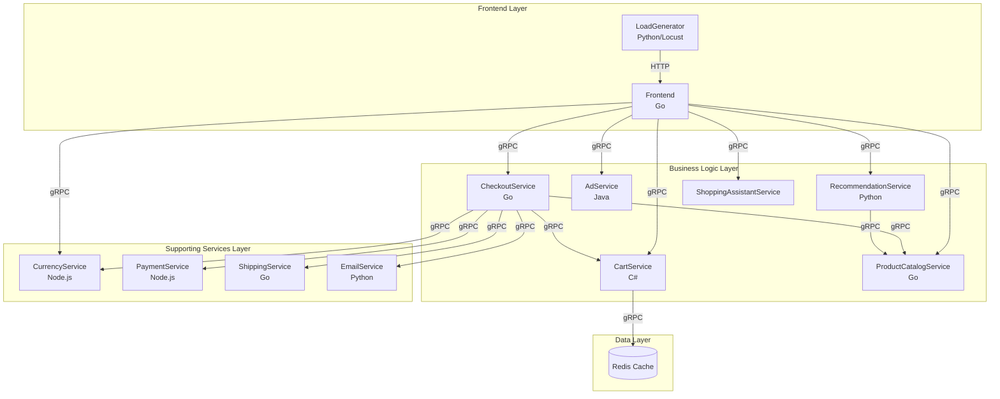
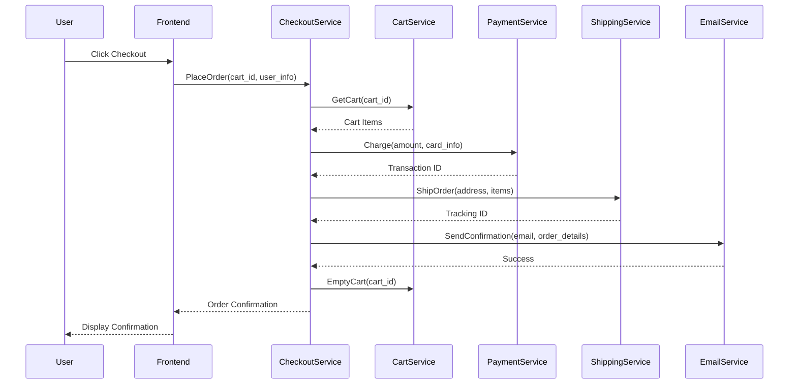
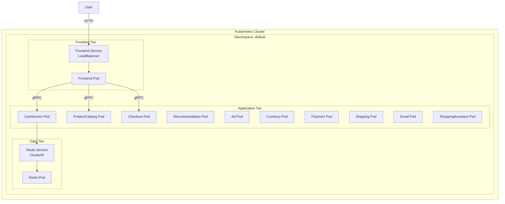

# Design Document: Mintlify Documentation System

## Overview

This design document outlines the implementation of a comprehensive Mintlify-based documentation system for the Online Boutique microservices demo application. The system will replace the current simple Markdown documentation with a modern, interactive documentation platform featuring enhanced navigation, visual diagrams, API references, and comprehensive guides.

The implementation will leverage Mintlify's built-in features including:
- Automatic navigation generation from configuration
- Mermaid diagram rendering
- Syntax highlighting for multiple languages
- Search functionality
- Responsive design
- Dark mode support

The documentation will be organized into six main sections: Getting Started, Architecture, Microservices (with 12 individual service pages), Deployment, Development, and API Reference.

## Architecture

### High-Level Structure

```mermaid
graph TD
    A[mint.json Configuration] --> B[Navigation Structure]
    B --> C[Getting Started]
    B --> D[Architecture]
    B --> E[Microservices]
    B --> F[Deployment]
    B --> G[Development]
    B --> H[API Reference]
    
    E --> E1[Frontend]
    E --> E2[CartService]
    E --> E3[ProductCatalogService]
    E --> E4[CurrencyService]
    E --> E5[PaymentService]
    E --> E6[ShippingService]
    E --> E7[EmailService]
    E --> E8[CheckoutService]
    E --> E9[RecommendationService]
    E --> E10[AdService]
    E --> E11[LoadGenerator]
    E --> E12[ShoppingAssistantService]
    
    D --> D1[System Overview]
    D --> D2[Communication Patterns]
    D --> D3[Data Flow]
    D --> D4[User Journeys]
    
    F --> F1[Kubernetes]
    F --> F2[Helm]
    F --> F3[Terraform]
    F --> F4[Kustomize]
    F --> F5[Optional Components]
```



### Directory Structure

The Mintlify documentation will be organized in the following directory structure:

```
docs/
├── mint.json                          # Mintlify configuration
├── introduction.mdx                   # Homepage
├── getting-started/
│   ├── quickstart.mdx                # Quick deployment guide
│   ├── prerequisites.mdx             # Requirements and setup
│   └── local-setup.mdx               # Local development setup
├── architecture/
│   ├── overview.mdx                  # System architecture overview
│   ├── communication.mdx             # gRPC and service communication
│   ├── data-flow.mdx                 # Data flow diagrams
│   └── user-journeys.mdx             # Sequence diagrams for key flows
├── microservices/
│   ├── overview.mdx                  # Microservices introduction
│   ├── frontend.mdx                  # Frontend service
│   ├── cartservice.mdx               # Cart service
│   ├── productcatalogservice.mdx     # Product catalog service
│   ├── currencyservice.mdx           # Currency service
│   ├── paymentservice.mdx            # Payment service
│   ├── shippingservice.mdx           # Shipping service
│   ├── emailservice.mdx              # Email service
│   ├── checkoutservice.mdx           # Checkout service
│   ├── recommendationservice.mdx     # Recommendation service
│   ├── adservice.mdx                 # Ad service
│   ├── loadgenerator.mdx             # Load generator
│   └── shoppingassistantservice.mdx  # Shopping assistant service
├── deployment/
│   ├── overview.mdx                  # Deployment options overview
│   ├── kubernetes.mdx                # Kubernetes deployment
│   ├── helm.mdx                      # Helm deployment
│   ├── terraform.mdx                 # Terraform deployment
│   ├── kustomize.mdx                 # Kustomize deployment
│   └── optional-components.mdx       # AlloyDB, Spanner, Memorystore, Istio
├── development/
│   ├── setup.mdx                     # Development environment setup
│   ├── building.mdx                  # Building and running locally
│   ├── testing.mdx                   # Testing guidelines
│   ├── adding-service.mdx            # Adding new microservices
│   └── contributing.mdx              # Contribution guidelines
├── api-reference/
│   ├── overview.mdx                  # API documentation overview
│   ├── proto-definitions.mdx         # Protocol Buffer definitions
│   └── grpc-services.mdx             # gRPC service methods
└── images/
    ├── architecture-diagram.png
    ├── online-boutique-frontend-1.png
    ├── online-boutique-frontend-2.png
    └── memorystore.png
```

### Technology Stack

- **Documentation Platform**: Mintlify (latest version)
- **Diagram Rendering**: Mermaid.js (integrated with Mintlify)
- **Configuration Format**: JSON (mint.json)
- **Content Format**: MDX (Markdown with JSX support)
- **Syntax Highlighting**: Built-in Mintlify support for Go, C#, Node.js, Python, Java, YAML, Protocol Buffers
- **Hosting**: Mintlify's hosting platform or self-hosted option

## Components and Interfaces

### 1. Configuration Component (mint.json)

The `mint.json` file is the central configuration for the Mintlify documentation system. It defines:

**Structure**:
```json
{
  "name": "Online Boutique",
  "logo": {
    "light": "/images/logo-light.svg",
    "dark": "/images/logo-dark.svg"
  },
  "favicon": "/images/favicon.png",
  "colors": {
    "primary": "#4285F4",
    "light": "#8AB4F8",
    "dark": "#1967D2"
  },
  "topbarLinks": [
    {
      "name": "GitHub",
      "url": "https://github.com/GoogleCloudPlatform/microservices-demo"
    }
  ],
  "navigation": [
    {
      "group": "Getting Started",
      "pages": [
        "getting-started/quickstart",
        "getting-started/prerequisites",
        "getting-started/local-setup"
      ]
    },
    {
      "group": "Architecture",
      "pages": [
        "architecture/overview",
        "architecture/communication",
        "architecture/data-flow",
        "architecture/user-journeys"
      ]
    },
    {
      "group": "Microservices",
      "pages": [
        "microservices/overview",
        "microservices/frontend",
        "microservices/cartservice",
        "microservices/productcatalogservice",
        "microservices/currencyservice",
        "microservices/paymentservice",
        "microservices/shippingservice",
        "microservices/emailservice",
        "microservices/checkoutservice",
        "microservices/recommendationservice",
        "microservices/adservice",
        "microservices/loadgenerator",
        "microservices/shoppingassistantservice"
      ]
    },
    {
      "group": "Deployment",
      "pages": [
        "deployment/overview",
        "deployment/kubernetes",
        "deployment/helm",
        "deployment/terraform",
        "deployment/kustomize",
        "deployment/optional-components"
      ]
    },
    {
      "group": "Development",
      "pages": [
        "development/setup",
        "development/building",
        "development/testing",
        "development/adding-service",
        "development/contributing"
      ]
    },
    {
      "group": "API Reference",
      "pages": [
        "api-reference/overview",
        "api-reference/proto-definitions",
        "api-reference/grpc-services"
      ]
    }
  ],
  "footerSocials": {
    "github": "https://github.com/GoogleCloudPlatform/microservices-demo"
  }
}
```

**Key Features**:
- Navigation hierarchy with 6 main groups
- 12 individual microservice pages
- Branding configuration (colors, logo, favicon)
- External links to GitHub repository
- Footer social links

### 2. Content Migration Component

This component handles the migration of existing documentation from `/docs` to the new Mintlify structure.

**Migration Mapping**:
- `README.md` → `introduction.mdx` + `getting-started/quickstart.mdx`
- `docs/development-guide.md` → `development/setup.mdx` + `development/building.mdx`
- `docs/adding-new-microservice.md` → `development/adding-service.mdx`
- `docs/purpose.md` → Integrated into `introduction.mdx`
- `docs/img/*` → `images/*`

**Content Enhancement**:
- Add frontmatter metadata to each MDX file
- Convert plain Markdown to MDX format
- Add Mermaid diagrams where appropriate
- Enhance with code examples and callouts
- Add cross-references between related pages

### 3. Diagram Generation Component

This component creates Mermaid diagrams for visualizing system architecture and flows.

**Diagram Types**:

**System Architecture Diagram**:


**Checkout Flow Sequence Diagram**:


**Deployment Architecture Diagram**:


### 4. Microservice Documentation Template

Each microservice page follows a consistent template structure:

**Template Structure**:
```mdx
---
title: "[Service Name]"
description: "[Brief description]"
---

# [Service Name]

## Overview

[Detailed description of the service's purpose and role in the system]

## Technology Stack

- **Language**: [Programming Language]
- **Framework**: [Framework if applicable]
- **Dependencies**: [Key dependencies]
- **Communication**: gRPC

## Key Features

- [Feature 1]
- [Feature 2]
- [Feature 3]

## Service Dependencies

This service depends on:
- [Dependency 1] - [Purpose]
- [Dependency 2] - [Purpose]

This service is used by:
- [Consumer 1] - [Purpose]
- [Consumer 2] - [Purpose]

## gRPC API

### Service Definition

```protobuf
[Protocol Buffer definition]
```

### Methods

#### [MethodName]

**Request**: `[RequestType]`
**Response**: `[ResponseType]`

[Description of what the method does]

**Example Request**:
```json
{
  [example request]
}
```

**Example Response**:
```json
{
  [example response]
}
```

## Configuration

### Environment Variables

| Variable | Description | Default | Required |
|----------|-------------|---------|----------|
| [VAR_NAME] | [Description] | [Default] | [Yes/No] |

### Configuration Files

[Any configuration files used by the service]

## Local Development

### Prerequisites

- [Prerequisite 1]
- [Prerequisite 2]

### Running Locally

```bash
[Commands to run the service locally]
```

### Testing

```bash
[Commands to test the service]
```

## Deployment

[Service-specific deployment considerations]

## Monitoring and Observability

- **Metrics**: [Key metrics exposed]
- **Logs**: [Logging configuration]
- **Traces**: [Tracing configuration]

## Common Issues and Troubleshooting

### [Issue 1]

**Symptom**: [Description]
**Solution**: [How to fix]

### [Issue 2]

**Symptom**: [Description]
**Solution**: [How to fix]
```

### 5. API Reference Component

The API Reference section provides comprehensive documentation of all Protocol Buffer definitions and gRPC services.

**Structure**:
- Overview page explaining gRPC and Protocol Buffers
- Proto definitions page with all `.proto` files documented
- gRPC services page with all service methods, request/response types, and examples

**Proto Documentation Format**:
```mdx
## [ServiceName]

**File**: `protos/[filename].proto`

### Messages

#### [MessageName]

| Field | Type | Description |
|-------|------|-------------|
| [field_name] | [type] | [description] |

### Services

#### [ServiceName]

| Method | Request | Response | Description |
|--------|---------|----------|-------------|
| [MethodName] | [RequestType] | [ResponseType] | [Description] |
```

### 6. Search and Navigation Component

Mintlify provides built-in search functionality that indexes all content automatically.

**Search Features**:
- Full-text search across all pages
- Keyboard shortcuts (Cmd/Ctrl + K)
- Search result highlighting
- Fuzzy matching

**Navigation Features**:
- Sidebar navigation with collapsible groups
- Breadcrumb navigation
- Previous/Next page navigation
- Table of contents for each page
- Mobile-responsive navigation

## Data Models

### Documentation Page Model

Each documentation page follows this data model:

```typescript
interface DocumentationPage {
  // Frontmatter metadata
  title: string;
  description: string;
  icon?: string;
  
  // Content
  content: string; // MDX content
  
  // Navigation
  group: string;
  order?: number;
  
  // SEO
  seoTitle?: string;
  seoDescription?: string;
  
  // Features
  toc?: boolean; // Show table of contents
  mode?: 'default' | 'wide'; // Page layout mode
}
```

### Microservice Model

Each microservice is documented with this data structure:

```typescript
interface MicroserviceDocumentation {
  name: string;
  language: string;
  description: string;
  
  // Technical details
  framework?: string;
  dependencies: string[];
  
  // Relationships
  dependsOn: ServiceDependency[];
  usedBy: ServiceDependency[];
  
  // API
  protoFile: string;
  grpcMethods: GrpcMethod[];
  
  // Configuration
  environmentVariables: EnvironmentVariable[];
  configFiles: ConfigFile[];
  
  // Operations
  metrics: string[];
  logConfiguration: string;
  traceConfiguration: string;
}

interface ServiceDependency {
  serviceName: string;
  purpose: string;
  protocol: 'gRPC' | 'HTTP' | 'Redis';
}

interface GrpcMethod {
  name: string;
  requestType: string;
  responseType: string;
  description: string;
  exampleRequest: object;
  exampleResponse: object;
}

interface EnvironmentVariable {
  name: string;
  description: string;
  defaultValue?: string;
  required: boolean;
}

interface ConfigFile {
  path: string;
  format: string;
  description: string;
}
```

### Diagram Model

Diagrams are defined using Mermaid syntax embedded in MDX files:

```typescript
interface DiagramDefinition {
  type: 'graph' | 'sequenceDiagram' | 'classDiagram' | 'stateDiagram';
  title: string;
  description: string;
  mermaidCode: string;
}
```

### Navigation Model

The navigation structure is defined in mint.json:

```typescript
interface NavigationConfig {
  name: string;
  logo: {
    light: string;
    dark: string;
  };
  favicon: string;
  colors: {
    primary: string;
    light: string;
    dark: string;
  };
  topbarLinks: Link[];
  navigation: NavigationGroup[];
  footerSocials: Record<string, string>;
}

interface NavigationGroup {
  group: string;
  pages: string[]; // Paths to MDX files
}

interface Link {
  name: string;
  url: string;
}
```


## Correctness Properties

A property is a characteristic or behavior that should hold true across all valid executions of a system—essentially, a formal statement about what the system should do. Properties serve as the bridge between human-readable specifications and machine-verifiable correctness guarantees.

### Property 1: Configuration File Validity

*For any* Mintlify documentation system, the mint.json configuration file must exist, be valid JSON, and contain all required fields (name, navigation, colors).

**Validates: Requirements 1.1**

### Property 2: Navigation Depth Constraint

*For any* navigation group in the documentation system, the maximum depth of nested pages must not exceed 3 levels.

**Validates: Requirements 2.3**

### Property 3: Microservice Documentation Completeness

*For any* microservice in the system (all 12 services), its documentation page must contain all required sections: overview, technology stack, key features, gRPC API, configuration, dependencies, local development, deployment, and troubleshooting.

**Validates: Requirements 4.1, 4.2, 4.3, 4.4, 4.5**

### Property 4: Architecture Description Completeness

*For any* microservice in the system, the architecture documentation must explain its purpose and responsibilities.

**Validates: Requirements 3.4**

### Property 5: Deployment Documentation Completeness

*For any* deployment method (Kubernetes, Helm, Terraform, Kustomize), its documentation page must contain prerequisites, step-by-step instructions, configuration examples, and validation steps.

**Validates: Requirements 5.2, 5.4**

### Property 6: API Method Documentation Completeness

*For any* gRPC service method documented in the API reference, it must include the method name, request type, response type, description, example request, and example response.

**Validates: Requirements 7.2, 7.3**

### Property 7: MDX Format Compliance

*For any* documentation page file, it must have a .mdx extension, valid frontmatter with title and description fields, and be parseable as MDX.

**Validates: Requirements 8.4**

### Property 8: Deployment Diagram Coverage

*For any* deployment method (Kubernetes, Helm, Terraform, Kustomize), there must exist a corresponding deployment architecture diagram.

**Validates: Requirements 9.3**

### Property 9: Code Block Syntax Highlighting

*For any* code block in the documentation, it must specify a language identifier for proper syntax highlighting.

**Validates: Requirements 10.4**

### Property 10: Internal Link Validity

*For any* internal link in the documentation (links starting with / or relative paths), the target file must exist in the documentation structure.

**Validates: Requirements 11.1**

### Property 11: Mermaid Diagram Validity

*For any* Mermaid diagram in the documentation, it must render without syntax errors when processed by the Mermaid renderer.

**Validates: Requirements 11.2**

### Property 12: Code Example Syntax Validity

*For any* code example in the documentation, it must be syntactically valid according to its specified language.

**Validates: Requirements 11.3**

## Error Handling

### Build-Time Errors

The documentation system should handle the following build-time errors:

1. **Invalid Configuration**
   - **Error**: mint.json is missing or contains invalid JSON
   - **Handling**: Display clear error message indicating the issue and line number
   - **Recovery**: Provide example valid configuration

2. **Missing Required Files**
   - **Error**: Referenced page in navigation doesn't exist
   - **Handling**: Build fails with error listing missing files
   - **Recovery**: Create placeholder files or remove from navigation

3. **Invalid MDX Syntax**
   - **Error**: MDX file contains syntax errors
   - **Handling**: Build fails with error showing file and line number
   - **Recovery**: Fix syntax errors in the file

4. **Broken Internal Links**
   - **Error**: Internal link points to non-existent page
   - **Handling**: Build warning listing all broken links
   - **Recovery**: Fix links or create missing pages

5. **Invalid Mermaid Diagrams**
   - **Error**: Mermaid syntax is invalid
   - **Handling**: Build warning showing diagram location and error
   - **Recovery**: Fix Mermaid syntax

6. **Missing Images**
   - **Error**: Referenced image file doesn't exist
   - **Handling**: Build warning listing missing images
   - **Recovery**: Add missing images or remove references

### Runtime Errors

The documentation system should handle the following runtime errors:

1. **Search Failures**
   - **Error**: Search index fails to load
   - **Handling**: Display message to user, disable search temporarily
   - **Recovery**: Rebuild search index

2. **Diagram Rendering Failures**
   - **Error**: Mermaid diagram fails to render in browser
   - **Handling**: Display error message in place of diagram
   - **Recovery**: Show raw Mermaid code as fallback

3. **Navigation Loading Failures**
   - **Error**: Navigation fails to load
   - **Handling**: Display simplified navigation or error message
   - **Recovery**: Reload page

### Validation Strategy

The documentation system should implement validation at multiple stages:

1. **Pre-Build Validation**
   - Validate mint.json schema
   - Check all referenced files exist
   - Validate frontmatter in all MDX files

2. **Build-Time Validation**
   - Parse all MDX files
   - Validate all Mermaid diagrams
   - Check internal links
   - Validate code block language specifiers

3. **Post-Build Validation**
   - Verify all expected output files generated
   - Check search index created successfully
   - Validate all images copied correctly

4. **Continuous Validation**
   - Run link checker periodically
   - Validate code examples against latest language versions
   - Check for outdated content

## Testing Strategy

The Mintlify documentation system will be validated using a dual testing approach combining unit tests for specific scenarios and property-based tests for universal correctness properties.

### Unit Testing

Unit tests will focus on:

1. **Configuration Validation**
   - Test mint.json parsing with valid configuration
   - Test error handling for invalid JSON
   - Test error handling for missing required fields
   - Test navigation structure validation

2. **Content Migration**
   - Test that all existing docs files are accounted for
   - Test that all images are copied correctly
   - Test that content is preserved during migration
   - Test specific content transformations (Markdown to MDX)

3. **Build Process**
   - Test successful build with valid documentation
   - Test build failure with invalid MDX
   - Test build warnings for broken links
   - Test build warnings for missing images

4. **Specific Diagrams**
   - Test system architecture diagram includes all 12 services
   - Test checkout sequence diagram includes all required steps
   - Test deployment diagrams exist for each method

5. **Required Pages**
   - Test all 12 microservice pages exist
   - Test all 6 main navigation groups exist
   - Test homepage exists with required content
   - Test all 4 deployment method pages exist

6. **Integration Points**
   - Test search functionality returns results
   - Test navigation links work correctly
   - Test breadcrumb navigation displays correctly
   - Test copy-to-clipboard functionality works

### Property-Based Testing

Property-based tests will validate universal properties across all documentation content. Each test should run a minimum of 100 iterations.

**Test Configuration**:
- Testing Framework: Language-specific PBT library (e.g., Hypothesis for Python, fast-check for TypeScript)
- Minimum Iterations: 100 per property test
- Tag Format: `Feature: mintlify-documentation, Property {number}: {property_text}`

**Property Tests**:

1. **Property Test: Navigation Depth Constraint**
   - **Tag**: Feature: mintlify-documentation, Property 2: Navigation depth constraint
   - **Test**: For any navigation group, verify maximum depth ≤ 3
   - **Generator**: Generate navigation structures with varying depths
   - **Assertion**: Maximum depth of any path ≤ 3

2. **Property Test: Microservice Documentation Completeness**
   - **Tag**: Feature: mintlify-documentation, Property 3: Microservice documentation completeness
   - **Test**: For any microservice page, verify all required sections exist
   - **Generator**: Iterate through all 12 microservice pages
   - **Assertion**: Each page contains all required sections

3. **Property Test: Architecture Description Completeness**
   - **Tag**: Feature: mintlify-documentation, Property 4: Architecture description completeness
   - **Test**: For any microservice, verify architecture docs explain its purpose
   - **Generator**: Iterate through all 12 microservices
   - **Assertion**: Architecture documentation contains purpose description for each service

4. **Property Test: Deployment Documentation Completeness**
   - **Tag**: Feature: mintlify-documentation, Property 5: Deployment documentation completeness
   - **Test**: For any deployment method, verify all required sections exist
   - **Generator**: Iterate through all 4 deployment methods
   - **Assertion**: Each deployment page contains prerequisites, instructions, examples, and validation

5. **Property Test: API Method Documentation Completeness**
   - **Tag**: Feature: mintlify-documentation, Property 6: API method documentation completeness
   - **Test**: For any gRPC method, verify complete documentation
   - **Generator**: Iterate through all documented gRPC methods
   - **Assertion**: Each method has name, types, description, and examples

6. **Property Test: MDX Format Compliance**
   - **Tag**: Feature: mintlify-documentation, Property 7: MDX format compliance
   - **Test**: For any documentation file, verify valid MDX format
   - **Generator**: Iterate through all .mdx files
   - **Assertion**: Each file has .mdx extension, valid frontmatter, and parses successfully

7. **Property Test: Deployment Diagram Coverage**
   - **Tag**: Feature: mintlify-documentation, Property 8: Deployment diagram coverage
   - **Test**: For any deployment method, verify diagram exists
   - **Generator**: Iterate through all 4 deployment methods
   - **Assertion**: Each deployment method has a corresponding diagram

8. **Property Test: Code Block Syntax Highlighting**
   - **Tag**: Feature: mintlify-documentation, Property 9: Code block syntax highlighting
   - **Test**: For any code block, verify language identifier specified
   - **Generator**: Parse all MDX files and extract code blocks
   - **Assertion**: Each code block has a language identifier

9. **Property Test: Internal Link Validity**
   - **Tag**: Feature: mintlify-documentation, Property 10: Internal link validity
   - **Test**: For any internal link, verify target exists
   - **Generator**: Parse all MDX files and extract internal links
   - **Assertion**: Each internal link target file exists

10. **Property Test: Mermaid Diagram Validity**
    - **Tag**: Feature: mintlify-documentation, Property 11: Mermaid diagram validity
    - **Test**: For any Mermaid diagram, verify it renders without errors
    - **Generator**: Parse all MDX files and extract Mermaid diagrams
    - **Assertion**: Each diagram renders successfully with Mermaid CLI

11. **Property Test: Code Example Syntax Validity**
    - **Tag**: Feature: mintlify-documentation, Property 12: Code example syntax validity
    - **Test**: For any code example, verify syntactic validity
    - **Generator**: Parse all code blocks and validate with language-specific parsers
    - **Assertion**: Each code example is syntactically valid for its language

### Testing Tools

- **MDX Parser**: `@mdx-js/mdx` for parsing and validating MDX files
- **JSON Validator**: `ajv` for validating mint.json against schema
- **Link Checker**: Custom script to validate internal links
- **Mermaid Validator**: `@mermaid-js/mermaid-cli` for validating diagrams
- **Code Validators**: Language-specific linters (eslint, pylint, gofmt, etc.)
- **Property Testing**: Language-specific PBT library

### Test Execution

Tests should be executed:
- **Pre-commit**: Run fast validation checks (JSON validation, MDX parsing)
- **CI/CD Pipeline**: Run full test suite including property tests
- **Pre-deployment**: Run complete validation including link checking
- **Periodic**: Run extended validation including code example testing

### Success Criteria

The documentation system is considered complete and correct when:
1. All unit tests pass
2. All property-based tests pass (100+ iterations each)
3. Build completes without errors
4. All 12 microservices have complete documentation
5. All 4 deployment methods have complete documentation
6. All internal links resolve correctly
7. All Mermaid diagrams render successfully
8. Search functionality works correctly
9. Navigation structure is complete and correct
10. All existing content from /docs is preserved and enhanced
