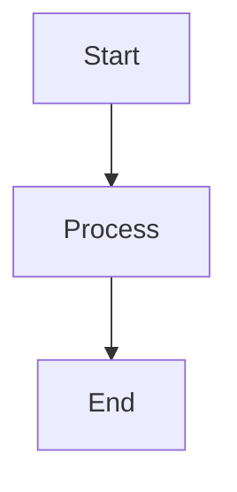

# Contributing to Online Boutique Documentation

Thank you for your interest in improving the Online Boutique documentation! This guide will help you contribute effectively.

## Quick Start

1. Fork the repository
2. Clone your fork
3. Create a branch for your changes
4. Make your changes
5. Test locally
6. Submit a pull request

## Documentation Structure

```
docs/
├── getting-started/     # Getting started guides
├── architecture/        # Architecture documentation
├── microservices/       # Individual service docs
├── deployment/          # Deployment guides
├── development/         # Development guides
├── api-reference/       # API documentation
├── images/              # Images and diagrams
└── scripts/             # Validation scripts
```

## Writing Guidelines

### MDX Format

All documentation uses MDX (Markdown with JSX). Every file must have frontmatter:

```mdx
---
title: Page Title
description: Brief description (< 160 characters)
---

# Page Title

Content goes here...
```

### Style Guide

**Writing Style:**
- Use clear, concise language
- Write in second person ("you")
- Use active voice
- Keep paragraphs short (3-4 sentences)
- Use bullet points for lists

**Code Examples:**
- Always specify language for syntax highlighting
- Provide complete, working examples
- Include comments for clarity
- Use realistic data

**Diagrams:**
- Use Mermaid for diagrams
- Keep diagrams simple and focused
- Add labels and legends
- Ensure readability at different sizes

### Mintlify Components

Use these components to enhance documentation:

**Cards:**
```mdx
<CardGroup cols={2}>
  <Card title="Title" icon="icon-name" href="/path">
    Description
  </Card>
</CardGroup>
```

**Accordions:**
```mdx
<AccordionGroup>
  <Accordion title="Question">
    Answer
  </Accordion>
</AccordionGroup>
```

**Tabs:**
```mdx
<Tabs>
  <Tab title="Option 1">
    Content
  </Tab>
</Tabs>
```

**Callouts:**
```mdx
<Note>Important information</Note>
<Tip>Helpful tip</Tip>
<Warning>Warning message</Warning>
<Info>Additional information</Info>
```

## Adding a New Page

1. **Create the MDX file** in the appropriate directory
2. **Add frontmatter** with title and description
3. **Write content** following the style guide
4. **Add to navigation** in `mint.json`:
   ```json
   {
     "group": "Section Name",
     "pages": [
       "path/to/new-page"
     ]
   }
   ```
5. **Validate** your changes:
   ```bash
   npm run validate
   ```
6. **Test locally**:
   ```bash
   npm run dev
   ```

## Updating Existing Pages

1. Make your changes
2. Run validation: `npm run validate`
3. Test locally: `npm run dev`
4. Submit a pull request

## Validation

Run these commands before submitting:

```bash
# Validate all
npm run validate

# Validate specific aspects
npm run validate:mint     # Check mint.json
npm run validate:mdx      # Check MDX files
npm run validate:links    # Check for broken links
```

## Testing Locally

Start the development server:

```bash
cd docs
npm install
npm run dev
```

Visit `http://localhost:3000` to preview your changes.

## Pull Request Process

1. **Create a descriptive branch name:**
   ```bash
   git checkout -b docs/add-feature-guide
   ```

2. **Make your changes** following the guidelines

3. **Commit with clear messages:**
   ```bash
   git commit -m "docs: add feature guide for X"
   ```

4. **Push to your fork:**
   ```bash
   git push origin docs/add-feature-guide
   ```

5. **Open a pull request** with:
   - Clear title describing the change
   - Description of what was added/changed
   - Screenshots if applicable
   - Link to related issues

### PR Checklist

- [ ] Frontmatter includes title and description
- [ ] Content follows style guide
- [ ] Code examples are complete and working
- [ ] All links are valid
- [ ] Validation passes (`npm run validate`)
- [ ] Tested locally (`npm run dev`)
- [ ] Added to navigation in `mint.json`
- [ ] No spelling or grammar errors

## Common Tasks

### Adding a Microservice Page

Use this template:

```mdx
---
title: '[Service Name]'
description: '[Brief description]'
---

## Overview
[Service description]

## Technology Stack
- **Language**: [Language]
- **Framework**: [Framework]
- **Dependencies**: [Key dependencies]

## Key Features
- [Feature 1]
- [Feature 2]

## Service Dependencies
### Depends On
- [Service] - [Purpose]

### Used By
- [Service] - [Purpose]

## gRPC API
[API documentation]

## Configuration
[Environment variables and config]

## Local Development
[How to run locally]

## Troubleshooting
[Common issues and solutions]
```

### Adding a Diagram

Use Mermaid syntax:

````mdx

````

### Adding Code Examples

Always specify the language:

````mdx
```bash
kubectl get pods
```

```go
func main() {
    fmt.Println("Hello")
}
```
````

## Documentation Standards

### Required Sections

Every microservice page must include:
- Overview
- Technology Stack
- Key Features
- Service Dependencies
- gRPC API
- Configuration
- Troubleshooting

Every deployment guide must include:
- Prerequisites
- Step-by-step instructions
- Configuration examples
- Validation steps
- Troubleshooting

### Link Format

- Internal links: `/path/to/page` (absolute from docs root)
- External links: `https://example.com` (full URL)
- Anchor links: `#section-name` (within same page)

### Image Format

- Place images in `docs/images/`
- Use descriptive filenames
- Reference as: `/images/filename.png`
- Include alt text for accessibility

## Validation Rules

### Frontmatter
- Every MDX file must have `title` and `description`
- Titles should be concise (< 60 characters)
- Descriptions should be informative (< 160 characters)

### Links
- All internal links must point to existing pages
- No broken links allowed
- External links should use HTTPS

### Code Blocks
- All code blocks must specify a language
- Code should be syntactically valid
- Include comments for complex code

### Diagrams
- All Mermaid diagrams must be valid
- Diagrams should render without errors
- Use consistent styling

## Getting Help

- **Questions**: Open a GitHub Discussion
- **Bugs**: Create a GitHub Issue
- **Suggestions**: Open a GitHub Issue with [Enhancement] tag

## Code of Conduct

- Be respectful and inclusive
- Provide constructive feedback
- Focus on improving documentation
- Help others learn and contribute

## License

By contributing, you agree that your contributions will be licensed under the Apache License 2.0.

## Resources

- [Mintlify Documentation](https://mintlify.com/docs)
- [MDX Documentation](https://mdxjs.com/)
- [Mermaid Documentation](https://mermaid.js.org/)
- [Online Boutique Repository](https://github.com/GoogleCloudPlatform/microservices-demo)

## Thank You!

Your contributions help make Online Boutique documentation better for everyone. We appreciate your time and effort!
