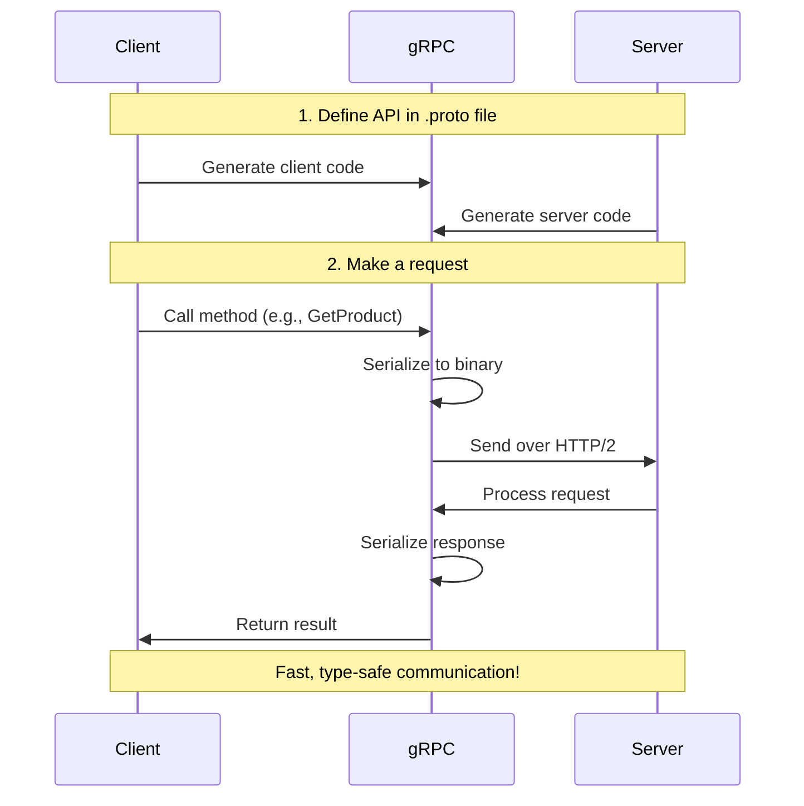
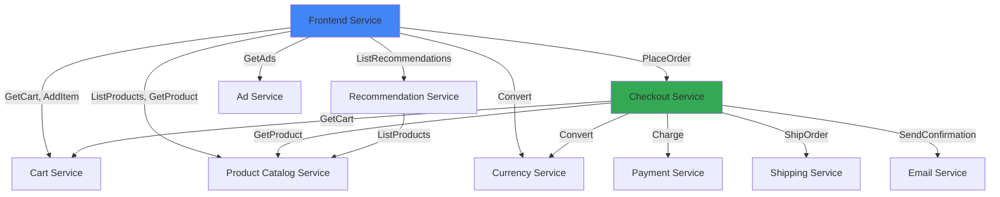

<Note>
  **First time working with APIs?** This guide is designed for beginners. We'll explain everything step by step with plenty of examples. Don't worry if terms like "gRPC" or "Protocol Buffers" sound intimidating - by the end of this page, you'll understand them!
</Note>

## Quick Start Tutorial

Let's start with a simple example to understand how the API works.

<Steps>
  <Step title="Understand the Goal">
    Imagine you want to get information about a product in the store. You need to:
    1. Know which product you want (the product ID)
    2. Ask the Product Catalog Service for that product's details
    3. Receive the product information back
  </Step>

  <Step title="The Request">
    You send a request that looks like this:
    ```json
    {
      "id": "OLJCESPC7Z"
    }
    ```
    This is saying: "Hey, give me info about product OLJCESPC7Z"
  </Step>

  <Step title="The Response">
    The service sends back:
    ```json
    {
      "id": "OLJCESPC7Z",
      "name": "Vintage Typewriter",
      "description": "This typewriter looks good in your living room.",
      "price_usd": {
        "currency_code": "USD",
        "units": 67,
        "nanos": 990000000
      }
    }
    ```
    Now you have all the product details!
  </Step>

  <Step title="That's It!">
    That's the basic pattern for all API calls:
    1. Send a request with the data you need
    2. Get a response with the information you asked for
    
    Every API method in Online Boutique follows this same pattern.
  </Step>
</Steps>

---

## Overview

Online Boutique uses gRPC for all inter-service communication. Think of gRPC as a way for different parts of the application to talk to each other, similar to how you might call a function in your code, but across different services.

<Note>
  **New to APIs?** Don't worry! This guide will walk you through everything step by step. We'll explain technical terms as we go and provide plenty of examples.
</Note>

This section provides comprehensive documentation of all gRPC services, methods, and message types used throughout the application.

<CardGroup cols={2}>
  <Card title="gRPC" icon="bolt">
    High-performance RPC framework
  </Card>
  <Card title="Protocol Buffers" icon="file-code">
    Language-neutral data serialization
  </Card>
  <Card title="9 Services" icon="server">
    Cart, Product, Payment, Shipping, and more
  </Card>
  <Card title="Type-Safe" icon="shield-check">
    Strongly-typed contracts between services
  </Card>
</CardGroup>

## What is gRPC?

<Tip>
  **Simple Explanation:** Imagine you're ordering food at a restaurant. You (the client) tell the waiter (gRPC) what you want, and the waiter brings your request to the kitchen (the server). The kitchen prepares your food and sends it back through the waiter. gRPC works the same way - it helps different parts of an application communicate with each other.
</Tip>

[gRPC](https://grpc.io/) is a modern way for different programs to talk to each other over a network. Instead of writing custom code to send and receive data, gRPC handles all the complicated networking stuff for you.

**Key Features:**
- **Fast:** Uses efficient binary format instead of text (like JSON)
- **Type-Safe:** Catches errors before your code runs
- **Language-Agnostic:** Works with Go, Python, Java, Node.js, and more
- **Auto-Generated Code:** Creates client and server code automatically

## How gRPC Works



### Why gRPC?

Online Boutique uses gRPC for several reasons:

<AccordionGroup>
  <Accordion title="Performance">
    - Binary serialization is faster than JSON
    - HTTP/2 multiplexing reduces latency
    - Efficient network usage with smaller payloads
    - Built-in support for streaming
  </Accordion>

  <Accordion title="Type Safety">
    - Strongly-typed contracts defined in .proto files
    - Compile-time validation of API contracts
    - Auto-generated client and server code
    - Reduces runtime errors
  </Accordion>

  <Accordion title="Language Agnostic">
    - Works across multiple programming languages
    - Consistent API regardless of implementation language
    - Easy to add services in different languages
    - Generated code handles serialization
  </Accordion>

  <Accordion title="Developer Experience">
    - Clear API contracts in .proto files
    - Auto-generated documentation
    - Built-in error handling
    - Deadline/timeout support
  </Accordion>
</AccordionGroup>

## Protocol Buffers

<Tip>
  **Simple Explanation:** Think of Protocol Buffers (protobuf) as a recipe card. Just like a recipe tells you exactly what ingredients you need and how much of each, protobuf tells your program exactly what data to expect and what type each piece should be.
</Tip>

Protocol Buffers is a way to define the structure of your data. It's similar to JSON or XML, but:
- **Smaller:** Takes up less space (important for network speed)
- **Faster:** Quicker to read and write
- **Safer:** Catches mistakes at compile-time, not runtime

### A Simple Example

Let's say you want to send information about a product. Here's how you'd define it:

```protobuf
// This is like creating a template for product data
message Product {
    string id = 1;              // Product ID (like "ABC123")
    string name = 2;            // Product name (like "Vintage Camera")
    string description = 3;     // What the product is
    Money price_usd = 4;        // How much it costs
}

// Money is another template we can reuse
message Money {
    string currency_code = 1;   // Like "USD" or "EUR"
    int64 units = 2;            // Dollars (the whole number part)
    int32 nanos = 3;            // Cents (the decimal part)
}
```

<Note>
  The numbers (1, 2, 3, etc.) aren't the values - they're like labels that help the computer know which field is which when sending data over the network.
</Note>

### Key Concepts

<Tabs>
  <Tab title="Services">
    **What is a Service?**
    
    A service is like a menu at a restaurant - it lists all the things you can ask for (methods).
    
    ```protobuf
    service CartService {
        rpc AddItem(AddItemRequest) returns (Empty) {}
        rpc GetCart(GetCartRequest) returns (Cart) {}
        rpc EmptyCart(EmptyCartRequest) returns (Empty) {}
    }
    ```
    
    Each method (like `AddItem`) specifies:
    - **What you send:** `AddItemRequest` (the request)
    - **What you get back:** `Empty` (the response)
    
    <Tip>
      `rpc` stands for "Remote Procedure Call" - it's just a fancy way of saying "a function you can call over the network."
    </Tip>
  </Tab>

  <Tab title="Messages">
    **What is a Message?**
    
    A message is like a form with specific fields that need to be filled out.
    
    ```protobuf
    message CartItem {
        string product_id = 1;  // Which product
        int32 quantity = 2;     // How many
    }
    ```
    
    Each field has three parts:
    1. **Type:** What kind of data (string, number, etc.)
    2. **Name:** What to call it (product_id, quantity)
    3. **Number:** A unique ID for this field (used internally)
    
    <Note>
      Think of the field number like a seat number at a concert - it helps the system know exactly where each piece of data belongs.
    </Note>
  </Tab>

  <Tab title="Field Numbers">
    **Why Field Numbers?**
    
    Field numbers are like shortcuts that make data transfer faster.
    
    ```protobuf
    message Product {
        string id = 1;           // Field #1 (most common)
        string name = 2;         // Field #2 (very common)
        string description = 3;  // Field #3 (common)
    }
    ```
    
    **Best Practices:**
    - Use numbers 1-15 for fields you use most often (they're more efficient)
    - Use numbers 16+ for less common fields
    - **Never change or reuse field numbers** (it will break things!)
    
    <Warning>
      Once you assign a field number, it's permanent. Changing it is like changing someone's birthday - it causes confusion!
    </Warning>
  </Tab>

  <Tab title="Repeated Fields">
    **What are Repeated Fields?**
    
    `repeated` means "a list of" - like a shopping list with multiple items.
    
    ```protobuf
    message Cart {
        string user_id = 1;
        repeated CartItem items = 2;  // A list of items
    }
    ```
    
    This is equivalent to arrays in different languages:
    - **Go:** `[]CartItem`
    - **Python:** `list[CartItem]`
    - **JavaScript:** `CartItem[]`
    - **Java:** `List<CartItem>`
    
    <Tip>
      Think of `repeated` like saying "one or more" - you can have zero items, one item, or many items.
    </Tip>
  </Tab>
</Tabs>

## Service Architecture

Online Boutique consists of 9 gRPC services:



### Service Communication Patterns

<CardGroup cols={2}>
  <Card title="Request-Response" icon="arrows-left-right">
    Most common pattern - client sends request, server sends single response
  </Card>
  <Card title="Unary RPC" icon="arrow-right">
    All Online Boutique services use unary RPCs (one request, one response)
  </Card>
</CardGroup>

## Common Message Types

Several message types are used across multiple services. Think of these as building blocks that get reused in different places.

### Money

Represents monetary amounts with currency.

<Tip>
  **Why is money split into `units` and `nanos`?** Computers can't accurately represent decimal numbers like 19.99. So we split it into whole dollars (units) and fractional parts (nanos). This prevents rounding errors in financial calculations!
</Tip>

```protobuf
message Money {
    string currency_code = 1;  // ISO 4217 code (e.g., "USD")
    int64 units = 2;           // Whole units (e.g., dollars)
    int32 nanos = 3;           // Fractional units (e.g., cents)
}
```

**Example:** $19.99 USD
```json
{
  "currency_code": "USD",
  "units": 19,              // $19
  "nanos": 990000000        // $0.99 (990 million nanoseconds = 99 cents)
}
```

<Note>
  **Quick Math:** To convert cents to nanos, multiply by 10,000,000. So 99 cents = 990,000,000 nanos.
</Note>

### Address

Represents shipping addresses:

```protobuf
message Address {
    string street_address = 1;
    string city = 2;
    string state = 3;
    string country = 4;
    int32 zip_code = 5;
}
```

### CartItem

Represents items in a shopping cart:

```protobuf
message CartItem {
    string product_id = 1;
    int32 quantity = 2;
}
```

### Empty

Used for methods that don't need request/response data:

```protobuf
message Empty {}
```

## API Conventions

### Naming Conventions

- **Services**: PascalCase with "Service" suffix (e.g., `CartService`)
- **Methods**: PascalCase verbs (e.g., `GetProduct`, `AddItem`)
- **Messages**: PascalCase nouns (e.g., `Product`, `CartItem`)
- **Fields**: snake_case (e.g., `product_id`, `user_id`)

### Request/Response Patterns

Most methods follow these patterns:

- **Get**: `Get{Resource}Request` → `{Resource}`
- **List**: `List{Resource}Request` → `List{Resource}Response`
- **Create/Add**: `Add{Resource}Request` → `Empty` or `{Resource}`
- **Update**: `Update{Resource}Request` → `{Resource}`
- **Delete**: `Delete{Resource}Request` → `Empty`

### Error Handling

gRPC uses status codes for errors:

| Code | Description | Example |
|------|-------------|---------|
| OK | Success | Request completed successfully |
| INVALID_ARGUMENT | Invalid input | Invalid product ID format |
| NOT_FOUND | Resource not found | Product doesn't exist |
| ALREADY_EXISTS | Resource exists | Duplicate cart item |
| PERMISSION_DENIED | Access denied | Unauthorized access |
| UNAVAILABLE | Service unavailable | Service is down |
| INTERNAL | Internal error | Unexpected server error |

## Using the APIs

### Client Generation

Generate client code from proto files:

<Tabs>
  <Tab title="Go">
    ```bash
    protoc --go_out=. --go-grpc_out=. protos/demo.proto
    ```
  </Tab>

  <Tab title="Node.js">
    ```javascript
    const grpc = require('@grpc/grpc-js');
    const protoLoader = require('@grpc/proto-loader');
    
    const packageDefinition = protoLoader.loadSync('protos/demo.proto');
    const proto = grpc.loadPackageDefinition(packageDefinition);
    ```
  </Tab>

  <Tab title="Python">
    ```bash
    python -m grpc_tools.protoc -I. --python_out=. --grpc_python_out=. protos/demo.proto
    ```
  </Tab>

  <Tab title="Java">
    ```bash
    protoc --java_out=. --grpc-java_out=. protos/demo.proto
    ```
  </Tab>
</Tabs>

### Making Requests

Example of calling a gRPC service:

<Tabs>
  <Tab title="Go">
    ```go
    conn, err := grpc.Dial("productcatalogservice:3550", grpc.WithInsecure())
    if err != nil {
        log.Fatal(err)
    }
    defer conn.Close()
    
    client := pb.NewProductCatalogServiceClient(conn)
    
    resp, err := client.GetProduct(context.Background(), &pb.GetProductRequest{
        Id: "OLJCESPC7Z",
    })
    if err != nil {
        log.Fatal(err)
    }
    
    fmt.Printf("Product: %s - $%.2f\n", resp.Name, float64(resp.PriceUsd.Units))
    ```
  </Tab>

  <Tab title="Node.js">
    ```javascript
    const client = new proto.hipstershop.ProductCatalogService(
        'productcatalogservice:3550',
        grpc.credentials.createInsecure()
    );
    
    client.getProduct({ id: 'OLJCESPC7Z' }, (err, response) => {
        if (err) {
            console.error(err);
            return;
        }
        console.log(`Product: ${response.name} - $${response.price_usd.units}`);
    });
    ```
  </Tab>

  <Tab title="Python">
    ```python
    channel = grpc.insecure_channel('productcatalogservice:3550')
    stub = demo_pb2_grpc.ProductCatalogServiceStub(channel)
    
    response = stub.GetProduct(demo_pb2.GetProductRequest(id='OLJCESPC7Z'))
    print(f"Product: {response.name} - ${response.price_usd.units}")
    ```
  </Tab>
</Tabs>

### Testing with grpcurl

<Tip>
  **What is grpcurl?** It's like `curl` for gRPC - a command-line tool that lets you test your APIs without writing any code. Perfect for beginners!
</Tip>

Test gRPC services from the command line:

```bash
# Step 1: See what services are available
grpcurl -plaintext localhost:3550 list

# Step 2: See what methods a service has
grpcurl -plaintext localhost:3550 list hipstershop.ProductCatalogService

# Step 3: Call a method
grpcurl -plaintext -d '{"id": "OLJCESPC7Z"}' \
  localhost:3550 \
  hipstershop.ProductCatalogService/GetProduct
```

<Note>
  **What does `-plaintext` mean?** It tells grpcurl to connect without encryption (HTTPS). This is fine for local development but never use it in production!
</Note>

**Common grpcurl Commands:**

<AccordionGroup>
  <Accordion title="List all services">
    ```bash
    grpcurl -plaintext localhost:3550 list
    ```
    Shows all available services on this server.
  </Accordion>

  <Accordion title="List methods in a service">
    ```bash
    grpcurl -plaintext localhost:3550 list hipstershop.CartService
    ```
    Shows all methods (like AddItem, GetCart) in the CartService.
  </Accordion>

  <Accordion title="Describe a method">
    ```bash
    grpcurl -plaintext localhost:3550 describe hipstershop.CartService.AddItem
    ```
    Shows what data the method expects and returns.
  </Accordion>

  <Accordion title="Call a method">
    ```bash
    grpcurl -plaintext -d '{"user_id": "123"}' \
      localhost:3550 \
      hipstershop.CartService/GetCart
    ```
    Actually calls the method with your data.
  </Accordion>
</AccordionGroup>

## API Documentation Structure

This API reference is organized into three sections:

<CardGroup cols={3}>
  <Card title="Overview" icon="book" href="/api-reference/overview">
    This page - introduction to gRPC and Protocol Buffers
  </Card>
  <Card title="Proto Definitions" icon="file-code" href="/api-reference/proto-definitions">
    Complete Protocol Buffer definitions for all messages
  </Card>
  <Card title="gRPC Services" icon="server" href="/api-reference/grpc-services">
    Detailed documentation of all service methods
  </Card>
</CardGroup>

## Best Practices

<AccordionGroup>
  <Accordion title="Use Deadlines">
    Always set deadlines/timeouts for gRPC calls:
    
    ```go
    ctx, cancel := context.WithTimeout(context.Background(), 5*time.Second)
    defer cancel()
    
    resp, err := client.GetProduct(ctx, req)
    ```
  </Accordion>

  <Accordion title="Handle Errors Properly">
    Check and handle gRPC status codes:
    
    ```go
    resp, err := client.GetProduct(ctx, req)
    if err != nil {
        if status.Code(err) == codes.NotFound {
            // Handle not found
        } else if status.Code(err) == codes.InvalidArgument {
            // Handle invalid input
        }
        return err
    }
    ```
  </Accordion>

  <Accordion title="Reuse Connections">
    gRPC connections are expensive to create. Reuse them:
    
    ```go
    // Create once
    conn, _ := grpc.Dial(address, opts...)
    client := pb.NewProductCatalogServiceClient(conn)
    
    // Reuse for multiple calls
    resp1, _ := client.GetProduct(ctx, req1)
    resp2, _ := client.GetProduct(ctx, req2)
    ```
  </Accordion>

  <Accordion title="Use Metadata for Context">
    Pass request context using metadata:
    
    ```go
    md := metadata.Pairs(
        "user-id", "12345",
        "request-id", "abc-123",
    )
    ctx := metadata.NewOutgoingContext(context.Background(), md)
    
    resp, err := client.GetProduct(ctx, req)
    ```
  </Accordion>
</AccordionGroup>

## Additional Resources

<CardGroup cols={2}>
  <Card title="gRPC Documentation" icon="book" href="https://grpc.io/docs/">
    Official gRPC documentation
  </Card>
  <Card title="Protocol Buffers Guide" icon="file" href="https://protobuf.dev/">
    Protocol Buffers language guide
  </Card>
  <Card title="gRPC Best Practices" icon="star" href="https://grpc.io/docs/guides/performance/">
    Performance and best practices
  </Card>
  <Card title="Proto Style Guide" icon="pen" href="https://protobuf.dev/programming-guides/style/">
    Protocol Buffers style guide
  </Card>
</CardGroup>

---

## Glossary for Beginners

<AccordionGroup>
  <Accordion title="API (Application Programming Interface)">
    A way for different programs to talk to each other. Like a menu at a restaurant - it tells you what you can order (what functions you can call).
  </Accordion>

  <Accordion title="gRPC">
    A technology that lets different services communicate over a network. Think of it as a phone system for your applications.
  </Accordion>

  <Accordion title="Protocol Buffers (protobuf)">
    A way to define the structure of your data. Like a form with specific fields that must be filled out.
  </Accordion>

  <Accordion title="Service">
    A collection of related functions (methods) that do specific things. For example, CartService handles all shopping cart operations.
  </Accordion>

  <Accordion title="Method">
    A function you can call on a service. Like `AddItem` or `GetCart`.
  </Accordion>

  <Accordion title="Message">
    A data structure with specific fields. Like a form or a template for data.
  </Accordion>

  <Accordion title="Request">
    The data you send when calling a method. Like filling out a form to request something.
  </Accordion>

  <Accordion title="Response">
    The data you get back after calling a method. Like receiving an answer to your request.
  </Accordion>

  <Accordion title="Field">
    A single piece of data in a message. Like a field on a form (name, address, etc.).
  </Accordion>

  <Accordion title="Field Number">
    A unique ID for each field in a message. Used internally by Protocol Buffers.
  </Accordion>

  <Accordion title="Endpoint">
    The address where a service lives. Like a phone number or street address.
  </Accordion>

  <Accordion title="Client">
    The program that calls the API (makes requests). Usually your application.
  </Accordion>

  <Accordion title="Server">
    The program that receives API calls and sends responses. The service you're calling.
  </Accordion>

  <Accordion title="Status Code">
    A code that tells you if a request succeeded or failed, and why. Like OK, NOT_FOUND, or INVALID_ARGUMENT.
  </Accordion>

  <Accordion title="Serialization">
    Converting data into a format that can be sent over a network. Protocol Buffers does this automatically.
  </Accordion>

  <Accordion title="Unary RPC">
    A simple request-response pattern: you send one request, you get one response. All Online Boutique APIs use this pattern.
  </Accordion>
</AccordionGroup>

## Next Steps

<CardGroup cols={2}>
  <Card title="Proto Definitions" icon="file-code" href="/api-reference/proto-definitions">
    View all Protocol Buffer message definitions
  </Card>
  <Card title="gRPC Services" icon="server" href="/api-reference/grpc-services">
    Explore all gRPC service methods
  </Card>
</CardGroup>
