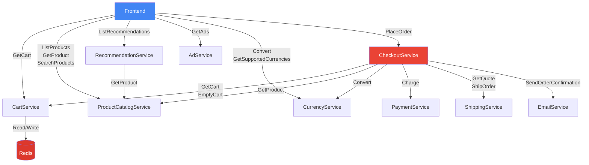
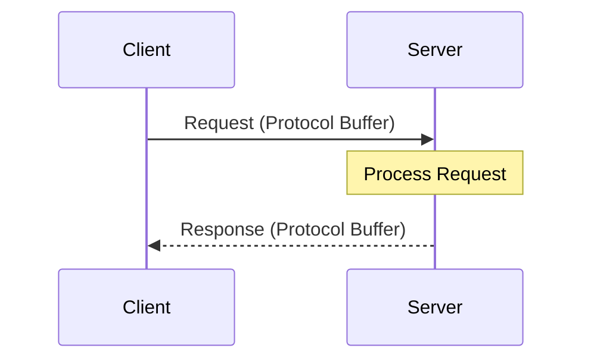
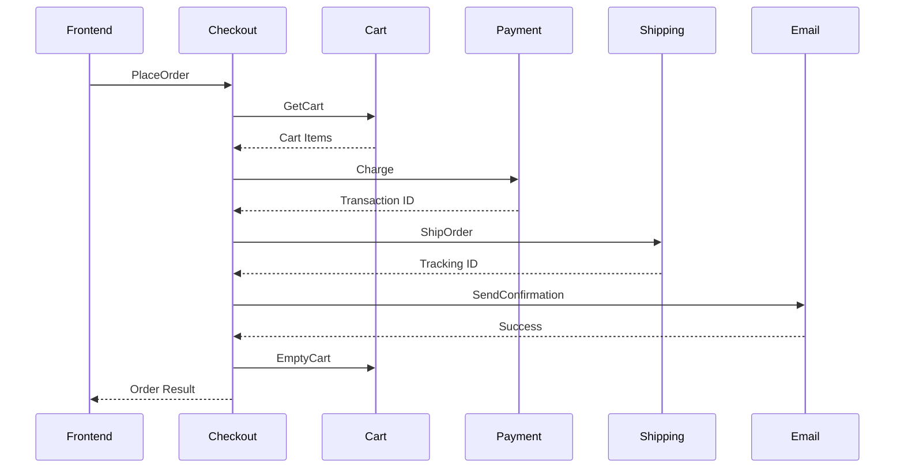
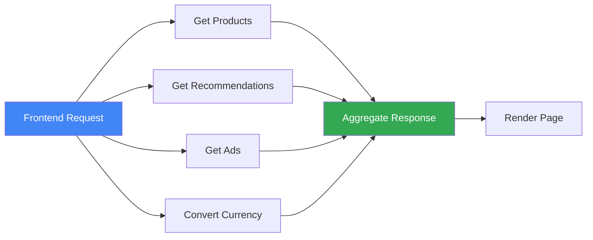
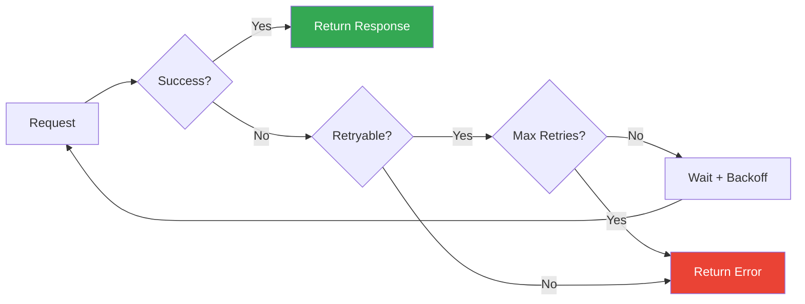
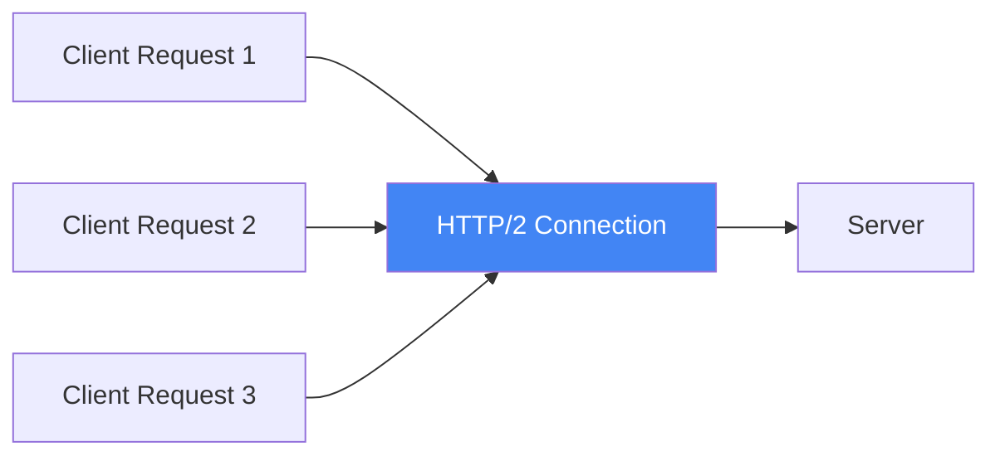
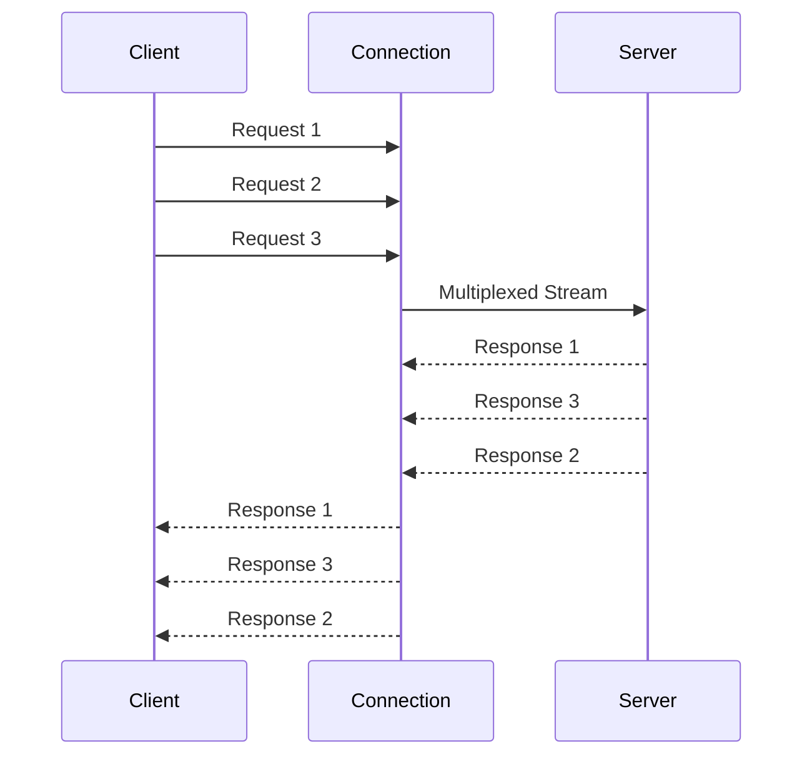
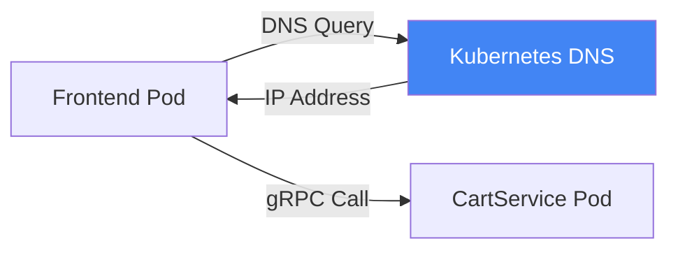
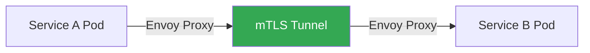
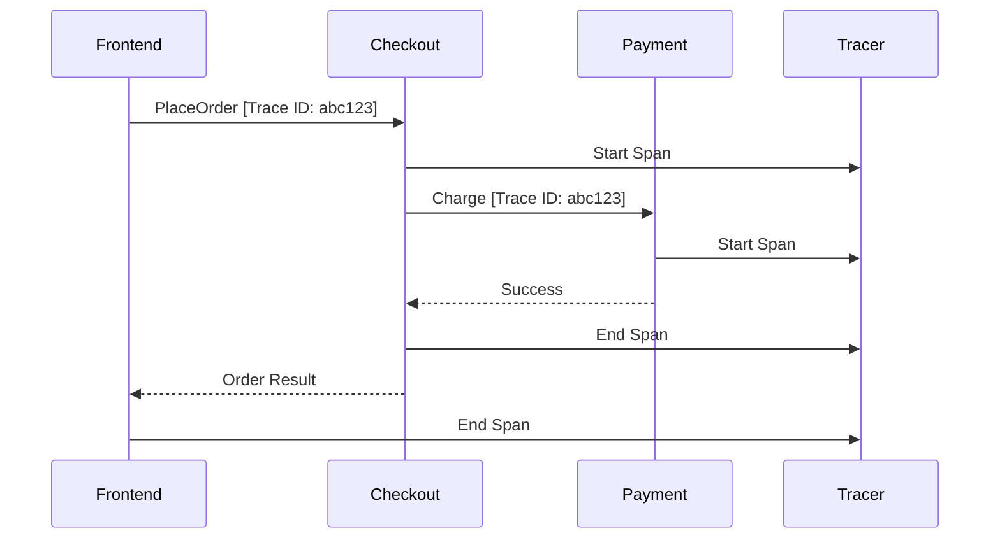

Online Boutique uses **gRPC** (Google Remote Procedure Call) for all inter-service communication. This page explains how services communicate, the benefits of gRPC, and the Protocol Buffer definitions that define service contracts.

## gRPC Overview

gRPC is a modern, high-performance RPC framework that uses HTTP/2 for transport and Protocol Buffers for serialization.

### Why gRPC?

<CardGroup cols={2}>
  <Card title="Performance" icon="gauge-high">
    Binary protocol with efficient serialization, 7-10x faster than JSON
  </Card>
  <Card title="Type Safety" icon="shield-check">
    Strongly-typed contracts with compile-time validation
  </Card>
  <Card title="Code Generation" icon="code">
    Automatic client and server code generation for all languages
  </Card>
  <Card title="Streaming" icon="water">
    Built-in support for unary, server, client, and bidirectional streaming
  </Card>
</CardGroup>

### gRPC vs REST

| Feature | gRPC | REST |
|---------|------|------|
| **Protocol** | HTTP/2 | HTTP/1.1 |
| **Payload** | Protocol Buffers (binary) | JSON (text) |
| **Performance** | High (binary, multiplexing) | Moderate |
| **Type Safety** | Strong (compile-time) | Weak (runtime) |
| **Streaming** | Native support | Limited (SSE, WebSockets) |
| **Browser Support** | Limited (needs proxy) | Native |
| **Human Readable** | No (binary) | Yes (JSON) |

<Note>
  Online Boutique uses gRPC for internal service-to-service communication and HTTP for the frontend-to-user interface.
</Note>

## Communication Architecture

### Service Dependency Graph



### Communication Patterns

#### 1. Request-Response (Unary RPC)

Most services use simple request-response pattern:



**Example**: Getting product details

```protobuf
// Request
message GetProductRequest {
    string id = 1;
}

// Response
message Product {
    string id = 1;
    string name = 2;
    string description = 3;
    Money price_usd = 5;
}
```

#### 2. Service Orchestration

Checkout service orchestrates multiple services:



#### 3. Fan-Out Pattern

Frontend fans out to multiple services in parallel:



## Protocol Buffers

Protocol Buffers (protobuf) is a language-neutral, platform-neutral mechanism for serializing structured data.

### Benefits

<AccordionGroup>
  <Accordion title="Compact Binary Format" icon="compress">
    Protocol Buffers serialize to a compact binary format, typically 3-10x smaller than JSON:
    
    - **JSON**: ~200 bytes for a product
    - **Protobuf**: ~50 bytes for the same product
    
    This reduces bandwidth and improves performance.
  </Accordion>
  
  <Accordion title="Schema Evolution" icon="code-branch">
    Protocol Buffers support backward and forward compatibility:
    
    - Add new fields without breaking old clients
    - Remove fields without breaking new clients
    - Field numbers are permanent identifiers
    
    This enables independent service deployment.
  </Accordion>
  
  <Accordion title="Strong Typing" icon="shield-check">
    All fields have explicit types:
    
    - Compile-time type checking
    - No runtime type errors
    - IDE autocomplete support
    
    This catches errors early in development.
  </Accordion>
  
  <Accordion title="Code Generation" icon="robot">
    Automatic code generation for multiple languages:
    
    - Go, Java, Python, C#, Node.js, and more
    - Type-safe client and server code
    - Consistent API across languages
    
    This reduces boilerplate and ensures consistency.
  </Accordion>
</AccordionGroup>

### Proto File Structure

All service definitions are in `protos/demo.proto`:

```protobuf
syntax = "proto3";

package hipstershop;

// Service definition
service ProductCatalogService {
    rpc ListProducts(Empty) returns (ListProductsResponse) {}
    rpc GetProduct(GetProductRequest) returns (Product) {}
    rpc SearchProducts(SearchProductsRequest) returns (SearchProductsResponse) {}
}

// Message definitions
message Product {
    string id = 1;
    string name = 2;
    string description = 3;
    string picture = 4;
    Money price_usd = 5;
    repeated string categories = 6;
}
```

### Field Numbering

Each field has a unique number:

```protobuf
message Product {
    string id = 1;           // Field number 1
    string name = 2;         // Field number 2
    string description = 3;  // Field number 3
}
```

<Warning>
  **Never change field numbers!** They are used for serialization and must remain constant for backward compatibility.
</Warning>

### Data Types

Protocol Buffers support various data types:

| Proto Type | Go | Java | Python | C# | Node.js |
|------------|-----|------|--------|-----|---------|
| `string` | string | String | str | string | string |
| `int32` | int32 | int | int | int | number |
| `int64` | int64 | long | int | long | number |
| `bool` | bool | boolean | bool | bool | boolean |
| `bytes` | []byte | ByteString | bytes | ByteString | Buffer |
| `repeated` | []T | List<T> | list | List<T> | T[] |

## Service Contracts

### Cart Service

Manages shopping cart operations:

```protobuf
service CartService {
    rpc AddItem(AddItemRequest) returns (Empty) {}
    rpc GetCart(GetCartRequest) returns (Cart) {}
    rpc EmptyCart(EmptyCartRequest) returns (Empty) {}
}

message CartItem {
    string product_id = 1;
    int32 quantity = 2;
}

message Cart {
    string user_id = 1;
    repeated CartItem items = 2;
}
```

**Usage Example**:
```go
// Add item to cart
cart.AddItem(ctx, &pb.AddItemRequest{
    UserId: "user123",
    Item: &pb.CartItem{
        ProductId: "OLJCESPC7Z",
        Quantity: 1,
    },
})
```

### Product Catalog Service

Provides product information:

```protobuf
service ProductCatalogService {
    rpc ListProducts(Empty) returns (ListProductsResponse) {}
    rpc GetProduct(GetProductRequest) returns (Product) {}
    rpc SearchProducts(SearchProductsRequest) returns (SearchProductsResponse) {}
}

message Product {
    string id = 1;
    string name = 2;
    string description = 3;
    string picture = 4;
    Money price_usd = 5;
    repeated string categories = 6;
}
```

### Currency Service

Handles currency conversion:

```protobuf
service CurrencyService {
    rpc GetSupportedCurrencies(Empty) returns (GetSupportedCurrenciesResponse) {}
    rpc Convert(CurrencyConversionRequest) returns (Money) {}
}

message Money {
    string currency_code = 1;  // ISO 4217 code (e.g., "USD")
    int64 units = 2;            // Whole units (e.g., dollars)
    int32 nanos = 3;            // Fractional units (e.g., cents * 10^7)
}
```

**Money Representation**:
```
$12.34 = Money{currency_code: "USD", units: 12, nanos: 340000000}
-$1.75 = Money{currency_code: "USD", units: -1, nanos: -750000000}
```

### Checkout Service

Orchestrates order placement:

```protobuf
service CheckoutService {
    rpc PlaceOrder(PlaceOrderRequest) returns (PlaceOrderResponse) {}
}

message PlaceOrderRequest {
    string user_id = 1;
    string user_currency = 2;
    Address address = 3;
    string email = 5;
    CreditCardInfo credit_card = 6;
}

message PlaceOrderResponse {
    OrderResult order = 1;
}
```

## Error Handling

### gRPC Status Codes

gRPC uses standard status codes:

| Code | Name | Description | Example |
|------|------|-------------|---------|
| 0 | OK | Success | Request completed successfully |
| 1 | CANCELLED | Cancelled | Client cancelled request |
| 2 | UNKNOWN | Unknown error | Unexpected error |
| 3 | INVALID_ARGUMENT | Invalid argument | Invalid product ID |
| 4 | DEADLINE_EXCEEDED | Timeout | Request took too long |
| 5 | NOT_FOUND | Not found | Product doesn't exist |
| 7 | PERMISSION_DENIED | Permission denied | Unauthorized access |
| 14 | UNAVAILABLE | Service unavailable | Service is down |

### Error Handling Pattern

```go
// Client-side error handling
resp, err := client.GetProduct(ctx, &pb.GetProductRequest{Id: "invalid"})
if err != nil {
    st, ok := status.FromError(err)
    if ok {
        switch st.Code() {
        case codes.NotFound:
            // Handle not found
        case codes.InvalidArgument:
            // Handle invalid argument
        default:
            // Handle other errors
        }
    }
}
```

### Retry Logic

Services implement retry logic for transient failures:



**Retryable Errors**:
- `UNAVAILABLE` - Service temporarily down
- `DEADLINE_EXCEEDED` - Request timeout
- `RESOURCE_EXHAUSTED` - Rate limit exceeded

**Non-Retryable Errors**:
- `INVALID_ARGUMENT` - Bad request data
- `NOT_FOUND` - Resource doesn't exist
- `PERMISSION_DENIED` - Authorization failure

## Performance Optimization

### Connection Pooling

gRPC reuses HTTP/2 connections:



**Benefits**:
- Reduced connection overhead
- Lower latency
- Better resource utilization

### Request Multiplexing

Multiple requests share a single connection:



### Compression

gRPC supports message compression:

```go
// Enable compression
conn, err := grpc.Dial(
    address,
    grpc.WithDefaultCallOptions(grpc.UseCompressor(gzip.Name)),
)
```

**Compression Ratios**:
- Text data: 60-80% reduction
- JSON: 70-90% reduction
- Already compressed data: Minimal benefit

### Deadlines and Timeouts

Set deadlines to prevent hanging requests:

```go
// Set 5-second deadline
ctx, cancel := context.WithTimeout(context.Background(), 5*time.Second)
defer cancel()

resp, err := client.GetProduct(ctx, req)
```

## Service Discovery

### Kubernetes DNS

Services discover each other via Kubernetes DNS:

```
<service-name>.<namespace>.svc.cluster.local
```

**Example**:
```go
// Connect to cart service
conn, err := grpc.Dial(
    "cartservice:7070",  // Kubernetes service name
    grpc.WithInsecure(),
)
```

### Service Resolution



## Security

### TLS Encryption

Production deployments should use TLS:

```go
// Server with TLS
creds, err := credentials.NewServerTLSFromFile(certFile, keyFile)
server := grpc.NewServer(grpc.Creds(creds))

// Client with TLS
creds, err := credentials.NewClientTLSFromFile(certFile, "")
conn, err := grpc.Dial(address, grpc.WithTransportCredentials(creds))
```

### Service Mesh (Istio)

With Istio, mTLS is automatic:



**Benefits**:
- Automatic certificate management
- Mutual authentication
- Encrypted communication
- Zero code changes

## Observability

### Distributed Tracing

gRPC integrates with OpenTelemetry:



### Metrics

gRPC exposes Prometheus metrics:

- `grpc_server_handled_total` - Total requests handled
- `grpc_server_handling_seconds` - Request duration
- `grpc_server_msg_received_total` - Messages received
- `grpc_server_msg_sent_total` - Messages sent

### Logging

Structured logging for gRPC calls:

```json
{
  "timestamp": "2024-02-13T10:30:00Z",
  "service": "frontend",
  "method": "/hipstershop.ProductCatalogService/GetProduct",
  "request_id": "abc123",
  "duration_ms": 45,
  "status": "OK"
}
```

## Best Practices

<AccordionGroup>
  <Accordion title="Use Deadlines" icon="clock">
    Always set deadlines to prevent hanging requests:
    ```go
    ctx, cancel := context.WithTimeout(ctx, 5*time.Second)
    defer cancel()
    ```
  </Accordion>
  
  <Accordion title="Handle Errors Properly" icon="triangle-exclamation">
    Check and handle gRPC status codes appropriately:
    ```go
    if err != nil {
        st, _ := status.FromError(err)
        log.Printf("Error: %v, Code: %v", st.Message(), st.Code())
    }
    ```
  </Accordion>
  
  <Accordion title="Implement Retries" icon="rotate">
    Retry transient failures with exponential backoff:
    ```go
    grpc.WithUnaryInterceptor(
        grpc_retry.UnaryClientInterceptor(
            grpc_retry.WithMax(3),
            grpc_retry.WithBackoff(grpc_retry.BackoffExponential(100*time.Millisecond)),
        ),
    )
    ```
  </Accordion>
  
  <Accordion title="Use Connection Pooling" icon="layer-group">
    Reuse gRPC connections instead of creating new ones for each request.
  </Accordion>
  
  <Accordion title="Enable Compression" icon="compress">
    Use compression for large payloads to reduce bandwidth.
  </Accordion>
  
  <Accordion title="Monitor Performance" icon="chart-line">
    Track metrics like latency, error rates, and throughput.
  </Accordion>
</AccordionGroup>

## Next Steps

<CardGroup cols={2}>
  <Card title="Data Flow" icon="diagram-project" href="/architecture/data-flow">
    See how data flows through the system
  </Card>
  <Card title="User Journeys" icon="route" href="/architecture/user-journeys">
    Explore sequence diagrams for key flows
  </Card>
  <Card title="API Reference" icon="book" href="/api-reference/proto-definitions">
    Complete Protocol Buffer definitions
  </Card>
  <Card title="Microservices" icon="cubes" href="/microservices/overview">
    Detailed documentation for each service
  </Card>
</CardGroup>
