This page explains how data flows through the Online Boutique system, from user requests to database operations and external API calls.

## Request Flow Overview

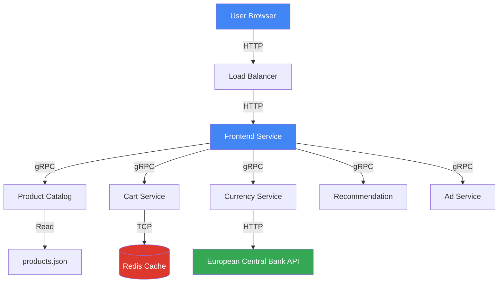

## Homepage Load Flow

When a user visits the homepage, multiple services are called in parallel:

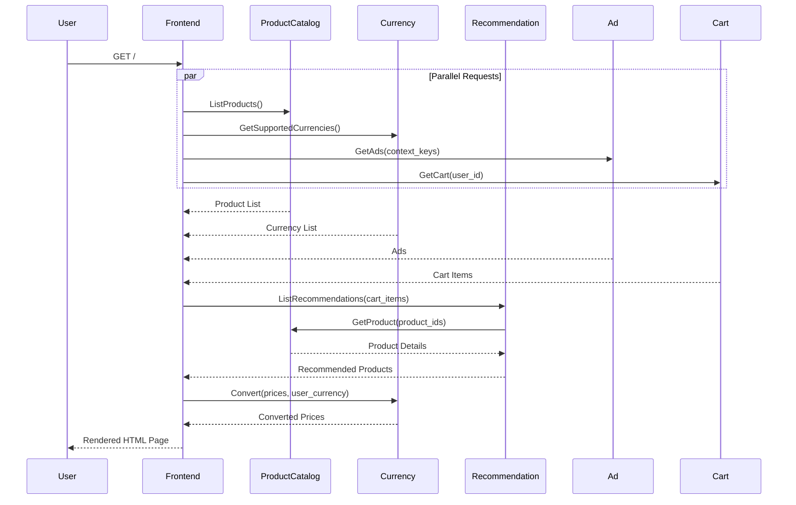

**Data Flow Steps**:

1. **User Request**: Browser sends HTTP GET to frontend
2. **Parallel Service Calls**: Frontend fans out to multiple services
3. **Product Data**: Product catalog returns list from JSON file
4. **Currency Data**: Currency service fetches supported currencies
5. **Ad Data**: Ad service returns contextual advertisements
6. **Cart Data**: Cart service retrieves user's cart from Redis
7. **Recommendations**: Recommendation service suggests products based on cart
8. **Currency Conversion**: All prices converted to user's selected currency
9. **Response**: Frontend aggregates all data and renders HTML

## Product Search Flow

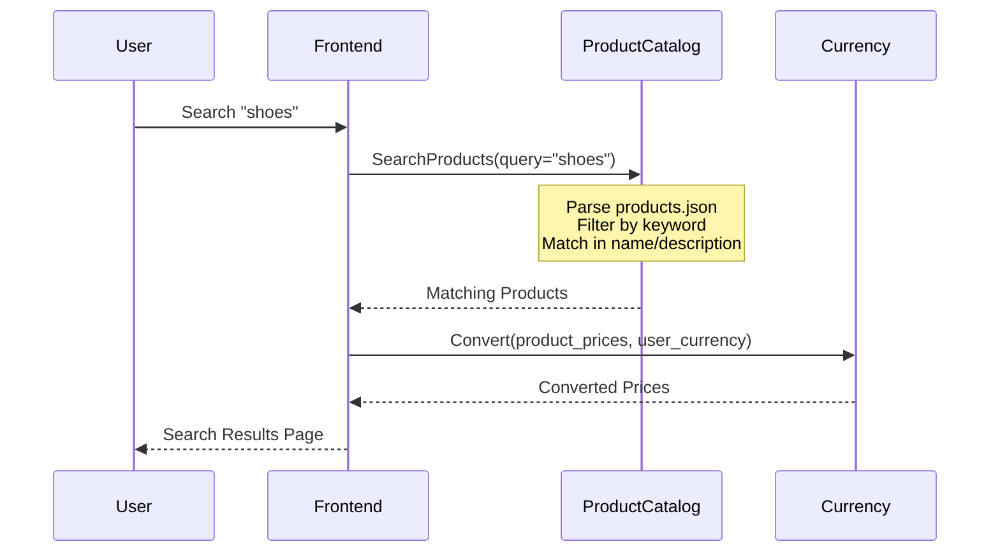

**Search Algorithm**:
1. Receive search query from frontend
2. Load products from JSON file
3. Filter products where query matches:
   - Product name (case-insensitive)
   - Product description (case-insensitive)
   - Product categories
4. Return matching products
5. Convert prices to user's currency

## Add to Cart Flow

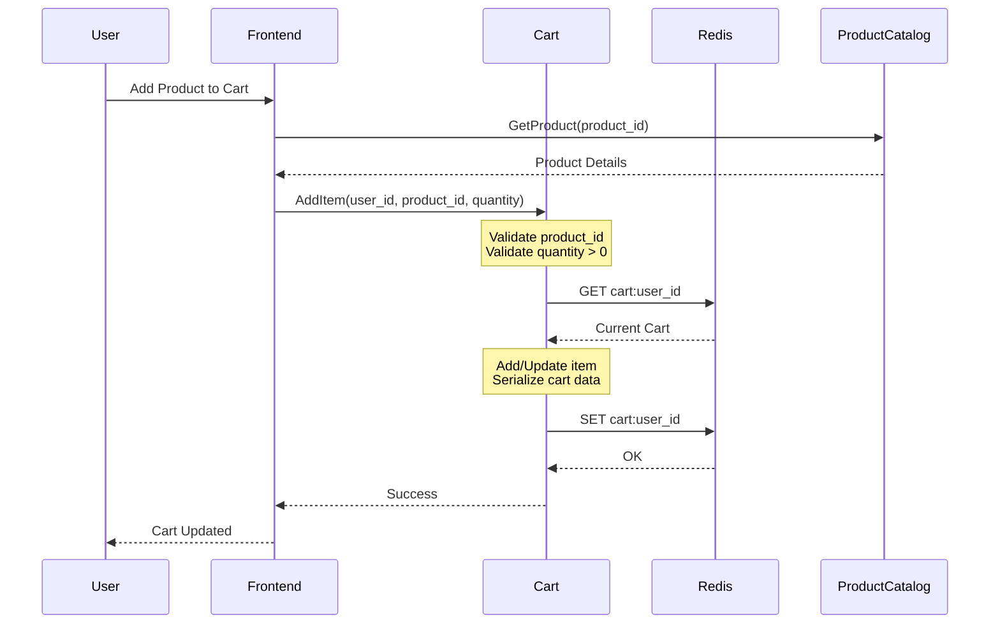

**Cart Data Structure in Redis**:
```json
{
  "user_id": "session_abc123",
  "items": [
    {
      "product_id": "OLJCESPC7Z",
      "quantity": 2
    },
    {
      "product_id": "66VCHSJNUP",
      "quantity": 1
    }
  ]
}
```

**Key**: `cart:{user_id}`  
**TTL**: 24 hours (configurable)

## Checkout Flow

The checkout process is the most complex data flow, involving 7 services:

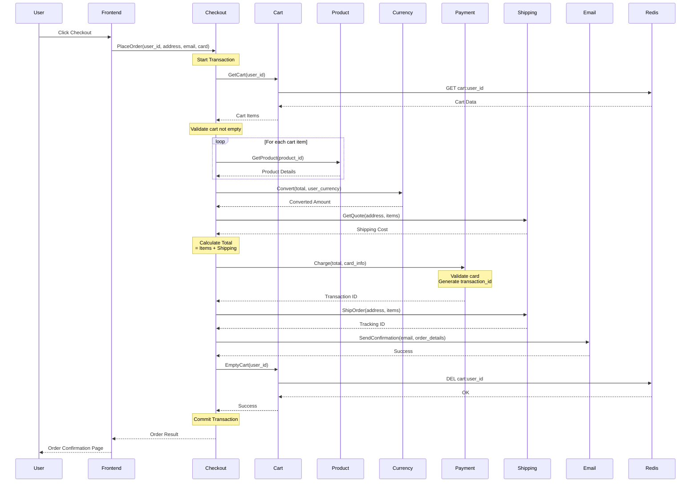

**Order Data Structure**:
```json
{
  "order_id": "a1b2c3d4-e5f6-7890",
  "user_id": "session_abc123",
  "items": [
    {
      "product_id": "OLJCESPC7Z",
      "quantity": 2,
      "cost": {
        "currency_code": "USD",
        "units": 35,
        "nanos": 990000000
      }
    }
  ],
  "shipping_address": {
    "street_address": "1600 Amphitheatre Parkway",
    "city": "Mountain View",
    "state": "CA",
    "country": "US",
    "zip_code": 94043
  },
  "shipping_cost": {
    "currency_code": "USD",
    "units": 8,
    "nanos": 990000000
  },
  "shipping_tracking_id": "SHIP-12345",
  "transaction_id": "TXN-67890"
}
```

## Currency Conversion Flow

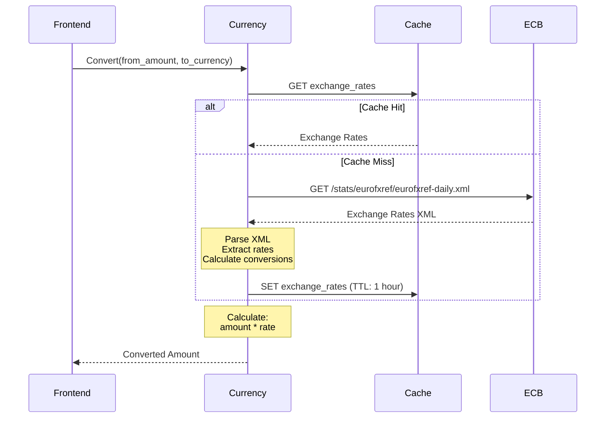

**Exchange Rate Caching**:
- **Source**: European Central Bank (ECB)
- **Update Frequency**: Daily
- **Cache TTL**: 1 hour
- **Fallback**: Use cached rates if ECB unavailable

**Conversion Formula**:
```
converted_amount = original_amount * (target_rate / source_rate)
```

**Example**:
```
$100 USD to EUR
EUR rate = 0.85
Converted = 100 * 0.85 = €85
```

## Recommendation Flow

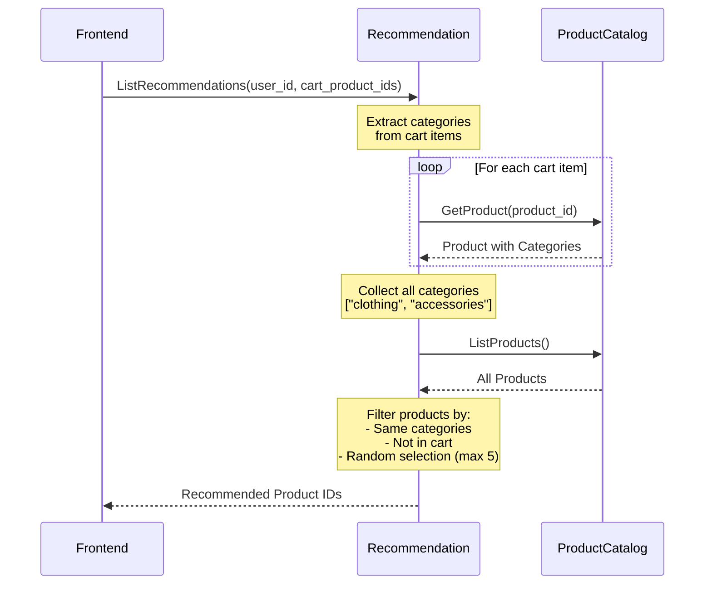

**Recommendation Algorithm**:
1. Get products currently in cart
2. Extract categories from cart products
3. Find all products with matching categories
4. Exclude products already in cart
5. Randomly select up to 5 products
6. Return product IDs

## Data Storage Patterns

### Redis (Cart Service)

**Purpose**: Session-based cart storage

**Data Model**:
```
Key: cart:{user_id}
Value: Serialized Cart protobuf
TTL: 86400 seconds (24 hours)
```

**Operations**:
- `GET cart:{user_id}` - Retrieve cart
- `SET cart:{user_id}` - Update cart
- `DEL cart:{user_id}` - Empty cart
- `EXPIRE cart:{user_id} 86400` - Reset TTL

**Alternative Backends** (via Kustomize):
- **Spanner**: Globally distributed SQL database
- **AlloyDB**: PostgreSQL-compatible database

### JSON File (Product Catalog)

**Purpose**: Static product inventory

**Location**: `src/productcatalogservice/products.json`

**Structure**:
```json
{
  "products": [
    {
      "id": "OLJCESPC7Z",
      "name": "Sunglasses",
      "description": "Add a modern touch...",
      "picture": "/static/img/products/sunglasses.jpg",
      "priceUsd": {
        "currencyCode": "USD",
        "units": 19,
        "nanos": 990000000
      },
      "categories": ["accessories"]
    }
  ]
}
```

**Access Pattern**:
- Load entire file into memory on startup
- Serve from memory (no disk I/O per request)
- Optional: Reload on SIGUSR1 signal

### In-Memory (Ad Service)

**Purpose**: Ad inventory

**Structure**:
```go
var ads = []Ad{
    {RedirectUrl: "/product/2ZYFJ3GM2N", Text: "Film camera for sale..."},
    {RedirectUrl: "/product/0PUK6V6EV0", Text: "Vintage camera lens..."},
    // ... more ads
}
```

**Selection**: Random selection based on context keywords

## Data Consistency

### Session Management

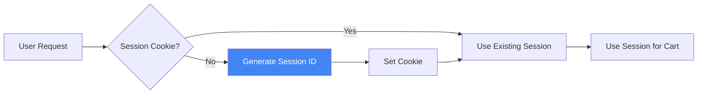

**Session ID Format**: `{random_uuid}`  
**Cookie Name**: `shop_session-id`  
**Cookie Lifetime**: Session (browser close)

### Cart Consistency

**Problem**: Multiple concurrent cart updates

**Solution**: Redis atomic operations

```go
// Atomic read-modify-write
WATCH cart:user_id
cart = GET cart:user_id
cart.items.append(new_item)
MULTI
SET cart:user_id cart
EXEC
```

### Price Consistency

**Challenge**: Prices change during checkout

**Solution**: Calculate prices at checkout time
1. Retrieve current product prices
2. Apply current exchange rates
3. Calculate total
4. Process payment

**Note**: Prices may differ from cart display to checkout

## External API Integration

### European Central Bank API

**Endpoint**: `https://www.ecb.europa.eu/stats/eurofxref/eurofxref-daily.xml`

**Response Format**: XML
```xml
<Cube>
  <Cube time="2024-02-13">
    <Cube currency="USD" rate="1.0856"/>
    <Cube currency="JPY" rate="163.26"/>
    <Cube currency="GBP" rate="0.85668"/>
  </Cube>
</Cube>
```

**Error Handling**:
- Timeout: 5 seconds
- Retry: 3 attempts with exponential backoff
- Fallback: Use cached rates
- Alert: Log warning if rates > 24 hours old

## Performance Optimizations

### Caching Strategy

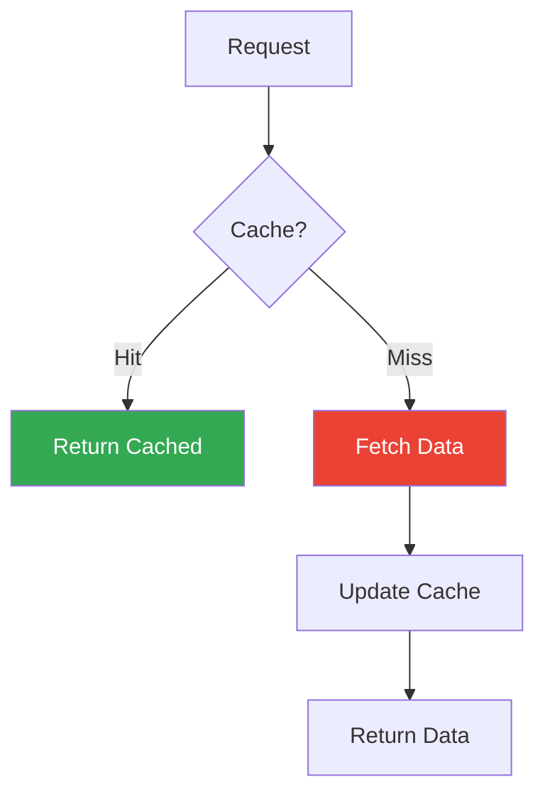

**Cached Data**:
- Exchange rates (1 hour TTL)
- Product catalog (in-memory, reload on signal)
- Cart data (24 hour TTL)

### Connection Pooling

**gRPC Connections**:
- Reuse HTTP/2 connections
- Connection pool size: 10 per service
- Idle timeout: 5 minutes
- Max lifetime: 30 minutes

### Request Batching

**Product Details**:
- Batch multiple GetProduct calls
- Reduce round trips
- Parallel processing

## Data Flow Metrics

### Key Metrics

| Metric | Description | Target |
|--------|-------------|--------|
| **Request Latency** | Time from user request to response | < 100ms (p95) |
| **Service Latency** | Time for individual service calls | < 50ms (p95) |
| **Cache Hit Rate** | Percentage of cache hits | > 90% |
| **Error Rate** | Percentage of failed requests | < 0.1% |
| **Throughput** | Requests per second | > 1000 RPS |

### Monitoring Points

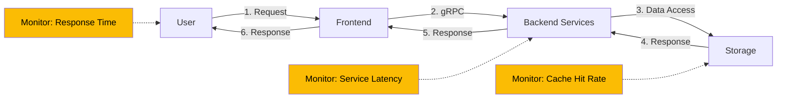

## Error Handling in Data Flow

### Graceful Degradation

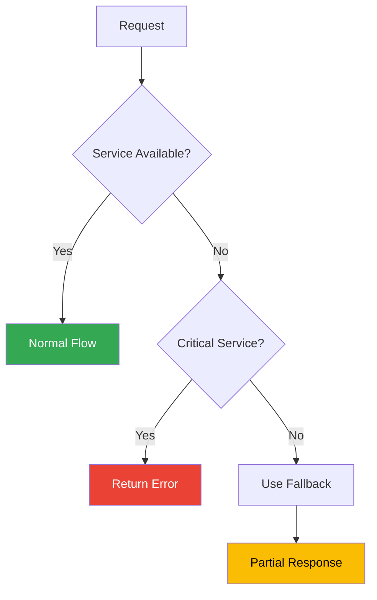

**Critical Services** (must succeed):
- Cart Service (for checkout)
- Payment Service (for checkout)
- Product Catalog (for product pages)

**Non-Critical Services** (can fail gracefully):
- Recommendation Service (show empty recommendations)
- Ad Service (hide ad section)
- Currency Service (use default USD)

### Retry Strategy

**Transient Failures**:
- Max retries: 3
- Backoff: Exponential (100ms, 200ms, 400ms)
- Timeout: 5 seconds per attempt

**Circuit Breaker**:
- Failure threshold: 5 consecutive failures
- Open duration: 30 seconds
- Half-open: Allow 1 test request

## Data Security

### Data in Transit


**With Istio Service Mesh**:
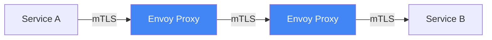

### Data at Rest

- **Redis**: Optional encryption at rest
- **Spanner/AlloyDB**: Automatic encryption
- **Secrets**: Kubernetes Secrets (base64 encoded)

### Sensitive Data Handling

**Credit Card Information**:
- Never stored
- Passed directly to payment service
- Masked in logs (last 4 digits only)

**Personal Information**:
- Email addresses: Used only for order confirmation
- Addresses: Used only for shipping calculation
- No persistent user accounts

## Next Steps

<CardGroup cols={2}>
  <Card title="User Journeys" icon="route" href="/architecture/user-journeys">
    See detailed sequence diagrams for key flows
  </Card>
  <Card title="Communication Patterns" icon="arrows-left-right" href="/architecture/communication">
    Learn about gRPC and service communication
  </Card>
  <Card title="Microservices" icon="cubes" href="/microservices/overview">
    Explore individual service implementations
  </Card>
  <Card title="Deployment" icon="rocket" href="/deployment/overview">
    Deploy Online Boutique to production
  </Card>
</CardGroup>
