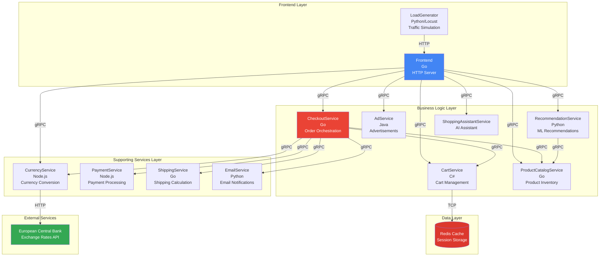
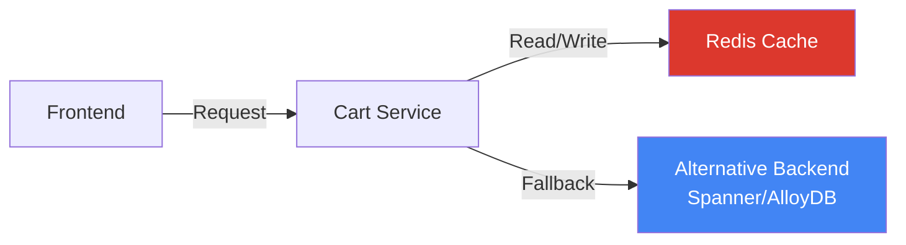
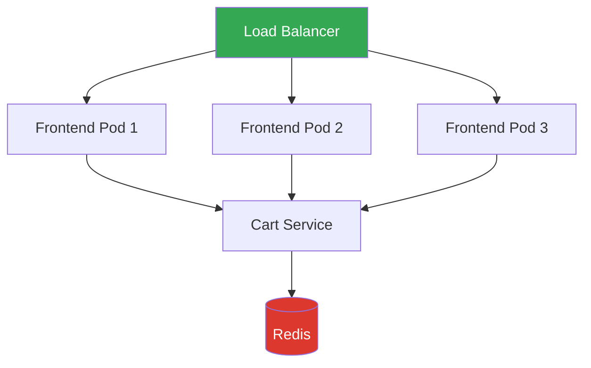
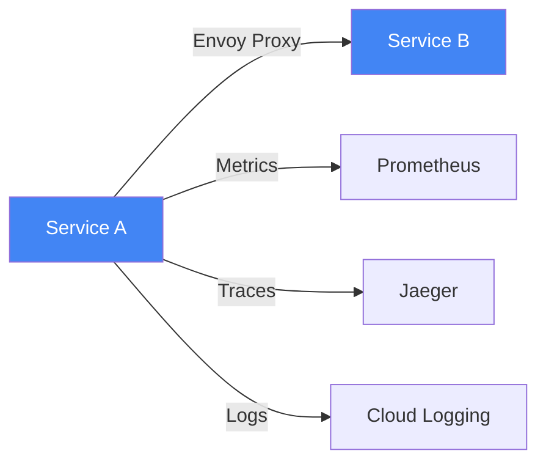
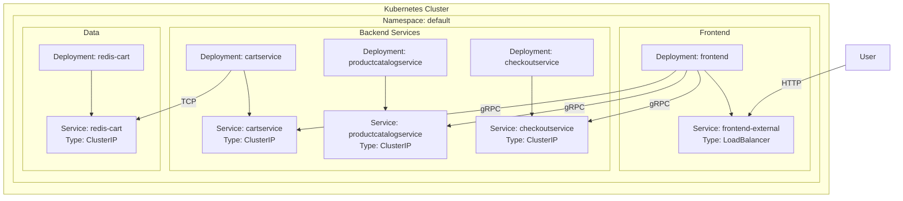

Online Boutique is built using a **microservices architecture** with 11 independent services that communicate via gRPC. This architecture demonstrates modern cloud-native patterns and best practices.

## System Architecture

The following diagram shows all microservices and their communication patterns:



## Service Overview

### Frontend Layer

<AccordionGroup>
  <Accordion title="Frontend Service" icon="window-maximize">
    **Language**: Go  
    **Purpose**: Web UI and API gateway
    
    The frontend service is the entry point for users. It:
    - Serves the web UI (HTML/CSS/JavaScript)
    - Aggregates data from backend services
    - Manages user sessions
    - Handles HTTP requests and converts them to gRPC calls
    
    **Key Responsibilities**:
    - Product browsing and search
    - Shopping cart display
    - Checkout flow coordination
    - Currency selection
    - Ad display
    
    **Dependencies**: All backend services
  </Accordion>
  
  <Accordion title="Load Generator" icon="chart-line">
    **Language**: Python (Locust)  
    **Purpose**: Realistic traffic simulation
    
    Continuously generates realistic user traffic to:
    - Test system performance
    - Demonstrate observability features
    - Simulate production load patterns
    
    **Traffic Patterns**:
    - Browse products
    - Add items to cart
    - Complete checkout
    - View recommendations
  </Accordion>
</AccordionGroup>

### Business Logic Layer

<AccordionGroup>
  <Accordion title="Cart Service" icon="cart-shopping">
    **Language**: C#  
    **Purpose**: Shopping cart management
    
    Manages shopping cart operations using Redis for persistence:
    - Add items to cart
    - Remove items from cart
    - Get cart contents
    - Empty cart
    
    **Storage**: Redis (in-memory cache)  
    **Alternative Backends**: Spanner, AlloyDB (via Kustomize)
  </Accordion>
  
  <Accordion title="Product Catalog Service" icon="box">
    **Language**: Go  
    **Purpose**: Product inventory and search
    
    Provides product information from a JSON file:
    - List all products
    - Get product details
    - Search products by keyword
    - Product categorization
    
    **Data Source**: Static JSON file (`products.json`)  
    **Features**: Dynamic catalog reloading, latency injection for testing
  </Accordion>
  
  <Accordion title="Recommendation Service" icon="star">
    **Language**: Python  
    **Purpose**: Product recommendations
    
    Suggests products based on cart contents using a simple algorithm:
    - Analyzes current cart items
    - Finds products in similar categories
    - Returns personalized recommendations
    
    **Algorithm**: Category-based filtering
  </Accordion>
  
  <Accordion title="Ad Service" icon="rectangle-ad">
    **Language**: Java  
    **Purpose**: Contextual advertisements
    
    Provides text ads based on context keywords:
    - Keyword-based ad selection
    - Random ad rotation
    - Context-aware targeting
    
    **Ad Storage**: In-memory list
  </Accordion>
  
  <Accordion title="Checkout Service" icon="cash-register">
    **Language**: Go  
    **Purpose**: Order orchestration
    
    Coordinates the checkout process by calling multiple services:
    1. Retrieve cart items
    2. Calculate shipping cost
    3. Process payment
    4. Ship order
    5. Send confirmation email
    6. Empty cart
    
    **Pattern**: Orchestration (vs. choreography)  
    **Error Handling**: Comprehensive error handling and rollback
  </Accordion>
  
  <Accordion title="Shopping Assistant Service" icon="robot">
    **Language**: Python  
    **Purpose**: AI-powered shopping assistance
    
    Uses Gemini AI to provide intelligent product suggestions:
    - Image-based product search
    - Natural language queries
    - Personalized recommendations
    
    **AI Model**: Google Gemini  
    **Deployment**: Optional Kustomize component
  </Accordion>
</AccordionGroup>

### Supporting Services Layer

<AccordionGroup>
  <Accordion title="Currency Service" icon="dollar-sign">
    **Language**: Node.js  
    **Purpose**: Multi-currency support
    
    Converts prices between currencies:
    - Fetches real exchange rates from European Central Bank
    - Supports 150+ currencies
    - Caches exchange rates
    
    **Characteristics**: Highest QPS (queries per second) service  
    **External Dependency**: European Central Bank API
  </Accordion>
  
  <Accordion title="Payment Service" icon="credit-card">
    **Language**: Node.js  
    **Purpose**: Payment processing (mock)
    
    Simulates payment processing:
    - Validates credit card information
    - Generates transaction IDs
    - Mock charge processing
    
    **Note**: This is a mock service - no real payments are processed
  </Accordion>
  
  <Accordion title="Shipping Service" icon="truck">
    **Language**: Go  
    **Purpose**: Shipping cost calculation
    
    Calculates shipping costs and generates tracking IDs:
    - Cost calculation based on cart items
    - Mock shipment creation
    - Tracking ID generation
    
    **Algorithm**: Simple cost calculation based on item count
  </Accordion>
  
  <Accordion title="Email Service" icon="envelope">
    **Language**: Python  
    **Purpose**: Order confirmation emails
    
    Sends order confirmation emails:
    - Generates email content
    - Mock email sending
    - Order summary formatting
    
    **Note**: Emails are logged but not actually sent
  </Accordion>
</AccordionGroup>

## Architecture Patterns

### Microservices Principles

Online Boutique demonstrates key microservices principles:

<CardGroup cols={2}>
  <Card title="Single Responsibility" icon="bullseye">
    Each service has one clear purpose and responsibility
  </Card>
  <Card title="Loose Coupling" icon="link-slash">
    Services communicate via well-defined APIs (gRPC)
  </Card>
  <Card title="Independent Deployment" icon="rocket">
    Services can be deployed independently
  </Card>
  <Card title="Technology Diversity" icon="layer-group">
    Services use different languages and frameworks
  </Card>
</CardGroup>

### Communication Patterns

#### Synchronous Communication (gRPC)

All inter-service communication uses gRPC with Protocol Buffers:

**Advantages**:
- Type-safe contracts
- High performance (binary protocol)
- Built-in code generation
- Streaming support
- Language-agnostic

**Example Flow**:
```
Frontend → gRPC → Product Catalog Service
         ← Product List ←
```

#### Asynchronous Communication

Currently, Online Boutique uses synchronous communication. For production systems, consider:
- Message queues for order processing
- Event-driven architecture for notifications
- Pub/sub for real-time updates

### Data Management

#### Database per Service

Each service manages its own data:

- **Cart Service**: Redis (in-memory cache)
- **Product Catalog**: JSON file (could be database)
- **Other Services**: Stateless or ephemeral storage

**Benefits**:
- Service independence
- Technology flexibility
- Easier scaling

**Challenges**:
- Data consistency
- Distributed transactions
- Query complexity

#### Caching Strategy



### Scalability Patterns

#### Horizontal Scaling

All services are designed to scale horizontally:



**Scaling Strategies**:
- **Stateless Services**: Frontend, Product Catalog, Currency, etc.
- **Stateful Services**: Cart Service (uses external Redis)
- **Auto-scaling**: Based on CPU, memory, or custom metrics

#### Service Mesh Integration

Optional Istio service mesh provides:



**Features**:
- Traffic management
- Security (mTLS)
- Observability
- Resilience (retries, circuit breakers)

## Deployment Architecture

### Kubernetes Resources

Each service typically includes:

```yaml
# Deployment
- Pods (containers)
- ReplicaSets (scaling)
- Resource limits (CPU/memory)

# Networking
- Services (ClusterIP for internal, LoadBalancer for frontend)
- Endpoints
- Network Policies (optional)

# Configuration
- ConfigMaps
- Secrets
- Environment Variables
```

### Resource Topology



## Design Decisions

### Why gRPC?

<AccordionGroup>
  <Accordion title="Performance" icon="gauge-high">
    - Binary protocol (faster than JSON)
    - HTTP/2 multiplexing
    - Efficient serialization with Protocol Buffers
  </Accordion>
  
  <Accordion title="Type Safety" icon="shield-check">
    - Strongly-typed contracts
    - Compile-time validation
    - Automatic code generation
  </Accordion>
  
  <Accordion title="Language Agnostic" icon="globe">
    - Works across all major languages
    - Consistent API across services
    - Easy polyglot development
  </Accordion>
  
  <Accordion title="Modern Features" icon="star">
    - Streaming (unary, server, client, bidirectional)
    - Deadlines and cancellation
    - Built-in authentication
  </Accordion>
</AccordionGroup>

### Why Polyglot?

Using multiple languages demonstrates:

- **Real-world scenarios**: Most organizations have diverse tech stacks
- **Best tool for the job**: Each language has strengths
- **Team flexibility**: Teams can use familiar technologies
- **Learning opportunity**: Explore different ecosystems

### Why Kubernetes?

Kubernetes provides:

- **Orchestration**: Automated deployment, scaling, and management
- **Portability**: Run anywhere (cloud, on-prem, local)
- **Ecosystem**: Rich tooling and integrations
- **Industry standard**: Most widely adopted container orchestrator

## Non-Functional Requirements

### Performance

- **Response Time**: < 100ms for most operations
- **Throughput**: Handles 1000+ requests/second
- **Scalability**: Horizontal scaling for all services

### Reliability

- **Availability**: 99.9% uptime target
- **Fault Tolerance**: Graceful degradation
- **Health Checks**: Liveness and readiness probes

### Observability

- **Logging**: Structured logs to Cloud Logging
- **Metrics**: Prometheus-compatible metrics
- **Tracing**: Distributed tracing with OpenTelemetry
- **Profiling**: Continuous profiling support

### Security

- **Authentication**: Service-to-service auth (optional with Istio)
- **Authorization**: RBAC policies
- **Encryption**: TLS for external traffic, mTLS for internal (with service mesh)
- **Secrets Management**: Kubernetes Secrets

## Next Steps

<CardGroup cols={2}>
  <Card title="Communication Patterns" icon="arrows-left-right" href="/architecture/communication">
    Deep dive into gRPC and service communication
  </Card>
  <Card title="Data Flow" icon="diagram-project" href="/architecture/data-flow">
    Understand how data flows through the system
  </Card>
  <Card title="User Journeys" icon="route" href="/architecture/user-journeys">
    See sequence diagrams for key user flows
  </Card>
  <Card title="Microservices Details" icon="cubes" href="/microservices/overview">
    Explore each service in detail
  </Card>
</CardGroup>
