This page provides detailed sequence diagrams for the most important user journeys in Online Boutique. These diagrams show exactly how services interact to fulfill user requests.

## Journey 1: Browse Products

The simplest journey - a user visits the homepage and browses products.

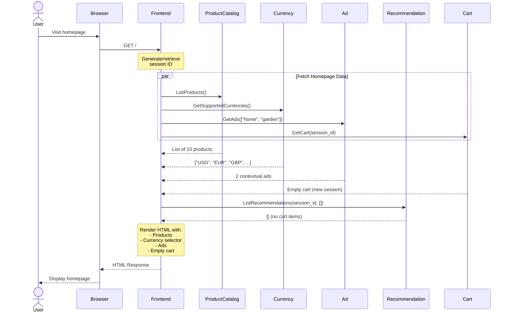

**Key Points**:
- Session ID generated on first visit
- Multiple services called in parallel for performance
- Empty cart for new users
- No recommendations without cart items

## Journey 2: Search for Products

User searches for specific products.

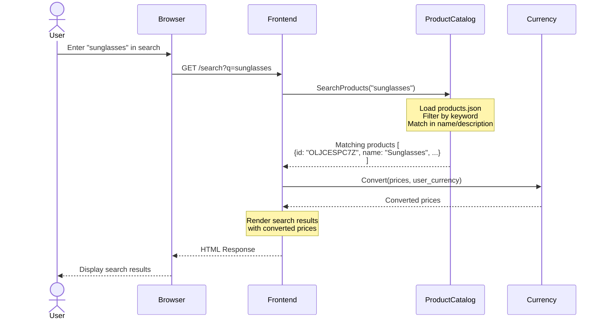

**Search Behavior**:
- Case-insensitive matching
- Searches in product name and description
- Returns all matching products
- Prices converted to user's selected currency

## Journey 3: View Product Details

User clicks on a product to see details.

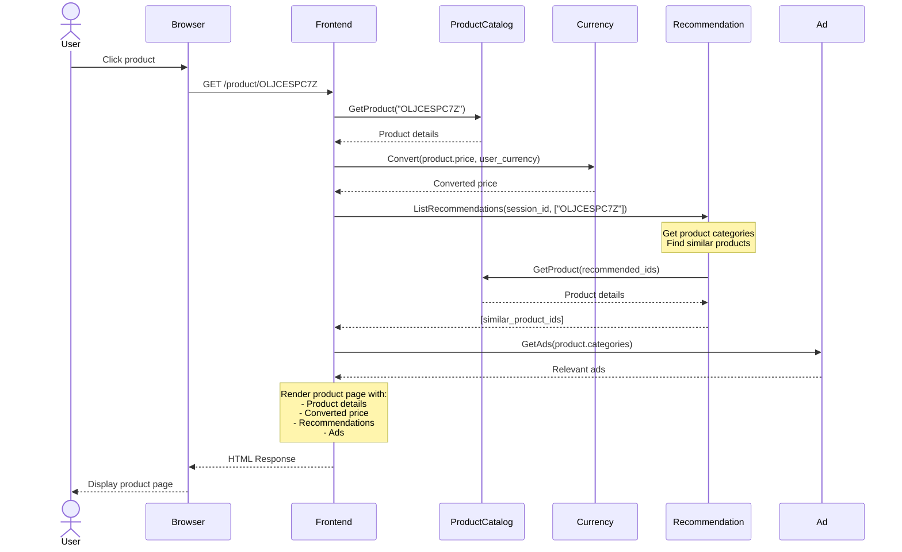

**Features**:
- Full product information displayed
- Price in user's currency
- Recommendations based on product category
- Contextual ads based on product category

## Journey 4: Add Item to Cart

User adds a product to their shopping cart.

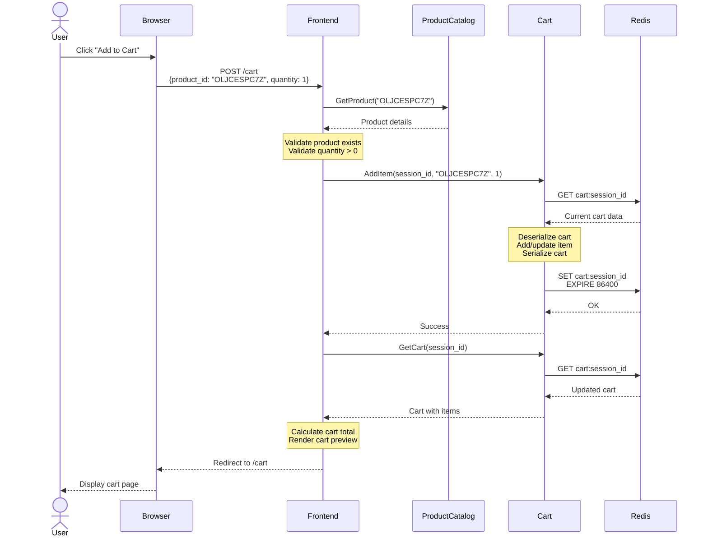

**Cart Operations**:
- Validates product exists before adding
- Updates quantity if product already in cart
- Stores cart in Redis with 24-hour TTL
- Redirects to cart page after adding

## Journey 5: View Cart

User views their shopping cart.

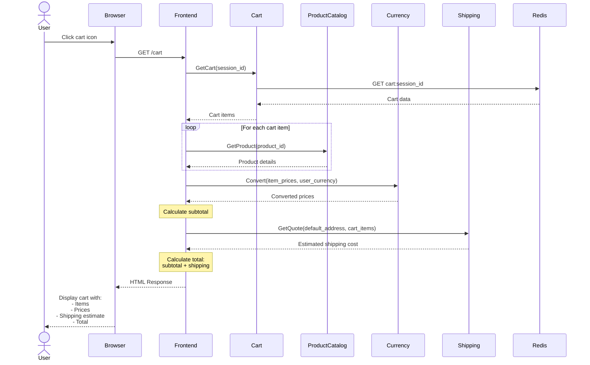

**Cart Display**:
- Shows all items with current prices
- Displays quantity for each item
- Shows estimated shipping cost
- Calculates total in user's currency

## Journey 6: Update Cart Quantity

User changes the quantity of an item in the cart.

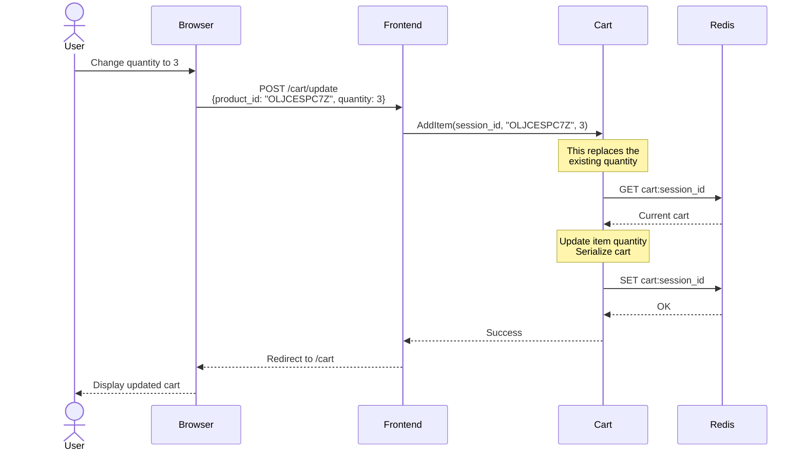

## Journey 7: Remove Item from Cart

User removes an item from the cart.

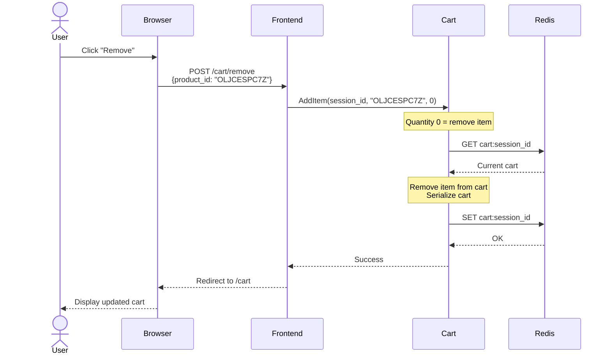

**Note**: Setting quantity to 0 removes the item from the cart.

## Journey 8: Change Currency

User selects a different currency.

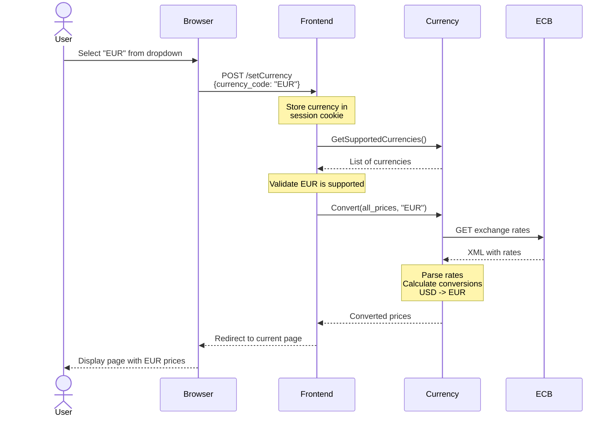

**Currency Conversion**:
- Supported currencies fetched from ECB
- Exchange rates cached for 1 hour
- All prices converted in real-time
- Currency preference stored in session

## Journey 9: Complete Checkout (Success Path)

The most complex journey - user completes a purchase.

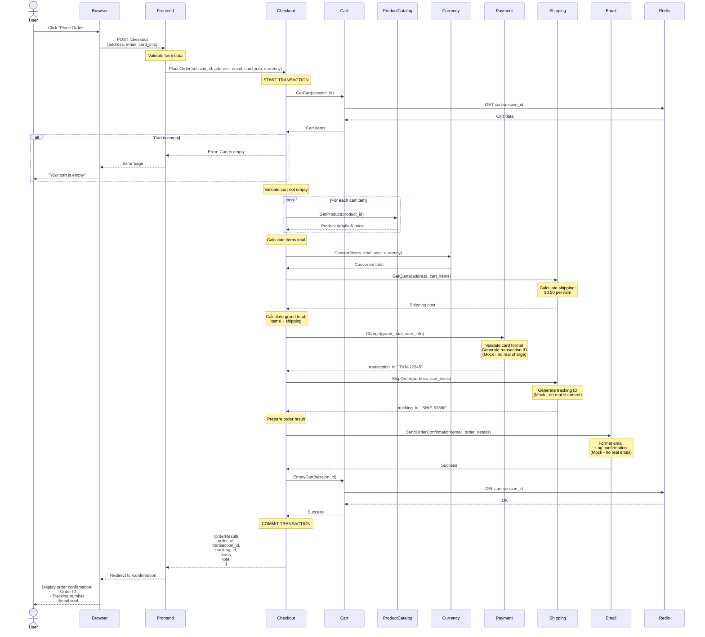

**Checkout Steps**:
1. Validate cart is not empty
2. Get current product prices
3. Calculate items total
4. Get shipping quote
5. Calculate grand total
6. Process payment (mock)
7. Create shipment (mock)
8. Send confirmation email (mock)
9. Empty cart
10. Return order confirmation

**Error Handling**: If any step fails, the transaction is rolled back and an error is returned to the user.

## Journey 10: Checkout with Errors

What happens when checkout fails.

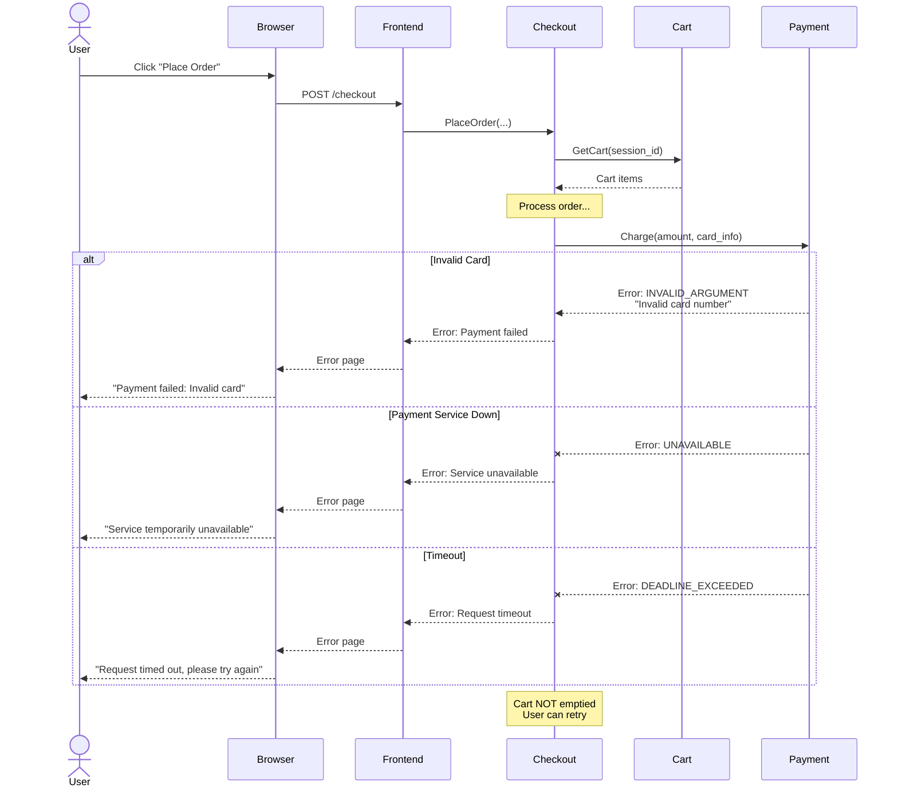

**Error Scenarios**:
- **Invalid card**: User sees error, can correct and retry
- **Service unavailable**: Temporary error, user can retry
- **Timeout**: Request took too long, user can retry
- **Cart preserved**: Cart is not emptied on error

## Journey 11: Load Generator Simulation

The load generator simulates realistic user behavior.

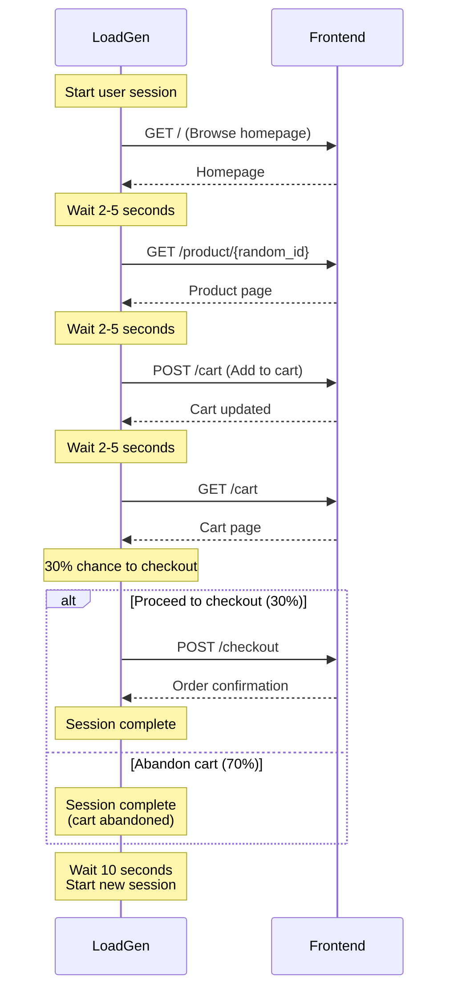

**Load Generator Behavior**:
- Simulates realistic user patterns
- Random delays between actions (2-5 seconds)
- 30% checkout rate, 70% abandonment
- Continuous traffic generation
- Configurable request rate

## Performance Characteristics

### Latency Targets

| Journey | Target (p95) | Typical |
|---------|--------------|---------|
| Browse Products | < 200ms | 100ms |
| Search Products | < 150ms | 80ms |
| View Product | < 150ms | 75ms |
| Add to Cart | < 100ms | 50ms |
| View Cart | < 200ms | 120ms |
| Change Currency | < 100ms | 60ms |
| Complete Checkout | < 1000ms | 600ms |

### Service Call Counts

| Journey | Service Calls | Parallel | Sequential |
|---------|---------------|----------|------------|
| Browse Products | 6 | 5 | 1 |
| View Product | 4 | 2 | 2 |
| Add to Cart | 3 | 0 | 3 |
| Complete Checkout | 12 | 0 | 12 |

## User Experience Optimizations

### Parallel Requests

Homepage loads faster by calling services in parallel:
- Product Catalog
- Currency Service
- Ad Service
- Cart Service
- Recommendation Service

### Caching

Reduces latency for repeated requests:
- Exchange rates (1 hour)
- Product catalog (in-memory)
- Cart data (Redis)

### Graceful Degradation

Non-critical services can fail without breaking the page:
- No recommendations → Hide section
- No ads → Hide ad section
- Currency service down → Show USD prices

## Next Steps

<CardGroup cols={2}>
  <Card title="Architecture Overview" icon="sitemap" href="/architecture/overview">
    See the complete system architecture
  </Card>
  <Card title="Data Flow" icon="diagram-project" href="/architecture/data-flow">
    Understand how data moves through the system
  </Card>
  <Card title="Microservices" icon="cubes" href="/microservices/overview">
    Learn about each service in detail
  </Card>
  <Card title="API Reference" icon="book" href="/api-reference/overview">
    Explore the gRPC APIs
  </Card>
</CardGroup>
