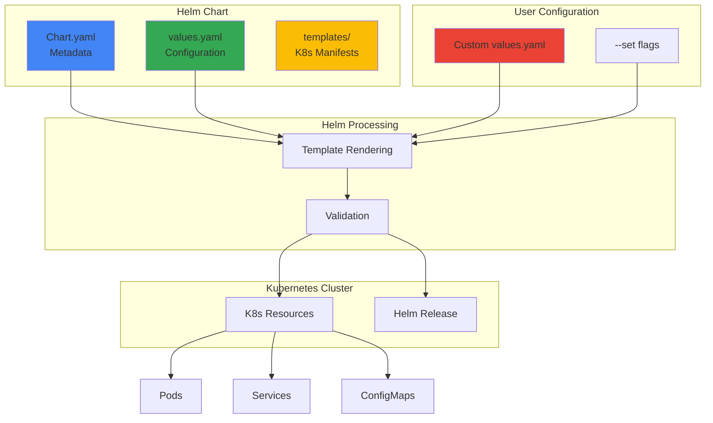
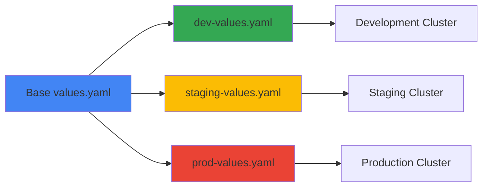

Deploy Online Boutique using Helm, the package manager for Kubernetes. Helm provides templating, versioning, and easy configuration management, making it ideal for production deployments.

<Warning>
Online Boutique's Helm chart is currently experimental. Report issues at [GitHub Issue #1319](https://github.com/GoogleCloudPlatform/microservices-demo/issues/1319).
</Warning>

## Prerequisites

<Steps>
  <Step title="Helm Installation">
    Install Helm 3.0 or later
    ```bash
    # macOS
    brew install helm
    
    # Linux
    curl https://raw.githubusercontent.com/helm/helm/main/scripts/get-helm-3 | bash
    
    # Windows
    choco install kubernetes-helm
    
    # Verify installation
    helm version
    ```
  </Step>
  
  <Step title="Kubernetes Cluster">
    Ensure you have a running Kubernetes cluster with kubectl configured
    ```bash
    kubectl cluster-info
    kubectl get nodes
    ```
  </Step>
  
  <Step title="Cluster Resources">
    Minimum requirements:
    - 4 vCPUs
    - 8 GB RAM
    - Kubernetes 1.24+
  </Step>
</Steps>

## Quick Start

Deploy Online Boutique with default configuration:

```bash
helm upgrade onlineboutique \
  oci://us-docker.pkg.dev/online-boutique-ci/charts/onlineboutique \
  --install
```

<Note>
The `--install` flag installs the chart if it doesn't exist, or upgrades it if it does.
</Note>

### Verify Deployment

```bash
# Check release status
helm list

# Check pods
kubectl get pods

# Get frontend URL
kubectl get service frontend-external
```

## Helm Architecture



## Configuration Options

### Basic Configuration

Create a `custom-values.yaml` file:

```yaml
# Custom image repository
images:
  repository: gcr.io/my-project/microservices-demo
  tag: "v0.10.1"

# Enable service accounts
serviceAccounts:
  create: true
  annotations:
    iam.gke.io/gcp-service-account: my-sa@project.iam.gserviceaccount.com

# Resource limits
frontend:
  resources:
    requests:
      cpu: 200m
      memory: 128Mi
    limits:
      cpu: 400m
      memory: 256Mi
```

Deploy with custom values:

```bash
helm upgrade onlineboutique \
  oci://us-docker.pkg.dev/online-boutique-ci/charts/onlineboutique \
  --install \
  --values custom-values.yaml
```

### Advanced Configuration

<Tabs>
  <Tab title="Production Setup">
    ```yaml
    # production-values.yaml
    
    # Use custom image registry
    images:
      repository: us-docker.pkg.dev/my-project/microservices-demo
      tag: "v1.0.0"
    
    # Enable security features
    serviceAccounts:
      create: true
    
    networkPolicies:
      create: true
    
    authorizationPolicies:
      create: true
    
    securityContext:
      enable: true
    
    seccompProfile:
      enable: true
      type: RuntimeDefault
    
    # Enable observability
    googleCloudOperations:
      profiler: true
      tracing: true
      metrics: true
    
    opentelemetryCollector:
      create: true
      projectId: "my-gcp-project"
    
    # Scale services
    frontend:
      replicas: 3
    
    cartservice:
      replicas: 2
    
    productcatalogservice:
      replicas: 2
    ```
    
    Deploy:
    ```bash
    helm upgrade onlineboutique \
      oci://us-docker.pkg.dev/online-boutique-ci/charts/onlineboutique \
      --install \
      --create-namespace \
      --namespace onlineboutique \
      --values production-values.yaml
    ```
  </Tab>
  
  <Tab title="Spanner Integration">
    ```yaml
    # spanner-values.yaml
    
    # Disable in-cluster Redis
    redis:
      create: false
    
    # Configure Spanner
    cartservice:
      database:
        type: spanner
        connectionString: projects/my-project/instances/onlineboutique/databases/carts
    
    # Enable Workload Identity
    serviceAccounts:
      create: true
      annotations:
        iam.gke.io/gcp-service-account: spanner-db-user@my-project.iam.gserviceaccount.com
      annotationsOnlyForCartservice: true
    ```
    
    Deploy:
    ```bash
    helm upgrade onlineboutique \
      oci://us-docker.pkg.dev/online-boutique-ci/charts/onlineboutique \
      --install \
      --values spanner-values.yaml
    ```
  </Tab>
  
  <Tab title="Istio Service Mesh">
    ```yaml
    # istio-values.yaml
    
    # Disable external frontend service
    frontend:
      externalService: false
      virtualService:
        create: true
        gateway: istio-system/istio-gateway
        host: shop.example.com
    
    # Enable Istio sidecars
    sidecars:
      create: true
    
    # Enable authorization policies
    authorizationPolicies:
      create: true
    
    # Enable network policies
    networkPolicies:
      create: true
    ```
    
    Deploy:
    ```bash
    helm upgrade onlineboutique \
      oci://us-docker.pkg.dev/online-boutique-ci/charts/onlineboutique \
      --install \
      --values istio-values.yaml
    ```
  </Tab>
  
  <Tab title="Development">
    ```yaml
    # dev-values.yaml
    
    # Disable load generator
    loadgenerator:
      create: false
    
    # Reduce resources
    frontend:
      resources:
        requests:
          cpu: 50m
          memory: 32Mi
    
    cartservice:
      resources:
        requests:
          cpu: 100m
          memory: 64Mi
    
    # Single replicas
    frontend:
      replicas: 1
    ```
    
    Deploy:
    ```bash
    helm upgrade onlineboutique \
      oci://us-docker.pkg.dev/online-boutique-ci/charts/onlineboutique \
      --install \
      --values dev-values.yaml
    ```
  </Tab>
</Tabs>

## Command-Line Configuration

Override values using `--set` flags:

```bash
helm upgrade onlineboutique \
  oci://us-docker.pkg.dev/online-boutique-ci/charts/onlineboutique \
  --install \
  --set images.repository=gcr.io/my-project/microservices-demo \
  --set images.tag=v1.0.0 \
  --set frontend.replicas=3 \
  --set serviceAccounts.create=true \
  --set networkPolicies.create=true
```

### Common --set Examples

<CodeGroup>
```bash Custom Registry
helm upgrade onlineboutique \
  oci://us-docker.pkg.dev/online-boutique-ci/charts/onlineboutique \
  --install \
  --set images.repository=my-registry.io/online-boutique
```

```bash Disable Service
helm upgrade onlineboutique \
  oci://us-docker.pkg.dev/online-boutique-ci/charts/onlineboutique \
  --install \
  --set loadgenerator.create=false
```

```bash Enable Monitoring
helm upgrade onlineboutique \
  oci://us-docker.pkg.dev/online-boutique-ci/charts/onlineboutique \
  --install \
  --set googleCloudOperations.tracing=true \
  --set googleCloudOperations.profiler=true
```

```bash Scale Services
helm upgrade onlineboutique \
  oci://us-docker.pkg.dev/online-boutique-ci/charts/onlineboutique \
  --install \
  --set frontend.replicas=5 \
  --set cartservice.replicas=3
```
</CodeGroup>

## Values Reference

### Global Settings

| Parameter | Description | Default |
|-----------|-------------|---------|
| `images.repository` | Container image repository | `us-central1-docker.pkg.dev/google-samples/microservices-demo` |
| `images.tag` | Image tag override | Chart appVersion |

### Security Settings

| Parameter | Description | Default |
|-----------|-------------|---------|
| `serviceAccounts.create` | Create service accounts | `true` |
| `serviceAccounts.annotations` | Service account annotations | `{}` |
| `networkPolicies.create` | Create network policies | `false` |
| `authorizationPolicies.create` | Create authorization policies | `false` |
| `securityContext.enable` | Enable security context | `true` |
| `seccompProfile.enable` | Enable seccomp profile | `false` |

### Observability Settings

| Parameter | Description | Default |
|-----------|-------------|---------|
| `googleCloudOperations.profiler` | Enable Cloud Profiler | `false` |
| `googleCloudOperations.tracing` | Enable Cloud Trace | `false` |
| `googleCloudOperations.metrics` | Enable Cloud Monitoring | `false` |
| `opentelemetryCollector.create` | Deploy OpenTelemetry Collector | `false` |

### Service-Specific Settings

Each service supports:
- `create`: Enable/disable service
- `name`: Service name
- `replicas`: Number of replicas
- `resources.requests`: Resource requests
- `resources.limits`: Resource limits

Example for frontend:

```yaml
frontend:
  create: true
  name: frontend
  replicas: 1
  resources:
    requests:
      cpu: 100m
      memory: 64Mi
    limits:
      cpu: 200m
      memory: 128Mi
```

## Helm Operations

### List Releases

```bash
# List all releases
helm list

# List releases in all namespaces
helm list --all-namespaces

# List releases with specific status
helm list --failed
```

### Get Release Information

```bash
# Get release status
helm status onlineboutique

# Get release values
helm get values onlineboutique

# Get all release information
helm get all onlineboutique

# Get release manifest
helm get manifest onlineboutique
```

### Upgrade Release

```bash
# Upgrade with new values
helm upgrade onlineboutique \
  oci://us-docker.pkg.dev/online-boutique-ci/charts/onlineboutique \
  --values new-values.yaml

# Upgrade with specific version
helm upgrade onlineboutique \
  oci://us-docker.pkg.dev/online-boutique-ci/charts/onlineboutique \
  --version 0.10.1

# Dry run upgrade
helm upgrade onlineboutique \
  oci://us-docker.pkg.dev/online-boutique-ci/charts/onlineboutique \
  --values new-values.yaml \
  --dry-run --debug
```

### Rollback Release

```bash
# Rollback to previous version
helm rollback onlineboutique

# Rollback to specific revision
helm rollback onlineboutique 2

# View rollback history
helm history onlineboutique
```

### Uninstall Release

```bash
# Uninstall release
helm uninstall onlineboutique

# Uninstall and keep history
helm uninstall onlineboutique --keep-history
```

## Multi-Environment Deployment



### Environment-Specific Values

<CodeGroup>
```yaml dev-values.yaml
# Development environment
images:
  tag: "latest"

loadgenerator:
  create: false

frontend:
  replicas: 1

resources:
  requests:
    cpu: 50m
    memory: 32Mi
```

```yaml staging-values.yaml
# Staging environment
images:
  tag: "v1.0.0-rc1"

googleCloudOperations:
  tracing: true
  profiler: true

frontend:
  replicas: 2

networkPolicies:
  create: true
```

```yaml prod-values.yaml
# Production environment
images:
  repository: us-docker.pkg.dev/prod-project/microservices-demo
  tag: "v1.0.0"

serviceAccounts:
  create: true

networkPolicies:
  create: true

authorizationPolicies:
  create: true

googleCloudOperations:
  tracing: true
  profiler: true
  metrics: true

frontend:
  replicas: 5

cartservice:
  replicas: 3
```
</CodeGroup>

Deploy to each environment:

```bash
# Development
helm upgrade onlineboutique \
  oci://us-docker.pkg.dev/online-boutique-ci/charts/onlineboutique \
  --install \
  --namespace dev \
  --create-namespace \
  --values dev-values.yaml

# Staging
helm upgrade onlineboutique \
  oci://us-docker.pkg.dev/online-boutique-ci/charts/onlineboutique \
  --install \
  --namespace staging \
  --create-namespace \
  --values staging-values.yaml

# Production
helm upgrade onlineboutique \
  oci://us-docker.pkg.dev/online-boutique-ci/charts/onlineboutique \
  --install \
  --namespace production \
  --create-namespace \
  --values prod-values.yaml
```

## Troubleshooting

<AccordionGroup>
  <Accordion title="Helm install fails with 'not found' error">
    **Cause**: Chart repository not accessible
    
    ```bash
    # Verify chart exists
    helm show chart oci://us-docker.pkg.dev/online-boutique-ci/charts/onlineboutique
    
    # Check network connectivity
    curl -I https://us-docker.pkg.dev
    ```
    
    **Solution**: Ensure network access to Google Artifact Registry
  </Accordion>
  
  <Accordion title="Values not being applied">
    **Cause**: Incorrect values file or syntax error
    
    ```bash
    # Validate values file
    helm lint -f custom-values.yaml
    
    # Dry run to see rendered templates
    helm upgrade onlineboutique \
      oci://us-docker.pkg.dev/online-boutique-ci/charts/onlineboutique \
      --install \
      --values custom-values.yaml \
      --dry-run --debug
    ```
    
    **Solution**: Check YAML syntax and value paths
  </Accordion>
  
  <Accordion title="Upgrade fails with conflicts">
    **Cause**: Resource conflicts or immutable field changes
    
    ```bash
    # Check release status
    helm status onlineboutique
    
    # View differences
    helm diff upgrade onlineboutique \
      oci://us-docker.pkg.dev/online-boutique-ci/charts/onlineboutique \
      --values new-values.yaml
    ```
    
    **Solution**: Uninstall and reinstall, or use `--force` flag
  </Accordion>
  
  <Accordion title="Rollback doesn't work">
    **Cause**: No previous revisions available
    
    ```bash
    # Check history
    helm history onlineboutique
    ```
    
    **Solution**: Ensure release has previous revisions
  </Accordion>
</AccordionGroup>

## Best Practices

<CardGroup cols={2}>
  <Card title="Version Control" icon="code-branch">
    Store values files in Git for version control and audit trail
  </Card>
  <Card title="Environment Separation" icon="layer-group">
    Use separate namespaces and values files for each environment
  </Card>
  <Card title="Secrets Management" icon="key">
    Use Kubernetes Secrets or external secret managers, not values files
  </Card>
  <Card title="Testing" icon="flask">
    Always use `--dry-run --debug` before applying changes
  </Card>
</CardGroup>

## Next Steps

<CardGroup cols={2}>
  <Card title="Enable Monitoring" icon="chart-line" href="/deployment/optional-components">
    Add Cloud Operations integration
  </Card>
  <Card title="Add Service Mesh" icon="network-wired" href="/deployment/optional-components">
    Deploy with Istio
  </Card>
  <Card title="Use Spanner" icon="database" href="/deployment/optional-components">
    Replace Redis with Cloud Spanner
  </Card>
  <Card title="CI/CD Integration" icon="robot" href="/development/contributing">
    Automate deployments
  </Card>
</CardGroup>

## Additional Resources

- [Helm Documentation](https://helm.sh/docs/)
- [Helm Chart Repository](https://us-docker.pkg.dev/online-boutique-ci/charts/onlineboutique)
- [GitHub Issue #1319](https://github.com/GoogleCloudPlatform/microservices-demo/issues/1319) - Helm chart feedback
- [Blog: Helm chart for Online Boutique](https://medium.com/google-cloud/246119e46d53)
