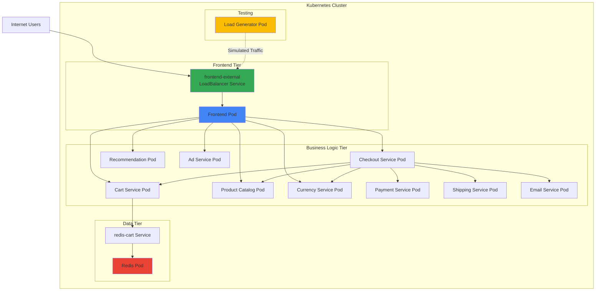
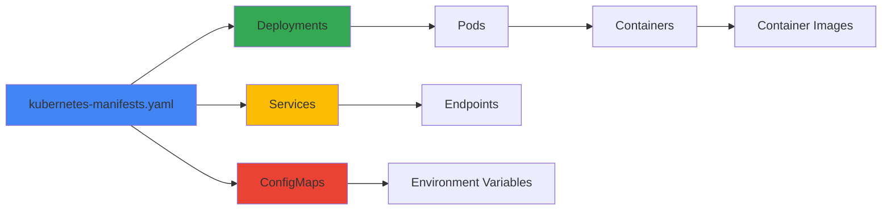

Deploy Online Boutique to any Kubernetes cluster using standard Kubernetes manifests and kubectl. This is the simplest deployment method, ideal for development, testing, and learning.

## Prerequisites

<Steps>
  <Step title="Kubernetes Cluster">
    A running Kubernetes cluster with at least:
    - 4 vCPUs
    - 8 GB RAM
    - Kubernetes 1.24+
  </Step>
  <Step title="kubectl">
    Install and configure kubectl
    ```bash
    # Verify kubectl is installed
    kubectl version --client
    
    # Verify cluster access
    kubectl cluster-info
    ```
  </Step>
  <Step title="Clone Repository">
    Get the Online Boutique source code
    ```bash
    git clone --depth 1 --branch v0 https://github.com/GoogleCloudPlatform/microservices-demo.git
    cd microservices-demo
    ```
  </Step>
</Steps>

## Quick Start (GKE)

Deploy to Google Kubernetes Engine in minutes:

<Steps>
  <Step title="Set up GCP Project">
    ```bash
    export PROJECT_ID=<YOUR_PROJECT_ID>
    export REGION=us-central1
    
    # Enable required APIs
    gcloud services enable container.googleapis.com \
      --project=${PROJECT_ID}
    ```
  </Step>
  
  <Step title="Create GKE Cluster">
    ```bash
    gcloud container clusters create-auto online-boutique \
      --project=${PROJECT_ID} \
      --region=${REGION}
    ```
    <Note>Cluster creation takes 5-10 minutes</Note>
  </Step>
  
  <Step title="Deploy Application">
    ```bash
    kubectl apply -f ./release/kubernetes-manifests.yaml
    ```
  </Step>
  
  <Step title="Wait for Pods">
    ```bash
    kubectl get pods -w
    ```
    Wait until all pods show `Running` status (2-3 minutes)
  </Step>
  
  <Step title="Get Frontend URL">
    ```bash
    kubectl get service frontend-external | awk '{print $4}'
    ```
    Visit `http://EXTERNAL_IP` in your browser
  </Step>
</Steps>

## Deployment Architecture



## Detailed Deployment Steps

### 1. Review Manifests

The deployment uses pre-built container images from Google Container Registry:

```bash
# View the manifest file
cat release/kubernetes-manifests.yaml
```

The manifest includes:
- 12 Deployments (one per microservice)
- 12 Services (ClusterIP for internal, LoadBalancer for frontend)
- ConfigMaps for configuration
- Resource requests and limits

### 2. Deploy to Cluster

```bash
# Apply all manifests
kubectl apply -f ./release/kubernetes-manifests.yaml

# Output:
# deployment.apps/emailservice created
# service/emailservice created
# deployment.apps/checkoutservice created
# service/checkoutservice created
# ...
```

### 3. Monitor Deployment

<Tabs>
  <Tab title="Watch Pods">
    ```bash
    # Watch pod status
    kubectl get pods -w
    
    # Check specific pod
    kubectl describe pod <pod-name>
    
    # View pod logs
    kubectl logs -f <pod-name>
    ```
  </Tab>
  
  <Tab title="Check Services">
    ```bash
    # List all services
    kubectl get services
    
    # Get frontend external IP
    kubectl get service frontend-external
    ```
  </Tab>
  
  <Tab title="View Events">
    ```bash
    # See cluster events
    kubectl get events --sort-by='.lastTimestamp'
    
    # Watch events
    kubectl get events -w
    ```
  </Tab>
</Tabs>

### 4. Verify Deployment

Expected pod status after successful deployment:

```bash
kubectl get pods
```

```
NAME                                     READY   STATUS    RESTARTS   AGE
adservice-76bdd69666-ckc5j               1/1     Running   0          2m58s
cartservice-66d497c6b7-dp5jr             1/1     Running   0          2m59s
checkoutservice-666c784bd6-4jd22         1/1     Running   0          3m1s
currencyservice-5d5d496984-4jmd7         1/1     Running   0          2m59s
emailservice-667457d9d6-75jcq            1/1     Running   0          3m2s
frontend-6b8d69b9fb-wjqdg                1/1     Running   0          3m1s
loadgenerator-665b5cd444-gwqdq           1/1     Running   0          3m
paymentservice-68596d6dd6-bf6bv          1/1     Running   0          3m
productcatalogservice-557d474574-888kr   1/1     Running   0          3m
recommendationservice-69c56b74d4-7z8r5   1/1     Running   0          3m1s
redis-cart-5f59546cdd-5jnqf              1/1     Running   0          2m58s
shippingservice-6ccc89f8fd-v686r         1/1     Running   0          2m58s
```

## Local Kubernetes Deployment

### Minikube

<Steps>
  <Step title="Start Minikube">
    ```bash
    minikube start --cpus=4 --memory=8192
    ```
  </Step>
  
  <Step title="Deploy Application">
    ```bash
    kubectl apply -f ./release/kubernetes-manifests.yaml
    ```
  </Step>
  
  <Step title="Access Frontend">
    ```bash
    minikube service frontend-external
    ```
    This opens the application in your default browser
  </Step>
</Steps>

### Kind (Kubernetes in Docker)

<Steps>
  <Step title="Create Cluster">
    ```bash
    kind create cluster --name online-boutique
    ```
  </Step>
  
  <Step title="Deploy Application">
    ```bash
    kubectl apply -f ./release/kubernetes-manifests.yaml
    ```
  </Step>
  
  <Step title="Port Forward">
    ```bash
    kubectl port-forward service/frontend-external 8080:80
    ```
    Access at `http://localhost:8080`
  </Step>
</Steps>

### Docker Desktop

<Steps>
  <Step title="Enable Kubernetes">
    Enable Kubernetes in Docker Desktop settings
  </Step>
  
  <Step title="Deploy Application">
    ```bash
    kubectl apply -f ./release/kubernetes-manifests.yaml
    ```
  </Step>
  
  <Step title="Access Frontend">
    ```bash
    kubectl get service frontend-external
    ```
    Use the EXTERNAL-IP or localhost with port-forward
  </Step>
</Steps>

## Resource Requirements

### Minimum Cluster Resources

| Component | CPU Request | Memory Request | CPU Limit | Memory Limit |
|-----------|-------------|----------------|-----------|--------------|
| Frontend | 100m | 64Mi | 200m | 128Mi |
| Cart Service | 200m | 64Mi | 300m | 128Mi |
| Product Catalog | 100m | 64Mi | 200m | 128Mi |
| Currency Service | 100m | 64Mi | 200m | 128Mi |
| Payment Service | 100m | 64Mi | 200m | 128Mi |
| Shipping Service | 100m | 64Mi | 200m | 128Mi |
| Email Service | 100m | 64Mi | 200m | 128Mi |
| Checkout Service | 100m | 64Mi | 200m | 128Mi |
| Recommendation | 100m | 220Mi | 200m | 450Mi |
| Ad Service | 200m | 180Mi | 300m | 300Mi |
| Load Generator | 300m | 256Mi | 500m | 512Mi |
| Redis | 70m | 200Mi | 125m | 256Mi |

**Total Minimum**: ~1.6 vCPUs, ~1.5 GB RAM

<Warning>
These are minimum requests. For production, allocate at least 4 vCPUs and 8 GB RAM to handle traffic spikes and ensure stability.
</Warning>

## Manifest Structure

The Kubernetes manifest includes these resource types:



### Example Service Definition

```yaml
apiVersion: v1
kind: Service
metadata:
  name: frontend-external
spec:
  type: LoadBalancer
  selector:
    app: frontend
  ports:
  - name: http
    port: 80
    targetPort: 8080
```

### Example Deployment Definition

```yaml
apiVersion: apps/v1
kind: Deployment
metadata:
  name: frontend
spec:
  replicas: 1
  selector:
    matchLabels:
      app: frontend
  template:
    metadata:
      labels:
        app: frontend
    spec:
      containers:
      - name: server
        image: gcr.io/google-samples/microservices-demo/frontend:v0.10.1
        ports:
        - containerPort: 8080
        env:
        - name: PORT
          value: "8080"
        - name: PRODUCT_CATALOG_SERVICE_ADDR
          value: "productcatalogservice:3550"
        resources:
          requests:
            cpu: 100m
            memory: 64Mi
          limits:
            cpu: 200m
            memory: 128Mi
```

## Scaling

### Manual Scaling

```bash
# Scale frontend to 3 replicas
kubectl scale deployment frontend --replicas=3

# Scale multiple services
kubectl scale deployment frontend cartservice productcatalogservice --replicas=2

# Verify scaling
kubectl get deployments
```

### Horizontal Pod Autoscaling

```yaml
apiVersion: autoscaling/v2
kind: HorizontalPodAutoscaler
metadata:
  name: frontend-hpa
spec:
  scaleTargetRef:
    apiVersion: apps/v1
    kind: Deployment
    name: frontend
  minReplicas: 1
  maxReplicas: 10
  metrics:
  - type: Resource
    resource:
      name: cpu
      target:
        type: Utilization
        averageUtilization: 70
```

Apply HPA:
```bash
kubectl apply -f frontend-hpa.yaml
kubectl get hpa
```

## Updating the Deployment

### Rolling Update

```bash
# Update image version
kubectl set image deployment/frontend server=gcr.io/google-samples/microservices-demo/frontend:v0.10.2

# Check rollout status
kubectl rollout status deployment/frontend

# View rollout history
kubectl rollout history deployment/frontend
```

### Rollback

```bash
# Rollback to previous version
kubectl rollout undo deployment/frontend

# Rollback to specific revision
kubectl rollout undo deployment/frontend --to-revision=2
```

## Troubleshooting

<AccordionGroup>
  <Accordion title="Pods stuck in Pending state">
    **Cause**: Insufficient cluster resources
    
    ```bash
    # Check pod events
    kubectl describe pod <pod-name>
    
    # Check node resources
    kubectl top nodes
    kubectl describe nodes
    ```
    
    **Solution**: Scale up cluster or reduce resource requests
  </Accordion>
  
  <Accordion title="ImagePullBackOff errors">
    **Cause**: Cannot pull container image
    
    ```bash
    # Check pod events
    kubectl describe pod <pod-name>
    ```
    
    **Solution**: 
    - Verify image name and tag
    - Check network connectivity
    - Verify image registry access
  </Accordion>
  
  <Accordion title="CrashLoopBackOff errors">
    **Cause**: Application crashes on startup
    
    ```bash
    # View logs
    kubectl logs <pod-name>
    kubectl logs <pod-name> --previous
    ```
    
    **Solution**: Check logs for application errors
  </Accordion>
  
  <Accordion title="Service not accessible">
    **Cause**: Service or networking misconfiguration
    
    ```bash
    # Check service
    kubectl get service frontend-external
    kubectl describe service frontend-external
    
    # Check endpoints
    kubectl get endpoints frontend-external
    ```
    
    **Solution**:
    - Verify LoadBalancer is provisioned
    - Check firewall rules
    - Verify pod labels match service selector
  </Accordion>
  
  <Accordion title="External IP shows <pending>">
    **Cause**: LoadBalancer provisioning in progress
    
    ```bash
    # Wait and check again
    kubectl get service frontend-external -w
    ```
    
    **Solution**: Wait 2-5 minutes for cloud provider to provision LoadBalancer
    
    For local clusters (Minikube, Kind), use port-forward instead:
    ```bash
    kubectl port-forward service/frontend-external 8080:80
    ```
  </Accordion>
</AccordionGroup>

## Verification

After deployment, verify that all services are running correctly:

<Steps>
  <Step title="Check Pod Status">
    Ensure all pods are running:
    ```bash
    kubectl get pods
    ```
    
    All pods should show `Running` status with `1/1` or `2/2` ready containers.
  </Step>

  <Step title="Verify Services">
    Check that all services are created:
    ```bash
    kubectl get services
    ```
    
    You should see 12 services including the `frontend-external` LoadBalancer.
  </Step>

  <Step title="Test Frontend Access">
    Get the frontend URL and test it:
    ```bash
    # Get external IP
    kubectl get svc frontend-external
    
    # Open in browser or curl
    curl http://<EXTERNAL-IP>
    ```
    
    You should see the Online Boutique homepage.
  </Step>

  <Step title="Check Service Communication">
    Verify services can communicate:
    ```bash
    # Check logs for any errors
    kubectl logs -l app=frontend --tail=50
    
    # Test adding item to cart through UI
    # Browse products and add to cart
    ```
  </Step>

  <Step title="Monitor Resource Usage">
    Check resource consumption:
    ```bash
    # View resource usage
    kubectl top pods
    kubectl top nodes
    ```
  </Step>
</Steps>

<Tip>
  **Health Check:** Visit the frontend URL and try these actions:
  - Browse products
  - Add items to cart
  - View cart
  - Complete checkout (use test card: 4432-8015-6152-0454)
  
  If all these work, your deployment is successful!
</Tip>

## Cleanup

### Delete Application

```bash
# Delete all resources
kubectl delete -f ./release/kubernetes-manifests.yaml

# Verify deletion
kubectl get pods
```

### Delete GKE Cluster

```bash
gcloud container clusters delete online-boutique \
  --project=${PROJECT_ID} \
  --region=${REGION}
```

### Delete Local Cluster

<Tabs>
  <Tab title="Minikube">
    ```bash
    minikube delete
    ```
  </Tab>
  <Tab title="Kind">
    ```bash
    kind delete cluster --name online-boutique
    ```
  </Tab>
  <Tab title="Docker Desktop">
    Disable Kubernetes in Docker Desktop settings
  </Tab>
</Tabs>

## Next Steps

<CardGroup cols={2}>
  <Card title="Monitor with Cloud Operations" icon="chart-line" href="/deployment/optional-components">
    Enable monitoring, tracing, and profiling
  </Card>
  <Card title="Add Service Mesh" icon="network-wired" href="/deployment/optional-components">
    Deploy with Istio for advanced traffic management
  </Card>
  <Card title="Use Managed Redis" icon="database" href="/deployment/optional-components">
    Replace in-cluster Redis with Memorystore
  </Card>
  <Card title="Customize with Kustomize" icon="sliders" href="/deployment/kustomize">
    Create deployment variations
  </Card>
</CardGroup>

<Tip>
For production deployments, consider using [Helm](/deployment/helm) or [Kustomize](/deployment/kustomize) for better configuration management.
</Tip>
