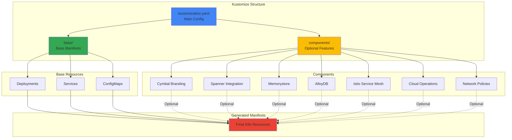
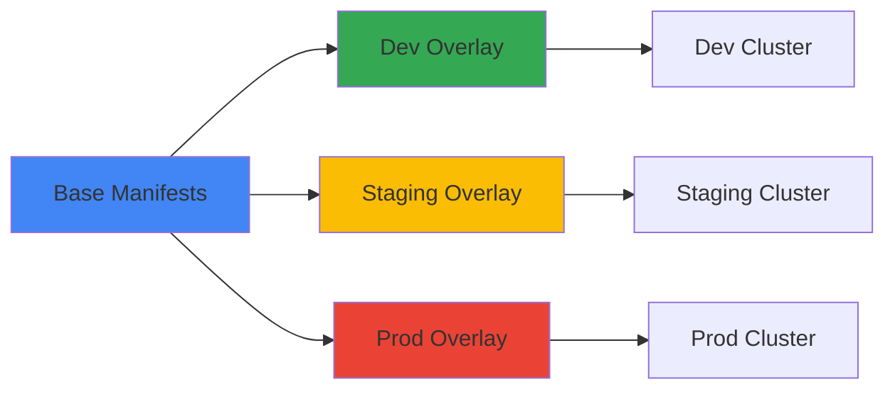

Deploy Online Boutique with Kustomize for template-free customization of Kubernetes manifests. Kustomize enables composable deployment variations without modifying base configurations.

## Overview

Kustomize is a Kubernetes configuration management tool that allows you to customize manifests without duplication. Its commands are built into `kubectl` as `kubectl apply -k`.

### Key Benefits

- Template-free customization using pure YAML
- Composable components for deployment variations
- Built into kubectl (no additional installation)
- Easy to understand patches and overlays
- GitOps-friendly

## Prerequisites

<Steps>
  <Step title="Kubernetes Cluster">
    A running Kubernetes cluster with kubectl configured
    ```bash
    kubectl cluster-info
    ```
  </Step>
  
  <Step title="kubectl with Kustomize">
    kubectl 1.14+ includes Kustomize support
    ```bash
    kubectl version --client
    kubectl kustomize --help
    ```
  </Step>
  
  <Step title="Optional: Kustomize Binary">
    Install standalone Kustomize for advanced features
    ```bash
    # macOS
    brew install kustomize
    
    # Linux
    curl -s "https://raw.githubusercontent.com/kubernetes-sigs/kustomize/master/hack/install_kustomize.sh" | bash
    
    # Verify
    kustomize version
    ```
  </Step>
  
  <Step title="Clone Repository">
    ```bash
    git clone https://github.com/GoogleCloudPlatform/microservices-demo.git
    cd microservices-demo/kustomize
    ```
  </Step>
</Steps>

## Quick Start

<Steps>
  <Step title="Preview Manifests">
    ```bash
    cd kustomize/
    kubectl kustomize .
    ```
    This shows what will be deployed without actually applying
  </Step>
  
  <Step title="Deploy Application">
    ```bash
    kubectl apply -k .
    ```
  </Step>
  
  <Step title="Wait for Pods">
    ```bash
    kubectl get pods -w
    ```
  </Step>
  
  <Step title="Access Frontend">
    ```bash
    kubectl get service frontend-external | awk '{print $4}'
    ```
    Visit `http://EXTERNAL_IP` in your browser
  </Step>
</Steps>

## Kustomize Architecture



## Directory Structure

```
kustomize/
├── kustomization.yaml          # Main configuration
├── base/                       # Base manifests
│   ├── kustomization.yaml
│   ├── adservice.yaml
│   ├── cartservice.yaml
│   ├── checkoutservice.yaml
│   ├── currencyservice.yaml
│   ├── emailservice.yaml
│   ├── frontend.yaml
│   ├── loadgenerator.yaml
│   ├── paymentservice.yaml
│   ├── productcatalogservice.yaml
│   ├── recommendationservice.yaml
│   └── shippingservice.yaml
└── components/                 # Optional components
    ├── alloydb/
    ├── spanner/
    ├── memorystore/
    ├── service-mesh-istio/
    ├── google-cloud-operations/
    ├── cymbal-branding/
    ├── network-policies/
    ├── container-images-registry/
    ├── container-images-tag/
    └── ...
```

## Available Components

<CardGroup cols={2}>
  <Card title="Cymbal Branding" icon="palette">
    Change branding to Cymbal Shops
  </Card>
  <Card title="Cloud Operations" icon="chart-line">
    Enable monitoring, tracing, and profiling
  </Card>
  <Card title="Memorystore" icon="database">
    Use managed Redis for cart storage
  </Card>
  <Card title="Spanner" icon="database">
    Use Cloud Spanner for cart storage
  </Card>
  <Card title="AlloyDB" icon="database">
    Use AlloyDB for cart storage
  </Card>
  <Card title="Istio Service Mesh" icon="network-wired">
    Add service mesh capabilities
  </Card>
  <Card title="Network Policies" icon="shield">
    Deploy fine-grained network policies
  </Card>
  <Card title="Custom Registry" icon="box">
    Update container image registry
  </Card>
</CardGroup>

## Using Components

### Add a Single Component

```bash
cd kustomize/

# Add Cymbal Shops branding
kustomize edit add component components/cymbal-branding

# Preview changes
kubectl kustomize .

# Deploy
kubectl apply -k .
```

### Add Multiple Components

```bash
# Add multiple components
kustomize edit add component components/cymbal-branding
kustomize edit add component components/google-cloud-operations

# Your kustomization.yaml will look like:
# apiVersion: kustomize.config.k8s.io/v1beta1
# kind: Kustomization
# resources:
# - base
# components:
# - components/cymbal-branding
# - components/google-cloud-operations
```

### Manual Component Configuration

Edit `kustomization.yaml` directly:

```yaml
apiVersion: kustomize.config.k8s.io/v1beta1
kind: Kustomization
resources:
- base
components:
- components/cymbal-branding
- components/google-cloud-operations
- components/network-policies
```

## Component Examples

### Cymbal Shops Branding

Changes all branding to Google Cloud's fictitious company:

```bash
kustomize edit add component components/cymbal-branding
kubectl apply -k .
```

This enables the `CYMBAL_BRANDING` environment variable in the frontend service.

### Google Cloud Operations

Enable monitoring, tracing, and profiling:

```bash
kustomize edit add component components/google-cloud-operations
kubectl apply -k .
```

Adds environment variables:
- `ENABLE_STATS=1`
- `ENABLE_TRACING=1`
- `DISABLE_PROFILER=0`

### Network Policies

Deploy fine-grained network policies:

```bash
kustomize edit add component components/network-policies
kubectl apply -k .
```

Creates NetworkPolicy resources for each service to restrict traffic.

### Custom Image Registry

Update container image registry:

```bash
# Edit the component configuration
sed -i 's|us-docker.pkg.dev/google-samples/containers/bankofanthos|gcr.io/my-project/online-boutique|g' \
  components/container-images-registry/kustomization.yaml

kustomize edit add component components/container-images-registry
kubectl apply -k .
```

### Custom Image Tag

Update image tags:

```bash
# Edit the component
sed -i 's/v0.10.1/v1.0.0/g' components/container-images-tag/kustomization.yaml

kustomize edit add component components/container-images-tag
kubectl apply -k .
```

## Database Integration Components

### Memorystore (Redis)

Replace in-cluster Redis with managed Memorystore:

<Steps>
  <Step title="Provision Memorystore">
    ```bash
    REGION="us-central1"
    ZONE="us-central1-a"
    
    gcloud services enable redis.googleapis.com
    
    gcloud redis instances create redis-cart \
      --size=1 \
      --region=${REGION} \
      --zone=${ZONE} \
      --redis-version=redis_7_0
    ```
  </Step>
  
  <Step title="Configure Component">
    ```bash
    REDIS_IP=$(gcloud redis instances describe redis-cart \
      --region=${REGION} --format='get(host)')
    REDIS_PORT=$(gcloud redis instances describe redis-cart \
      --region=${REGION} --format='get(port)')
    
    sed -i "s/REDIS_CONNECTION_STRING/${REDIS_IP}:${REDIS_PORT}/g" \
      components/memorystore/kustomization.yaml
    ```
  </Step>
  
  <Step title="Deploy">
    ```bash
    kustomize edit add component components/memorystore
    kubectl apply -k .
    ```
  </Step>
</Steps>

<Note>
The Memorystore component automatically removes the in-cluster `redis-cart` Deployment and Service.
</Note>

### Cloud Spanner

Replace Redis with Cloud Spanner:

<Steps>
  <Step title="Provision Spanner">
    ```bash
    PROJECT_ID="your-project-id"
    SPANNER_REGION_CONFIG="regional-us-east5"
    SPANNER_INSTANCE_NAME="onlineboutique"
    SPANNER_DATABASE_NAME="carts"
    
    gcloud services enable spanner.googleapis.com
    
    gcloud spanner instances create ${SPANNER_INSTANCE_NAME} \
      --description="online boutique shopping cart" \
      --config ${SPANNER_REGION_CONFIG} \
      --instance-type free-instance
    
    gcloud spanner databases create ${SPANNER_DATABASE_NAME} \
      --instance ${SPANNER_INSTANCE_NAME} \
      --database-dialect GOOGLE_STANDARD_SQL \
      --ddl "CREATE TABLE CartItems (userId STRING(1024), productId STRING(1024), quantity INT64) PRIMARY KEY (userId, productId); CREATE INDEX CartItemsByUserId ON CartItems(userId);"
    ```
  </Step>
  
  <Step title="Configure IAM">
    ```bash
    SPANNER_DB_USER_GSA_NAME="spanner-db-user-sa"
    SPANNER_DB_USER_GSA_ID="${SPANNER_DB_USER_GSA_NAME}@${PROJECT_ID}.iam.gserviceaccount.com"
    CARTSERVICE_KSA_NAME="cartservice"
    
    gcloud iam service-accounts create ${SPANNER_DB_USER_GSA_NAME}
    
    gcloud spanner databases add-iam-policy-binding ${SPANNER_DATABASE_NAME} \
      --member "serviceAccount:${SPANNER_DB_USER_GSA_ID}" \
      --role roles/spanner.databaseUser \
      --instance ${SPANNER_INSTANCE_NAME}
    
    gcloud iam service-accounts add-iam-policy-binding ${SPANNER_DB_USER_GSA_ID} \
      --member "serviceAccount:${PROJECT_ID}.svc.id.goog[default/${CARTSERVICE_KSA_NAME}]" \
      --role roles/iam.workloadIdentityUser
    ```
  </Step>
  
  <Step title="Configure Component">
    ```bash
    sed -i "s/SPANNER_PROJECT/${PROJECT_ID}/g" components/spanner/kustomization.yaml
    sed -i "s/SPANNER_INSTANCE/${SPANNER_INSTANCE_NAME}/g" components/spanner/kustomization.yaml
    sed -i "s/SPANNER_DATABASE/${SPANNER_DATABASE_NAME}/g" components/spanner/kustomization.yaml
    sed -i "s/SPANNER_DB_USER_GSA_ID/${SPANNER_DB_USER_GSA_ID}/g" components/spanner/kustomization.yaml
    ```
  </Step>
  
  <Step title="Deploy">
    ```bash
    kustomize edit add component components/spanner
    kubectl apply -k .
    ```
  </Step>
</Steps>

### AlloyDB

Replace Redis with AlloyDB:

See [Optional Components](/deployment/optional-components#alloydb) for detailed AlloyDB integration instructions.

## Istio Service Mesh Integration

Deploy with Istio service mesh:

<Steps>
  <Step title="Install Istio">
    ```bash
    # Option A: Cloud Service Mesh
    gcloud services enable mesh.googleapis.com anthos.googleapis.com
    gcloud container fleet mesh enable
    gcloud container fleet mesh update \
      --management automatic \
      --memberships online-boutique
    
    # Option B: Open Source Istio
    istioctl install --set profile=minimal -y
    ```
  </Step>
  
  <Step title="Enable Injection">
    ```bash
    kubectl label namespace default istio-injection=enabled
    ```
  </Step>
  
  <Step title="Deploy with Istio Component">
    ```bash
    kustomize edit add component components/service-mesh-istio
    kubectl apply -k .
    ```
  </Step>
  
  <Step title="Get Gateway Address">
    ```bash
    INGRESS_HOST=$(kubectl get gateway istio-gateway \
      -o jsonpath='{.status.addresses[*].value}')
    echo "http://$INGRESS_HOST"
    ```
  </Step>
</Steps>

## Remote Kustomize Targets

Reference remote resources directly:

```yaml
apiVersion: kustomize.config.k8s.io/v1beta1
kind: Kustomization
resources:
- github.com/GoogleCloudPlatform/microservices-demo/kustomize/base
components:
- github.com/GoogleCloudPlatform/microservices-demo/kustomize/components/cymbal-branding
- github.com/GoogleCloudPlatform/microservices-demo/kustomize/components/google-cloud-operations
```

Deploy:
```bash
kubectl apply -k github.com/GoogleCloudPlatform/microservices-demo/kustomize
```

## Advanced Customization

### Custom Patches

Create custom patches in your kustomization:

```yaml
apiVersion: kustomize.config.k8s.io/v1beta1
kind: Kustomization
resources:
- base

patches:
- patch: |-
    apiVersion: apps/v1
    kind: Deployment
    metadata:
      name: frontend
    spec:
      replicas: 3
  target:
    kind: Deployment
    name: frontend

- patch: |-
    apiVersion: v1
    kind: Service
    metadata:
      name: frontend
    spec:
      type: NodePort
  target:
    kind: Service
    name: frontend
```

### ConfigMap Generators

Generate ConfigMaps from files:

```yaml
apiVersion: kustomize.config.k8s.io/v1beta1
kind: Kustomization
resources:
- base

configMapGenerator:
- name: app-config
  files:
  - config.properties
  literals:
  - ENV=production
  - LOG_LEVEL=info
```

### Secret Generators

Generate Secrets:

```yaml
apiVersion: kustomize.config.k8s.io/v1beta1
kind: Kustomization
resources:
- base

secretGenerator:
- name: db-credentials
  literals:
  - username=admin
  - password=secret123
```

## Multi-Environment Deployment



### Environment Structure

```
kustomize/
├── base/
│   └── kustomization.yaml
├── overlays/
│   ├── dev/
│   │   └── kustomization.yaml
│   ├── staging/
│   │   └── kustomization.yaml
│   └── prod/
│       └── kustomization.yaml
```

### Development Overlay

```yaml
# overlays/dev/kustomization.yaml
apiVersion: kustomize.config.k8s.io/v1beta1
kind: Kustomization
resources:
- ../../base

components:
- ../../components/cymbal-branding

patches:
- patch: |-
    apiVersion: apps/v1
    kind: Deployment
    metadata:
      name: loadgenerator
    $patch: delete
```

### Production Overlay

```yaml
# overlays/prod/kustomization.yaml
apiVersion: kustomize.config.k8s.io/v1beta1
kind: Kustomization
resources:
- ../../base

components:
- ../../components/google-cloud-operations
- ../../components/network-policies
- ../../components/memorystore

patches:
- patch: |-
    apiVersion: apps/v1
    kind: Deployment
    metadata:
      name: frontend
    spec:
      replicas: 5
  target:
    kind: Deployment
    name: frontend
```

Deploy environments:

```bash
# Development
kubectl apply -k overlays/dev

# Staging
kubectl apply -k overlays/staging

# Production
kubectl apply -k overlays/prod
```

## Verification

After deploying with Kustomize, verify your deployment:

<Steps>
  <Step title="Check Deployment Status">
    Verify all resources were created:
    ```bash
    kubectl get all
    ```
    
    All pods should be in `Running` state.
  </Step>

  <Step title="Verify Kustomization">
    Check what was applied:
    ```bash
    kubectl get kustomization
    ```
  </Step>

  <Step title="Test Application">
    Access the frontend:
    ```bash
    kubectl get svc frontend-external
    # Visit the EXTERNAL-IP in your browser
    ```
  </Step>

  <Step title="Verify Components">
    If you added components, verify they're working:
    ```bash
    # Check if Memorystore is connected
    kubectl logs -l app=cartservice | grep -i redis
    
    # Check if Istio is injected
    kubectl get pods -o jsonpath='{.items[*].spec.containers[*].name}' | grep istio-proxy
    ```
  </Step>
</Steps>

## Troubleshooting

<AccordionGroup>
  <Accordion title="Component not found">
    **Error**: `unable to find one of 'kustomization.yaml'`
    
    **Solution**: Ensure you're in the correct directory
    ```bash
    cd kustomize/
    ls components/
    ```
  </Accordion>
  
  <Accordion title="Patch doesn't apply">
    **Error**: `no matches for Id`
    
    **Solution**: Verify resource names and kinds match exactly
    ```bash
    kubectl kustomize . | grep -A 5 "kind: Deployment"
    ```
  </Accordion>
  
  <Accordion title="Variables not substituted">
    **Cause**: Sed commands didn't run or failed
    
    **Solution**: Check component kustomization.yaml files
    ```bash
    cat components/memorystore/kustomization.yaml
    ```
  </Accordion>
  
  <Accordion title="Duplicate resources">
    **Error**: `may not add resource with an already registered id`
    
    **Solution**: Remove duplicate component or resource references
  </Accordion>
</AccordionGroup>

## Best Practices

<CardGroup cols={2}>
  <Card title="Use Components" icon="puzzle-piece">
    Leverage components for reusable, composable variations
  </Card>
  <Card title="Preview First" icon="eye">
    Always run `kubectl kustomize .` before applying
  </Card>
  <Card title="Version Control" icon="code-branch">
    Store kustomization.yaml in Git for reproducibility
  </Card>
  <Card title="Environment Overlays" icon="layer-group">
    Use overlays for environment-specific configurations
  </Card>
</CardGroup>

## Next Steps

<CardGroup cols={2}>
  <Card title="Optional Components" icon="puzzle-piece" href="/deployment/optional-components">
    Explore all available integrations
  </Card>
  <Card title="Istio Service Mesh" icon="network-wired" href="/deployment/optional-components#istio">
    Add service mesh capabilities
  </Card>
  <Card title="Cloud Operations" icon="chart-line" href="/deployment/optional-components#monitoring">
    Enable monitoring and tracing
  </Card>
  <Card title="Development Guide" icon="code" href="/development/setup">
    Set up local development
  </Card>
</CardGroup>

## Additional Resources

- [Kustomize Documentation](https://kustomize.io/)
- [Kubernetes Kustomize Guide](https://kubernetes.io/docs/tasks/manage-kubernetes-objects/kustomization/)
- [Kustomize GitHub](https://github.com/kubernetes-sigs/kustomize)
- [Blog: Kustomize with Online Boutique](https://medium.com/google-cloud/246119e46d53)
