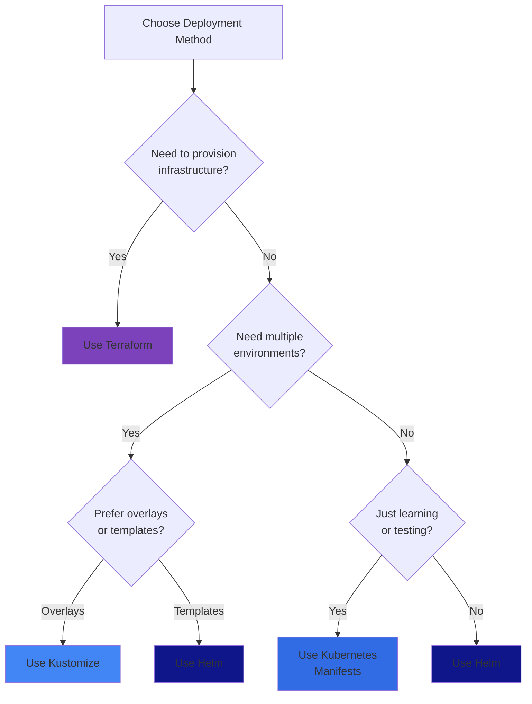
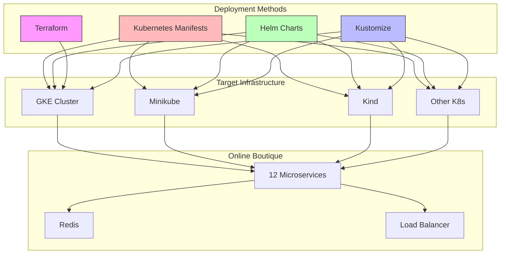
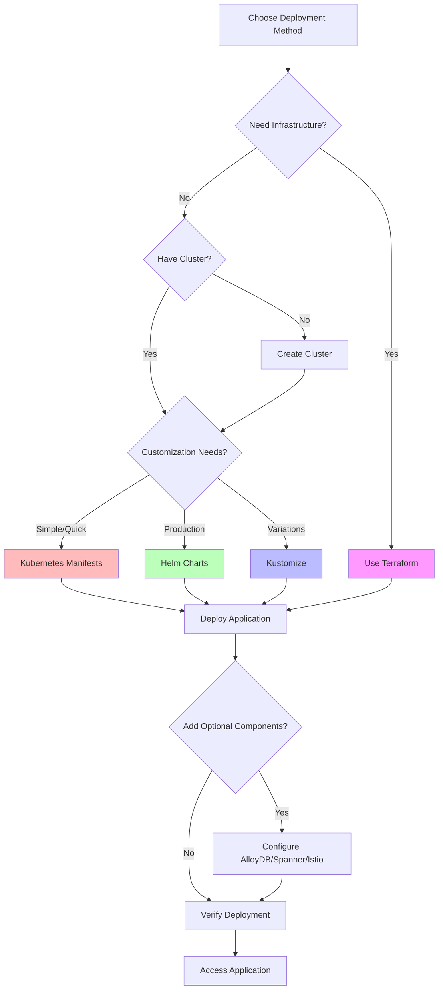

Online Boutique can be deployed to Kubernetes clusters using multiple methods. Each method has its own advantages depending on your use case, infrastructure preferences, and operational requirements.

## Deployment Decision Tree



## Deployment Methods

<CardGroup cols={2}>
  <Card title="Kubernetes Manifests" icon="cube" href="/deployment/kubernetes">
    Direct deployment using kubectl and YAML manifests
  </Card>
  <Card title="Helm Charts" icon="chart-simple" href="/deployment/helm">
    Package manager for Kubernetes with templating
  </Card>
  <Card title="Terraform" icon="code" href="/deployment/terraform">
    Infrastructure as Code for GKE cluster provisioning
  </Card>
  <Card title="Kustomize" icon="layer-group" href="/deployment/kustomize">
    Template-free customization of Kubernetes manifests
  </Card>
</CardGroup>

## Comparison Matrix

| Feature | Kubernetes | Helm | Terraform | Kustomize |
|---------|-----------|------|-----------|-----------|
| **Complexity** | Low | Medium | Medium | Medium |
| **Customization** | Manual | Values-based | Full IaC | Overlay-based |
| **Infrastructure Provisioning** | No | No | Yes | No |
| **Multi-environment** | Manual | Good | Excellent | Excellent |
| **Learning Curve** | Low | Medium | Medium | Low |
| **Best For** | Quick start | Production | Full stack | Variations |

## Quick Comparison

### Kubernetes Manifests
<Accordion title="When to use">
- Quick testing and development
- Learning Kubernetes basics
- Simple deployments without customization
- CI/CD pipelines with static configurations
</Accordion>

<Accordion title="Pros">
- Simplest approach with minimal tooling
- Direct control over all resources
- Easy to understand and debug
- No additional dependencies
</Accordion>

<Accordion title="Cons">
- Limited reusability across environments
- Manual management of configuration variations
- No built-in templating or parameterization
</Accordion>

### Helm Charts
<Accordion title="When to use">
- Production deployments with multiple environments
- Need for configuration templating
- Package versioning and rollback capabilities
- Sharing deployments across teams
</Accordion>

<Accordion title="Pros">
- Rich templating with values files
- Package versioning and release management
- Large ecosystem of charts
- Easy upgrades and rollbacks
</Accordion>

<Accordion title="Cons">
- Additional tool to learn
- Template syntax can be complex
- Debugging can be challenging
</Accordion>

### Terraform
<Accordion title="When to use">
- Full infrastructure provisioning (GKE cluster + application)
- Infrastructure as Code requirements
- Multi-cloud or hybrid deployments
- Automated infrastructure management
</Accordion>

<Accordion title="Pros">
- Complete infrastructure lifecycle management
- State management and drift detection
- Declarative infrastructure definition
- Supports multiple cloud providers
</Accordion>

<Accordion title="Cons">
- Steeper learning curve
- Requires Terraform knowledge
- State file management complexity
- Longer deployment times
</Accordion>

### Kustomize
<Accordion title="When to use">
- Multiple deployment variations
- Environment-specific configurations
- Overlay-based customization
- GitOps workflows
</Accordion>

<Accordion title="Pros">
- Template-free, pure YAML
- Built into kubectl
- Composable components
- Easy to understand patches
</Accordion>

<Accordion title="Cons">
- Limited logic capabilities
- Can become complex with many overlays
- Less mature than Helm
</Accordion>

## Architecture Diagram



## Prerequisites

All deployment methods require:

<Steps>
  <Step title="Kubernetes Cluster">
    A running Kubernetes cluster (GKE, Minikube, Kind, or other)
  </Step>
  <Step title="kubectl">
    Kubernetes command-line tool installed and configured
  </Step>
  <Step title="Source Code">
    Clone the Online Boutique repository
    ```bash
    git clone https://github.com/GoogleCloudPlatform/microservices-demo.git
    cd microservices-demo
    ```
  </Step>
</Steps>

### Additional Requirements by Method

<Tabs>
  <Tab title="Kubernetes">
    - kubectl 1.24+
    - Access to a Kubernetes cluster
  </Tab>
  <Tab title="Helm">
    - Helm 3.0+
    - kubectl configured
  </Tab>
  <Tab title="Terraform">
    - Terraform 1.0+
    - Google Cloud SDK (gcloud)
    - GCP project with billing enabled
  </Tab>
  <Tab title="Kustomize">
    - kubectl 1.14+ (includes Kustomize)
    - Or standalone Kustomize binary
  </Tab>
</Tabs>

## Optional Components

Online Boutique supports optional integrations that can be enabled during deployment:

<CardGroup cols={2}>
  <Card title="AlloyDB" icon="database">
    Replace Redis with AlloyDB for cart storage
  </Card>
  <Card title="Spanner" icon="database">
    Replace Redis with Cloud Spanner for cart storage
  </Card>
  <Card title="Memorystore" icon="memory">
    Replace in-cluster Redis with managed Memorystore
  </Card>
  <Card title="Istio Service Mesh" icon="network-wired">
    Add service mesh capabilities for traffic management
  </Card>
</CardGroup>

See [Optional Components](/deployment/optional-components) for detailed integration guides.

## Deployment Flow



## Next Steps

<CardGroup cols={2}>
  <Card title="Quick Start with Kubernetes" icon="rocket" href="/deployment/kubernetes">
    Get started in minutes with kubectl
  </Card>
  <Card title="Production with Helm" icon="shield" href="/deployment/helm">
    Deploy with Helm for production use
  </Card>
  <Card title="Full Stack with Terraform" icon="cloud" href="/deployment/terraform">
    Provision infrastructure and deploy
  </Card>
  <Card title="Customize with Kustomize" icon="sliders" href="/deployment/kustomize">
    Create deployment variations
  </Card>
</CardGroup>

## Support and Troubleshooting

<Tip>
For deployment issues, check the [GitHub Issues](https://github.com/GoogleCloudPlatform/microservices-demo/issues) or create a new issue with your deployment method and error details.
</Tip>

<Warning>
Always ensure your Kubernetes cluster has sufficient resources:
- Minimum 4 vCPUs
- Minimum 8 GB RAM
- Sufficient storage for container images
</Warning>
