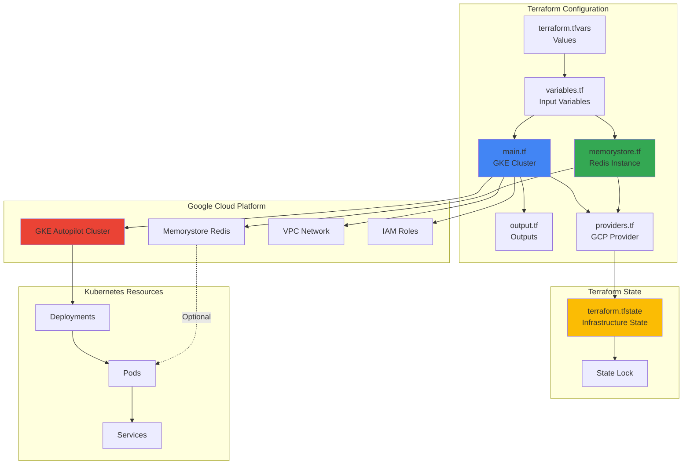
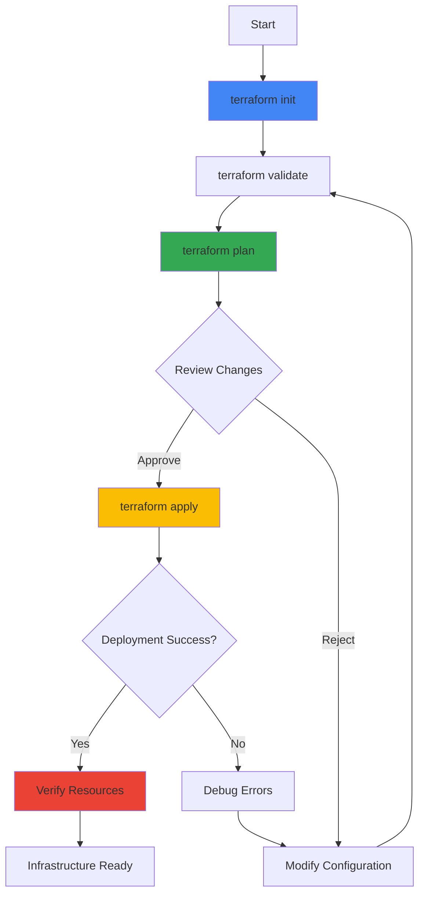

Deploy Online Boutique along with a complete GKE cluster infrastructure using Terraform. This approach provides Infrastructure as Code (IaC) for reproducible, version-controlled deployments.

## Overview

The Terraform configuration provisions:
- Google Kubernetes Engine (GKE) Autopilot cluster
- Online Boutique application deployment
- Optional: Google Cloud Memorystore (Redis) instance
- Required networking and IAM configurations

## Prerequisites

<Steps>
  <Step title="Google Cloud Project">
    Create or select a GCP project with billing enabled
    ```bash
    # Create new project
    gcloud projects create PROJECT_ID --name="Online Boutique"
    
    # Enable billing
    gcloud beta billing projects link PROJECT_ID \
      --billing-account=BILLING_ACCOUNT_ID
    ```
  </Step>
  
  <Step title="Install Terraform">
    Install Terraform 1.0 or later
    ```bash
    # macOS
    brew install terraform
    
    # Linux
    wget https://releases.hashicorp.com/terraform/1.6.0/terraform_1.6.0_linux_amd64.zip
    unzip terraform_1.6.0_linux_amd64.zip
    sudo mv terraform /usr/local/bin/
    
    # Windows
    choco install terraform
    
    # Verify installation
    terraform version
    ```
  </Step>
  
  <Step title="Install Google Cloud SDK">
    Install and configure gcloud CLI
    ```bash
    # Install gcloud
    curl https://sdk.cloud.google.com | bash
    
    # Initialize and authenticate
    gcloud init
    gcloud auth application-default login
    ```
  </Step>
  
  <Step title="Install kubectl">
    Install Kubernetes CLI
    ```bash
    gcloud components install kubectl
    ```
  </Step>
</Steps>

## Quick Start

<Steps>
  <Step title="Clone Repository">
    ```bash
    git clone https://github.com/GoogleCloudPlatform/microservices-demo.git
    cd microservices-demo/terraform
    ```
  </Step>
  
  <Step title="Configure Variables">
    Edit `terraform.tfvars`:
    ```hcl
    gcp_project_id = "your-project-id"
    region         = "us-central1"
    memorystore    = false
    ```
  </Step>
  
  <Step title="Initialize Terraform">
    ```bash
    terraform init
    ```
  </Step>
  
  <Step title="Preview Changes">
    ```bash
    terraform plan
    ```
  </Step>
  
  <Step title="Deploy Infrastructure">
    ```bash
    terraform apply
    ```
    Type `yes` when prompted. Deployment takes ~10 minutes.
  </Step>
  
  <Step title="Access Application">
    ```bash
    # Get cluster credentials
    gcloud container clusters get-credentials online-boutique \
      --region=us-central1 \
      --project=your-project-id
    
    # Get frontend URL
    kubectl get service frontend-external | awk '{print $4}'
    ```
  </Step>
</Steps>

## Terraform Architecture



## Configuration Files

### main.tf

Provisions the GKE Autopilot cluster:

```hcl
resource "google_container_cluster" "online_boutique" {
  name     = "online-boutique"
  location = var.region
  
  # Enable Autopilot
  enable_autopilot = true
  
  # Deletion protection
  deletion_protection = true
  
  # Release channel
  release_channel {
    channel = "REGULAR"
  }
  
  # IP allocation policy
  ip_allocation_policy {
    cluster_ipv4_cidr_block  = "/17"
    services_ipv4_cidr_block = "/22"
  }
}

# Deploy Online Boutique
resource "null_resource" "deploy_online_boutique" {
  depends_on = [google_container_cluster.online_boutique]
  
  provisioner "local-exec" {
    command = <<EOT
      gcloud container clusters get-credentials ${google_container_cluster.online_boutique.name} \
        --region=${var.region} \
        --project=${var.gcp_project_id}
      kubectl apply -f ../release/kubernetes-manifests.yaml
    EOT
  }
}
```

### variables.tf

Defines input variables:

```hcl
variable "gcp_project_id" {
  description = "The GCP project ID"
  type        = string
}

variable "region" {
  description = "The GCP region for resources"
  type        = string
  default     = "us-central1"
}

variable "memorystore" {
  description = "Enable Google Cloud Memorystore (Redis)"
  type        = bool
  default     = false
}
```

### terraform.tfvars

Provides variable values:

```hcl
gcp_project_id = "your-project-id"
region         = "us-central1"
memorystore    = false
```

### memorystore.tf

Optional Memorystore Redis instance:

```hcl
resource "google_redis_instance" "cart" {
  count = var.memorystore ? 1 : 0
  
  name           = "cart-redis"
  tier           = "BASIC"
  memory_size_gb = 1
  region         = var.region
  
  redis_version     = "REDIS_6_X"
  display_name      = "Cart Redis Instance"
  reserved_ip_range = "10.0.0.0/29"
  
  auth_enabled = true
}
```

### output.tf

Defines output values:

```hcl
output "cluster_name" {
  description = "GKE cluster name"
  value       = google_container_cluster.online_boutique.name
}

output "cluster_endpoint" {
  description = "GKE cluster endpoint"
  value       = google_container_cluster.online_boutique.endpoint
  sensitive   = true
}

output "region" {
  description = "GCP region"
  value       = var.region
}

output "memorystore_host" {
  description = "Memorystore Redis host"
  value       = var.memorystore ? google_redis_instance.cart[0].host : null
}
```

## Configuration Options

### Basic Configuration

Edit `terraform.tfvars` for basic customization:

```hcl
# Required
gcp_project_id = "my-gcp-project"

# Optional
region      = "us-east1"
memorystore = false
```

### With Memorystore

Enable managed Redis:

```hcl
gcp_project_id = "my-gcp-project"
region         = "us-central1"
memorystore    = true
```

<Note>
When Memorystore is enabled, the cart service automatically connects to the managed Redis instance instead of the in-cluster Redis pod.
</Note>

### Custom Cluster Configuration

Modify `main.tf` for advanced cluster settings:

```hcl
resource "google_container_cluster" "online_boutique" {
  name     = "online-boutique"
  location = var.region
  
  enable_autopilot = true
  
  # Custom network
  network    = google_compute_network.vpc.name
  subnetwork = google_compute_subnetwork.subnet.name
  
  # Maintenance window
  maintenance_policy {
    daily_maintenance_window {
      start_time = "03:00"
    }
  }
  
  # Monitoring and logging
  monitoring_config {
    enable_components = ["SYSTEM_COMPONENTS", "WORKLOADS"]
  }
  
  logging_config {
    enable_components = ["SYSTEM_COMPONENTS", "WORKLOADS"]
  }
}
```

## Terraform Workflow



### Initialize Terraform

```bash
# Initialize working directory
terraform init

# Output:
# Initializing the backend...
# Initializing provider plugins...
# - Finding latest version of hashicorp/google...
# - Installing hashicorp/google v5.0.0...
# Terraform has been successfully initialized!
```

### Validate Configuration

```bash
# Validate syntax and configuration
terraform validate

# Format configuration files
terraform fmt

# Check formatting
terraform fmt -check
```

### Plan Changes

```bash
# Preview infrastructure changes
terraform plan

# Save plan to file
terraform plan -out=tfplan

# Show saved plan
terraform show tfplan
```

### Apply Changes

```bash
# Apply configuration
terraform apply

# Apply without confirmation prompt
terraform apply -auto-approve

# Apply saved plan
terraform apply tfplan
```

### View State

```bash
# List resources in state
terraform state list

# Show specific resource
terraform state show google_container_cluster.online_boutique

# View outputs
terraform output

# View specific output
terraform output cluster_name
```

## State Management

### Local State

By default, Terraform stores state locally in `terraform.tfstate`:

```bash
# View state
cat terraform.tfstate

# Backup state
cp terraform.tfstate terraform.tfstate.backup
```

<Warning>
Never commit `terraform.tfstate` to version control. It may contain sensitive information.
</Warning>

### Remote State (Recommended)

Configure remote state in Google Cloud Storage:

```hcl
# backend.tf
terraform {
  backend "gcs" {
    bucket = "my-terraform-state-bucket"
    prefix = "online-boutique"
  }
}
```

Create the bucket:

```bash
# Create GCS bucket
gsutil mb gs://my-terraform-state-bucket

# Enable versioning
gsutil versioning set on gs://my-terraform-state-bucket
```

Initialize with remote backend:

```bash
terraform init -migrate-state
```

## Multi-Environment Deployment

### Workspace-Based

```bash
# Create workspaces
terraform workspace new dev
terraform workspace new staging
terraform workspace new prod

# List workspaces
terraform workspace list

# Switch workspace
terraform workspace select dev

# Deploy to current workspace
terraform apply -var-file="dev.tfvars"
```

### Directory-Based

```
terraform/
├── modules/
│   └── online-boutique/
│       ├── main.tf
│       ├── variables.tf
│       └── outputs.tf
├── environments/
│   ├── dev/
│   │   ├── main.tf
│   │   └── terraform.tfvars
│   ├── staging/
│   │   ├── main.tf
│   │   └── terraform.tfvars
│   └── prod/
│       ├── main.tf
│       └── terraform.tfvars
```

Deploy each environment:

```bash
# Development
cd environments/dev
terraform init
terraform apply

# Staging
cd ../staging
terraform init
terraform apply

# Production
cd ../prod
terraform init
terraform apply
```

## Updating Infrastructure

### Update Application

```bash
# Modify Kubernetes manifests
# Then apply changes
terraform apply -replace=null_resource.deploy_online_boutique
```

### Update Cluster

```bash
# Modify cluster configuration in main.tf
# Preview changes
terraform plan

# Apply changes
terraform apply
```

### Upgrade Terraform Version

```bash
# Upgrade providers
terraform init -upgrade

# Verify compatibility
terraform validate
```

## Cleanup

<Steps>
  <Step title="Disable Deletion Protection">
    Edit `main.tf`:
    ```hcl
    resource "google_container_cluster" "online_boutique" {
      # ...
      deletion_protection = false
    }
    ```
    
    Apply change:
    ```bash
    terraform apply
    ```
  </Step>
  
  <Step title="Destroy Infrastructure">
    ```bash
    terraform destroy
    ```
    Type `yes` when prompted.
  </Step>
  
  <Step title="Verify Deletion">
    ```bash
    # Check GKE clusters
    gcloud container clusters list --project=your-project-id
    
    # Check Memorystore instances
    gcloud redis instances list --region=us-central1
    ```
  </Step>
</Steps>

## Troubleshooting

<AccordionGroup>
  <Accordion title="API not enabled error">
    **Error**: `Error 403: ... API has not been used in project`
    
    **Solution**: Enable required APIs
    ```bash
    gcloud services enable container.googleapis.com \
      compute.googleapis.com \
      redis.googleapis.com \
      --project=your-project-id
    ```
  </Accordion>
  
  <Accordion title="Insufficient permissions">
    **Error**: `Error 403: ... does not have permission`
    
    **Solution**: Grant required IAM roles
    ```bash
    gcloud projects add-iam-policy-binding your-project-id \
      --member=user:your-email@example.com \
      --role=roles/container.admin
    
    gcloud projects add-iam-policy-binding your-project-id \
      --member=user:your-email@example.com \
      --role=roles/compute.admin
    ```
  </Accordion>
  
  <Accordion title="State lock error">
    **Error**: `Error acquiring the state lock`
    
    **Solution**: Force unlock (use with caution)
    ```bash
    terraform force-unlock LOCK_ID
    ```
  </Accordion>
  
  <Accordion title="Cluster creation timeout">
    **Error**: Cluster creation takes too long
    
    **Solution**: Increase timeout in provider configuration
    ```hcl
    provider "google" {
      project = var.gcp_project_id
      region  = var.region
      
      timeouts {
        create = "30m"
        update = "40m"
      }
    }
    ```
  </Accordion>
  
  <Accordion title="Deletion protection prevents destroy">
    **Error**: `Cannot delete cluster with deletion protection enabled`
    
    **Solution**: Disable deletion protection first
    ```bash
    # Update main.tf
    sed -i 's/deletion_protection = true/deletion_protection = false/g' main.tf
    
    # Apply change
    terraform apply
    
    # Then destroy
    terraform destroy
    ```
  </Accordion>
</AccordionGroup>

## Best Practices

<CardGroup cols={2}>
  <Card title="Version Control" icon="code-branch">
    Store Terraform files in Git, exclude `terraform.tfstate` and `.terraform/`
  </Card>
  <Card title="Remote State" icon="cloud">
    Use GCS backend for team collaboration and state locking
  </Card>
  <Card title="Variable Files" icon="file">
    Use separate `.tfvars` files for each environment
  </Card>
  <Card title="Plan Before Apply" icon="eye">
    Always run `terraform plan` before `terraform apply`
  </Card>
  <Card title="State Backups" icon="floppy-disk">
    Enable versioning on GCS bucket for state backups
  </Card>
  <Card title="Modules" icon="cube">
    Use modules for reusable infrastructure components
  </Card>
</CardGroup>

## Next Steps

<CardGroup cols={2}>
  <Card title="Add Monitoring" icon="chart-line" href="/deployment/optional-components">
    Enable Cloud Operations
  </Card>
  <Card title="Configure Memorystore" icon="database" href="/deployment/optional-components">
    Use managed Redis
  </Card>
  <Card title="CI/CD Integration" icon="robot" href="/development/contributing">
    Automate Terraform deployments
  </Card>
  <Card title="Multi-Region Setup" icon="globe" href="/architecture/overview">
    Deploy across regions
  </Card>
</CardGroup>

## Additional Resources

- [Terraform Documentation](https://www.terraform.io/docs)
- [Google Provider Documentation](https://registry.terraform.io/providers/hashicorp/google/latest/docs)
- [GKE Terraform Module](https://registry.terraform.io/modules/terraform-google-modules/kubernetes-engine/google/latest)
- [Terraform Best Practices](https://www.terraform.io/docs/cloud/guides/recommended-practices/index.html)
