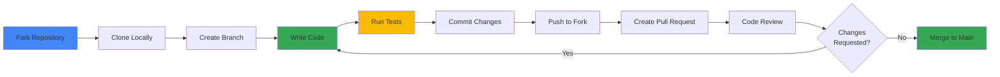

## Overview

We welcome contributions to Online Boutique! This guide explains how to contribute code, documentation, bug reports, and feature requests to the project.

<Info>
  Online Boutique is an open-source project maintained by Google Cloud Platform. All contributions are subject to review and must follow our guidelines.
</Info>

## Contribution Workflow



## Ways to Contribute

<CardGroup cols={2}>
  <Card title="Report Bugs" icon="bug">
    Help us improve by reporting issues you encounter
  </Card>
  <Card title="Fix Issues" icon="wrench">
    Pick up existing issues and submit fixes
  </Card>
  <Card title="Add Features" icon="sparkles">
    Propose and implement new functionality
  </Card>
  <Card title="Improve Docs" icon="book">
    Enhance documentation and examples
  </Card>
</CardGroup>

## Getting Started

### Prerequisites

Before contributing, ensure you have:

1. Completed the [development setup](/development/setup)
2. Read the [architecture documentation](/architecture/overview)
3. Familiarized yourself with the codebase
4. Reviewed existing issues and pull requests

### Fork and Clone

1. Fork the repository on GitHub
2. Clone your fork locally:

```bash
git clone https://github.com/YOUR_USERNAME/microservices-demo.git
cd microservices-demo
```

3. Add the upstream repository:

```bash
git remote add upstream https://github.com/GoogleCloudPlatform/microservices-demo.git
```

4. Create a new branch for your work:

```bash
git checkout -b feature/my-new-feature
```

## Code Contributions

### Finding Issues to Work On

Look for issues labeled:

- `good first issue` - Great for first-time contributors
- `help wanted` - Issues where we need community help
- `bug` - Bug fixes needed
- `enhancement` - New features or improvements

Comment on the issue to let others know you're working on it.

### Making Changes

<Steps>
  <Step title="Create a Branch">
    Create a descriptive branch name:
    ```bash
    git checkout -b fix/payment-validation-bug
    # or
    git checkout -b feature/add-review-service
    ```
  </Step>

  <Step title="Make Your Changes">
    - Write clean, readable code
    - Follow existing code style
    - Add comments for complex logic
    - Update relevant documentation
  </Step>

  <Step title="Test Your Changes">
    ```bash
    # Run tests
    ./test/run-all-tests.sh
    
    # Test locally
    skaffold run
    kubectl get pods
    ```
  </Step>

  <Step title="Commit Your Changes">
    Write clear, descriptive commit messages:
    ```bash
    git add .
    git commit -m "fix: validate credit card expiration date correctly
    
    - Add proper date comparison logic
    - Handle edge cases for month boundaries
    - Add unit tests for validation
    
    Fixes #123"
    ```
  </Step>

  <Step title="Push to Your Fork">
    ```bash
    git push origin feature/my-new-feature
    ```
  </Step>

  <Step title="Create Pull Request">
    Open a pull request on GitHub with a clear description of your changes.
  </Step>
</Steps>

### Code Style Guidelines

Follow the style conventions for each language:

<Tabs>
  <Tab title="Go">
    - Use `gofmt` to format code
    - Follow [Effective Go](https://golang.org/doc/effective_go.html)
    - Use meaningful variable names
    - Add comments for exported functions
    
    ```bash
    # Format code
    gofmt -w .
    
    # Run linter
    golangci-lint run
    ```
  </Tab>

  <Tab title="Node.js">
    - Use 2 spaces for indentation
    - Use semicolons
    - Follow [Airbnb JavaScript Style Guide](https://github.com/airbnb/javascript)
    - Use ESLint
    
    ```bash
    # Run linter
    npm run lint
    
    # Fix auto-fixable issues
    npm run lint -- --fix
    ```
  </Tab>

  <Tab title="Python">
    - Follow [PEP 8](https://www.python.org/dev/peps/pep-0008/)
    - Use 4 spaces for indentation
    - Use type hints where appropriate
    - Use Black for formatting
    
    ```bash
    # Format code
    black .
    
    # Run linter
    pylint **/*.py
    ```
  </Tab>

  <Tab title="C#">
    - Follow [C# Coding Conventions](https://docs.microsoft.com/en-us/dotnet/csharp/fundamentals/coding-style/coding-conventions)
    - Use 4 spaces for indentation
    - Use PascalCase for public members
    
    ```bash
    # Format code
    dotnet format
    ```
  </Tab>

  <Tab title="Java">
    - Follow [Google Java Style Guide](https://google.github.io/styleguide/javaguide.html)
    - Use 2 spaces for indentation
    - Use meaningful names
    
    ```bash
    # Format code
    ./gradlew spotlessApply
    ```
  </Tab>
</Tabs>

### Testing Requirements

All code contributions must include appropriate tests:

<AccordionGroup>
  <Accordion title="Unit Tests">
    - Test individual functions and methods
    - Mock external dependencies
    - Aim for 70-80% code coverage
    - Tests should be fast (< 1 second each)
  </Accordion>

  <Accordion title="Integration Tests">
    - Test service interactions
    - Use real dependencies when possible
    - Test error scenarios
    - Document test setup requirements
  </Accordion>

  <Accordion title="End-to-End Tests">
    - Test complete user workflows
    - Run against deployed application
    - Cover critical paths
    - Keep E2E tests minimal
  </Accordion>
</AccordionGroup>

### Documentation Requirements

Update documentation for any user-facing changes:

- Update README if adding new features
- Add/update API documentation for new endpoints
- Update architecture diagrams if needed
- Add examples for new functionality
- Update deployment guides if needed

## Pull Request Process

### PR Title Format

Use conventional commit format:

```
<type>(<scope>): <description>

Examples:
feat(frontend): add product search functionality
fix(payment): correct credit card validation
docs(readme): update deployment instructions
refactor(cart): simplify cart calculation logic
test(checkout): add integration tests
```

**Types:**
- `feat`: New feature
- `fix`: Bug fix
- `docs`: Documentation changes
- `style`: Code style changes (formatting, etc.)
- `refactor`: Code refactoring
- `test`: Adding or updating tests
- `chore`: Maintenance tasks

### PR Description Template

```markdown
## Description
Brief description of what this PR does.

## Related Issue
Fixes #123

## Type of Change
- [ ] Bug fix
- [ ] New feature
- [ ] Breaking change
- [ ] Documentation update

## Testing
Describe how you tested your changes:
- [ ] Unit tests pass
- [ ] Integration tests pass
- [ ] Tested locally with Skaffold
- [ ] Tested on GKE

## Checklist
- [ ] Code follows project style guidelines
- [ ] Self-review completed
- [ ] Comments added for complex code
- [ ] Documentation updated
- [ ] Tests added/updated
- [ ] All tests pass
- [ ] No new warnings introduced

## Screenshots (if applicable)
Add screenshots for UI changes.

## Additional Notes
Any additional information reviewers should know.
```

### Review Process

1. **Automated Checks**: CI/CD runs tests and linters
2. **Code Review**: Maintainers review your code
3. **Feedback**: Address review comments
4. **Approval**: At least one maintainer approval required
5. **Merge**: Maintainers merge your PR

<Note>
  Be patient during review. Maintainers are volunteers and may take time to respond. Feel free to ping after a week if no response.
</Note>

## Bug Reports

### Before Reporting

1. Search existing issues to avoid duplicates
2. Verify the bug exists in the latest version
3. Collect relevant information

### Bug Report Template

```markdown
**Describe the bug**
A clear description of what the bug is.

**To Reproduce**
Steps to reproduce the behavior:
1. Deploy using '...'
2. Navigate to '...'
3. Click on '...'
4. See error

**Expected behavior**
What you expected to happen.

**Actual behavior**
What actually happened.

**Screenshots**
If applicable, add screenshots.

**Environment:**
- Deployment method: [GKE/Minikube/Kind/etc.]
- Kubernetes version: [e.g. 1.28]
- Skaffold version: [e.g. 2.8.0]
- OS: [e.g. macOS 13.0]

**Logs**
```
Paste relevant logs here
```

**Additional context**
Any other relevant information.
```

## Feature Requests

### Before Requesting

1. Check if the feature already exists
2. Search existing feature requests
3. Consider if it fits the project scope

### Feature Request Template

```markdown
**Is your feature request related to a problem?**
A clear description of the problem.

**Describe the solution you'd like**
What you want to happen.

**Describe alternatives you've considered**
Other solutions you've thought about.

**Additional context**
Any other relevant information, mockups, or examples.

**Would you like to implement this feature?**
Let us know if you're willing to contribute the implementation.
```

## Documentation Contributions

Documentation improvements are always welcome!

### Types of Documentation

- **Code Comments**: Explain complex logic
- **README Files**: Service-level documentation
- **Architecture Docs**: System design and patterns
- **Deployment Guides**: How to deploy and configure
- **API Documentation**: gRPC service definitions
- **Tutorials**: Step-by-step guides

### Documentation Style

- Use clear, concise language
- Include code examples
- Add diagrams where helpful
- Keep content up to date
- Test all commands and examples

## Community Guidelines

### Code of Conduct

- Be respectful and inclusive
- Welcome newcomers
- Provide constructive feedback
- Focus on the code, not the person
- Assume good intentions

### Communication Channels

- **GitHub Issues**: Bug reports and feature requests
- **Pull Requests**: Code contributions and discussions
- **Discussions**: General questions and ideas

## Release Process

### Versioning

Online Boutique follows [Semantic Versioning](https://semver.org/):

- **Major**: Breaking changes
- **Minor**: New features (backward compatible)
- **Patch**: Bug fixes

### Release Cycle

- Releases are made periodically by maintainers
- Contributors don't need to worry about versioning
- Maintainers handle changelog and release notes

## License

By contributing, you agree that your contributions will be licensed under the Apache License 2.0.

### License Header

Add this header to new files:

```
// Copyright 2024 Google LLC
//
// Licensed under the Apache License, Version 2.0 (the "License");
// you may not use this file except in compliance with the License.
// You may obtain a copy of the License at
//
//      http://www.apache.org/licenses/LICENSE-2.0
//
// Unless required by applicable law or agreed to in writing, software
// distributed under the License is distributed on an "AS IS" BASIS,
// WITHOUT WARRANTIES OR CONDITIONS OF ANY KIND, either express or implied.
// See the License for the specific language governing permissions and
// limitations under the License.
```

## Recognition

Contributors are recognized in:

- GitHub contributors list
- Release notes (for significant contributions)
- Project README (for major features)

## Getting Help

If you need help with your contribution:

1. Check existing documentation
2. Search closed issues and PRs
3. Ask in the issue or PR comments
4. Be specific about what you need help with

## Advanced Topics

### Becoming a Maintainer

Active contributors may be invited to become maintainers. Maintainers:

- Review and merge pull requests
- Triage issues
- Guide project direction
- Help other contributors

### Security Issues

**Do not report security vulnerabilities in public issues.**

Email security concerns to: [security@example.com]

Include:
- Description of the vulnerability
- Steps to reproduce
- Potential impact
- Suggested fix (if any)

## Checklist for Contributors

Before submitting your contribution:

<Steps>
  <Step title="Code Quality">
    - [ ] Code follows style guidelines
    - [ ] No linting errors
    - [ ] Code is well-commented
    - [ ] No debug code or console logs
  </Step>

  <Step title="Testing">
    - [ ] Unit tests added/updated
    - [ ] All tests pass locally
    - [ ] Integration tests pass
    - [ ] Tested in local cluster
  </Step>

  <Step title="Documentation">
    - [ ] README updated if needed
    - [ ] API docs updated if needed
    - [ ] Comments added for complex code
    - [ ] Examples provided
  </Step>

  <Step title="Git">
    - [ ] Commits are logical and well-described
    - [ ] Branch is up to date with main
    - [ ] No merge conflicts
    - [ ] Commit messages follow convention
  </Step>

  <Step title="Pull Request">
    - [ ] PR title follows convention
    - [ ] Description is complete
    - [ ] Related issue linked
    - [ ] Screenshots added (if UI change)
  </Step>
</Steps>

## Thank You!

Thank you for contributing to Online Boutique! Your contributions help make this project better for everyone.

<CardGroup cols={2}>
  <Card title="View Issues" icon="github" href="https://github.com/GoogleCloudPlatform/microservices-demo/issues">
    Find issues to work on
  </Card>
  <Card title="Pull Requests" icon="code-pull-request" href="https://github.com/GoogleCloudPlatform/microservices-demo/pulls">
    View open pull requests
  </Card>
  <Card title="Discussions" icon="comments" href="https://github.com/GoogleCloudPlatform/microservices-demo/discussions">
    Join the conversation
  </Card>
  <Card title="Contributors" icon="users" href="https://github.com/GoogleCloudPlatform/microservices-demo/graphs/contributors">
    See all contributors
  </Card>
</CardGroup>
