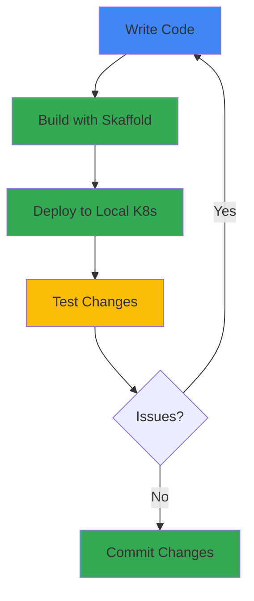

## Overview

This guide walks you through setting up a local development environment for working on Online Boutique. You'll install the necessary tools and configure your system to build, run, and test the microservices locally.

## Development Workflow



## Prerequisites

Before you begin, ensure you have the following installed on your system:

<CardGroup cols={2}>
  <Card title="Docker" icon="docker">
    Container runtime for building and running services
  </Card>
  <Card title="Kubernetes CLI" icon="dharmachakra">
    kubectl for interacting with Kubernetes clusters
  </Card>
  <Card title="Skaffold" icon="rocket">
    Tool for continuous development on Kubernetes
  </Card>
  <Card title="Git" icon="git">
    Version control system
  </Card>
</CardGroup>

## Required Tools

### Docker Desktop

Docker is required to build container images and run containers locally.

<Tabs>
  <Tab title="macOS">
    Download and install [Docker Desktop for Mac](https://www.docker.com/products/docker-desktop).
    
    **System Requirements:**
    - macOS 10.15 or newer
    - At least 4 GB RAM (8 GB recommended)
    - At least 32 GB disk space
    
    **Configuration:**
    1. Open Docker Desktop preferences
    2. Go to Resources
    3. Set CPUs to at least 4
    4. Set Memory to at least 6.0 GB
    5. Set Disk image size to at least 32 GB
  </Tab>

  <Tab title="Windows">
    Download and install [Docker Desktop for Windows](https://www.docker.com/products/docker-desktop).
    
    **System Requirements:**
    - Windows 10 64-bit: Pro, Enterprise, or Education
    - WSL 2 backend enabled
    - At least 4 GB RAM (8 GB recommended)
    - At least 32 GB disk space
    
    **Configuration:**
    1. Open Docker Desktop settings
    2. Go to Resources
    3. Set CPUs to at least 4
    4. Set Memory to at least 6.0 GB
    5. Set Disk image size to at least 32 GB
  </Tab>

  <Tab title="Linux">
    Install Docker Engine following the [official documentation](https://docs.docker.com/engine/install/).
    
    ```bash
    # Ubuntu/Debian example
    sudo apt-get update
    sudo apt-get install docker-ce docker-ce-cli containerd.io
    
    # Add your user to the docker group
    sudo usermod -aG docker $USER
    
    # Log out and back in for group changes to take effect
    ```
  </Tab>
</Tabs>

### kubectl

kubectl is the Kubernetes command-line tool for deploying and managing applications.

<Tabs>
  <Tab title="macOS">
    ```bash
    # Using Homebrew
    brew install kubectl
    
    # Or using gcloud
    gcloud components install kubectl
    ```
  </Tab>

  <Tab title="Windows">
    ```powershell
    # Using Chocolatey
    choco install kubernetes-cli
    
    # Or using gcloud
    gcloud components install kubectl
    ```
  </Tab>

  <Tab title="Linux">
    ```bash
    # Download the latest release
    curl -LO "https://dl.k8s.io/release/$(curl -L -s https://dl.k8s.io/release/stable.txt)/bin/linux/amd64/kubectl"
    
    # Install kubectl
    sudo install -o root -g root -m 0755 kubectl /usr/local/bin/kubectl
    
    # Or using gcloud
    gcloud components install kubectl
    ```
  </Tab>
</Tabs>

Verify installation:
```bash
kubectl version --client
```

### Skaffold

Skaffold handles the workflow for building, pushing, and deploying your application.

<Tabs>
  <Tab title="macOS">
    ```bash
    # Using Homebrew
    brew install skaffold
    
    # Or download binary
    curl -Lo skaffold https://storage.googleapis.com/skaffold/releases/latest/skaffold-darwin-amd64
    sudo install skaffold /usr/local/bin/
    ```
  </Tab>

  <Tab title="Windows">
    ```powershell
    # Using Chocolatey
    choco install skaffold
    
    # Or download binary
    # Download from https://storage.googleapis.com/skaffold/releases/latest/skaffold-windows-amd64.exe
    # Rename to skaffold.exe and add to PATH
    ```
  </Tab>

  <Tab title="Linux">
    ```bash
    # Download the latest release
    curl -Lo skaffold https://storage.googleapis.com/skaffold/releases/latest/skaffold-linux-amd64
    sudo install skaffold /usr/local/bin/
    ```
  </Tab>
</Tabs>

<Note>
  Skaffold version 2.0.2 or higher is required. The latest version is recommended.
</Note>

Verify installation:
```bash
skaffold version
```

### Git

Git is required to clone the repository and manage source code.

<Tabs>
  <Tab title="macOS">
    ```bash
    # Using Homebrew
    brew install git
    
    # Or use Xcode Command Line Tools
    xcode-select --install
    ```
  </Tab>

  <Tab title="Windows">
    Download and install [Git for Windows](https://git-scm.com/download/win).
  </Tab>

  <Tab title="Linux">
    ```bash
    # Ubuntu/Debian
    sudo apt-get install git
    
    # Fedora
    sudo dnf install git
    ```
  </Tab>
</Tabs>

## Optional Tools

### Local Kubernetes Cluster

For local development, you'll need a Kubernetes cluster. Choose one of the following options:

<Tabs>
  <Tab title="Docker Desktop">
    Docker Desktop includes a built-in Kubernetes cluster.
    
    **Enable Kubernetes:**
    1. Open Docker Desktop preferences
    2. Go to Kubernetes tab
    3. Check "Enable Kubernetes"
    4. Click "Apply & Restart"
    
    **Verify:**
    ```bash
    kubectl config current-context
    # Should show: docker-desktop
    ```
  </Tab>

  <Tab title="Minikube">
    [Minikube](https://minikube.sigs.k8s.io/) runs a local Kubernetes cluster.
    
    **Install:**
    ```bash
    # macOS
    brew install minikube
    
    # Linux
    curl -LO https://storage.googleapis.com/minikube/releases/latest/minikube-linux-amd64
    sudo install minikube-linux-amd64 /usr/local/bin/minikube
    
    # Windows
    choco install minikube
    ```
    
    **Start cluster:**
    ```bash
    minikube start --cpus=4 --memory=4096 --disk-size=32g
    ```
    
    **Verify:**
    ```bash
    kubectl get nodes
    ```
  </Tab>

  <Tab title="Kind">
    [Kind](https://kind.sigs.k8s.io/) runs Kubernetes clusters using Docker containers.
    
    **Install:**
    ```bash
    # macOS/Linux
    curl -Lo ./kind https://kind.sigs.k8s.io/dl/latest/kind-linux-amd64
    chmod +x ./kind
    sudo mv ./kind /usr/local/bin/kind
    
    # macOS with Homebrew
    brew install kind
    
    # Windows
    choco install kind
    ```
    
    **Create cluster:**
    ```bash
    kind create cluster
    ```
    
    **Verify:**
    ```bash
    kubectl cluster-info --context kind-kind
    ```
  </Tab>
</Tabs>

### Google Cloud SDK (for GKE)

If you plan to deploy to Google Kubernetes Engine, install the Google Cloud SDK.

<Tabs>
  <Tab title="macOS">
    ```bash
    # Using Homebrew
    brew install google-cloud-sdk
    
    # Or download installer
    # Visit https://cloud.google.com/sdk/docs/install
    ```
  </Tab>

  <Tab title="Windows">
    Download and run the [Google Cloud SDK installer](https://cloud.google.com/sdk/docs/install).
  </Tab>

  <Tab title="Linux">
    ```bash
    # Add Cloud SDK distribution URI as a package source
    echo "deb [signed-by=/usr/share/keyrings/cloud.google.gpg] https://packages.cloud.google.com/apt cloud-sdk main" | sudo tee -a /etc/apt/sources.list.d/google-cloud-sdk.list
    
    # Import the Google Cloud public key
    curl https://packages.cloud.google.com/apt/doc/apt-key.gpg | sudo apt-key --keyring /usr/share/keyrings/cloud.google.gpg add -
    
    # Update and install
    sudo apt-get update && sudo apt-get install google-cloud-sdk
    ```
  </Tab>
</Tabs>

**Initialize gcloud:**
```bash
gcloud init
gcloud auth login
```

## Clone the Repository

Clone the Online Boutique repository to your local machine:

```bash
git clone https://github.com/GoogleCloudPlatform/microservices-demo.git
cd microservices-demo
```

## Verify Your Setup

Run these commands to verify all tools are installed correctly:

```bash
# Check Docker
docker --version
docker ps

# Check kubectl
kubectl version --client

# Check Skaffold
skaffold version

# Check Git
git --version

# Check cluster connection
kubectl get nodes
```

<Check>
If all commands execute successfully, your development environment is ready!
</Check>

## Language-Specific Setup

Depending on which microservices you plan to work on, you may need additional language-specific tools:

<AccordionGroup>
  <Accordion title="Go (Frontend, Checkout, Product Catalog, Shipping)">
    **Install Go 1.21 or higher:**
    
    ```bash
    # macOS
    brew install go
    
    # Linux
    wget https://go.dev/dl/go1.21.0.linux-amd64.tar.gz
    sudo tar -C /usr/local -xzf go1.21.0.linux-amd64.tar.gz
    export PATH=$PATH:/usr/local/go/bin
    
    # Windows
    choco install golang
    ```
    
    **Verify:**
    ```bash
    go version
    ```
  </Accordion>

  <Accordion title="Node.js (Currency, Payment)">
    **Install Node.js 20 or higher:**
    
    ```bash
    # macOS
    brew install node@20
    
    # Linux (using nvm)
    curl -o- https://raw.githubusercontent.com/nvm-sh/nvm/v0.39.0/install.sh | bash
    nvm install 20
    
    # Windows
    choco install nodejs
    ```
    
    **Verify:**
    ```bash
    node --version
    npm --version
    ```
  </Accordion>

  <Accordion title="Python (Email, Recommendation, Load Generator)">
    **Install Python 3.11 or higher:**
    
    ```bash
    # macOS
    brew install python@3.11
    
    # Linux
    sudo apt-get install python3.11 python3-pip
    
    # Windows
    choco install python
    ```
    
    **Verify:**
    ```bash
    python3 --version
    pip3 --version
    ```
  </Accordion>

  <Accordion title="C# (.NET) (Cart Service)">
    **Install .NET 8.0 SDK:**
    
    ```bash
    # macOS
    brew install dotnet
    
    # Linux
    wget https://dot.net/v1/dotnet-install.sh
    chmod +x dotnet-install.sh
    ./dotnet-install.sh --channel 8.0
    
    # Windows
    choco install dotnet-sdk
    ```
    
    **Verify:**
    ```bash
    dotnet --version
    ```
  </Accordion>

  <Accordion title="Java (Ad Service)">
    **Install Java 21 or higher:**
    
    ```bash
    # macOS
    brew install openjdk@21
    
    # Linux
    sudo apt-get install openjdk-21-jdk
    
    # Windows
    choco install openjdk
    ```
    
    **Verify:**
    ```bash
    java -version
    ```
  </Accordion>
</AccordionGroup>

## IDE Setup

### Visual Studio Code

Recommended extensions for working with Online Boutique:

- **Docker** - Manage containers and images
- **Kubernetes** - Kubernetes resource management
- **Go** - Go language support
- **Python** - Python language support
- **C#** - C# language support
- **Java Extension Pack** - Java language support
- **YAML** - YAML language support
- **Protocol Buffers** - Proto file syntax highlighting

### IntelliJ IDEA / GoLand / PyCharm

JetBrains IDEs have built-in support for most languages used in Online Boutique. Install the following plugins:

- **Docker** - Container management
- **Kubernetes** - Kubernetes integration
- **Protocol Buffers** - Proto file support

## Troubleshooting

<AccordionGroup>
  <Accordion title="Docker daemon not running">
    **Symptom:** `Cannot connect to the Docker daemon`
    
    **Solution:**
    - Ensure Docker Desktop is running
    - On Linux, start the Docker service: `sudo systemctl start docker`
    - Check Docker status: `docker ps`
  </Accordion>

  <Accordion title="kubectl cannot connect to cluster">
    **Symptom:** `The connection to the server localhost:8080 was refused`
    
    **Solution:**
    - Verify your cluster is running
    - Check kubectl context: `kubectl config current-context`
    - For Docker Desktop, ensure Kubernetes is enabled
    - For Minikube, ensure cluster is started: `minikube status`
  </Accordion>

  <Accordion title="Insufficient resources">
    **Symptom:** Pods stuck in Pending state or frequent crashes
    
    **Solution:**
    - Increase Docker Desktop resource limits (CPU, Memory, Disk)
    - For Minikube, restart with more resources:
      ```bash
      minikube delete
      minikube start --cpus=4 --memory=4096 --disk-size=32g
      ```
  </Accordion>

  <Accordion title="Skaffold build failures">
    **Symptom:** `build failed` errors
    
    **Solution:**
    - Ensure Docker daemon is running
    - Check available disk space
    - Clear Docker cache: `docker system prune -a`
    - Update Skaffold to latest version
  </Accordion>
</AccordionGroup>

## Next Steps

Now that your development environment is set up, you can:

<CardGroup cols={2}>
  <Card title="Build and Run" icon="hammer" href="/development/building">
    Learn how to build and run Online Boutique locally
  </Card>
  <Card title="Testing" icon="flask" href="/development/testing">
    Understand the testing strategy and run tests
  </Card>
  <Card title="Add a Service" icon="plus" href="/development/adding-service">
    Add a new microservice to the application
  </Card>
  <Card title="Contributing" icon="code-pull-request" href="/development/contributing">
    Learn how to contribute to the project
  </Card>
</CardGroup>
