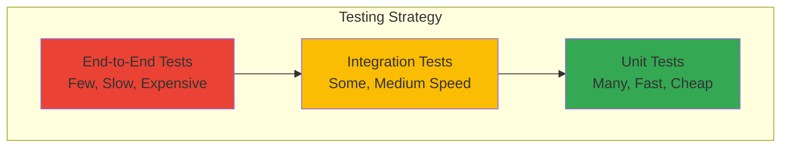

## Overview

This guide covers testing strategies for Online Boutique, including unit tests, integration tests, and end-to-end testing. Each microservice has its own test suite tailored to its programming language and framework.

## Testing Pyramid



<Note>
  **The Testing Pyramid:** Write more unit tests (fast, isolated) and fewer end-to-end tests (slow, brittle). This gives you fast feedback while still catching integration issues.
</Note>

## Testing Philosophy

Online Boutique follows these testing principles:

<CardGroup cols={2}>
  <Card title="Test Pyramid" icon="triangle">
    Many unit tests, fewer integration tests, minimal E2E tests
  </Card>
  <Card title="Fast Feedback" icon="bolt">
    Tests should run quickly to enable rapid development
  </Card>
  <Card title="Isolation" icon="cube">
    Tests should be independent and not rely on external services
  </Card>
  <Card title="Realistic" icon="check">
    Integration tests should use real dependencies when possible
  </Card>
</CardGroup>

## Running All Tests

To run tests for all microservices, use the provided test script:

```bash
# From repository root
./test/run-all-tests.sh
```

This script:
1. Discovers all microservices with test suites
2. Runs tests for each service in its native environment
3. Reports results and failures
4. Exits with non-zero code if any tests fail

## Testing Individual Microservices

Each microservice has its own testing approach based on its language and framework.

### Go Services

Go services (Frontend, Checkout, Product Catalog, Shipping) use Go's built-in testing framework.

<Tabs>
  <Tab title="Frontend">
    ```bash
    cd src/frontend
    go test ./...
    ```
    
    **Test Coverage:**
    ```bash
    go test -cover ./...
    ```
    
    **Verbose Output:**
    ```bash
    go test -v ./...
    ```
  </Tab>

  <Tab title="Checkout Service">
    ```bash
    cd src/checkoutservice
    go test ./...
    ```
  </Tab>

  <Tab title="Product Catalog">
    ```bash
    cd src/productcatalogservice
    go test ./...
    ```
  </Tab>

  <Tab title="Shipping Service">
    ```bash
    cd src/shippingservice
    go test ./...
    ```
  </Tab>
</Tabs>

**Common Go Test Commands:**

```bash
# Run specific test
go test -run TestFunctionName

# Run with race detector
go test -race ./...

# Generate coverage report
go test -coverprofile=coverage.out ./...
go tool cover -html=coverage.out

# Run benchmarks
go test -bench=. ./...
```

### Node.js Services

Node.js services (Currency, Payment) use Jest for testing.

<Tabs>
  <Tab title="Currency Service">
    ```bash
    cd src/currencyservice
    npm install
    npm test
    ```
    
    **Watch Mode:**
    ```bash
    npm test -- --watch
    ```
    
    **Coverage:**
    ```bash
    npm test -- --coverage
    ```
  </Tab>

  <Tab title="Payment Service">
    ```bash
    cd src/paymentservice
    npm install
    npm test
    ```
  </Tab>
</Tabs>

**Common Jest Commands:**

```bash
# Run specific test file
npm test -- paymentservice.test.js

# Run tests matching pattern
npm test -- --testNamePattern="charge"

# Update snapshots
npm test -- --updateSnapshot

# Run in watch mode
npm test -- --watch
```

### Python Services

Python services (Email, Recommendation, Load Generator) use pytest.

<Tabs>
  <Tab title="Email Service">
    ```bash
    cd src/emailservice
    python3 -m pip install -r requirements.txt
    python3 -m pytest
    ```
    
    **Verbose Output:**
    ```bash
    python3 -m pytest -v
    ```
    
    **Coverage:**
    ```bash
    python3 -m pytest --cov=. --cov-report=html
    ```
  </Tab>

  <Tab title="Recommendation Service">
    ```bash
    cd src/recommendationservice
    python3 -m pip install -r requirements.txt
    python3 -m pytest
    ```
  </Tab>
</Tabs>

**Common pytest Commands:**

```bash
# Run specific test file
pytest test_email.py

# Run specific test
pytest test_email.py::test_send_email

# Run with markers
pytest -m unit

# Show print statements
pytest -s

# Stop on first failure
pytest -x
```

### C# Service

The Cart Service uses .NET's testing framework (xUnit).

```bash
cd src/cartservice/tests
dotnet test
```

**Additional Options:**

```bash
# Verbose output
dotnet test --verbosity detailed

# Run specific test
dotnet test --filter "FullyQualifiedName~TestMethodName"

# Generate coverage
dotnet test /p:CollectCoverage=true /p:CoverageReportFormat=opencover
```

### Java Service

The Ad Service uses JUnit for testing.

```bash
cd src/adservice
./gradlew test
```

**Additional Options:**

```bash
# Run specific test class
./gradlew test --tests AdServiceTest

# Generate coverage report
./gradlew jacocoTestReport

# Run with info logging
./gradlew test --info
```

## Integration Testing

Integration tests verify that services work correctly together.

### Local Integration Tests

Run integration tests against a local deployment:

```bash
# Deploy to local cluster
skaffold run

# Wait for all pods to be ready
kubectl wait --for=condition=ready pod --all --timeout=300s

# Run integration tests
./test/integration-tests.sh
```

### Service-to-Service Tests

Test communication between services:

```bash
# Port forward to frontend
kubectl port-forward deployment/frontend 8080:8080 &

# Run API tests
curl http://localhost:8080/
curl http://localhost:8080/product/OLJCESPC7Z

# Test cart operations
curl -X POST http://localhost:8080/cart \
  -d "product_id=OLJCESPC7Z&quantity=1"

# Kill port forward
kill %1
```

## End-to-End Testing

E2E tests verify complete user workflows through the application.

### Load Generator

The load generator service continuously exercises the application:

```bash
# Check load generator logs
kubectl logs -l app=loadgenerator --tail=50

# Verify it's generating traffic
kubectl logs -l app=loadgenerator | grep "200 OK"
```

### Manual E2E Testing

Test complete user journeys:

<Steps>
  <Step title="Browse Products">
    Navigate to the homepage and verify products are displayed
  </Step>
  
  <Step title="View Product Details">
    Click on a product and verify details page loads
  </Step>
  
  <Step title="Add to Cart">
    Add items to cart and verify cart updates
  </Step>
  
  <Step title="Checkout">
    Complete checkout flow with test credit card
  </Step>
  
  <Step title="Verify Order">
    Confirm order confirmation page displays
  </Step>
</Steps>

### Automated E2E Tests

Run automated browser tests (if available):

```bash
# Install dependencies
npm install -g playwright

# Run E2E tests
cd test/e2e
npm install
npm test
```

## Performance Testing

### Load Testing with Locust

The load generator uses Locust for load testing:

```bash
# Access Locust UI
kubectl port-forward deployment/loadgenerator 8089:8089

# Open browser to http://localhost:8089
# Configure number of users and spawn rate
# Start load test
```

### Stress Testing

Test service limits:

```bash
# Increase load generator replicas
kubectl scale deployment/loadgenerator --replicas=5

# Monitor resource usage
kubectl top pods

# Watch for errors
kubectl logs -l app=frontend --tail=100 -f
```

## Test Data

### Test Credit Cards

Use these test credit cards for payment testing:

<CardGroup cols={2}>
  <Card title="VISA">
    ```
    Number: 4432-8015-6152-0454
    CVV: 672
    Expiry: 12/2025
    ```
  </Card>
  <Card title="MasterCard">
    ```
    Number: 5555-5555-5555-4444
    CVV: 123
    Expiry: 12/2025
    ```
  </Card>
</CardGroup>

### Test Products

The product catalog includes these test products:

- `OLJCESPC7Z` - Vintage Typewriter
- `66VCHSJNUP` - Vintage Camera Lens
- `1YMWWN1N4O` - Home Barista Kit
- `L9ECAV7KIM` - Terrarium
- `2ZYFJ3GM2N` - Film Camera
- `0PUK6V6EV0` - Vintage Record Player
- `LS4PSXUNUM` - Metal Camping Mug
- `9SIQT8TOJO` - City Bike
- `6E92ZMYYFZ` - Air Plant

## Continuous Integration

### GitHub Actions

Tests run automatically on pull requests:

```yaml
# .github/workflows/test.yml
name: Tests
on: [pull_request]
jobs:
  test:
    runs-on: ubuntu-latest
    steps:
      - uses: actions/checkout@v2
      - name: Run tests
        run: ./test/run-all-tests.sh
```

### Pre-commit Hooks

Run tests before committing:

```bash
# Install pre-commit
pip install pre-commit

# Install hooks
pre-commit install

# Run manually
pre-commit run --all-files
```

## Test Coverage

### Viewing Coverage Reports

<Tabs>
  <Tab title="Go">
    ```bash
    go test -coverprofile=coverage.out ./...
    go tool cover -html=coverage.out -o coverage.html
    open coverage.html
    ```
  </Tab>

  <Tab title="Node.js">
    ```bash
    npm test -- --coverage
    open coverage/lcov-report/index.html
    ```
  </Tab>

  <Tab title="Python">
    ```bash
    pytest --cov=. --cov-report=html
    open htmlcov/index.html
    ```
  </Tab>

  <Tab title=".NET">
    ```bash
    dotnet test /p:CollectCoverage=true /p:CoverageReportFormat=html
    open coverage/index.html
    ```
  </Tab>
</Tabs>

### Coverage Goals

Target coverage levels by test type:

- **Unit Tests**: 70-80% line coverage
- **Integration Tests**: Critical paths covered
- **E2E Tests**: Major user workflows covered

## Debugging Tests

### Running Tests in Debug Mode

<Tabs>
  <Tab title="Go">
    ```bash
    # Use delve debugger
    dlv test ./...
    
    # Or use IDE debugging (VS Code, GoLand)
    ```
  </Tab>

  <Tab title="Node.js">
    ```bash
    # Debug with Node inspector
    node --inspect-brk node_modules/.bin/jest --runInBand
    
    # Or use VS Code debugging
    ```
  </Tab>

  <Tab title="Python">
    ```bash
    # Use pdb
    pytest --pdb
    
    # Or use IDE debugging (PyCharm, VS Code)
    ```
  </Tab>
</Tabs>

### Verbose Test Output

Enable detailed logging:

```bash
# Go
go test -v ./...

# Node.js
npm test -- --verbose

# Python
pytest -vv -s

# .NET
dotnet test --verbosity detailed

# Java
./gradlew test --info
```

## Mocking and Stubbing

### gRPC Service Mocks

Mock gRPC services for testing:

```go
// Go example
type mockProductCatalogService struct {
    pb.UnimplementedProductCatalogServiceServer
}

func (m *mockProductCatalogService) ListProducts(ctx context.Context, req *pb.Empty) (*pb.ListProductsResponse, error) {
    return &pb.ListProductsResponse{
        Products: []*pb.Product{
            {Id: "test-product", Name: "Test Product"},
        },
    }, nil
}
```

### External Service Mocks

Mock external dependencies:

```javascript
// Node.js example with Jest
jest.mock('./external-service', () => ({
  fetchData: jest.fn().mockResolvedValue({ data: 'test' })
}));
```

## Testing Best Practices

<AccordionGroup>
  <Accordion title="Write Tests First">
    Consider test-driven development (TDD):
    1. Write a failing test
    2. Implement minimum code to pass
    3. Refactor while keeping tests green
  </Accordion>

  <Accordion title="Keep Tests Fast">
    - Use mocks for external dependencies
    - Run unit tests in parallel
    - Minimize I/O operations
    - Use in-memory databases for integration tests
  </Accordion>

  <Accordion title="Test Behavior, Not Implementation">
    - Focus on what the code does, not how
    - Avoid testing private methods directly
    - Test public APIs and contracts
  </Accordion>

  <Accordion title="Use Descriptive Test Names">
    ```go
    // Good
    func TestCheckoutService_PlaceOrder_WithValidCart_ReturnsOrderID(t *testing.T)
    
    // Bad
    func TestPlaceOrder(t *testing.T)
    ```
  </Accordion>

  <Accordion title="Arrange-Act-Assert Pattern">
    Structure tests clearly:
    ```go
    func TestExample(t *testing.T) {
        // Arrange: Set up test data
        cart := &Cart{Items: []Item{{ID: "1", Quantity: 2}}}
        
        // Act: Execute the code under test
        total := cart.CalculateTotal()
        
        // Assert: Verify the result
        assert.Equal(t, 20.0, total)
    }
    ```
  </Accordion>
</AccordionGroup>

## Troubleshooting Tests

<AccordionGroup>
  <Accordion title="Tests fail locally but pass in CI">
    **Possible causes:**
    - Environment differences
    - Timing issues (race conditions)
    - Dependency version mismatches
    
    **Solutions:**
    - Use Docker to match CI environment
    - Add explicit waits for async operations
    - Pin dependency versions
  </Accordion>

  <Accordion title="Flaky tests">
    **Possible causes:**
    - Race conditions
    - External dependencies
    - Timing assumptions
    
    **Solutions:**
    - Use proper synchronization
    - Mock external services
    - Increase timeouts for slow operations
    - Run tests multiple times to identify flakiness
  </Accordion>

  <Accordion title="Tests are too slow">
    **Solutions:**
    - Run tests in parallel
    - Use test caching
    - Mock expensive operations
    - Split large test suites
  </Accordion>
</AccordionGroup>

## Next Steps

<CardGroup cols={2}>
  <Card title="Add a Service" icon="plus" href="/development/adding-service">
    Learn how to add a new microservice
  </Card>
  <Card title="Contributing" icon="code-pull-request" href="/development/contributing">
    Contribute to the project
  </Card>
  <Card title="Debugging" icon="bug" href="/development/setup">
    Debug running services
  </Card>
  <Card title="CI/CD" icon="rotate" href="/development/contributing">
    Set up continuous integration
  </Card>
</CardGroup>
