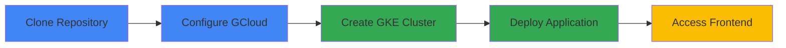

This guide will walk you through deploying Online Boutique to a Google Kubernetes Engine (GKE) cluster. The entire process takes approximately 10-15 minutes.

<Note>
  **New to Kubernetes?** This quickstart is designed for beginners. We'll guide you through each step with clear explanations.
</Note>

## Deployment Overview

Here's what we'll do:



## Prerequisites

Before you begin, ensure you have:

<Steps>
  <Step title="Google Cloud Project">
    A [Google Cloud project](https://cloud.google.com/resource-manager/docs/creating-managing-projects#creating_a_project) with billing enabled
  </Step>
  <Step title="Required Tools">
    - `gcloud` CLI installed and configured
    - `git` for cloning the repository
    - `kubectl` for Kubernetes management
  </Step>
  <Step title="Shell Environment">
    Access to a terminal with bash or similar shell
  </Step>
</Steps>

<Tip>
  Don't have these tools? Check out our [Prerequisites Guide](/getting-started/prerequisites) for detailed installation instructions.
</Tip>

## Step 1: Clone the Repository

First, clone the Online Boutique repository and navigate to the project directory:

```bash
git clone --depth 1 --branch v0 https://github.com/GoogleCloudPlatform/microservices-demo.git
cd microservices-demo/
```

<Info>
  The `--depth 1` flag skips downloading the full git history, making the clone faster.
</Info>

## Step 2: Configure Google Cloud

Set your Google Cloud project ID and region, then enable the required APIs:

```bash
export PROJECT_ID=<YOUR_PROJECT_ID>
export REGION=us-central1

gcloud services enable container.googleapis.com \
  --project=${PROJECT_ID}
```

<Warning>
  Replace `<YOUR_PROJECT_ID>` with your actual Google Cloud project ID. You can find this in the [Google Cloud Console](https://console.cloud.google.com/).
</Warning>

## Step 3: Create a GKE Cluster

Create an Autopilot GKE cluster. This will take a few minutes:

```bash
gcloud container clusters create-auto online-boutique \
  --project=${PROJECT_ID} \
  --region=${REGION}
```

<AccordionGroup>
  <Accordion title="What is GKE Autopilot?" icon="circle-question">
    GKE Autopilot is a mode of operation where Google manages the cluster infrastructure, including nodes, scaling, and security. It's perfect for getting started quickly without worrying about cluster configuration.
  </Accordion>
  
  <Accordion title="Why does this take a few minutes?" icon="clock">
    GKE is provisioning compute resources, configuring networking, and setting up the Kubernetes control plane. This typically takes 3-5 minutes.
  </Accordion>
</AccordionGroup>

## Step 4: Deploy Online Boutique

Deploy all microservices to your cluster using the pre-built manifests:

```bash
kubectl apply -f ./release/kubernetes-manifests.yaml
```

This command deploys:
- 11 microservices (frontend, cart, product catalog, etc.)
- 1 Redis instance for cart storage
- All necessary Kubernetes Services and Deployments

## Step 5: Wait for Pods to be Ready

Monitor the deployment status:

```bash
kubectl get pods
```

After a few minutes, you should see all pods in a `Running` state:

```
NAME                                     READY   STATUS    RESTARTS   AGE
adservice-76bdd69666-ckc5j               1/1     Running   0          2m58s
cartservice-66d497c6b7-dp5jr             1/1     Running   0          2m59s
checkoutservice-666c784bd6-4jd22         1/1     Running   0          3m1s
currencyservice-5d5d496984-4jmd7         1/1     Running   0          2m59s
emailservice-667457d9d6-75jcq            1/1     Running   0          3m2s
frontend-6b8d69b9fb-wjqdg                1/1     Running   0          3m1s
loadgenerator-665b5cd444-gwqdq           1/1     Running   0          3m
paymentservice-68596d6dd6-bf6bv          1/1     Running   0          3m
productcatalogservice-557d474574-888kr   1/1     Running   0          3m
recommendationservice-69c56b74d4-7z8r5   1/1     Running   0          3m1s
redis-cart-5f59546cdd-5jnqf              1/1     Running   0          2m58s
shippingservice-6ccc89f8fd-v686r         1/1     Running   0          2m58s
```

<Tip>
  If pods are in `Pending` or `ContainerCreating` status, wait a minute and check again. Initial image pulls can take time.
</Tip>

## Step 6: Access the Application

Get the external IP address of the frontend service:

```bash
kubectl get service frontend-external | awk '{print $4}'
```

<Note>
  It may take a minute for the external IP to be assigned. If you see `<pending>`, wait and run the command again.
</Note>

Once you have the IP address, open your browser and navigate to:

```
http://EXTERNAL_IP
```

🎉 **Congratulations!** You should now see the Online Boutique homepage.


## Step 7: Explore the Application

Try out these features:

<CardGroup cols={2}>
  <Card title="Browse Products" icon="store">
    Click on any product to view details and pricing
  </Card>
  <Card title="Add to Cart" icon="cart-shopping">
    Add items to your cart and view the cart page
  </Card>
  <Card title="Change Currency" icon="dollar-sign">
    Use the currency selector to see prices in different currencies
  </Card>
  <Card title="Complete Checkout" icon="credit-card">
    Go through the checkout process (no real payment required!)
  </Card>
</CardGroup>

## Verify the Deployment

Check that all services are running correctly:

```bash
# View all services
kubectl get services

# Check pod logs (example: frontend)
kubectl logs -l app=frontend

# View resource usage
kubectl top pods
```

## What's Next?

Now that you have Online Boutique running, explore these topics:

<CardGroup cols={2}>
  <Card title="Architecture Overview" icon="sitemap" href="/architecture/overview">
    Learn how the microservices work together
  </Card>
  <Card title="Explore Microservices" icon="cubes" href="/microservices/overview">
    Deep dive into each service's implementation
  </Card>
  <Card title="Local Development" icon="laptop-code" href="/development/setup">
    Set up a local development environment
  </Card>
  <Card title="Advanced Deployments" icon="gears" href="/deployment/overview">
    Try Helm, Terraform, or Kustomize deployments
  </Card>
</CardGroup>

## Cleanup

When you're done exploring, delete the GKE cluster to avoid charges:

```bash
gcloud container clusters delete online-boutique \
  --project=${PROJECT_ID} \
  --region=${REGION}
```

<Warning>
  This will permanently delete the cluster and all deployed applications. Make sure you've saved any important data first.
</Warning>

## Troubleshooting

<AccordionGroup>
  <Accordion title="Pods stuck in Pending state" icon="circle-exclamation">
    **Cause**: Insufficient cluster resources or image pull issues.
    
    **Solution**: 
    - Check pod events: `kubectl describe pod <pod-name>`
    - Verify cluster has enough resources: `kubectl get nodes`
    - Check for image pull errors in pod description
  </Accordion>
  
  <Accordion title="Cannot access external IP" icon="circle-exclamation">
    **Cause**: LoadBalancer service not yet provisioned or firewall rules.
    
    **Solution**:
    - Wait 2-3 minutes for LoadBalancer to provision
    - Verify service exists: `kubectl get service frontend-external`
    - Check GCP firewall rules allow traffic on port 80
  </Accordion>
  
  <Accordion title="Services failing to start" icon="circle-exclamation">
    **Cause**: Configuration errors or dependency issues.
    
    **Solution**:
    - Check pod logs: `kubectl logs <pod-name>`
    - Verify all pods are running: `kubectl get pods`
    - Check service endpoints: `kubectl get endpoints`
  </Accordion>
  
  <Accordion title="Permission denied errors" icon="circle-exclamation">
    **Cause**: Insufficient GCP permissions.
    
    **Solution**:
    - Verify you have Owner or Editor role on the project
    - Ensure billing is enabled
    - Check that required APIs are enabled
  </Accordion>
</AccordionGroup>

## Alternative Deployment Options

Looking for other ways to deploy Online Boutique?

<CardGroup cols={2}>
  <Card title="Local Kubernetes" icon="laptop" href="/getting-started/local-setup">
    Deploy to Minikube, Kind, or Docker Desktop
  </Card>
  <Card title="Helm Chart" icon="helm" href="/deployment/helm">
    Use Helm for customizable deployments
  </Card>
  <Card title="Terraform" icon="terraform" href="/deployment/terraform">
    Infrastructure as Code with Terraform
  </Card>
  <Card title="Kustomize" icon="layer-group" href="/deployment/kustomize">
    Customize deployments with Kustomize
  </Card>
</CardGroup>

## Need Help?

<Card title="Join the Discussion" icon="comments" href="https://github.com/GoogleCloudPlatform/microservices-demo/discussions">
  Ask questions and get help from the community
</Card>
