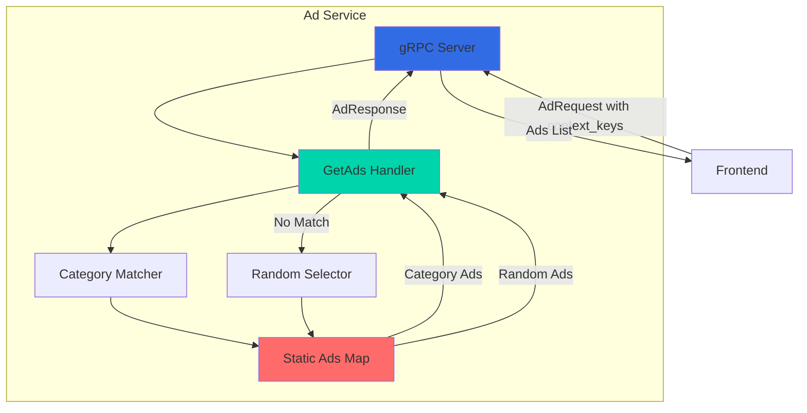
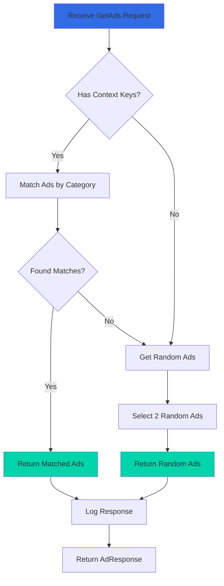

## Overview

The Ad Service is a Java-based microservice that provides contextual advertisements for the Online Boutique application. It serves targeted ads based on context keywords from the current page, using a simple category-based matching system. The service maintains a static catalog of ads mapped to product categories.

<CardGroup cols={2}>
  <Card title="Language" icon="java">
    Java 21 with gRPC
  </Card>
  <Card title="Port" icon="network-wired">
    9555
  </Card>
  <Card title="Dependencies" icon="link">
    None (standalone service)
  </Card>
  <Card title="Data Store" icon="database">
    In-memory ad catalog
  </Card>
</CardGroup>

## Service Architecture



## Key Features

<AccordionGroup>
  <Accordion title="Contextual Ad Targeting">
    - Matches ads to page context keywords
    - Category-based ad selection (clothing, accessories, footwear, etc.)
    - Returns up to 2 relevant ads per request
    - Falls back to random ads if no context match
  </Accordion>

  <Accordion title="Static Ad Catalog">
    - Pre-defined set of 7 product ads
    - Mapped to categories: clothing, accessories, footwear, hair, decor, kitchen
    - Includes redirect URLs and promotional text
    - No external ad network integration
  </Accordion>

  <Accordion title="Random Ad Serving">
    - Serves random ads when no context provided
    - Serves random ads when context doesn't match any category
    - Ensures ads are always displayed
  </Accordion>

  <Accordion title="High Performance">
    - In-memory ad storage
    - No database queries
    - Sub-millisecond response times
    - Stateless operation
  </Accordion>
</AccordionGroup>


## gRPC API

### Service Definition

```protobuf
service AdService {
    rpc GetAds(AdRequest) returns (AdResponse) {}
}
```

### Messages

<Tabs>
  <Tab title="AdRequest">
    ```protobuf
    message AdRequest {
        repeated string context_keys = 1;
    }
    ```
    
    **Fields:**
    - `context_keys`: List of keywords describing the current page context (e.g., ["clothing", "accessories"])
  </Tab>

  <Tab title="AdResponse">
    ```protobuf
    message AdResponse {
        repeated Ad ads = 1;
    }
    
    message Ad {
        string redirect_url = 1;
        string text = 2;
    }
    ```
    
    **Fields:**
    - `ads`: List of ads to display (up to 2)
    - `redirect_url`: URL to navigate to when ad is clicked
    - `text`: Advertisement text to display
  </Tab>
</Tabs>

### Methods

#### GetAds

Returns contextually relevant advertisements based on provided keywords.

<CodeGroup>
```java Request Example
AdRequest request = AdRequest.newBuilder()
    .addContextKeys("clothing")
    .addContextKeys("accessories")
    .build();

AdResponse response = stub.getAds(request);
```

```java Response Example
AdResponse.newBuilder()
    .addAds(Ad.newBuilder()
        .setRedirectUrl("/product/66VCHSJNUP")
        .setText("Tank top for sale. 20% off.")
        .build())
    .addAds(Ad.newBuilder()
        .setRedirectUrl("/product/1YMWWN1N4O")
        .setText("Watch for sale. Buy one, get second kit for free")
        .build())
    .build();
```

```java Empty Context Example
// Request with no context keys
AdRequest request = AdRequest.newBuilder().build();

// Returns 2 random ads
AdResponse response = stub.getAds(request);
```
</CodeGroup>

## Configuration

### Environment Variables

| Variable | Description | Default | Required |
|----------|-------------|---------|----------|
| `PORT` | gRPC server port | `9555` | No |
| `DISABLE_STATS` | Disable statistics collection | `false` | No |
| `DISABLE_TRACING` | Disable OpenTelemetry tracing | `false` | No |

### Example Configuration

```yaml
env:
  - name: PORT
    value: "9555"
  - name: DISABLE_STATS
    value: "1"
  - name: DISABLE_TRACING
    value: "1"
```

## Implementation Details

### Ad Catalog

The service maintains a static catalog of 7 ads mapped to categories:

<Tabs>
  <Tab title="Clothing">
    ```java
    Ad tankTop = Ad.newBuilder()
        .setRedirectUrl("/product/66VCHSJNUP")
        .setText("Tank top for sale. 20% off.")
        .build();
    ```
  </Tab>

  <Tab title="Accessories">
    ```java
    Ad watch = Ad.newBuilder()
        .setRedirectUrl("/product/1YMWWN1N4O")
        .setText("Watch for sale. Buy one, get second kit for free")
        .build();
    ```
  </Tab>

  <Tab title="Footwear">
    ```java
    Ad loafers = Ad.newBuilder()
        .setRedirectUrl("/product/L9ECAV7KIM")
        .setText("Loafers for sale. Buy one, get second one for free")
        .build();
    ```
  </Tab>

  <Tab title="Hair">
    ```java
    Ad hairdryer = Ad.newBuilder()
        .setRedirectUrl("/product/2ZYFJ3GM2N")
        .setText("Hairdryer for sale. 50% off.")
        .build();
    ```
  </Tab>

  <Tab title="Decor">
    ```java
    Ad candleHolder = Ad.newBuilder()
        .setRedirectUrl("/product/0PUK6V6EV0")
        .setText("Candle holder for sale. 30% off.")
        .build();
    ```
  </Tab>

  <Tab title="Kitchen">
    ```java
    Ad bambooGlassJar = Ad.newBuilder()
        .setRedirectUrl("/product/9SIQT8TOJO")
        .setText("Bamboo glass jar for sale. 10% off.")
        .build();
    
    Ad mug = Ad.newBuilder()
        .setRedirectUrl("/product/6E92ZMYYFZ")
        .setText("Mug for sale. Buy two, get third one for free")
        .build();
    ```
  </Tab>
</Tabs>

### Ad Selection Logic



### Core Implementation

<Tabs>
  <Tab title="GetAds Handler">
    Main request handler that processes ad requests.
    
    ```java
    @Override
    public void getAds(AdRequest req, StreamObserver<AdResponse> responseObserver) {
        try {
            List<Ad> allAds = new ArrayList<>();
            logger.info("received ad request (context_words=" + 
                       req.getContextKeysList() + ")");
            
            if (req.getContextKeysCount() > 0) {
                // Match ads by context
                for (int i = 0; i < req.getContextKeysCount(); i++) {
                    Collection<Ad> ads = service.getAdsByCategory(
                        req.getContextKeys(i)
                    );
                    allAds.addAll(ads);
                }
            } else {
                // No context, serve random ads
                allAds = service.getRandomAds();
            }
            
            if (allAds.isEmpty()) {
                // No matches, serve random ads
                allAds = service.getRandomAds();
            }
            
            AdResponse reply = AdResponse.newBuilder()
                .addAllAds(allAds)
                .build();
            responseObserver.onNext(reply);
            responseObserver.onCompleted();
        } catch (StatusRuntimeException e) {
            logger.log(Level.WARN, "GetAds Failed with status {}", e.getStatus());
            responseObserver.onError(e);
        }
    }
    ```
  </Tab>

  <Tab title="Category Matching">
    Retrieves ads for a specific category.
    
    ```java
    private static final ImmutableListMultimap<String, Ad> adsMap = createAdsMap();
    
    private Collection<Ad> getAdsByCategory(String category) {
        return adsMap.get(category);
    }
    
    private static ImmutableListMultimap<String, Ad> createAdsMap() {
        return ImmutableListMultimap.<String, Ad>builder()
            .putAll("clothing", tankTop)
            .putAll("accessories", watch)
            .putAll("footwear", loafers)
            .putAll("hair", hairdryer)
            .putAll("decor", candleHolder)
            .putAll("kitchen", bambooGlassJar, mug)
            .build();
    }
    ```
  </Tab>

  <Tab title="Random Selection">
    Selects random ads when no context match.
    
    ```java
    private static final Random random = new Random();
    private static int MAX_ADS_TO_SERVE = 2;
    
    private List<Ad> getRandomAds() {
        List<Ad> ads = new ArrayList<>(MAX_ADS_TO_SERVE);
        Collection<Ad> allAds = adsMap.values();
        
        for (int i = 0; i < MAX_ADS_TO_SERVE; i++) {
            ads.add(Iterables.get(allAds, random.nextInt(allAds.size())));
        }
        
        return ads;
    }
    ```
  </Tab>
</Tabs>

## Dependencies

### Gradle Dependencies

```groovy
dependencies {
    implementation "com.google.api.grpc:proto-google-common-protos:2.65.0"
    implementation "javax.annotation:javax.annotation-api:1.3.2"
    implementation "io.grpc:grpc-protobuf:1.78.0"
    implementation "io.grpc:grpc-stub:1.78.0"
    implementation "io.grpc:grpc-netty:1.78.0"
    implementation "io.grpc:grpc-services:1.78.0"
    implementation "io.grpc:grpc-census:1.78.0"
    implementation "org.apache.logging.log4j:log4j-core:2.25.3"
    implementation "com.google.protobuf:protobuf-java:4.33.4"
    
    runtimeOnly "com.fasterxml.jackson.core:jackson-core:2.21.0"
    runtimeOnly "com.fasterxml.jackson.core:jackson-databind:2.21.0"
    runtimeOnly "io.netty:netty-tcnative-boringssl-static:2.0.74.Final"
}
```

<Accordion title="Dependency Descriptions">
- **io.grpc:grpc-\***: gRPC framework for Java
- **com.google.protobuf**: Protocol Buffers runtime
- **org.apache.logging.log4j**: Logging framework
- **io.netty**: Network application framework
- **com.fasterxml.jackson**: JSON processing
</Accordion>

## Testing

### Manual Testing

```bash
# Build the service
cd src/adservice
./gradlew build

# Run the service
./gradlew run

# Test with grpcurl
grpcurl -plaintext \
  -d '{
    "context_keys": ["clothing", "accessories"]
  }' \
  localhost:9555 \
  hipstershop.AdService/GetAds
```

### Unit Testing

```java
import org.junit.Test;
import static org.junit.Assert.*;

public class AdServiceTest {
    
    @Test
    public void testGetAdsByCategory() {
        AdService service = AdService.getInstance();
        Collection<Ad> clothingAds = service.getAdsByCategory("clothing");
        
        assertNotNull(clothingAds);
        assertFalse(clothingAds.isEmpty());
        assertTrue(clothingAds.stream()
            .anyMatch(ad -> ad.getText().contains("Tank top")));
    }
    
    @Test
    public void testGetRandomAds() {
        AdService service = AdService.getInstance();
        List<Ad> randomAds = service.getRandomAds();
        
        assertNotNull(randomAds);
        assertEquals(2, randomAds.size());
    }
    
    @Test
    public void testGetAdsWithContext() {
        AdRequest request = AdRequest.newBuilder()
            .addContextKeys("kitchen")
            .build();
        
        // Should return kitchen-related ads
        // (bamboo glass jar and/or mug)
    }
}
```

### Test Scenarios

<Steps>
  <Step title="Context Match">
    Request ads with "clothing" context - should return tank top ad
  </Step>
  <Step title="Multiple Categories">
    Request with ["clothing", "kitchen"] - should return ads from both categories
  </Step>
  <Step title="No Context">
    Request with empty context_keys - should return 2 random ads
  </Step>
  <Step title="Unknown Category">
    Request with "unknown_category" - should return 2 random ads
  </Step>
</Steps>

## Deployment

### Kubernetes Deployment

```yaml
apiVersion: apps/v1
kind: Deployment
metadata:
  name: adservice
spec:
  selector:
    matchLabels:
      app: adservice
  template:
    metadata:
      labels:
        app: adservice
    spec:
      containers:
      - name: server
        image: adservice
        ports:
        - containerPort: 9555
        env:
        - name: PORT
          value: "9555"
        - name: DISABLE_STATS
          value: "1"
        - name: DISABLE_TRACING
          value: "1"
        resources:
          requests:
            cpu: 200m
            memory: 180Mi
          limits:
            cpu: 300m
            memory: 300Mi
        livenessProbe:
          grpc:
            port: 9555
          initialDelaySeconds: 10
        readinessProbe:
          grpc:
            port: 9555
          initialDelaySeconds: 5
```

### Docker Build

```dockerfile
FROM gradle:8.5-jdk21 AS builder

WORKDIR /app
COPY build.gradle settings.gradle ./
COPY src ./src

RUN gradle build --no-daemon

FROM openjdk:21-slim

WORKDIR /app
COPY --from=builder /app/build/libs/*.jar app.jar

EXPOSE 9555

ENTRYPOINT ["java", "-jar", "app.jar"]
```

## Monitoring

### Key Metrics

<CardGroup cols={2}>
  <Card title="Request Rate" icon="chart-line">
    Number of ad requests per second
  </Card>
  <Card title="Latency" icon="clock">
    P50, P95, P99 response times (should be <5ms)
  </Card>
  <Card title="Context Match Rate" icon="bullseye">
    Percentage of requests with context matches
  </Card>
  <Card title="Random Ad Rate" icon="shuffle">
    Percentage of requests serving random ads
  </Card>
</CardGroup>

### Log Examples

```
INFO: received ad request (context_words=[clothing, accessories])
INFO: Ad Service started, listening on 9555
```

## Performance Characteristics

<CardGroup cols={2}>
  <Card title="Response Time" icon="gauge-high">
    Typical: 1-3ms
    P99: <10ms
  </Card>
  <Card title="Throughput" icon="rocket">
    Can handle 5000+ req/s per instance
  </Card>
  <Card title="Memory Usage" icon="memory">
    Typical: 150-200 MB
    Peak: <300 MB
  </Card>
  <Card title="CPU Usage" icon="microchip">
    Typical: <5%
    Peak: <20%
  </Card>
</CardGroup>

## Future Enhancements

<Warning>
This is a simplified demo implementation. Production ad services would require significant enhancements.
</Warning>

### Potential Improvements

1. **Dynamic Ad Management**
   - Admin interface for ad creation/editing
   - Database-backed ad storage
   - Real-time ad updates
   - A/B testing framework

2. **Advanced Targeting**
   - User behavior tracking
   - Demographic targeting
   - Geographic targeting
   - Time-based targeting
   - Conversion tracking

3. **Ad Network Integration**
   - Google AdSense integration
   - Programmatic advertising
   - Real-time bidding (RTB)
   - Multiple ad networks

4. **Performance Optimization**
   - Ad caching strategies
   - CDN integration
   - Lazy loading
   - Ad preloading

5. **Analytics and Reporting**
   - Click-through rate (CTR) tracking
   - Impression tracking
   - Revenue reporting
   - Performance dashboards

## Troubleshooting

<AccordionGroup>
  <Accordion title="Service fails to start">
    **Symptoms:** Service crashes on startup
    
    **Solutions:**
    - Verify Java 21 is installed
    - Check PORT environment variable
    - Ensure port 9555 is not in use
    - Review Gradle build for errors
    - Check logs for specific error messages
  </Accordion>

  <Accordion title="Always returns random ads">
    **Symptoms:** Context keys not matching any ads
    
    **Solutions:**
    - Verify context keys match defined categories
    - Check adsMap initialization
    - Review category names (case-sensitive)
    - Ensure ads are properly mapped to categories
  </Accordion>

  <Accordion title="High memory usage">
    **Symptoms:** Service consuming excessive memory
    
    **Solutions:**
    - Check for memory leaks
    - Review JVM heap settings
    - Monitor garbage collection
    - Consider reducing MAX_ADS_TO_SERVE
  </Accordion>

  <Accordion title="Slow response times">
    **Symptoms:** High latency for ad requests
    
    **Solutions:**
    - Check CPU usage
    - Review garbage collection pauses
    - Verify no blocking operations
    - Check network connectivity
    - Monitor JVM performance
  </Accordion>
</AccordionGroup>

## Related Services

<CardGroup cols={2}>
  <Card title="Frontend" icon="window-maximize" href="/microservices/frontend">
    Displays ads to users on product pages
  </Card>
  <Card title="Product Catalog" icon="box" href="/microservices/productcatalogservice">
    Provides product categories for ad targeting
  </Card>
</CardGroup>

## Additional Resources

- [gRPC Java Documentation](https://grpc.io/docs/languages/java/)
- [Gradle Build Tool](https://gradle.org/guides/)
- [Google Guava Collections](https://github.com/google/guava/wiki/CollectionUtilitiesExplained)
- [Log4j2 Documentation](https://logging.apache.org/log4j/2.x/)
