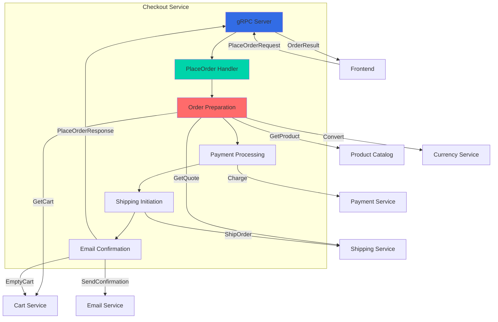
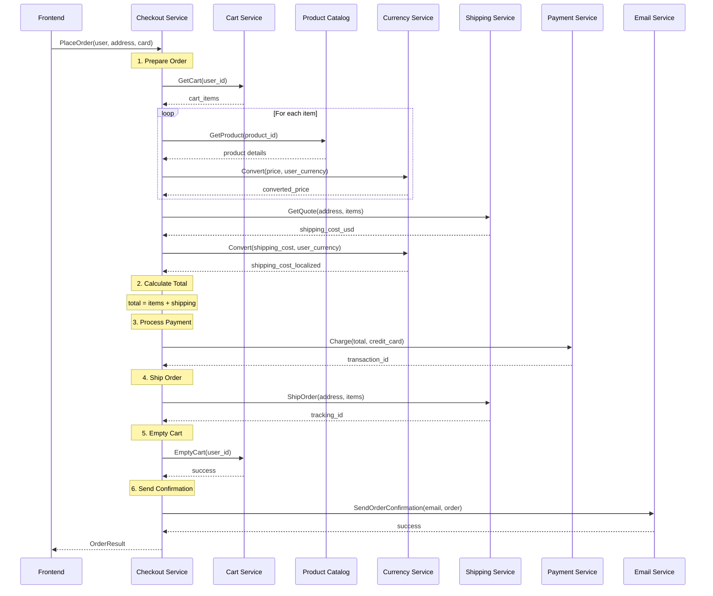
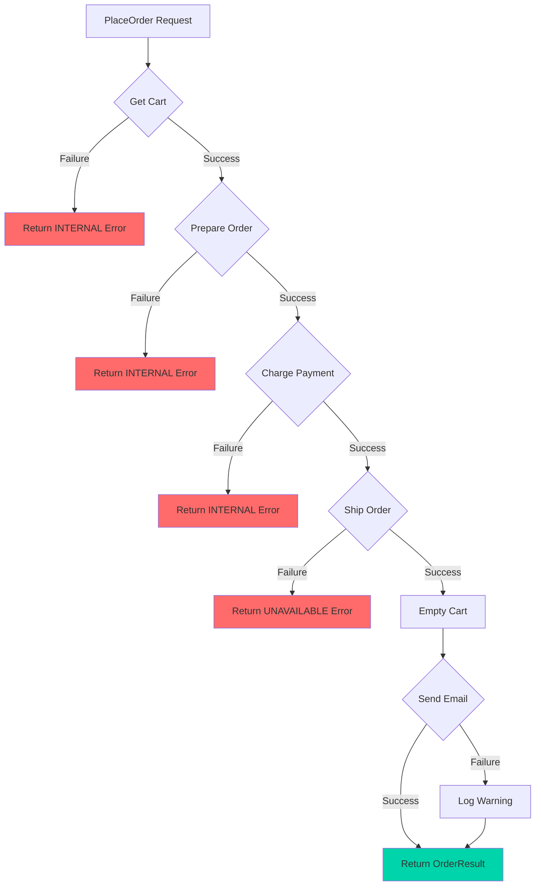

## Overview

The Checkout Service is a Go-based microservice that orchestrates the entire order placement workflow in the Online Boutique application. It acts as the central coordinator, calling multiple downstream services to complete an order: retrieving cart contents, calculating shipping costs, converting currencies, charging payment, initiating shipment, and sending confirmation emails.

<CardGroup cols={2}>
  <Card title="Language" icon="golang">
    Go with gRPC
  </Card>
  <Card title="Port" icon="network-wired">
    5050
  </Card>
  <Card title="Dependencies" icon="link">
    6 services (Cart, Product Catalog, Currency, Shipping, Payment, Email)
  </Card>
  <Card title="Data Store" icon="database">
    None (stateless orchestrator)
  </Card>
</CardGroup>

## Service Architecture




## Key Features

<AccordionGroup>
  <Accordion title="Order Orchestration">
    - Coordinates 6 downstream services in sequence
    - Handles complex multi-step transaction flow
    - Manages service dependencies and error propagation
    - Generates unique order IDs using UUID
  </Accordion>

  <Accordion title="Transaction Management">
    - Retrieves user cart contents
    - Calculates total cost with shipping
    - Processes payment through Payment Service
    - Initiates shipping and generates tracking ID
    - Empties cart after successful order
    - Sends order confirmation email
  </Accordion>

  <Accordion title="Currency Handling">
    - Converts all prices to user's preferred currency
    - Handles shipping cost conversion
    - Calculates order totals in user currency
    - Supports multi-currency transactions
  </Accordion>

  <Accordion title="Error Handling">
    - Validates cart contents before processing
    - Handles payment failures gracefully
    - Manages shipping service unavailability
    - Logs email confirmation failures (non-blocking)
    - Returns detailed error messages via gRPC status codes
  </Accordion>

  <Accordion title="Observability">
    - Structured JSON logging with logrus
    - OpenTelemetry distributed tracing
    - Google Cloud Profiler integration
    - Health check endpoint
    - Detailed request/response logging
  </Accordion>
</AccordionGroup>

## gRPC API

### Service Definition

```protobuf
service CheckoutService {
    rpc PlaceOrder(PlaceOrderRequest) returns (PlaceOrderResponse) {}
}
```

### Messages

<Tabs>
  <Tab title="PlaceOrderRequest">
    ```protobuf
    message PlaceOrderRequest {
        string user_id = 1;
        string user_currency = 2;
        Address address = 3;
        string email = 5;
        CreditCardInfo credit_card = 6;
    }
    
    message Address {
        string street_address = 1;
        string city = 2;
        string state = 3;
        string country = 4;
        int32 zip_code = 5;
    }
    
    message CreditCardInfo {
        string credit_card_number = 1;
        int32 credit_card_cvv = 2;
        int32 credit_card_expiration_year = 3;
        int32 credit_card_expiration_month = 4;
    }
    ```
    
    **Fields:**
    - `user_id`: Unique identifier for the user
    - `user_currency`: Preferred currency code (e.g., "USD", "EUR")
    - `address`: Shipping address
    - `email`: Email address for order confirmation
    - `credit_card`: Payment card information
  </Tab>

  <Tab title="PlaceOrderResponse">
    ```protobuf
    message PlaceOrderResponse {
        OrderResult order = 1;
    }
    
    message OrderResult {
        string order_id = 1;
        string shipping_tracking_id = 2;
        Money shipping_cost = 3;
        Address shipping_address = 4;
        repeated OrderItem items = 5;
    }
    
    message OrderItem {
        CartItem item = 1;
        Money cost = 2;
    }
    ```
    
    **Fields:**
    - `order`: Complete order details including ID, tracking, costs, and items
  </Tab>
</Tabs>


### Methods

#### PlaceOrder

Processes a complete order from cart to confirmation.

<CodeGroup>
```go Request Example
request := &pb.PlaceOrderRequest{
    UserId:       "user-123",
    UserCurrency: "USD",
    Address: &pb.Address{
        StreetAddress: "1600 Amphitheatre Parkway",
        City:          "Mountain View",
        State:         "CA",
        Country:       "United States",
        ZipCode:       94043,
    },
    Email: "customer@example.com",
    CreditCard: &pb.CreditCardInfo{
        CreditCardNumber:          "4432-8015-6152-0454",
        CreditCardCvv:             672,
        CreditCardExpirationYear:  2025,
        CreditCardExpirationMonth: 12,
    },
}

response, err := client.PlaceOrder(ctx, request)
```

```go Response Example
&pb.PlaceOrderResponse{
    Order: &pb.OrderResult{
        OrderId:            "550e8400-e29b-41d4-a716-446655440000",
        ShippingTrackingId: "AB-5123-34567890",
        ShippingCost: &pb.Money{
            CurrencyCode: "USD",
            Units:        8,
            Nanos:        990000000,
        },
        ShippingAddress: &pb.Address{
            StreetAddress: "1600 Amphitheatre Parkway",
            City:          "Mountain View",
            State:         "CA",
            Country:       "United States",
            ZipCode:       94043,
        },
        Items: []*pb.OrderItem{
            {
                Item: &pb.CartItem{
                    ProductId: "OLJCESPC7Z",
                    Quantity:  1,
                },
                Cost: &pb.Money{
                    CurrencyCode: "USD",
                    Units:        35,
                    Nanos:        0,
                },
            },
        },
    },
}
```
</CodeGroup>

## Configuration

### Environment Variables

| Variable | Description | Default | Required |
|----------|-------------|---------|----------|
| `PORT` | gRPC server port | `5050` | No |
| `PRODUCT_CATALOG_SERVICE_ADDR` | Product Catalog service address | - | Yes |
| `CART_SERVICE_ADDR` | Cart service address | - | Yes |
| `CURRENCY_SERVICE_ADDR` | Currency service address | - | Yes |
| `SHIPPING_SERVICE_ADDR` | Shipping service address | - | Yes |
| `PAYMENT_SERVICE_ADDR` | Payment service address | - | Yes |
| `EMAIL_SERVICE_ADDR` | Email service address | - | Yes |
| `ENABLE_TRACING` | Enable OpenTelemetry tracing | `0` | No |
| `ENABLE_PROFILER` | Enable Google Cloud Profiler | `0` | No |
| `COLLECTOR_SERVICE_ADDR` | OpenTelemetry collector address | - | If tracing enabled |

### Example Configuration

```yaml
env:
  - name: PORT
    value: "5050"
  - name: PRODUCT_CATALOG_SERVICE_ADDR
    value: "productcatalogservice:3550"
  - name: CART_SERVICE_ADDR
    value: "cartservice:7070"
  - name: CURRENCY_SERVICE_ADDR
    value: "currencyservice:7000"
  - name: SHIPPING_SERVICE_ADDR
    value: "shippingservice:50051"
  - name: PAYMENT_SERVICE_ADDR
    value: "paymentservice:50051"
  - name: EMAIL_SERVICE_ADDR
    value: "emailservice:8080"
  - name: ENABLE_TRACING
    value: "1"
  - name: COLLECTOR_SERVICE_ADDR
    value: "otelcol:4317"
```


## Implementation Details

### Order Processing Flow



### Core Components

<Tabs>
  <Tab title="PlaceOrder Handler">
    Main order processing logic that orchestrates all steps.
    
    ```go
    func (cs *checkoutService) PlaceOrder(ctx context.Context, 
                                          req *pb.PlaceOrderRequest) (*pb.PlaceOrderResponse, error) {
        log.Infof("[PlaceOrder] user_id=%q user_currency=%q", 
                  req.UserId, req.UserCurrency)

        // Generate unique order ID
        orderID, err := uuid.NewUUID()
        if err != nil {
            return nil, status.Errorf(codes.Internal, 
                                     "failed to generate order uuid")
        }

        // Prepare order items and get shipping quote
        prep, err := cs.prepareOrderItemsAndShippingQuoteFromCart(
            ctx, req.UserId, req.UserCurrency, req.Address)
        if err != nil {
            return nil, status.Errorf(codes.Internal, err.Error())
        }

        // Calculate total cost
        total := pb.Money{
            CurrencyCode: req.UserCurrency,
            Units: 0,
            Nanos: 0,
        }
        total = money.Must(money.Sum(total, *prep.shippingCostLocalized))
        for _, it := range prep.orderItems {
            multPrice := money.MultiplySlow(*it.Cost, 
                                           uint32(it.GetItem().GetQuantity()))
            total = money.Must(money.Sum(total, multPrice))
        }

        // Charge payment card
        txID, err := cs.chargeCard(ctx, &total, req.CreditCard)
        if err != nil {
            return nil, status.Errorf(codes.Internal, 
                                     "failed to charge card: %+v", err)
        }
        log.Infof("payment went through (transaction_id: %s)", txID)

        // Ship the order
        shippingTrackingID, err := cs.shipOrder(ctx, req.Address, prep.cartItems)
        if err != nil {
            return nil, status.Errorf(codes.Unavailable, 
                                     "shipping error: %+v", err)
        }

        // Empty user's cart
        _ = cs.emptyUserCart(ctx, req.UserId)

        // Create order result
        orderResult := &pb.OrderResult{
            OrderId:            orderID.String(),
            ShippingTrackingId: shippingTrackingID,
            ShippingCost:       prep.shippingCostLocalized,
            ShippingAddress:    req.Address,
            Items:              prep.orderItems,
        }

        // Send confirmation email (non-blocking failure)
        if err := cs.sendOrderConfirmation(ctx, req.Email, orderResult); err != nil {
            log.Warnf("failed to send order confirmation to %q: %+v", 
                     req.Email, err)
        } else {
            log.Infof("order confirmation email sent to %q", req.Email)
        }

        return &pb.PlaceOrderResponse{Order: orderResult}, nil
    }
    ```
  </Tab>

  <Tab title="Order Preparation">
    Prepares order items with pricing and shipping quote.
    
    ```go
    type orderPrep struct {
        orderItems            []*pb.OrderItem
        cartItems             []*pb.CartItem
        shippingCostLocalized *pb.Money
    }

    func (cs *checkoutService) prepareOrderItemsAndShippingQuoteFromCart(
        ctx context.Context, userID, userCurrency string, 
        address *pb.Address) (orderPrep, error) {
        
        var out orderPrep
        
        // Get user's cart
        cartItems, err := cs.getUserCart(ctx, userID)
        if err != nil {
            return out, fmt.Errorf("cart failure: %+v", err)
        }
        
        // Prepare order items with converted prices
        orderItems, err := cs.prepOrderItems(ctx, cartItems, userCurrency)
        if err != nil {
            return out, fmt.Errorf("failed to prepare order: %+v", err)
        }
        
        // Get shipping quote in USD
        shippingUSD, err := cs.quoteShipping(ctx, address, cartItems)
        if err != nil {
            return out, fmt.Errorf("shipping quote failure: %+v", err)
        }
        
        // Convert shipping cost to user currency
        shippingPrice, err := cs.convertCurrency(ctx, shippingUSD, userCurrency)
        if err != nil {
            return out, fmt.Errorf("failed to convert shipping cost: %+v", err)
        }

        out.shippingCostLocalized = shippingPrice
        out.cartItems = cartItems
        out.orderItems = orderItems
        return out, nil
    }
    ```
  </Tab>

  <Tab title="Service Clients">
    Helper methods for calling downstream services.
    
    ```go
    func (cs *checkoutService) getUserCart(ctx context.Context, 
                                           userID string) ([]*pb.CartItem, error) {
        cart, err := pb.NewCartServiceClient(cs.cartSvcConn).
            GetCart(ctx, &pb.GetCartRequest{UserId: userID})
        if err != nil {
            return nil, fmt.Errorf("failed to get user cart: %+v", err)
        }
        return cart.GetItems(), nil
    }

    func (cs *checkoutService) convertCurrency(ctx context.Context, 
                                               from *pb.Money, 
                                               toCurrency string) (*pb.Money, error) {
        result, err := pb.NewCurrencyServiceClient(cs.currencySvcConn).
            Convert(ctx, &pb.CurrencyConversionRequest{
                From:   from,
                ToCode: toCurrency,
            })
        if err != nil {
            return nil, fmt.Errorf("failed to convert currency: %+v", err)
        }
        return result, nil
    }

    func (cs *checkoutService) chargeCard(ctx context.Context, 
                                          amount *pb.Money, 
                                          paymentInfo *pb.CreditCardInfo) (string, error) {
        paymentResp, err := pb.NewPaymentServiceClient(cs.paymentSvcConn).
            Charge(ctx, &pb.ChargeRequest{
                Amount:     amount,
                CreditCard: paymentInfo,
            })
        if err != nil {
            return "", fmt.Errorf("could not charge the card: %+v", err)
        }
        return paymentResp.GetTransactionId(), nil
    }

    func (cs *checkoutService) shipOrder(ctx context.Context, 
                                         address *pb.Address, 
                                         items []*pb.CartItem) (string, error) {
        resp, err := pb.NewShippingServiceClient(cs.shippingSvcConn).
            ShipOrder(ctx, &pb.ShipOrderRequest{
                Address: address,
                Items:   items,
            })
        if err != nil {
            return "", fmt.Errorf("shipment failed: %+v", err)
        }
        return resp.GetTrackingId(), nil
    }
    ```
  </Tab>
</Tabs>


## Dependencies

### Go Modules

```go
require (
    cloud.google.com/go/profiler v0.4.3
    github.com/google/uuid v1.6.0
    github.com/pkg/errors v0.9.1
    github.com/sirupsen/logrus v1.9.4
    go.opentelemetry.io/contrib/instrumentation/google.golang.org/grpc/otelgrpc v0.64.0
    go.opentelemetry.io/otel v1.39.0
    go.opentelemetry.io/otel/exporters/otlp/otlptrace/otlptracegrpc v1.39.0
    go.opentelemetry.io/otel/sdk v1.39.0
    google.golang.org/grpc v1.78.0
    google.golang.org/protobuf v1.36.11
)
```

<Accordion title="Package Descriptions">
- **google.golang.org/grpc**: gRPC framework for Go
- **github.com/google/uuid**: UUID generation for order IDs
- **github.com/sirupsen/logrus**: Structured logger
- **github.com/pkg/errors**: Enhanced error handling
- **go.opentelemetry.io/\***: Distributed tracing instrumentation
- **cloud.google.com/go/profiler**: Google Cloud Profiler client
</Accordion>

### Service Dependencies

The Checkout Service depends on 6 downstream services:

<CardGroup cols={3}>
  <Card title="Cart Service" icon="shopping-cart">
    Retrieves user cart and empties it after order
  </Card>
  <Card title="Product Catalog" icon="box">
    Gets product details and prices
  </Card>
  <Card title="Currency Service" icon="dollar-sign">
    Converts prices to user currency
  </Card>
  <Card title="Shipping Service" icon="truck">
    Calculates shipping cost and initiates shipment
  </Card>
  <Card title="Payment Service" icon="credit-card">
    Processes credit card payment
  </Card>
  <Card title="Email Service" icon="envelope">
    Sends order confirmation email
  </Card>
</CardGroup>

## Testing

### Manual Testing

```bash
# Install grpcurl
go install github.com/fullstorydev/grpcurl/cmd/grpcurl@latest

# Test PlaceOrder
grpcurl -plaintext \
  -d '{
    "user_id": "user-123",
    "user_currency": "USD",
    "address": {
      "street_address": "1600 Amphitheatre Parkway",
      "city": "Mountain View",
      "state": "CA",
      "country": "United States",
      "zip_code": 94043
    },
    "email": "customer@example.com",
    "credit_card": {
      "credit_card_number": "4432-8015-6152-0454",
      "credit_card_cvv": 672,
      "credit_card_expiration_year": 2025,
      "credit_card_expiration_month": 12
    }
  }' \
  localhost:5050 \
  hipstershop.CheckoutService/PlaceOrder
```

### Integration Testing

```go
func TestPlaceOrder(t *testing.T) {
    // Setup test environment with mock services
    ctx := context.Background()
    
    // Create test request
    req := &pb.PlaceOrderRequest{
        UserId:       "test-user",
        UserCurrency: "USD",
        Address: &pb.Address{
            StreetAddress: "123 Test St",
            City:          "Test City",
            State:         "TS",
            Country:       "Test Country",
            ZipCode:       12345,
        },
        Email: "test@example.com",
        CreditCard: &pb.CreditCardInfo{
            CreditCardNumber:          "4432-8015-6152-0454",
            CreditCardCvv:             123,
            CreditCardExpirationYear:  2025,
            CreditCardExpirationMonth: 12,
        },
    }
    
    // Call PlaceOrder
    resp, err := client.PlaceOrder(ctx, req)
    
    // Verify response
    assert.NoError(t, err)
    assert.NotEmpty(t, resp.Order.OrderId)
    assert.NotEmpty(t, resp.Order.ShippingTrackingId)
    assert.Equal(t, "USD", resp.Order.ShippingCost.CurrencyCode)
}
```

### Test Scenarios

<Steps>
  <Step title="Successful Order">
    Place order with valid cart, address, and payment - should return order ID and tracking
  </Step>
  <Step title="Empty Cart">
    Attempt order with empty cart - should fail with appropriate error
  </Step>
  <Step title="Invalid Payment">
    Use invalid credit card - should fail at payment step
  </Step>
  <Step title="Currency Conversion">
    Place order in different currency (EUR, JPY) - prices should be converted correctly
  </Step>
  <Step title="Service Unavailable">
    Simulate downstream service failure - should return appropriate error code
  </Step>
</Steps>

## Deployment

### Kubernetes Deployment

```yaml
apiVersion: apps/v1
kind: Deployment
metadata:
  name: checkoutservice
spec:
  selector:
    matchLabels:
      app: checkoutservice
  template:
    metadata:
      labels:
        app: checkoutservice
    spec:
      containers:
      - name: server
        image: checkoutservice
        ports:
        - containerPort: 5050
        env:
        - name: PORT
          value: "5050"
        - name: PRODUCT_CATALOG_SERVICE_ADDR
          value: "productcatalogservice:3550"
        - name: CART_SERVICE_ADDR
          value: "cartservice:7070"
        - name: CURRENCY_SERVICE_ADDR
          value: "currencyservice:7000"
        - name: SHIPPING_SERVICE_ADDR
          value: "shippingservice:50051"
        - name: PAYMENT_SERVICE_ADDR
          value: "paymentservice:50051"
        - name: EMAIL_SERVICE_ADDR
          value: "emailservice:8080"
        - name: ENABLE_TRACING
          value: "1"
        - name: COLLECTOR_SERVICE_ADDR
          value: "otelcol:4317"
        resources:
          requests:
            cpu: 100m
            memory: 64Mi
          limits:
            cpu: 200m
            memory: 128Mi
        livenessProbe:
          grpc:
            port: 5050
          initialDelaySeconds: 10
        readinessProbe:
          grpc:
            port: 5050
          initialDelaySeconds: 5
```

### Docker Build

```dockerfile
FROM golang:1.25-alpine AS builder

WORKDIR /app
COPY go.* ./
RUN go mod download

COPY . .
RUN go build -o /checkoutservice .

FROM alpine:3.19
RUN apk add --no-cache ca-certificates

COPY --from=builder /checkoutservice /checkoutservice

EXPOSE 5050
ENTRYPOINT ["/checkoutservice"]
```


## Monitoring

### Key Metrics

<CardGroup cols={2}>
  <Card title="Order Rate" icon="chart-line">
    Number of orders placed per second
  </Card>
  <Card title="Success Rate" icon="check-circle">
    Percentage of successful order completions
  </Card>
  <Card title="Latency" icon="clock">
    P50, P95, P99 order processing times
  </Card>
  <Card title="Error Rate" icon="triangle-exclamation">
    Failed orders by error type and service
  </Card>
</CardGroup>

### Service-Specific Metrics

<Tabs>
  <Tab title="Downstream Calls">
    - Cart Service call latency and errors
    - Product Catalog call latency and errors
    - Currency Service call latency and errors
    - Shipping Service call latency and errors
    - Payment Service call latency and errors
    - Email Service call latency and errors
  </Tab>
  
  <Tab title="Business Metrics">
    - Total order value (by currency)
    - Average order value
    - Orders per user
    - Cart abandonment rate
    - Payment failure rate
    - Shipping cost distribution
  </Tab>
</Tabs>

### Log Examples

```json
{
  "timestamp": "2024-02-13T10:30:45.123Z",
  "severity": "info",
  "message": "[PlaceOrder] user_id=\"user-123\" user_currency=\"USD\""
}
```

```json
{
  "timestamp": "2024-02-13T10:30:45.456Z",
  "severity": "info",
  "message": "payment went through (transaction_id: 550e8400-e29b-41d4-a716-446655440000)"
}
```

```json
{
  "timestamp": "2024-02-13T10:30:45.789Z",
  "severity": "info",
  "message": "order confirmation email sent to \"customer@example.com\""
}
```

```json
{
  "timestamp": "2024-02-13T10:30:46.012Z",
  "severity": "error",
  "message": "failed to charge card: invalid credit card number"
}
```

## Error Handling

### Error Propagation

The Checkout Service uses gRPC status codes to communicate errors:

<CardGroup cols={2}>
  <Card title="INTERNAL" icon="server">
    Cart retrieval, payment, or order preparation failures
  </Card>
  <Card title="UNAVAILABLE" icon="circle-xmark">
    Shipping service unavailable or unreachable
  </Card>
  <Card title="INVALID_ARGUMENT" icon="triangle-exclamation">
    Invalid request parameters (handled by downstream services)
  </Card>
  <Card title="NOT_FOUND" icon="magnifying-glass">
    Product or cart not found (from downstream services)
  </Card>
</CardGroup>

### Failure Scenarios



### Email Failure Handling

<Warning>
Email confirmation failures are logged but do NOT cause the order to fail. The order is considered successful even if the email cannot be sent.
</Warning>

```go
if err := cs.sendOrderConfirmation(ctx, req.Email, orderResult); err != nil {
    log.Warnf("failed to send order confirmation to %q: %+v", req.Email, err)
} else {
    log.Infof("order confirmation email sent to %q", req.Email)
}
// Order still succeeds
return &pb.PlaceOrderResponse{Order: orderResult}, nil
```

## Performance Characteristics

<CardGroup cols={2}>
  <Card title="Response Time" icon="gauge-high">
    Typical: 200-500ms
    P99: <2s
  </Card>
  <Card title="Throughput" icon="rocket">
    Depends on downstream services
    Typically 50-100 orders/sec per instance
  </Card>
  <Card title="Memory Usage" icon="memory">
    Typical: 30-50 MB
    Peak: <128 MB
  </Card>
  <Card title="CPU Usage" icon="microchip">
    Typical: 10-20%
    Peak: <50%
  </Card>
</CardGroup>

### Latency Breakdown

Typical order processing time breakdown:

- Cart retrieval: 10-20ms
- Product catalog lookups: 50-100ms (multiple calls)
- Currency conversions: 20-40ms (multiple calls)
- Shipping quote: 10-20ms
- Payment processing: 50-100ms
- Shipping initiation: 10-20ms
- Email sending: 20-50ms
- Cart emptying: 10-20ms

**Total: 180-370ms** (excluding network overhead)

## Troubleshooting

<AccordionGroup>
  <Accordion title="Service fails to start">
    **Symptoms:** Service crashes on startup
    
    **Solutions:**
    - Verify all required environment variables are set
    - Check downstream service addresses are correct and reachable
    - Ensure Go version is 1.21 or higher
    - Run `go mod download` to fetch dependencies
    - Check logs for specific connection errors
  </Accordion>

  <Accordion title="Orders fail at payment step">
    **Symptoms:** All orders fail with payment error
    
    **Solutions:**
    - Verify Payment Service is running and reachable
    - Check PAYMENT_SERVICE_ADDR environment variable
    - Test Payment Service independently
    - Review payment service logs
    - Verify credit card validation logic
  </Accordion>

  <Accordion title="Currency conversion errors">
    **Symptoms:** Orders fail with currency conversion error
    
    **Solutions:**
    - Verify Currency Service is running
    - Check CURRENCY_SERVICE_ADDR environment variable
    - Ensure requested currency is supported
    - Test currency service independently
    - Review currency service logs
  </Accordion>

  <Accordion title="High latency">
    **Symptoms:** Slow order processing
    
    **Solutions:**
    - Check latency of each downstream service
    - Review distributed tracing data
    - Verify network connectivity
    - Check for resource constraints (CPU, memory)
    - Consider implementing timeouts
    - Review connection pool settings
  </Accordion>

  <Accordion title="Emails not being sent">
    **Symptoms:** Orders succeed but no confirmation emails
    
    **Solutions:**
    - Check Email Service logs
    - Verify EMAIL_SERVICE_ADDR is correct
    - Review email service configuration
    - Check for email provider issues
    - Note: This doesn't fail the order
  </Accordion>
</AccordionGroup>

## Best Practices

### Transaction Management

<Warning>
The Checkout Service does NOT implement distributed transactions or saga patterns. If a step fails after payment, manual intervention may be required.
</Warning>

For production use, consider implementing:

1. **Saga Pattern**: Compensating transactions for rollback
2. **Idempotency**: Prevent duplicate orders with idempotency keys
3. **Timeouts**: Set appropriate timeouts for each service call
4. **Circuit Breakers**: Prevent cascading failures
5. **Retry Logic**: Retry transient failures with exponential backoff

### Observability

<Steps>
  <Step title="Enable Distributed Tracing">
    Set `ENABLE_TRACING=1` to track requests across all services
  </Step>
  <Step title="Monitor Key Metrics">
    Track order success rate, latency, and error rates by service
  </Step>
  <Step title="Set Up Alerts">
    Alert on high error rates, latency spikes, or service unavailability
  </Step>
  <Step title="Log Correlation">
    Use trace IDs to correlate logs across services
  </Step>
</Steps>

## Related Services

<CardGroup cols={3}>
  <Card title="Frontend" icon="window-maximize" href="/microservices/frontend">
    Calls Checkout Service to place orders
  </Card>
  <Card title="Cart Service" icon="shopping-cart" href="/microservices/cartservice">
    Provides cart contents for checkout
  </Card>
  <Card title="Payment Service" icon="credit-card" href="/microservices/paymentservice">
    Processes credit card payments
  </Card>
  <Card title="Shipping Service" icon="truck" href="/microservices/shippingservice">
    Calculates shipping and generates tracking
  </Card>
  <Card title="Email Service" icon="envelope" href="/microservices/emailservice">
    Sends order confirmation emails
  </Card>
  <Card title="Currency Service" icon="dollar-sign" href="/microservices/currencyservice">
    Converts prices to user currency
  </Card>
</CardGroup>

## Additional Resources

- [gRPC Go Documentation](https://grpc.io/docs/languages/go/)
- [Microservices Patterns: Saga](https://microservices.io/patterns/data/saga.html)
- [Distributed Tracing with OpenTelemetry](https://opentelemetry.io/docs/instrumentation/go/)
- [Circuit Breaker Pattern](https://martinfowler.com/bliki/CircuitBreaker.html)
