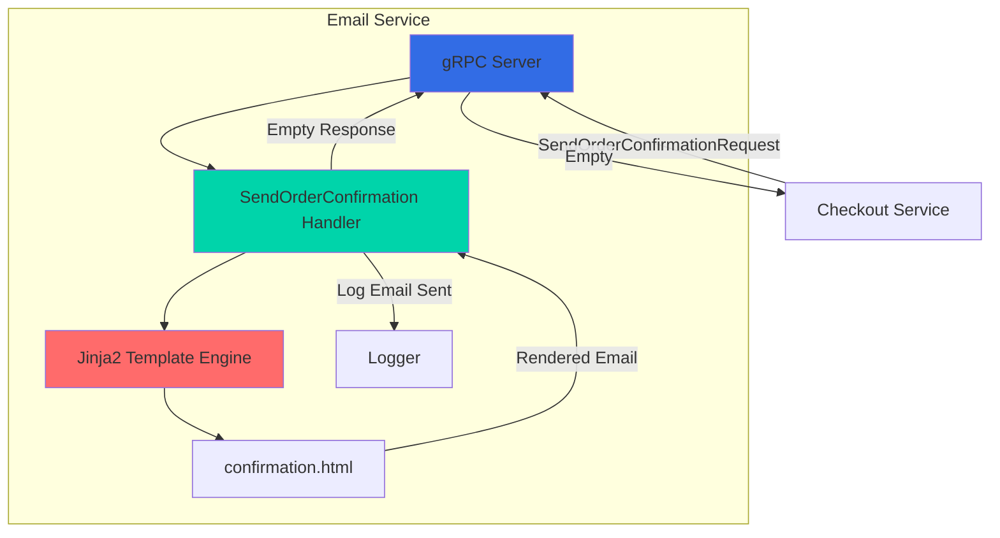
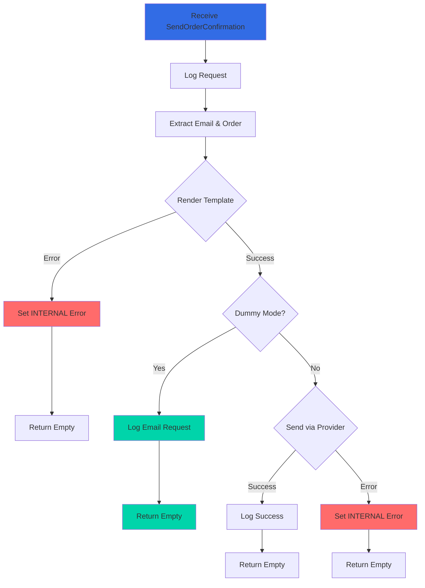

## Overview

The Email Service is a Python-based microservice responsible for sending order confirmation emails to customers in the Online Boutique application. It uses Jinja2 templates to render HTML emails with order details, tracking information, and itemized receipts. Currently operates in "dummy mode" for demonstration purposes.

<CardGroup cols={2}>
  <Card title="Language" icon="python">
    Python 3 with gRPC
  </Card>
  <Card title="Port" icon="network-wired">
    8080
  </Card>
  <Card title="Dependencies" icon="link">
    None (standalone service)
  </Card>
  <Card title="Data Store" icon="database">
    None (stateless)
  </Card>
</CardGroup>

## Service Architecture



## Key Features

<AccordionGroup>
  <Accordion title="HTML Email Templates">
    - Jinja2-based template rendering
    - Responsive HTML email design
    - Dynamic order information injection
    - Itemized order details with pricing
    - Shipping address and tracking information
  </Accordion>

  <Accordion title="Dummy Mode Operation">
    - Logs email requests without sending actual emails
    - No external email service dependencies
    - Safe for development and testing
    - Can be extended to integrate with real email providers
  </Accordion>

  <Accordion title="Template Security">
    - Auto-escaping for HTML and XML
    - Protection against XSS attacks
    - Safe rendering of user-provided data
    - Template error handling
  </Accordion>

  <Accordion title="Observability">
    - Structured JSON logging
    - OpenTelemetry tracing support
    - Google Cloud Profiler integration (optional)
    - Health check endpoint
  </Accordion>
</AccordionGroup>

## gRPC API

### Service Definition

```protobuf
service EmailService {
    rpc SendOrderConfirmation(SendOrderConfirmationRequest) returns (Empty) {}
}
```

### Messages

<Tabs>
  <Tab title="SendOrderConfirmationRequest">
    ```protobuf
    message SendOrderConfirmationRequest {
        string email = 1;
        OrderResult order = 2;
    }
    
    message OrderResult {
        string order_id = 1;
        string shipping_tracking_id = 2;
        Money shipping_cost = 3;
        Address shipping_address = 4;
        repeated OrderItem items = 5;
    }
    
    message OrderItem {
        CartItem item = 1;
        Money cost = 2;
    }
    ```
    
    **Fields:**
    - `email`: Recipient email address
    - `order`: Complete order details including items, shipping, and costs
  </Tab>

  <Tab title="Response">
    ```protobuf
    message Empty {}
    ```
    
    Returns an empty response on success. Errors are communicated via gRPC status codes.
  </Tab>
</Tabs>

### Methods

#### SendOrderConfirmation

Sends an order confirmation email to the specified address.

<CodeGroup>
```python Request Example
request = demo_pb2.SendOrderConfirmationRequest(
    email='customer@example.com',
    order=demo_pb2.OrderResult(
        order_id='550e8400-e29b-41d4-a716-446655440000',
        shipping_tracking_id='AB-5123-34567890',
        shipping_cost=demo_pb2.Money(
            currency_code='USD',
            units=8,
            nanos=990000000
        ),
        shipping_address=demo_pb2.Address(
            street_address='1600 Amphitheatre Parkway',
            city='Mountain View',
            state='CA',
            country='United States',
            zip_code=94043
        ),
        items=[
            demo_pb2.OrderItem(
                item=demo_pb2.CartItem(
                    product_id='OLJCESPC7Z',
                    quantity=1
                ),
                cost=demo_pb2.Money(
                    currency_code='USD',
                    units=35,
                    nanos=0
                )
            )
        ]
    )
)

response = stub.SendOrderConfirmation(request)
```

```python Response Example
# Empty response on success
demo_pb2.Empty()
```

```python Error Example
# gRPC error on failure
grpc.RpcError: <_InactiveRpcError of RPC that terminated with:
    status = StatusCode.INTERNAL
    details = "An error occurred when preparing the confirmation mail."
>
```
</CodeGroup>

## Configuration

### Environment Variables

| Variable | Description | Default | Required |
|----------|-------------|---------|----------|
| `PORT` | gRPC server port | `8080` | No |
| `DISABLE_PROFILER` | Disable Google Cloud Profiler | `false` | No |
| `ENABLE_TRACING` | Enable OpenTelemetry tracing | `0` | No |
| `COLLECTOR_SERVICE_ADDR` | OpenTelemetry collector address | `localhost:4317` | If tracing enabled |
| `GCP_PROJECT_ID` | Google Cloud project ID for profiler | - | If profiler enabled |

### Example Configuration

```yaml
env:
  - name: PORT
    value: "8080"
  - name: DISABLE_PROFILER
    value: "1"
  - name: ENABLE_TRACING
    value: "1"
  - name: COLLECTOR_SERVICE_ADDR
    value: "otelcol:4317"
```

## Implementation Details

### Email Processing Flow



### Core Components

<Tabs>
  <Tab title="email_server.py">
    Main gRPC server with email service implementation.
    
    ```python
    from jinja2 import Environment, FileSystemLoader, select_autoescape
    
    # Load email template
    env = Environment(
        loader=FileSystemLoader('templates'),
        autoescape=select_autoescape(['html', 'xml'])
    )
    template = env.get_template('confirmation.html')
    
    class DummyEmailService(BaseEmailService):
        def SendOrderConfirmation(self, request, context):
            logger.info(
                'A request to send order confirmation email to {} '
                'has been received.'.format(request.email)
            )
            return demo_pb2.Empty()
    
    def start(dummy_mode):
        server = grpc.server(
            futures.ThreadPoolExecutor(max_workers=10)
        )
        
        if dummy_mode:
            service = DummyEmailService()
        else:
            service = EmailService()  # Real email sending
        
        demo_pb2_grpc.add_EmailServiceServicer_to_server(
            service, server
        )
        health_pb2_grpc.add_HealthServicer_to_server(
            service, server
        )
        
        port = os.environ.get('PORT', "8080")
        server.add_insecure_port('[::]:' + port)
        server.start()
        
        # Keep server running
        while True:
            time.sleep(3600)
    ```
  </Tab>

  <Tab title="confirmation.html">
    Jinja2 HTML email template.
    
    ```html
    <!DOCTYPE html>
    <html>
      <head>
        <title>Your Order Confirmation</title>
        <link href="https://fonts.googleapis.com/css2?family=DM+Sans" 
              rel="stylesheet">
      </head>
      <style>
        body {
          font-family: 'DM Sans', sans-serif;
        }
      </style>
      <body>
        <h2>Your Order Confirmation</h2>
        <p>Thanks for shopping with us!</p>
        
        <h3>Order ID</h3>
        <p>#{{ order.order_id }}</p>
        
        <h3>Shipping</h3>
        <p>#{{ order.shipping_tracking_id }}</p>
        <p>{{ order.shipping_cost.units }}.{{ "%02d" | format(order.shipping_cost.nanos // 10000000) }} 
           {{ order.shipping_cost.currency_code }}</p>
        <p>{{ order.shipping_address.street_address }}, 
           {{ order.shipping_address.city }}, 
           {{ order.shipping_address.country }} 
           {{ order.shipping_address.zip_code }}</p>
        
        <h3>Items</h3>
        <table style="width:100%">
          <tr>
            <th>Item No.</th>
            <th>Quantity</th> 
            <th>Price</th>
          </tr>
          
          <tr>
            <td>#{{ item.item.product_id }}</td>
            <td>{{ item.item.quantity }}</td> 
            <td>{{ item.cost.units }}.{{ "%02d" | format(item.cost.nanos // 10000000) }} 
                {{ item.cost.currency_code }}</td>
          </tr>
          
        </table>
      </body>
    </html>
    ```
  </Tab>

  <Tab title="email_client.py">
    Test client for the email service.
    
    ```python
    import grpc
    import demo_pb2
    import demo_pb2_grpc
    
    def send_confirmation_email(email, order):
        channel = grpc.insecure_channel('[::]:8080')
        stub = demo_pb2_grpc.EmailServiceStub(channel)
        
        try:
            response = stub.SendOrderConfirmation(
                demo_pb2.SendOrderConfirmationRequest(
                    email=email,
                    order=order
                )
            )
            logger.info('Request sent.')
        except grpc.RpcError as err:
            logger.error(err.details())
            logger.error('{}, {}'.format(
                err.code().name, 
                err.code().value
            ))
    ```
  </Tab>
</Tabs>

## Dependencies

### Python Packages

```txt
grpcio==1.76.0
grpcio-health-checking==1.76.0
jinja2==3.1.6
google-api-core[grpc]==2.28.1
google-cloud-trace==1.17.0
opentelemetry-api==1.39.1
opentelemetry-distro==0.60b1
opentelemetry-exporter-otlp-proto-grpc==1.39.1
opentelemetry-instrumentation-grpc==0.60b1
python-json-logger==4.0.0
requests==2.32.5
```

<Accordion title="Package Descriptions">
- **grpcio**: Python gRPC implementation
- **grpcio-health-checking**: Health check service
- **jinja2**: Template engine for HTML rendering
- **google-api-core**: Google API client core library
- **google-cloud-trace**: Cloud Trace client
- **opentelemetry-\***: Distributed tracing instrumentation
- **python-json-logger**: JSON structured logging
- **requests**: HTTP library for API calls
</Accordion>

## Email Template

### Template Variables

The confirmation email template has access to the following variables:

<CardGroup cols={2}>
  <Card title="order.order_id" icon="hashtag">
    Unique order identifier
  </Card>
  <Card title="order.shipping_tracking_id" icon="truck">
    Shipping tracking number
  </Card>
  <Card title="order.shipping_cost" icon="dollar-sign">
    Shipping cost with currency
  </Card>
  <Card title="order.shipping_address" icon="location-dot">
    Complete shipping address
  </Card>
  <Card title="order.items" icon="list">
    Array of ordered items with prices
  </Card>
</CardGroup>

### Sample Rendered Email

```html
<h2>Your Order Confirmation</h2>
<p>Thanks for shopping with us!</p>

<h3>Order ID</h3>
<p>#550e8400-e29b-41d4-a716-446655440000</p>

<h3>Shipping</h3>
<p>#AB-5123-34567890</p>
<p>8.99 USD</p>
<p>1600 Amphitheatre Parkway, Mountain View, United States 94043</p>

<h3>Items</h3>
<table>
  <tr>
    <th>Item No.</th>
    <th>Quantity</th>
    <th>Price</th>
  </tr>
  <tr>
    <td>#OLJCESPC7Z</td>
    <td>1</td>
    <td>35.00 USD</td>
  </tr>
</table>
```

## Testing

### Manual Testing

```bash
# Run the service
cd src/emailservice
python email_server.py

# Test with grpcurl
grpcurl -plaintext \
  -d '{
    "email": "customer@example.com",
    "order": {
      "order_id": "550e8400-e29b-41d4-a716-446655440000",
      "shipping_tracking_id": "AB-5123-34567890",
      "shipping_cost": {
        "currency_code": "USD",
        "units": 8,
        "nanos": 990000000
      },
      "shipping_address": {
        "street_address": "1600 Amphitheatre Parkway",
        "city": "Mountain View",
        "state": "CA",
        "country": "United States",
        "zip_code": 94043
      },
      "items": [{
        "item": {
          "product_id": "OLJCESPC7Z",
          "quantity": 1
        },
        "cost": {
          "currency_code": "USD",
          "units": 35,
          "nanos": 0
        }
      }]
    }
  }' \
  localhost:8080 \
  hipstershop.EmailService/SendOrderConfirmation
```

### Using Test Client

```bash
# Run test client
cd src/emailservice
python email_client.py
```

### Template Testing

```python
from jinja2 import Environment, FileSystemLoader

# Load template
env = Environment(loader=FileSystemLoader('templates'))
template = env.get_template('confirmation.html')

# Test data
order = {
    'order_id': 'TEST-123',
    'shipping_tracking_id': 'AB-5123-34567890',
    'shipping_cost': {'units': 8, 'nanos': 990000000, 'currency_code': 'USD'},
    'shipping_address': {
        'street_address': '123 Test St',
        'city': 'Test City',
        'country': 'Test Country',
        'zip_code': 12345
    },
    'items': [
        {
            'item': {'product_id': 'PROD-1', 'quantity': 2},
            'cost': {'units': 50, 'nanos': 0, 'currency_code': 'USD'}
        }
    ]
}

# Render
html = template.render(order=order)
print(html)
```

## Deployment

### Kubernetes Deployment

```yaml
apiVersion: apps/v1
kind: Deployment
metadata:
  name: emailservice
spec:
  selector:
    matchLabels:
      app: emailservice
  template:
    metadata:
      labels:
        app: emailservice
    spec:
      containers:
      - name: server
        image: emailservice
        ports:
        - containerPort: 8080
        env:
        - name: PORT
          value: "8080"
        - name: DISABLE_PROFILER
          value: "1"
        resources:
          requests:
            cpu: 100m
            memory: 64Mi
          limits:
            cpu: 200m
            memory: 128Mi
        livenessProbe:
          grpc:
            port: 8080
          initialDelaySeconds: 10
        readinessProbe:
          grpc:
            port: 8080
          initialDelaySeconds: 5
```

### Docker Build

```dockerfile
FROM python:3.11-slim

WORKDIR /app

# Install dependencies
COPY requirements.txt .
RUN pip install --no-cache-dir -r requirements.txt

# Copy application
COPY . .

EXPOSE 8080

ENTRYPOINT ["python", "email_server.py"]
```

## Production Integration

<Warning>
The service currently runs in dummy mode. For production use, you need to integrate with a real email service provider.
</Warning>

### Email Provider Options

<Tabs>
  <Tab title="SendGrid">
    ```python
    import sendgrid
    from sendgrid.helpers.mail import Mail, Email, To, Content
    
    def send_email_sendgrid(email_address, content):
        sg = sendgrid.SendGridAPIClient(
            api_key=os.environ.get('SENDGRID_API_KEY')
        )
        
        message = Mail(
            from_email='noreply@example.com',
            to_emails=email_address,
            subject='Your Order Confirmation',
            html_content=content
        )
        
        response = sg.send(message)
        return response
    ```
  </Tab>

  <Tab title="AWS SES">
    ```python
    import boto3
    from botocore.exceptions import ClientError
    
    def send_email_ses(email_address, content):
        client = boto3.client('ses', region_name='us-east-1')
        
        try:
            response = client.send_email(
                Source='noreply@example.com',
                Destination={'ToAddresses': [email_address]},
                Message={
                    'Subject': {
                        'Data': 'Your Order Confirmation',
                        'Charset': 'UTF-8'
                    },
                    'Body': {
                        'Html': {
                            'Data': content,
                            'Charset': 'UTF-8'
                        }
                    }
                }
            )
            return response
        except ClientError as e:
            logger.error(e.response['Error']['Message'])
            raise
    ```
  </Tab>

  <Tab title="Mailgun">
    ```python
    import requests
    
    def send_email_mailgun(email_address, content):
        return requests.post(
            "https://api.mailgun.net/v3/YOUR_DOMAIN/messages",
            auth=("api", os.environ.get('MAILGUN_API_KEY')),
            data={
                "from": "noreply@example.com",
                "to": email_address,
                "subject": "Your Order Confirmation",
                "html": content
            }
        )
    ```
  </Tab>
</Tabs>

### Implementing Real Email Sending

To enable real email sending, modify the `EmailService` class:

```python
class EmailService(BaseEmailService):
    def __init__(self):
        # Initialize email provider client
        self.client = initialize_email_provider()
        super().__init__()
    
    def SendOrderConfirmation(self, request, context):
        email = request.email
        order = request.order
        
        try:
            # Render template
            confirmation = template.render(order=order)
        except TemplateError as err:
            context.set_details(
                "An error occurred when preparing the confirmation mail."
            )
            logger.error(err.message)
            context.set_code(grpc.StatusCode.INTERNAL)
            return demo_pb2.Empty()
        
        try:
            # Send via email provider
            self.send_email(email, confirmation)
            logger.info(f"Email sent successfully to {email}")
        except Exception as err:
            context.set_details(
                "An error occurred when sending the email."
            )
            logger.error(str(err))
            context.set_code(grpc.StatusCode.INTERNAL)
            return demo_pb2.Empty()
        
        return demo_pb2.Empty()
```

## Monitoring

### Key Metrics

<CardGroup cols={2}>
  <Card title="Email Requests" icon="envelope">
    Number of confirmation emails requested
  </Card>
  <Card title="Success Rate" icon="check">
    Percentage of successfully sent emails
  </Card>
  <Card title="Template Errors" icon="triangle-exclamation">
    Number of template rendering failures
  </Card>
  <Card title="Latency" icon="clock">
    Time to render and send emails
  </Card>
</CardGroup>

### Log Examples

```json
{
  "timestamp": "2024-02-13T10:30:45.123Z",
  "severity": "info",
  "message": "A request to send order confirmation email to customer@example.com has been received."
}
```

```json
{
  "timestamp": "2024-02-13T10:30:45.456Z",
  "severity": "error",
  "message": "An error occurred when preparing the confirmation mail.",
  "error": "TemplateNotFound: confirmation.html"
}
```

## Troubleshooting

<AccordionGroup>
  <Accordion title="Service fails to start">
    **Symptoms:** Service crashes on startup
    
    **Solutions:**
    - Verify Python version is 3.9 or higher
    - Check all dependencies are installed: `pip install -r requirements.txt`
    - Ensure templates/ directory exists with confirmation.html
    - Verify PORT environment variable is valid
    - Check logs for specific error messages
  </Accordion>

  <Accordion title="Template rendering fails">
    **Symptoms:** INTERNAL error when sending emails
    
    **Solutions:**
    - Verify confirmation.html exists in templates/ directory
    - Check template syntax is valid Jinja2
    - Ensure order data structure matches template expectations
    - Test template rendering independently
    - Review template error logs
  </Accordion>

  <Accordion title="Emails not being sent (production)">
    **Symptoms:** No emails received by customers
    
    **Solutions:**
    - Verify email provider credentials are correct
    - Check email provider API is accessible
    - Review email provider rate limits
    - Verify sender email is authorized
    - Check spam folders
    - Review email provider logs
  </Accordion>

  <Accordion title="High latency">
    **Symptoms:** Slow email sending
    
    **Solutions:**
    - Check email provider API response times
    - Verify network connectivity
    - Review template complexity
    - Check for blocking operations
    - Consider async email sending
    - Implement email queue
  </Accordion>
</AccordionGroup>

## Security Considerations

<CardGroup cols={2}>
  <Card title="Template Security" icon="shield-check">
    - Auto-escaping enabled for XSS protection
    - User input sanitized before rendering
    - Template files protected from modification
  </Card>
  <Card title="Email Validation" icon="envelope-circle-check">
    - Validate email addresses before sending
    - Implement rate limiting
    - Prevent email injection attacks
  </Card>
  <Card title="API Keys" icon="key">
    - Store provider keys in secrets
    - Rotate keys regularly
    - Use environment variables
  </Card>
  <Card title="Content Security" icon="lock">
    - Don't include sensitive data in emails
    - Use HTTPS for all links
    - Implement SPF/DKIM/DMARC
  </Card>
</CardGroup>

## Related Services

<CardGroup cols={3}>
  <Card title="Checkout Service" icon="shopping-cart" href="/microservices/checkoutservice">
    Calls Email Service after order completion
  </Card>
  <Card title="Payment Service" icon="credit-card" href="/microservices/paymentservice">
    Processes payment before email is sent
  </Card>
  <Card title="Shipping Service" icon="truck" href="/microservices/shippingservice">
    Provides tracking ID for email
  </Card>
</CardGroup>

## Additional Resources

- [Jinja2 Documentation](https://jinja.palletsprojects.com/)
- [gRPC Python Documentation](https://grpc.io/docs/languages/python/)
- [SendGrid API](https://docs.sendgrid.com/)
- [AWS SES Documentation](https://docs.aws.amazon.com/ses/)
- [Email HTML Best Practices](https://www.campaignmonitor.com/dev-resources/guides/coding/)
