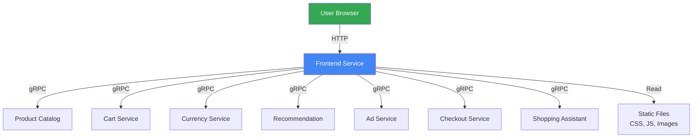
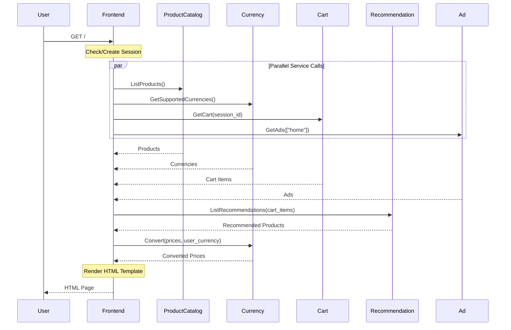

The Frontend service is the user-facing component of Online Boutique. It serves the web UI and acts as an API gateway, aggregating data from all backend services to render pages for users.

## Overview

The Frontend service is the entry point for all user interactions. It:
- Serves HTML pages with server-side rendering
- Manages user sessions via cookies
- Aggregates data from multiple backend services
- Converts HTTP requests to gRPC calls
- Handles currency conversion for display
- Implements the shopping cart UI

## Technology Stack

- **Language**: Go 1.21+
- **Framework**: Standard library `net/http`
- **Template Engine**: Go `html/template`
- **gRPC Client**: `google.golang.org/grpc`
- **Observability**: OpenTelemetry
- **Port**: 8080 (HTTP)

## Key Features

<CardGroup cols={2}>
  <Card title="Server-Side Rendering" icon="server">
    HTML pages rendered on the server for fast initial load
  </Card>
  <Card title="Session Management" icon="cookie">
    Automatic session ID generation and cookie management
  </Card>
  <Card title="Service Aggregation" icon="layer-group">
    Calls multiple backend services to build complete pages
  </Card>
  <Card title="Currency Support" icon="dollar-sign">
    Multi-currency display with real-time conversion
  </Card>
</CardGroup>

## Service Dependencies

### Depends On

The Frontend service depends on all backend services:

| Service | Purpose | Required |
|---------|---------|----------|
| **Product Catalog** | List and search products | Yes |
| **Cart Service** | Manage shopping cart | Yes |
| **Currency Service** | Convert prices | Yes |
| **Recommendation** | Show product suggestions | No |
| **Ad Service** | Display advertisements | No |
| **Checkout Service** | Process orders | Yes |
| **Shopping Assistant** | AI-powered help | No |

### Used By

- **Load Generator**: Simulates user traffic
- **Users**: Direct browser access

## Architecture



## Request Flow

### Homepage Request



## Configuration

### Environment Variables

| Variable | Description | Default | Required |
|----------|-------------|---------|----------|
| `PORT` | HTTP server port | `8080` | No |
| `PRODUCT_CATALOG_SERVICE_ADDR` | Product catalog gRPC address | `productcatalogservice:3550` | Yes |
| `CURRENCY_SERVICE_ADDR` | Currency service gRPC address | `currencyservice:7000` | Yes |
| `CART_SERVICE_ADDR` | Cart service gRPC address | `cartservice:7070` | Yes |
| `RECOMMENDATION_SERVICE_ADDR` | Recommendation service gRPC address | `recommendationservice:8080` | Yes |
| `CHECKOUT_SERVICE_ADDR` | Checkout service gRPC address | `checkoutservice:5050` | Yes |
| `SHIPPING_SERVICE_ADDR` | Shipping service gRPC address | `shippingservice:50051` | Yes |
| `AD_SERVICE_ADDR` | Ad service gRPC address | `adservice:9555` | Yes |
| `SHOPPING_ASSISTANT_SERVICE_ADDR` | Shopping assistant gRPC address | `shoppingassistantservice:80` | No |
| `ENV_PLATFORM` | Platform identifier for UI | `local` | No |
| `ENABLE_PROFILER` | Enable Cloud Profiler | `false` | No |
| `CYMBAL_BRANDING` | Use Cymbal branding | `false` | No |

### Example Configuration

```yaml
env:
- name: PORT
  value: "8080"
- name: PRODUCT_CATALOG_SERVICE_ADDR
  value: "productcatalogservice:3550"
- name: CURRENCY_SERVICE_ADDR
  value: "currencyservice:7000"
- name: CART_SERVICE_ADDR
  value: "cartservice:7070"
- name: RECOMMENDATION_SERVICE_ADDR
  value: "recommendationservice:8080"
- name: CHECKOUT_SERVICE_ADDR
  value: "checkoutservice:5050"
- name: AD_SERVICE_ADDR
  value: "adservice:9555"
```

## HTTP Endpoints

### Public Endpoints

| Method | Path | Description |
|--------|------|-------------|
| `GET` | `/` | Homepage with product list |
| `GET` | `/product/{id}` | Product details page |
| `GET` | `/cart` | Shopping cart page |
| `POST` | `/cart` | Add item to cart |
| `POST` | `/cart/empty` | Empty cart |
| `POST` | `/cart/checkout` | Proceed to checkout |
| `POST` | `/checkout` | Complete order |
| `GET` | `/static/*` | Static assets (CSS, JS, images) |
| `POST` | `/setCurrency` | Change currency |
| `POST` | `/logout` | Clear session |

### Health Endpoints

| Method | Path | Description |
|--------|------|-------------|
| `GET` | `/_healthz` | Liveness probe |
| `GET` | `/ready` | Readiness probe |

## Session Management

### Session ID Generation

```go
func ensureSessionID(next http.Handler) http.HandlerFunc {
    return func(w http.ResponseWriter, r *http.Request) {
        var sessionID string
        c, err := r.Cookie(cookieSessionID)
        if err == http.ErrNoCookie {
            // Generate new session ID
            sessionID = uuid.New().String()
            http.SetCookie(w, &http.Cookie{
                Name:     cookieSessionID,
                Value:    sessionID,
                MaxAge:   cookieMaxAge,
                Path:     "/",
                HttpOnly: true,
                SameSite: http.SameSiteStrictMode,
            })
        } else {
            sessionID = c.Value
        }
        
        ctx := context.WithValue(r.Context(), ctxKeySessionID{}, sessionID)
        next.ServeHTTP(w, r.WithContext(ctx))
    }
}
```

**Session Cookie**:
- **Name**: `shop_session-id`
- **Value**: UUID v4
- **Max Age**: Session (browser close)
- **HttpOnly**: Yes
- **SameSite**: Strict

## Template Rendering

### Template Structure

```
templates/
├── header.html       # Common header
├── footer.html       # Common footer
├── home.html         # Homepage
├── product.html      # Product details
├── cart.html         # Shopping cart
├── checkout.html     # Checkout form
├── order.html        # Order confirmation
└── error.html        # Error page
```

### Example Template Usage

```go
func (fe *frontendServer) homeHandler(w http.ResponseWriter, r *http.Request) {
    // Get data from services
    products, err := fe.getProducts(r.Context())
    currencies, err := fe.getCurrencies(r.Context())
    cart, err := fe.getCart(r.Context())
    
    // Render template
    if err := templates.ExecuteTemplate(w, "home", map[string]interface{}{
        "session_id":        sessionID(r.Context()),
        "request_id":        r.Context().Value(ctxKeyRequestID{}),
        "user_currency":     currentCurrency(r.Context()),
        "currencies":        currencies,
        "products":          products,
        "cart_size":         len(cart),
        "banner_color":      os.Getenv("BANNER_COLOR"),
        "platform_css":      plat.css,
        "platform_name":     plat.provider,
        "is_cymbal_brand":   isCymbalBrand,
    }); err != nil {
        log.Error(err)
    }
}
```

## Error Handling

### Graceful Degradation

```go
// Non-critical service failures are handled gracefully
recommendations, err := fe.getRecommendations(ctx, userID, productIDs)
if err != nil {
    log.Warnf("failed to get recommendations: %v", err)
    recommendations = []string{} // Empty recommendations
}

ads, err := fe.getAds(ctx, contextKeys)
if err != nil {
    log.Warnf("failed to get ads: %v", err)
    ads = []Ad{} // No ads
}
```

**Graceful Degradation Strategy**:
- **Critical Services** (must succeed): Product Catalog, Cart, Checkout
- **Non-Critical Services** (can fail): Recommendations, Ads, Shopping Assistant
- **Fallback**: Show page with partial data

### Error Pages

```go
func renderHTTPError(w http.ResponseWriter, r *http.Request, err error, code int) {
    log.WithField("error", err).WithField("status_code", code).Error("request error")
    
    templates.ExecuteTemplate(w, "error", map[string]interface{}{
        "session_id":  sessionID(r.Context()),
        "request_id":  r.Context().Value(ctxKeyRequestID{}),
        "error":       err.Error(),
        "status_code": code,
        "status_text": http.StatusText(code),
    })
}
```

## Performance Optimizations

### Parallel Service Calls

```go
// Call multiple services in parallel
var (
    products     []*pb.Product
    currencies   []string
    cart         *pb.Cart
    ads          []*pb.Ad
    wg           sync.WaitGroup
    mu           sync.Mutex
    errors       []error
)

wg.Add(4)

go func() {
    defer wg.Done()
    p, err := fe.getProducts(ctx)
    mu.Lock()
    products = p
    if err != nil {
        errors = append(errors, err)
    }
    mu.Unlock()
}()

// ... similar for other services

wg.Wait()
```

### Connection Pooling

```go
// gRPC connections are reused
conn, err := grpc.Dial(
    address,
    grpc.WithInsecure(),
    grpc.WithKeepaliveParams(keepalive.ClientParameters{
        Time:                10 * time.Second,
        Timeout:             time.Second,
        PermitWithoutStream: true,
    }),
)
```

### Caching

```go
// Static assets are cached
w.Header().Set("Cache-Control", "public, max-age=3600")
http.ServeFile(w, r, filepath.Join("static", path))
```

## Observability

### Logging

```go
log.WithFields(logrus.Fields{
    "session_id": sessionID,
    "request_id": requestID,
    "method":     r.Method,
    "path":       r.URL.Path,
    "duration":   time.Since(start),
}).Info("request completed")
```

### Metrics

Prometheus metrics exposed on `/metrics`:

```
# HTTP requests
http_requests_total{method="GET",path="/",status="200"} 1234
http_request_duration_seconds{method="GET",path="/"} 0.045

# gRPC client calls
grpc_client_calls_total{service="productcatalog",method="ListProducts"} 567
grpc_client_duration_seconds{service="productcatalog",method="ListProducts"} 0.023
```

### Tracing

```go
// OpenTelemetry tracing
ctx, span := tracer.Start(ctx, "frontend.homeHandler")
defer span.End()

span.SetAttributes(
    attribute.String("session.id", sessionID),
    attribute.String("user.currency", currency),
)
```

## Local Development

### Prerequisites

- Go 1.21 or later
- Protocol Buffer compiler (`protoc`)
- gRPC dependencies

### Running Locally

```bash
# Navigate to frontend directory
cd src/frontend

# Install dependencies
go mod download

# Generate protobuf code (if needed)
protoc --go_out=. --go-grpc_out=. ../../protos/demo.proto

# Set environment variables
export PRODUCT_CATALOG_SERVICE_ADDR=localhost:3550
export CURRENCY_SERVICE_ADDR=localhost:7000
export CART_SERVICE_ADDR=localhost:7070
# ... other services

# Run the service
go run main.go
```

### Running with Docker

```bash
# Build image
docker build -t frontend:dev .

# Run container
docker run -p 8080:8080 \
  -e PRODUCT_CATALOG_SERVICE_ADDR=productcatalogservice:3550 \
  -e CURRENCY_SERVICE_ADDR=currencyservice:7000 \
  frontend:dev
```

### Testing

```bash
# Run unit tests
go test ./...

# Run tests with coverage
go test -cover ./...

# Run specific test
go test -run TestMoneyValidation ./money
```

## Deployment

### Kubernetes Deployment

```yaml
apiVersion: apps/v1
kind: Deployment
metadata:
  name: frontend
spec:
  replicas: 2
  selector:
    matchLabels:
      app: frontend
  template:
    metadata:
      labels:
        app: frontend
    spec:
      containers:
      - name: server
        image: frontend:latest
        ports:
        - containerPort: 8080
        env:
        - name: PORT
          value: "8080"
        - name: PRODUCT_CATALOG_SERVICE_ADDR
          value: "productcatalogservice:3550"
        resources:
          requests:
            cpu: 100m
            memory: 64Mi
          limits:
            cpu: 200m
            memory: 128Mi
        livenessProbe:
          httpGet:
            path: /_healthz
            port: 8080
          initialDelaySeconds: 10
          periodSeconds: 10
        readinessProbe:
          httpGet:
            path: /ready
            port: 8080
          initialDelaySeconds: 5
          periodSeconds: 5
```

### Service Definition

```yaml
apiVersion: v1
kind: Service
metadata:
  name: frontend
spec:
  type: ClusterIP
  selector:
    app: frontend
  ports:
  - name: http
    port: 80
    targetPort: 8080
---
apiVersion: v1
kind: Service
metadata:
  name: frontend-external
spec:
  type: LoadBalancer
  selector:
    app: frontend
  ports:
  - name: http
    port: 80
    targetPort: 8080
```

## Monitoring

### Key Metrics to Monitor

| Metric | Description | Alert Threshold |
|--------|-------------|-----------------|
| **Request Rate** | Requests per second | - |
| **Error Rate** | Percentage of 5xx errors | > 1% |
| **Latency (p95)** | 95th percentile response time | > 200ms |
| **CPU Usage** | CPU utilization | > 80% |
| **Memory Usage** | Memory utilization | > 80% |
| **gRPC Errors** | Failed backend calls | > 5% |

### Health Check

```bash
# Check liveness
curl http://localhost:8080/_healthz

# Check readiness
curl http://localhost:8080/ready
```

## Troubleshooting

<AccordionGroup>
  <Accordion title="Service returns 500 errors" icon="circle-exclamation">
    **Symptoms**: Users see error pages, logs show backend service failures
    
    **Possible Causes**:
    - Backend service is down
    - Network connectivity issues
    - Timeout errors
    
    **Solutions**:
    ```bash
    # Check backend service health
    kubectl get pods -l app=productcatalogservice
    
    # Check service endpoints
    kubectl get endpoints productcatalogservice
    
    # View frontend logs
    kubectl logs -l app=frontend --tail=100
    
    # Test backend connectivity
    kubectl exec -it frontend-pod -- nc -zv productcatalogservice 3550
    ```
  </Accordion>
  
  <Accordion title="Slow page loads" icon="circle-exclamation">
    **Symptoms**: Pages take > 2 seconds to load
    
    **Possible Causes**:
    - Backend services are slow
    - Too many sequential calls
    - Network latency
    
    **Solutions**:
    ```bash
    # Check service latency
    kubectl logs -l app=frontend | grep duration
    
    # View distributed traces
    # (Check Cloud Trace or Jaeger)
    
    # Scale up frontend
    kubectl scale deployment/frontend --replicas=5
    ```
  </Accordion>
  
  <Accordion title="Session not persisting" icon="circle-exclamation">
    **Symptoms**: Cart empties on page refresh, user logged out
    
    **Possible Causes**:
    - Cookies blocked
    - Session cookie not set
    - Cart service issues
    
    **Solutions**:
    - Check browser cookie settings
    - Verify session cookie is set (check browser dev tools)
    - Check cart service health: `kubectl get pods -l app=cartservice`
  </Accordion>
  
  <Accordion title="Currency conversion not working" icon="circle-exclamation">
    **Symptoms**: Prices not converting, stuck in USD
    
    **Possible Causes**:
    - Currency service down
    - ECB API unavailable
    - Invalid currency code
    
    **Solutions**:
    ```bash
    # Check currency service
    kubectl get pods -l app=currencyservice
    
    # View currency service logs
    kubectl logs -l app=currencyservice
    
    # Test currency service directly
    grpcurl -plaintext currencyservice:7000 hipstershop.CurrencyService/GetSupportedCurrencies
    ```
  </Accordion>
</AccordionGroup>

## Security Considerations

### Input Validation

```go
// Validate product ID
if !isValidProductID(productID) {
    http.Error(w, "Invalid product ID", http.StatusBadRequest)
    return
}

// Validate quantity
if quantity < 1 || quantity > 10 {
    http.Error(w, "Invalid quantity", http.StatusBadRequest)
    return
}
```

### XSS Protection

```go
// Templates automatically escape HTML
{{ .ProductName }}  // Escaped automatically

// For trusted HTML, use template.HTML
{{ .TrustedHTML | safeHTML }}
```

### CSRF Protection

```go
// CSRF token in forms
<input type="hidden" name="csrf_token" value="{{ .CSRFToken }}">

// Validate CSRF token
if r.FormValue("csrf_token") != session.CSRFToken {
    http.Error(w, "Invalid CSRF token", http.StatusForbidden)
    return
}
```

## Next Steps

<CardGroup cols={2}>
  <Card title="Cart Service" icon="cart-shopping" href="/microservices/cartservice">
    Learn about shopping cart management
  </Card>
  <Card title="Product Catalog" icon="box" href="/microservices/productcatalogservice">
    Explore product data management
  </Card>
  <Card title="Checkout Service" icon="cash-register" href="/microservices/checkoutservice">
    Understand order processing
  </Card>
  <Card title="Architecture" icon="sitemap" href="/architecture/overview">
    See how all services work together
  </Card>
</CardGroup>
