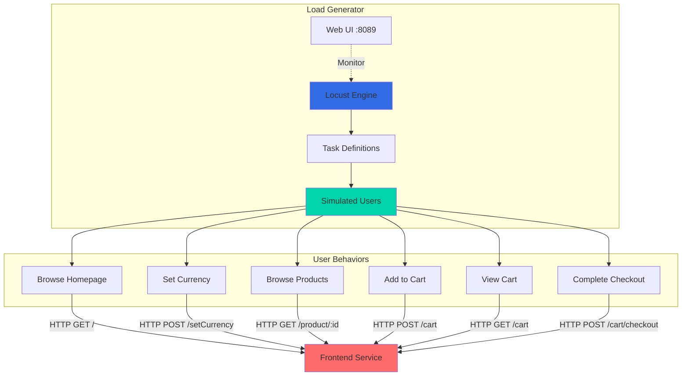
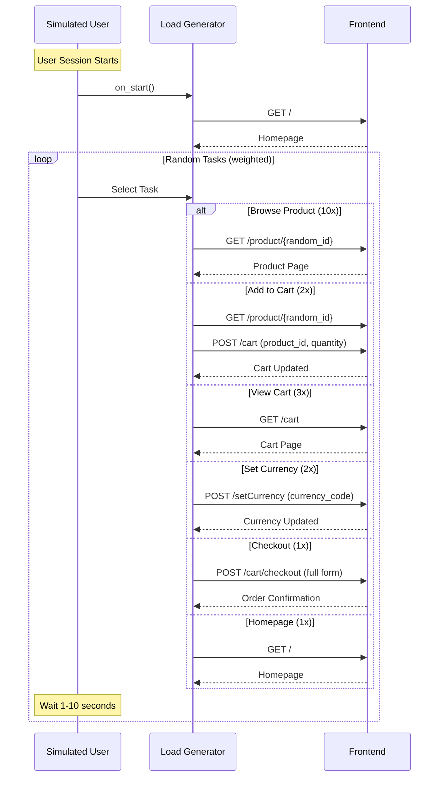

## Overview

The Load Generator is a Python-based tool that uses Locust to simulate realistic user traffic for the Online Boutique application. It generates continuous load by simulating user behaviors like browsing products, adding items to cart, and completing checkouts. This service is essential for testing, demonstrations, and observability validation.

<CardGroup cols={2}>
  <Card title="Language" icon="python">
    Python 3 with Locust
  </Card>
  <Card title="Port" icon="network-wired">
    8089 (Locust Web UI)
  </Card>
  <Card title="Dependencies" icon="link">
    Frontend Service (HTTP)
  </Card>
  <Card title="Purpose" icon="vial">
    Load testing and traffic simulation
  </Card>
</CardGroup>

## Service Architecture



## Key Features

<AccordionGroup>
  <Accordion title="Realistic User Simulation">
    - Simulates actual user browsing patterns
    - Random product selection from catalog
    - Variable cart quantities (1-10 items)
    - Realistic checkout with fake data
    - Random wait times between actions (1-10 seconds)
  </Accordion>

  <Accordion title="Weighted Task Distribution">
    - Homepage browsing: 1x weight
    - Currency changes: 2x weight
    - Product browsing: 10x weight (most common)
    - Add to cart: 2x weight
    - View cart: 3x weight
    - Checkout: 1x weight (least common)
  </Accordion>

  <Accordion title="Fake Data Generation">
    - Uses Faker library for realistic test data
    - Generates valid email addresses
    - Creates realistic shipping addresses
    - Produces valid credit card numbers (test cards)
    - Random expiration dates and CVV codes
  </Accordion>

  <Accordion title="Locust Web UI">
    - Real-time statistics dashboard
    - Request rate and response time charts
    - Failure rate monitoring
    - User count control
    - Start/stop load testing
  </Accordion>
</AccordionGroup>

## User Behaviors

### Task Weights

The load generator simulates different user actions with varying frequencies:

<CardGroup cols={3}>
  <Card title="Browse Products" icon="magnifying-glass">
    Weight: 10 (Most frequent)
  </Card>
  <Card title="View Cart" icon="shopping-cart">
    Weight: 3
  </Card>
  <Card title="Set Currency" icon="dollar-sign">
    Weight: 2
  </Card>
  <Card title="Add to Cart" icon="cart-plus">
    Weight: 2
  </Card>
  <Card title="Homepage" icon="house">
    Weight: 1
  </Card>
  <Card title="Checkout" icon="credit-card">
    Weight: 1 (Least frequent)
  </Card>
</CardGroup>

### Behavior Flow



## Implementation Details

### Task Definitions

<Tabs>
  <Tab title="Browse Product">
    ```python
    products = [
        '0PUK6V6EV0', '1YMWWN1N4O', '2ZYFJ3GM2N',
        '66VCHSJNUP', '6E92ZMYYFZ', '9SIQT8TOJO',
        'L9ECAV7KIM', 'LS4PSXUNUM', 'OLJCESPC7Z'
    ]
    
    def browseProduct(l):
        l.client.get("/product/" + random.choice(products))
    ```
  </Tab>

  <Tab title="Add to Cart">
    ```python
    def addToCart(l):
        product = random.choice(products)
        l.client.get("/product/" + product)
        l.client.post("/cart", {
            'product_id': product,
            'quantity': random.randint(1, 10)
        })
    ```
  </Tab>

  <Tab title="Checkout">
    ```python
    from faker import Faker
    fake = Faker()
    
    def checkout(l):
        addToCart(l)
        current_year = datetime.datetime.now().year + 1
        l.client.post("/cart/checkout", {
            'email': fake.email(),
            'street_address': fake.street_address(),
            'zip_code': fake.zipcode(),
            'city': fake.city(),
            'state': fake.state_abbr(),
            'country': fake.country(),
            'credit_card_number': fake.credit_card_number(card_type="visa"),
            'credit_card_expiration_month': random.randint(1, 12),
            'credit_card_expiration_year': random.randint(current_year, current_year + 70),
            'credit_card_cvv': f"{random.randint(100, 999)}",
        })
    ```
  </Tab>

  <Tab title="Set Currency">
    ```python
    def setCurrency(l):
        currencies = ['EUR', 'USD', 'JPY', 'CAD', 'GBP', 'TRY']
        l.client.post("/setCurrency", {
            'currency_code': random.choice(currencies)
        })
    ```
  </Tab>
</Tabs>

### User Class Configuration

```python
class UserBehavior(TaskSet):
    def on_start(self):
        # Always start by visiting homepage
        index(self)
    
    # Task weights define frequency
    tasks = {
        index: 1,
        setCurrency: 2,
        browseProduct: 10,
        addToCart: 2,
        viewCart: 3,
        checkout: 1
    }

class WebsiteUser(FastHttpUser):
    tasks = [UserBehavior]
    wait_time = between(1, 10)  # Wait 1-10 seconds between tasks
```

## Configuration

### Environment Variables

| Variable | Description | Default | Required |
|----------|-------------|---------|----------|
| `FRONTEND_ADDR` | Frontend service URL | `http://frontend:80` | Yes |
| `USERS` | Number of concurrent users | `10` | No |
| `SPAWN_RATE` | Users spawned per second | `2` | No |
| `HOST` | Target host URL | - | Yes (or via CLI) |

### Example Configuration

```yaml
env:
  - name: FRONTEND_ADDR
    value: "http://frontend:80"
  - name: USERS
    value: "10"
  - name: SPAWN_RATE
    value: "2"
```

## Running the Load Generator

### Command Line

```bash
# Install dependencies
pip install -r requirements.txt

# Run with web UI
locust --host=http://frontend:80

# Run headless (no UI)
locust --host=http://frontend:80 \
       --users 10 \
       --spawn-rate 2 \
       --run-time 1h \
       --headless

# Run with specific locustfile
locust -f locustfile.py --host=http://localhost:8080
```

### Web UI Access

Once started, access the Locust web interface at:

```
http://localhost:8089
```

<Steps>
  <Step title="Open Web UI">
    Navigate to http://localhost:8089 in your browser
  </Step>
  <Step title="Configure Load Test">
    Set number of users and spawn rate
  </Step>
  <Step title="Start Test">
    Click "Start swarming" to begin load generation
  </Step>
  <Step title="Monitor Results">
    View real-time statistics, charts, and failures
  </Step>
</Steps>

## Dependencies

### Python Packages

```txt
locust==2.43.0
faker==40.1.0
flask==3.1.2
gevent==25.9.1
requests==2.32.5
pytest==8.4.2
```

<Accordion title="Package Descriptions">
- **locust**: Load testing framework
- **faker**: Fake data generation library
- **flask**: Web framework for Locust UI
- **gevent**: Coroutine-based networking library
- **requests**: HTTP library
- **pytest**: Testing framework
</Accordion>

## Deployment

### Kubernetes Deployment

```yaml
apiVersion: apps/v1
kind: Deployment
metadata:
  name: loadgenerator
spec:
  replicas: 1
  selector:
    matchLabels:
      app: loadgenerator
  template:
    metadata:
      labels:
        app: loadgenerator
    spec:
      containers:
      - name: main
        image: loadgenerator
        env:
        - name: FRONTEND_ADDR
          value: "http://frontend:80"
        - name: USERS
          value: "10"
        - name: SPAWN_RATE
          value: "2"
        resources:
          requests:
            cpu: 300m
            memory: 256Mi
          limits:
            cpu: 500m
            memory: 512Mi
```

### Docker Build

```dockerfile
FROM python:3.11-slim

WORKDIR /app

# Install dependencies
COPY requirements.txt .
RUN pip install --no-cache-dir -r requirements.txt

# Copy locustfile
COPY locustfile.py .

# Expose Locust web UI port
EXPOSE 8089

# Run Locust
ENTRYPOINT ["locust", "--host=${FRONTEND_ADDR}"]
```

### Docker Run

```bash
# Run with web UI
docker run -p 8089:8089 \
  -e FRONTEND_ADDR=http://frontend:80 \
  loadgenerator

# Run headless
docker run \
  -e FRONTEND_ADDR=http://frontend:80 \
  loadgenerator \
  --headless --users 10 --spawn-rate 2
```


## Monitoring and Metrics

### Locust Web UI Metrics

<CardGroup cols={2}>
  <Card title="Request Statistics" icon="chart-bar">
    - Total requests
    - Requests per second (RPS)
    - Response times (min, max, avg, median)
    - Request size and response size
  </Card>
  <Card title="Failure Statistics" icon="triangle-exclamation">
    - Failed requests count
    - Failure rate percentage
    - Error messages and types
    - Failure distribution by endpoint
  </Card>
  <Card title="User Statistics" icon="users">
    - Current user count
    - User spawn rate
    - Active users over time
  </Card>
  <Card title="Response Time Charts" icon="chart-line">
    - Response time percentiles (50th, 95th, 99th)
    - Response time over time
    - RPS over time
  </Card>
</CardGroup>

### Example Metrics

```
Type     Name                                          # reqs      # fails  |     Avg     Min     Max  Median  |   req/s failures/s
--------|-------------------------------------------|-------|-------------|-------|-------|-------|-------|--------|-----------
GET      /                                              1234            0  |      45      12     234      38  |   12.3        0.00
GET      /product/0PUK6V6EV0                            5678            2  |      67      23     456      54  |   56.8        0.02
POST     /cart                                          2345            1  |      89      34     567      76  |   23.5        0.01
POST     /cart/checkout                                  456            0  |     234      89    1234     198  |    4.6        0.00
GET      /cart                                          3456            0  |      56      18     345      45  |   34.6        0.00
POST     /setCurrency                                   2345            0  |      34      12     123      28  |   23.5        0.00
--------|-------------------------------------------|-------|-------------|-------|-------|-------|-------|--------|-----------
         Aggregated                                    15514            3  |      65      12    1234      52  |  155.1        0.03
```

## Use Cases

### 1. Load Testing

Test application performance under various load conditions:

```bash
# Light load (10 users)
locust --host=http://frontend:80 --users 10 --spawn-rate 2

# Medium load (100 users)
locust --host=http://frontend:80 --users 100 --spawn-rate 10

# Heavy load (1000 users)
locust --host=http://frontend:80 --users 1000 --spawn-rate 50

# Stress test (ramp up to 5000 users)
locust --host=http://frontend:80 --users 5000 --spawn-rate 100
```

### 2. Continuous Traffic Generation

Generate constant background traffic for demos and monitoring:

```bash
# Run continuously with 10 users
locust --host=http://frontend:80 \
       --users 10 \
       --spawn-rate 2 \
       --headless
```

### 3. Performance Benchmarking

Compare performance across different configurations:

```bash
# Baseline test
locust --host=http://frontend-v1:80 --users 100 --run-time 10m --headless

# New version test
locust --host=http://frontend-v2:80 --users 100 --run-time 10m --headless
```

### 4. Observability Validation

Generate traffic to validate monitoring and tracing:

```bash
# Generate diverse traffic patterns
locust --host=http://frontend:80 --users 50 --spawn-rate 5
```

## Testing Scenarios

<Tabs>
  <Tab title="Smoke Test">
    Quick validation that system is working.
    
    ```bash
    locust --host=http://frontend:80 \
           --users 1 \
           --spawn-rate 1 \
           --run-time 1m \
           --headless
    ```
  </Tab>

  <Tab title="Load Test">
    Test system under expected load.
    
    ```bash
    locust --host=http://frontend:80 \
           --users 100 \
           --spawn-rate 10 \
           --run-time 30m \
           --headless
    ```
  </Tab>

  <Tab title="Stress Test">
    Find system breaking point.
    
    ```bash
    locust --host=http://frontend:80 \
           --users 1000 \
           --spawn-rate 50 \
           --run-time 1h \
           --headless
    ```
  </Tab>

  <Tab title="Spike Test">
    Test sudden traffic increase.
    
    ```bash
    # Start with 10 users
    locust --host=http://frontend:80 --users 10 --spawn-rate 10
    
    # Manually increase to 500 users via web UI
    # Observe system behavior during spike
    ```
  </Tab>

  <Tab title="Endurance Test">
    Test system stability over time.
    
    ```bash
    locust --host=http://frontend:80 \
           --users 50 \
           --spawn-rate 5 \
           --run-time 24h \
           --headless
    ```
  </Tab>
</Tabs>

## Customization

### Adding New Tasks

```python
def searchProducts(l):
    """Simulate product search"""
    search_terms = ['hat', 'shirt', 'mug', 'bag']
    l.client.get("/search", params={'q': random.choice(search_terms)})

# Add to tasks dictionary
tasks = {
    index: 1,
    setCurrency: 2,
    browseProduct: 10,
    searchProducts: 5,  # New task
    addToCart: 2,
    viewCart: 3,
    checkout: 1
}
```

### Adjusting Task Weights

```python
# More aggressive shopping behavior
tasks = {
    index: 1,
    setCurrency: 1,
    browseProduct: 5,   # Reduced browsing
    addToCart: 5,       # Increased adding to cart
    viewCart: 3,
    checkout: 3         # Increased checkouts
}
```

### Custom Wait Times

```python
from locust import between, constant, constant_pacing

# Random wait between 1-10 seconds (default)
wait_time = between(1, 10)

# Constant 5 second wait
wait_time = constant(5)

# Constant pacing (1 request per second per user)
wait_time = constant_pacing(1)
```

## Troubleshooting

<AccordionGroup>
  <Accordion title="High failure rate">
    **Symptoms:** Many requests failing
    
    **Solutions:**
    - Check frontend service is running
    - Verify FRONTEND_ADDR is correct
    - Reduce user count or spawn rate
    - Check frontend logs for errors
    - Verify network connectivity
    - Check resource limits (CPU, memory)
  </Accordion>

  <Accordion title="Slow response times">
    **Symptoms:** High latency in requests
    
    **Solutions:**
    - Reduce concurrent users
    - Check backend service performance
    - Verify database performance
    - Check network latency
    - Review resource utilization
  </Accordion>

  <Accordion title="Load generator crashes">
    **Symptoms:** Locust process terminates
    
    **Solutions:**
    - Check memory limits
    - Reduce user count
    - Verify Python dependencies
    - Check for exceptions in logs
    - Increase resource limits
  </Accordion>

  <Accordion title="Web UI not accessible">
    **Symptoms:** Cannot access http://localhost:8089
    
    **Solutions:**
    - Verify Locust is running
    - Check port 8089 is not in use
    - Verify firewall settings
    - Check Docker port mapping
    - Review Locust startup logs
  </Accordion>
</AccordionGroup>

## Best Practices

<CardGroup cols={2}>
  <Card title="Start Small" icon="seedling">
    Begin with low user counts and gradually increase
  </Card>
  <Card title="Monitor Resources" icon="gauge">
    Watch CPU, memory, and network usage
  </Card>
  <Card title="Realistic Patterns" icon="users">
    Simulate actual user behavior patterns
  </Card>
  <Card title="Gradual Ramp-Up" icon="chart-line">
    Use appropriate spawn rates to avoid sudden spikes
  </Card>
  <Card title="Set Time Limits" icon="clock">
    Use --run-time to automatically stop tests
  </Card>
  <Card title="Save Results" icon="floppy-disk">
    Export statistics for analysis and comparison
  </Card>
</CardGroup>

## Performance Considerations

### Load Generator Capacity

A single load generator instance can typically simulate:

- **Light load**: 100-500 users
- **Medium load**: 500-2000 users
- **Heavy load**: 2000-5000 users

For higher loads, use distributed mode with multiple workers.

### Distributed Load Testing

```bash
# Start master
locust --host=http://frontend:80 --master

# Start workers (on different machines)
locust --host=http://frontend:80 --worker --master-host=<master-ip>
locust --host=http://frontend:80 --worker --master-host=<master-ip>
locust --host=http://frontend:80 --worker --master-host=<master-ip>
```

## Related Services

<CardGroup cols={2}>
  <Card title="Frontend" icon="window-maximize" href="/microservices/frontend">
    Primary target for load generation
  </Card>
  <Card title="All Services" icon="server">
    Indirectly tests all backend services through frontend
  </Card>
</CardGroup>

## Additional Resources

- [Locust Documentation](https://docs.locust.io/)
- [Faker Documentation](https://faker.readthedocs.io/)
- [Load Testing Best Practices](https://locust.io/docs/latest/writing-a-locustfile.html)
- [Distributed Load Testing](https://docs.locust.io/en/stable/running-distributed.html)
