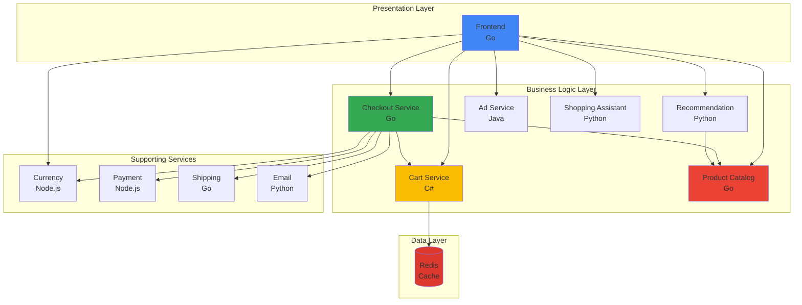
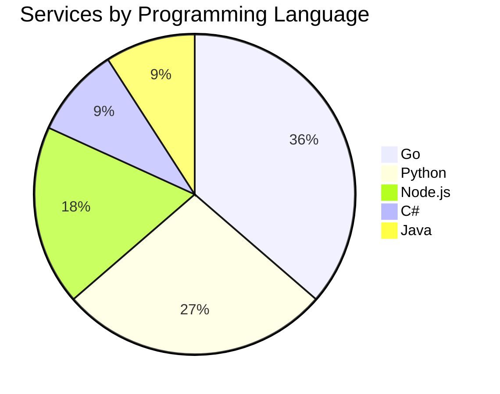
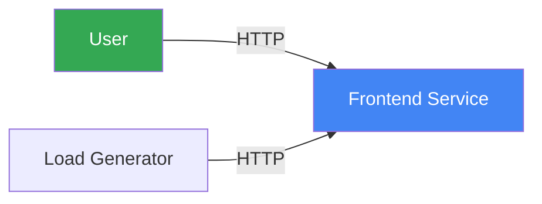
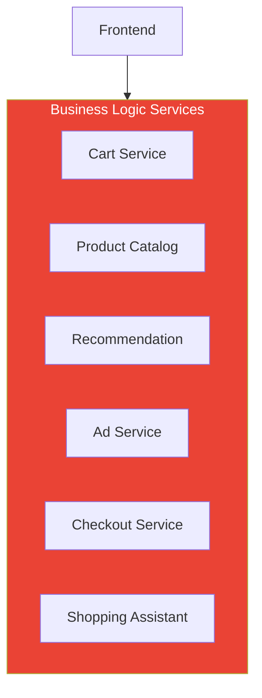
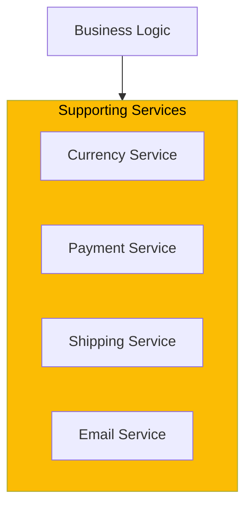
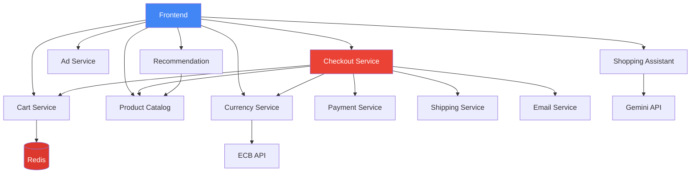
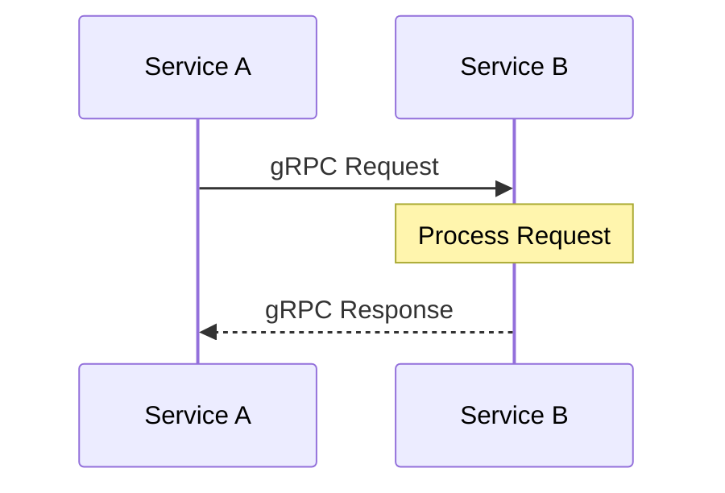
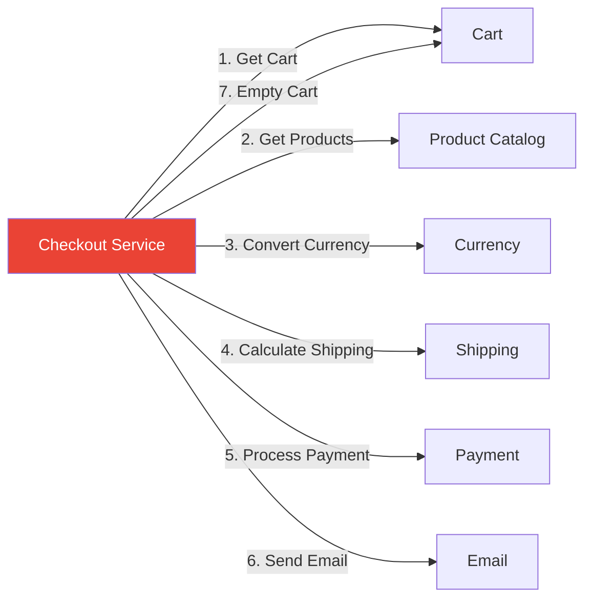
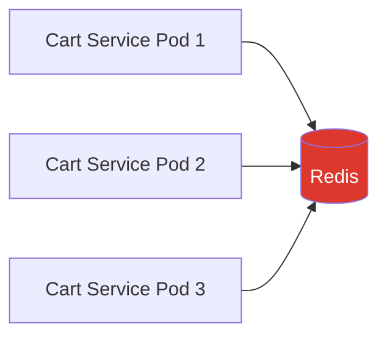

Online Boutique is built using a microservices architecture with 11 independent services, plus a load generator for testing. Each service is designed to handle a specific business capability and can be developed, deployed, and scaled independently.

## Service Layers



## Service Catalog

<CardGroup cols={2}>
  <Card title="Frontend" icon="window-maximize" href="/microservices/frontend">
    **Go** - Web UI and API gateway
  </Card>
  <Card title="Cart Service" icon="cart-shopping" href="/microservices/cartservice">
    **C#** - Shopping cart management
  </Card>
  <Card title="Product Catalog" icon="box" href="/microservices/productcatalogservice">
    **Go** - Product inventory and search
  </Card>
  <Card title="Currency Service" icon="dollar-sign" href="/microservices/currencyservice">
    **Node.js** - Multi-currency support
  </Card>
  <Card title="Payment Service" icon="credit-card" href="/microservices/paymentservice">
    **Node.js** - Payment processing
  </Card>
  <Card title="Shipping Service" icon="truck" href="/microservices/shippingservice">
    **Go** - Shipping cost calculation
  </Card>
  <Card title="Email Service" icon="envelope" href="/microservices/emailservice">
    **Python** - Order confirmation emails
  </Card>
  <Card title="Checkout Service" icon="cash-register" href="/microservices/checkoutservice">
    **Go** - Order orchestration
  </Card>
  <Card title="Recommendation" icon="star" href="/microservices/recommendationservice">
    **Python** - Product recommendations
  </Card>
  <Card title="Ad Service" icon="rectangle-ad" href="/microservices/adservice">
    **Java** - Contextual advertisements
  </Card>
  <Card title="Load Generator" icon="chart-line" href="/microservices/loadgenerator">
    **Python/Locust** - Traffic simulation
  </Card>
  <Card title="Shopping Assistant" icon="robot" href="/microservices/shoppingassistantservice">
    **Python** - AI-powered assistance
  </Card>
</CardGroup>

## Service Comparison

| Service | Language | Lines of Code | Dependencies | Purpose |
|---------|----------|---------------|--------------|---------|
| **Frontend** | Go | ~1,500 | All services | Web UI and gateway |
| **Cart Service** | C# | ~400 | Redis | Cart management |
| **Product Catalog** | Go | ~300 | None | Product data |
| **Currency Service** | Node.js | ~200 | ECB API | Currency conversion |
| **Payment Service** | Node.js | ~150 | None | Payment processing |
| **Shipping Service** | Go | ~200 | None | Shipping calculation |
| **Email Service** | Python | ~150 | None | Email notifications |
| **Checkout Service** | Go | ~500 | 6 services | Order orchestration |
| **Recommendation** | Python | ~200 | Product Catalog | Recommendations |
| **Ad Service** | Java | ~300 | None | Advertisements |
| **Load Generator** | Python | ~200 | Frontend | Traffic generation |
| **Shopping Assistant** | Python | ~400 | Gemini API | AI assistance |

## Language Distribution



### Why Polyglot?

Online Boutique intentionally uses multiple programming languages to demonstrate:

<AccordionGroup>
  <Accordion title="Real-World Scenarios" icon="building">
    Most organizations have diverse technology stacks. Teams may prefer different languages based on:
    - Existing expertise
    - Performance requirements
    - Library ecosystems
    - Team preferences
  </Accordion>
  
  <Accordion title="Best Tool for the Job" icon="wrench">
    Different languages excel at different tasks:
    - **Go**: High performance, great for services with high throughput
    - **Python**: Excellent for ML/AI, rapid development
    - **Node.js**: Event-driven, good for I/O-heavy operations
    - **C#**: Strong typing, great for business logic
    - **Java**: Enterprise-ready, robust ecosystem
  </Accordion>
  
  <Accordion title="gRPC Compatibility" icon="plug">
    gRPC works seamlessly across all languages:
    - Same Protocol Buffer definitions
    - Consistent API contracts
    - Language-specific code generation
    - No impedance mismatch
  </Accordion>
  
  <Accordion title="Learning Opportunity" icon="graduation-cap">
    Developers can explore:
    - Different language paradigms
    - Various frameworks and tools
    - Cross-language integration
    - Polyglot debugging
  </Accordion>
</AccordionGroup>

## Service Tiers

Services are organized into logical tiers based on their role:

### Frontend Tier



**Services**:
- **Frontend**: User-facing web application
- **Load Generator**: Simulates user traffic

**Characteristics**:
- HTTP/HTTPS protocol
- Stateless (session in cookies)
- Horizontally scalable

### Business Logic Tier



**Services**:
- **Cart Service**: Shopping cart operations
- **Product Catalog**: Product data management
- **Recommendation**: Product suggestions
- **Ad Service**: Advertisement serving
- **Checkout Service**: Order orchestration
- **Shopping Assistant**: AI-powered help

**Characteristics**:
- gRPC protocol
- Business logic implementation
- May have state (Cart uses Redis)

### Supporting Services Tier



**Services**:
- **Currency Service**: Currency conversion
- **Payment Service**: Payment processing
- **Shipping Service**: Shipping calculations
- **Email Service**: Email notifications

**Characteristics**:
- gRPC protocol
- Utility functions
- Stateless
- May call external APIs

## Service Dependencies



### Dependency Matrix

| Service | Depends On | Used By |
|---------|------------|---------|
| **Frontend** | All backend services | Load Generator |
| **Cart Service** | Redis | Frontend, Checkout |
| **Product Catalog** | None | Frontend, Checkout, Recommendation |
| **Currency Service** | ECB API | Frontend, Checkout |
| **Payment Service** | None | Checkout |
| **Shipping Service** | None | Checkout |
| **Email Service** | None | Checkout |
| **Checkout Service** | 6 services | Frontend |
| **Recommendation** | Product Catalog | Frontend |
| **Ad Service** | None | Frontend |
| **Shopping Assistant** | Gemini API | Frontend |

## Communication Patterns

### Synchronous (gRPC)

All inter-service communication uses gRPC:



**Benefits**:
- Type-safe contracts
- High performance
- Built-in error handling
- Streaming support

### Request-Response

Most services use simple request-response:

```go
// Client
response, err := client.GetProduct(ctx, &pb.GetProductRequest{
    Id: "OLJCESPC7Z",
})

// Server
func (s *server) GetProduct(ctx context.Context, req *pb.GetProductRequest) (*pb.Product, error) {
    product := findProduct(req.Id)
    return product, nil
}
```

### Orchestration (Checkout)

Checkout service orchestrates multiple services:



## Service Characteristics

### Stateless Services

Most services are stateless and can scale horizontally:

- Frontend
- Product Catalog
- Currency Service
- Payment Service
- Shipping Service
- Email Service
- Checkout Service
- Recommendation Service
- Ad Service
- Shopping Assistant

**Scaling**: Add more replicas
```bash
kubectl scale deployment/frontend --replicas=5
```

### Stateful Services

Only Cart Service maintains state (in Redis):



**Scaling**: Multiple pods share Redis
```bash
kubectl scale deployment/cartservice --replicas=3
```

## Resource Requirements

### CPU and Memory

| Service | CPU Request | CPU Limit | Memory Request | Memory Limit |
|---------|-------------|-----------|----------------|--------------|
| Frontend | 100m | 200m | 64Mi | 128Mi |
| Cart Service | 200m | 300m | 64Mi | 128Mi |
| Product Catalog | 100m | 200m | 64Mi | 128Mi |
| Currency Service | 100m | 200m | 64Mi | 128Mi |
| Payment Service | 100m | 200m | 64Mi | 128Mi |
| Shipping Service | 100m | 200m | 64Mi | 128Mi |
| Email Service | 100m | 200m | 64Mi | 128Mi |
| Checkout Service | 100m | 200m | 64Mi | 128Mi |
| Recommendation | 100m | 200m | 64Mi | 128Mi |
| Ad Service | 200m | 300m | 180Mi | 300Mi |
| Redis | 70m | 125m | 200Mi | 256Mi |

### Scaling Recommendations

| Service | Min Replicas | Max Replicas | Scale Metric |
|---------|--------------|--------------|--------------|
| Frontend | 2 | 10 | CPU > 70% |
| Cart Service | 2 | 5 | CPU > 70% |
| Product Catalog | 2 | 5 | CPU > 70% |
| Currency Service | 2 | 5 | CPU > 70% |
| Checkout Service | 2 | 5 | CPU > 70% |
| Others | 1 | 3 | CPU > 80% |

## Health Checks

All services implement health checks:

### Liveness Probe

Checks if the service is alive:

```yaml
livenessProbe:
  httpGet:
    path: /health
    port: 8080
  initialDelaySeconds: 10
  periodSeconds: 10
```

### Readiness Probe

Checks if the service is ready to accept traffic:

```yaml
readinessProbe:
  httpGet:
    path: /ready
    port: 8080
  initialDelaySeconds: 5
  periodSeconds: 5
```

### Health Check Responses

```json
{
  "status": "healthy",
  "service": "frontend",
  "version": "1.0.0",
  "dependencies": {
    "productcatalog": "healthy",
    "cart": "healthy",
    "currency": "healthy"
  }
}
```

## Observability

### Logging

All services use structured logging:

```json
{
  "timestamp": "2024-02-13T10:30:00Z",
  "level": "INFO",
  "service": "frontend",
  "trace_id": "abc123",
  "span_id": "def456",
  "message": "Request processed successfully",
  "duration_ms": 45
}
```

### Metrics

Services expose Prometheus metrics:

- `http_requests_total` - Total HTTP requests
- `http_request_duration_seconds` - Request duration
- `grpc_server_handled_total` - Total gRPC requests
- `grpc_server_handling_seconds` - gRPC request duration

### Tracing

Distributed tracing with OpenTelemetry:

```mermaid
gantt
    title Request Trace
    dateFormat X
    axisFormat %L ms
    
    Frontend : 0, 100
    Product Catalog : 10, 30
    Currency : 10, 25
    Cart : 10, 20
    Recommendation : 40, 30
```



## Development Workflow

### Local Development

Each service can be developed independently:

```bash
# Navigate to service directory
cd src/frontend

# Install dependencies
go mod download

# Run locally
go run main.go

# Run tests
go test ./...
```

### Building Images

Build container images:

```bash
# Build single service
docker build -t frontend:dev src/frontend

# Build all services with Skaffold
skaffold build
```

### Testing

Each service has its own test suite:

```bash
# Unit tests
npm test                    # Node.js services
go test ./...              # Go services
pytest                     # Python services
dotnet test                # C# services
mvn test                   # Java services
```

## Service Patterns

### Circuit Breaker

Prevent cascading failures:

```go
breaker := circuitbreaker.New(
    circuitbreaker.WithFailureThreshold(5),
    circuitbreaker.WithTimeout(30*time.Second),
)

err := breaker.Call(func() error {
    return callDownstreamService()
})
```

### Retry Logic

Retry transient failures:

```go
retry.Do(
    func() error {
        return callService()
    },
    retry.Attempts(3),
    retry.Delay(100*time.Millisecond),
    retry.DelayType(retry.BackOffDelay),
)
```

### Timeout

Set deadlines for requests:

```go
ctx, cancel := context.WithTimeout(context.Background(), 5*time.Second)
defer cancel()

response, err := client.GetProduct(ctx, request)
```

## Next Steps

Explore each microservice in detail:

<CardGroup cols={3}>
  <Card title="Frontend" icon="window-maximize" href="/microservices/frontend">
    Web UI and API gateway
  </Card>
  <Card title="Cart Service" icon="cart-shopping" href="/microservices/cartservice">
    Shopping cart management
  </Card>
  <Card title="Product Catalog" icon="box" href="/microservices/productcatalogservice">
    Product inventory
  </Card>
  <Card title="Currency Service" icon="dollar-sign" href="/microservices/currencyservice">
    Currency conversion
  </Card>
  <Card title="Payment Service" icon="credit-card" href="/microservices/paymentservice">
    Payment processing
  </Card>
  <Card title="Shipping Service" icon="truck" href="/microservices/shippingservice">
    Shipping calculation
  </Card>
  <Card title="Email Service" icon="envelope" href="/microservices/emailservice">
    Email notifications
  </Card>
  <Card title="Checkout Service" icon="cash-register" href="/microservices/checkoutservice">
    Order orchestration
  </Card>
  <Card title="Recommendation" icon="star" href="/microservices/recommendationservice">
    Product recommendations
  </Card>
  <Card title="Ad Service" icon="rectangle-ad" href="/microservices/adservice">
    Advertisements
  </Card>
  <Card title="Load Generator" icon="chart-line" href="/microservices/loadgenerator">
    Traffic simulation
  </Card>
  <Card title="Shopping Assistant" icon="robot" href="/microservices/shoppingassistantservice">
    AI assistance
  </Card>
</CardGroup>
