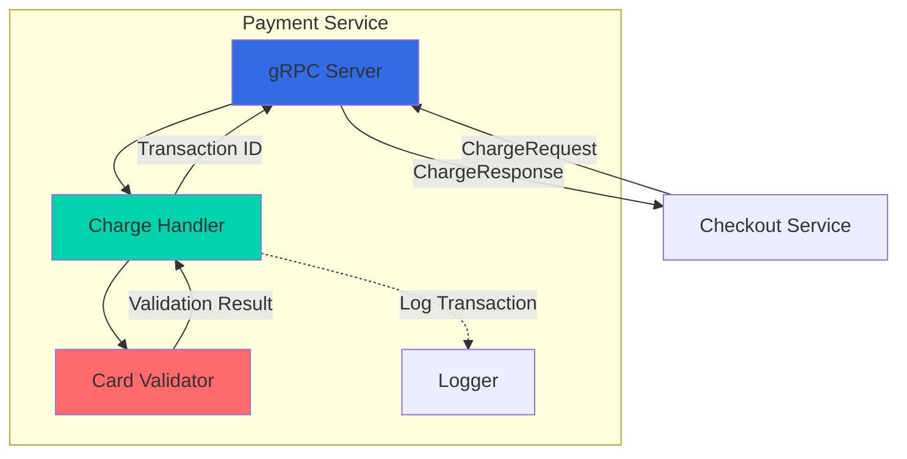
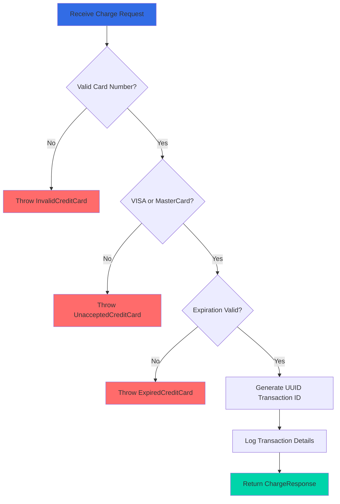

## Overview

The Payment Service is a Node.js-based microservice responsible for processing credit card payments in the Online Boutique application. It validates credit card information, checks expiration dates, and generates transaction IDs for successful charges. The service accepts only VISA and MasterCard credit cards.

<CardGroup cols={2}>
  <Card title="Language" icon="node-js">
    Node.js with gRPC
  </Card>
  <Card title="Port" icon="network-wired">
    50051
  </Card>
  <Card title="Dependencies" icon="link">
    None (standalone service)
  </Card>
  <Card title="Data Store" icon="database">
    None (stateless)
  </Card>
</CardGroup>

## Service Architecture



## Key Features

<AccordionGroup>
  <Accordion title="Credit Card Validation">
    - Validates credit card numbers using Luhn algorithm
    - Checks card type (VISA and MasterCard only)
    - Verifies expiration dates against current date
    - Returns detailed error messages for invalid cards
  </Accordion>

  <Accordion title="Transaction Processing">
    - Generates unique transaction IDs using UUID v4
    - Logs all transaction attempts with card details
    - Simulates payment processing (no actual charges)
    - Returns transaction ID for successful charges
  </Accordion>

  <Accordion title="Error Handling">
    - InvalidCreditCard: Card number fails validation
    - UnacceptedCreditCard: Card type not supported (AMEX, Diners Club, etc.)
    - ExpiredCreditCard: Card expiration date has passed
    - All errors include descriptive messages
  </Accordion>

  <Accordion title="Observability">
    - Structured logging with Pino
    - OpenTelemetry tracing support
    - Google Cloud Profiler integration
    - Health check endpoint
  </Accordion>
</AccordionGroup>

## gRPC API

### Service Definition

```protobuf
service PaymentService {
    rpc Charge(ChargeRequest) returns (ChargeResponse) {}
}
```

### Messages

<Tabs>
  <Tab title="ChargeRequest">
    ```protobuf
    message ChargeRequest {
        Money amount = 1;
        CreditCardInfo credit_card = 2;
    }
    
    message CreditCardInfo {
        string credit_card_number = 1;
        int32 credit_card_cvv = 2;
        int32 credit_card_expiration_year = 3;
        int32 credit_card_expiration_month = 4;
    }
    
    message Money {
        string currency_code = 1;
        int64 units = 2;
        int32 nanos = 3;
    }
    ```
    
    **Fields:**
    - `amount`: The amount to charge (currency code, units, and nanos)
    - `credit_card`: Credit card information for the charge
  </Tab>

  <Tab title="ChargeResponse">
    ```protobuf
    message ChargeResponse {
        string transaction_id = 1;
    }
    ```
    
    **Fields:**
    - `transaction_id`: Unique identifier for the transaction (UUID v4)
  </Tab>
</Tabs>

### Methods

#### Charge

Processes a credit card payment and returns a transaction ID.

<CodeGroup>
```javascript Request Example
const request = {
  amount: {
    currency_code: 'USD',
    units: 99,
    nanos: 990000000
  },
  credit_card: {
    credit_card_number: '4432-8015-6152-0454',
    credit_card_cvv: 672,
    credit_card_expiration_year: 2025,
    credit_card_expiration_month: 12
  }
};

const response = await paymentClient.charge(request);
```

```javascript Response Example
{
  transaction_id: '550e8400-e29b-41d4-a716-446655440000'
}
```

```javascript Error Example
{
  code: 400,
  message: 'Sorry, we cannot process amex credit cards. Only VISA or MasterCard is accepted.'
}
```
</CodeGroup>

**Validation Rules:**
- Card number must pass Luhn algorithm validation
- Only VISA and MasterCard are accepted
- Expiration date must be in the future
- All required fields must be present

## Configuration

### Environment Variables

| Variable | Description | Default | Required |
|----------|-------------|---------|----------|
| `PORT` | gRPC server port | `50051` | Yes |
| `DISABLE_PROFILER` | Disable Google Cloud Profiler | `false` | No |
| `ENABLE_TRACING` | Enable OpenTelemetry tracing | `0` | No |
| `COLLECTOR_SERVICE_ADDR` | OpenTelemetry collector address | - | If tracing enabled |
| `OTEL_SERVICE_NAME` | Service name for tracing | `paymentservice` | No |

### Example Configuration

```yaml
env:
  - name: PORT
    value: "50051"
  - name: DISABLE_PROFILER
    value: "1"
  - name: ENABLE_TRACING
    value: "1"
  - name: COLLECTOR_SERVICE_ADDR
    value: "otelcol:4317"
```

## Implementation Details

### Card Validation Logic



### Core Components

<Tabs>
  <Tab title="server.js">
    Main gRPC server implementation that handles incoming charge requests.
    
    ```javascript
    class HipsterShopServer {
      static ChargeServiceHandler(call, callback) {
        try {
          logger.info(`PaymentService#Charge invoked`);
          const response = charge(call.request);
          callback(null, response);
        } catch (err) {
          callback(err);
        }
      }
      
      listen() {
        this.server.bindAsync(
          `[::]:${this.port}`,
          grpc.ServerCredentials.createInsecure(),
          () => {
            logger.info(`PaymentService started on port ${this.port}`);
            this.server.start();
          }
        );
      }
    }
    ```
  </Tab>

  <Tab title="charge.js">
    Payment processing logic with card validation.
    
    ```javascript
    module.exports = function charge(request) {
      const { amount, credit_card: creditCard } = request;
      const cardNumber = creditCard.credit_card_number;
      const cardInfo = cardValidator(cardNumber);
      const { card_type: cardType, valid } = cardInfo.getCardDetails();

      if (!valid) {
        throw new InvalidCreditCard();
      }

      if (!(cardType === 'visa' || cardType === 'mastercard')) {
        throw new UnacceptedCreditCard(cardType);
      }

      // Validate expiration date
      const currentMonth = new Date().getMonth() + 1;
      const currentYear = new Date().getFullYear();
      const { credit_card_expiration_year: year,
              credit_card_expiration_month: month } = creditCard;
      
      if ((currentYear * 12 + currentMonth) > (year * 12 + month)) {
        throw new ExpiredCreditCard(cardNumber, month, year);
      }

      logger.info(`Transaction processed: ${cardType} ending ${cardNumber.substr(-4)}`);
      return { transaction_id: uuidv4() };
    };
    ```
  </Tab>

  <Tab title="index.js">
    Service initialization with observability setup.
    
    ```javascript
    // Enable profiling
    if (!process.env.DISABLE_PROFILER) {
      require('@google-cloud/profiler').start({
        serviceContext: {
          service: 'paymentservice',
          version: '1.0.0'
        }
      });
    }

    // Enable tracing
    if (process.env.ENABLE_TRACING == "1") {
      const { NodeSDK } = require('@opentelemetry/sdk-node');
      const { OTLPTraceExporter } = require('@opentelemetry/exporter-otlp-grpc');
      
      const sdk = new NodeSDK({
        resource: resourceFromAttributes({
          [ATTR_SERVICE_NAME]: 'paymentservice',
        }),
        traceExporter: new OTLPTraceExporter({
          url: process.env.COLLECTOR_SERVICE_ADDR
        }),
      });
      
      sdk.start();
    }

    const server = new HipsterShopServer(PROTO_PATH, PORT);
    server.listen();
    ```
  </Tab>
</Tabs>

## Dependencies

### NPM Packages

```json
{
  "dependencies": {
    "@google-cloud/profiler": "6.0.3",
    "@grpc/grpc-js": "1.14.3",
    "@grpc/proto-loader": "0.8.0",
    "@opentelemetry/api": "1.9.0",
    "@opentelemetry/exporter-otlp-grpc": "0.26.0",
    "@opentelemetry/instrumentation-grpc": "0.211.0",
    "@opentelemetry/sdk-trace-base": "2.5.0",
    "@opentelemetry/sdk-node": "0.211.0",
    "@opentelemetry/resources": "2.5.0",
    "@opentelemetry/semantic-conventions": "1.39.0",
    "pino": "10.3.0",
    "simple-card-validator": "^1.1.0",
    "uuid": "^13.0.0"
  }
}
```

<Accordion title="Package Descriptions">
- **@grpc/grpc-js**: Pure JavaScript gRPC implementation
- **@grpc/proto-loader**: Load .proto files at runtime
- **simple-card-validator**: Credit card validation library (Luhn algorithm)
- **uuid**: Generate unique transaction IDs
- **pino**: Fast JSON logger
- **@opentelemetry/\***: Distributed tracing instrumentation
- **@google-cloud/profiler**: Performance profiling for Google Cloud
</Accordion>

## Testing

### Test Credit Cards

For testing purposes, use these valid test card numbers:

<CardGroup cols={2}>
  <Card title="VISA" icon="credit-card">
    ```
    4432-8015-6152-0454
    CVV: 672
    Exp: 12/2025
    ```
  </Card>
  <Card title="MasterCard" icon="credit-card">
    ```
    5555-5555-5555-4444
    CVV: 123
    Exp: 12/2025
    ```
  </Card>
</CardGroup>

### Invalid Card Scenarios

<Steps>
  <Step title="Invalid Card Number">
    Use card number `1234-5678-9012-3456` to trigger InvalidCreditCard error
  </Step>
  <Step title="Unsupported Card Type">
    Use AMEX card `3782-822463-10005` to trigger UnacceptedCreditCard error
  </Step>
  <Step title="Expired Card">
    Use expiration date in the past (e.g., 01/2020) to trigger ExpiredCreditCard error
  </Step>
</Steps>

### Manual Testing

```bash
# Install grpcurl for testing
go install github.com/fullstorydev/grpcurl/cmd/grpcurl@latest

# Test charge endpoint
grpcurl -plaintext \
  -d '{
    "amount": {"currency_code": "USD", "units": 99, "nanos": 990000000},
    "credit_card": {
      "credit_card_number": "4432-8015-6152-0454",
      "credit_card_cvv": 672,
      "credit_card_expiration_year": 2025,
      "credit_card_expiration_month": 12
    }
  }' \
  localhost:50051 \
  hipstershop.PaymentService/Charge
```

## Deployment

### Kubernetes Deployment

```yaml
apiVersion: apps/v1
kind: Deployment
metadata:
  name: paymentservice
spec:
  selector:
    matchLabels:
      app: paymentservice
  template:
    metadata:
      labels:
        app: paymentservice
    spec:
      containers:
      - name: server
        image: paymentservice
        ports:
        - containerPort: 50051
        env:
        - name: PORT
          value: "50051"
        - name: DISABLE_PROFILER
          value: "1"
        resources:
          requests:
            cpu: 100m
            memory: 64Mi
          limits:
            cpu: 200m
            memory: 128Mi
        livenessProbe:
          grpc:
            port: 50051
        readinessProbe:
          grpc:
            port: 50051
```

### Docker Build

```dockerfile
FROM node:20-alpine

WORKDIR /app
COPY package*.json ./
RUN npm ci --only=production

COPY . .

EXPOSE 50051
ENTRYPOINT ["node", "index.js"]
```

## Monitoring

### Key Metrics

<CardGroup cols={2}>
  <Card title="Request Rate" icon="chart-line">
    Number of charge requests per second
  </Card>
  <Card title="Error Rate" icon="triangle-exclamation">
    Percentage of failed charge attempts
  </Card>
  <Card title="Latency" icon="clock">
    P50, P95, P99 response times
  </Card>
  <Card title="Card Validation" icon="shield-check">
    Validation failure breakdown by error type
  </Card>
</CardGroup>

### Log Examples

```json
{
  "level": "info",
  "message": "Transaction processed: visa ending 0454 Amount: USD99.99",
  "severity": "info"
}
```

```json
{
  "level": "error",
  "message": "Sorry, we cannot process amex credit cards. Only VISA or MasterCard is accepted.",
  "code": 400,
  "severity": "error"
}
```

## Security Considerations

<Warning>
This is a demo service and should NOT be used in production without significant security enhancements.
</Warning>

### Current Limitations

- No PCI DSS compliance
- Credit card data not encrypted
- No actual payment gateway integration
- CVV not validated
- No fraud detection
- No rate limiting

### Production Requirements

For a production payment service, you would need:

1. PCI DSS Level 1 compliance
2. End-to-end encryption for card data
3. Integration with real payment gateway (Stripe, Braintree, etc.)
4. Tokenization of card numbers
5. Fraud detection and prevention
6. Strong authentication and authorization
7. Comprehensive audit logging
8. Rate limiting and DDoS protection

## Troubleshooting

<AccordionGroup>
  <Accordion title="Service fails to start">
    **Symptoms:** Service crashes on startup
    
    **Solutions:**
    - Verify PORT environment variable is set
    - Check proto files are present in proto/ directory
    - Ensure Node.js version is 18 or higher
    - Check logs for missing dependencies
  </Accordion>

  <Accordion title="All charges fail validation">
    **Symptoms:** Every charge request returns InvalidCreditCard
    
    **Solutions:**
    - Verify card number format (use hyphens: 4432-8015-6152-0454)
    - Check simple-card-validator package is installed
    - Ensure card number passes Luhn algorithm
    - Use test card numbers provided in documentation
  </Accordion>

  <Accordion title="Expired card errors for valid dates">
    **Symptoms:** Cards with future expiration dates fail
    
    **Solutions:**
    - Check server system time is correct
    - Verify expiration year is 4-digit format (2025, not 25)
    - Ensure expiration month is 1-12
    - Check timezone settings
  </Accordion>

  <Accordion title="High latency">
    **Symptoms:** Slow response times for charge requests
    
    **Solutions:**
    - Check CPU and memory usage
    - Verify no network issues
    - Review profiler data if enabled
    - Check for excessive logging
  </Accordion>
</AccordionGroup>

## Related Services

<CardGroup cols={3}>
  <Card title="Checkout Service" icon="shopping-cart" href="/microservices/checkoutservice">
    Calls Payment Service to process orders
  </Card>
  <Card title="Currency Service" icon="dollar-sign" href="/microservices/currencyservice">
    Provides currency conversion for amounts
  </Card>
  <Card title="Email Service" icon="envelope" href="/microservices/emailservice">
    Sends confirmation after successful payment
  </Card>
</CardGroup>

## Additional Resources

- [gRPC Node.js Documentation](https://grpc.io/docs/languages/node/)
- [simple-card-validator Library](https://www.npmjs.com/package/simple-card-validator)
- [PCI DSS Compliance](https://www.pcisecuritystandards.org/)
- [Payment Gateway Integration Best Practices](https://stripe.com/docs/security/guide)
