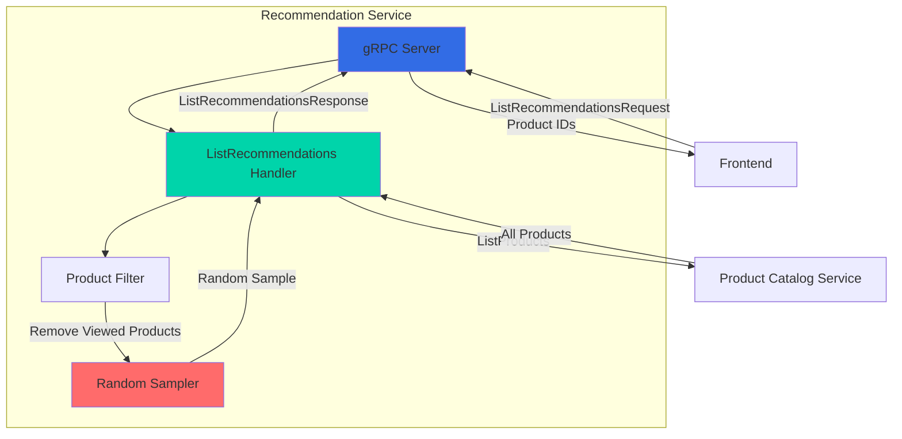
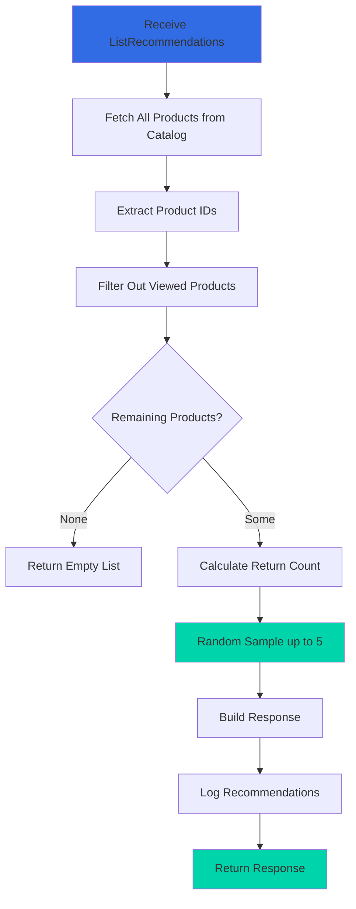

## Overview

The Recommendation Service is a Python-based microservice that provides product recommendations to users in the Online Boutique application. It uses a simple random sampling algorithm to suggest products that the user hasn't already viewed, helping to increase product discovery and engagement.

<CardGroup cols={2}>
  <Card title="Language" icon="python">
    Python 3 with gRPC
  </Card>
  <Card title="Port" icon="network-wired">
    8080
  </Card>
  <Card title="Dependencies" icon="link">
    Product Catalog Service
  </Card>
  <Card title="Data Store" icon="database">
    None (stateless)
  </Card>
</CardGroup>

## Service Architecture



## Key Features

<AccordionGroup>
  <Accordion title="Random Sampling Algorithm">
    - Fetches all products from Product Catalog
    - Filters out products user has already viewed
    - Randomly samples up to 5 products from remaining set
    - Ensures diverse recommendations across requests
  </Accordion>

  <Accordion title="Simple and Fast">
    - No machine learning or complex algorithms
    - Low latency recommendations
    - No training data required
    - Stateless operation
  </Accordion>

  <Accordion title="Product Filtering">
    - Excludes products user has already seen
    - Prevents duplicate recommendations
    - Maximizes product discovery
  </Accordion>

  <Accordion title="Observability">
    - Structured JSON logging
    - OpenTelemetry tracing support
    - Google Cloud Profiler integration (optional)
    - Health check endpoint
  </Accordion>
</AccordionGroup>


## gRPC API

### Service Definition

```protobuf
service RecommendationService {
    rpc ListRecommendations(ListRecommendationsRequest) returns (ListRecommendationsResponse) {}
}
```

### Messages

<Tabs>
  <Tab title="ListRecommendationsRequest">
    ```protobuf
    message ListRecommendationsRequest {
        string user_id = 1;
        repeated string product_ids = 2;
    }
    ```
    
    **Fields:**
    - `user_id`: User identifier (currently not used in algorithm)
    - `product_ids`: List of product IDs user has already viewed (to exclude from recommendations)
  </Tab>

  <Tab title="ListRecommendationsResponse">
    ```protobuf
    message ListRecommendationsResponse {
        repeated string product_ids = 1;
    }
    ```
    
    **Fields:**
    - `product_ids`: List of recommended product IDs (up to 5)
  </Tab>
</Tabs>

### Methods

#### ListRecommendations

Returns a list of recommended product IDs based on products the user hasn't viewed.

<CodeGroup>
```python Request Example
request = demo_pb2.ListRecommendationsRequest(
    user_id='user-123',
    product_ids=['OLJCESPC7Z', '66VCHSJNUP', '1YMWWN1N4O']
)

response = stub.ListRecommendations(request)
```

```python Response Example
demo_pb2.ListRecommendationsResponse(
    product_ids=[
        '2ZYFJ3GM2N',
        '0PUK6V6EV0',
        'LS4PSXUNUM',
        '9SIQT8TOJO',
        '6E92ZMYYFZ'
    ]
)
```
</CodeGroup>

**Algorithm:**
1. Fetch all products from Product Catalog Service
2. Filter out products in `product_ids` (already viewed)
3. Randomly sample up to 5 products from remaining set
4. Return sampled product IDs

## Configuration

### Environment Variables

| Variable | Description | Default | Required |
|----------|-------------|---------|----------|
| `PORT` | gRPC server port | `8080` | No |
| `PRODUCT_CATALOG_SERVICE_ADDR` | Product Catalog service address | - | Yes |
| `DISABLE_PROFILER` | Disable Google Cloud Profiler | `false` | No |
| `ENABLE_TRACING` | Enable OpenTelemetry tracing | `0` | No |
| `COLLECTOR_SERVICE_ADDR` | OpenTelemetry collector address | `localhost:4317` | If tracing enabled |
| `GCP_PROJECT_ID` | Google Cloud project ID for profiler | - | If profiler enabled |

### Example Configuration

```yaml
env:
  - name: PORT
    value: "8080"
  - name: PRODUCT_CATALOG_SERVICE_ADDR
    value: "productcatalogservice:3550"
  - name: DISABLE_PROFILER
    value: "1"
  - name: ENABLE_TRACING
    value: "1"
  - name: COLLECTOR_SERVICE_ADDR
    value: "otelcol:4317"
```

## Implementation Details

### Recommendation Algorithm



### Core Implementation

```python
class RecommendationService(demo_pb2_grpc.RecommendationServiceServicer):
    def ListRecommendations(self, request, context):
        max_responses = 5
        
        # Fetch list of products from product catalog
        cat_response = product_catalog_stub.ListProducts(demo_pb2.Empty())
        product_ids = [x.id for x in cat_response.products]
        
        # Filter out products user has already viewed
        filtered_products = list(set(product_ids) - set(request.product_ids))
        num_products = len(filtered_products)
        num_return = min(max_responses, num_products)
        
        # Sample list of indices to return
        indices = random.sample(range(num_products), num_return)
        
        # Fetch product ids from indices
        prod_list = [filtered_products[i] for i in indices]
        logger.info("[Recv ListRecommendations] product_ids={}".format(prod_list))
        
        # Build and return response
        response = demo_pb2.ListRecommendationsResponse()
        response.product_ids.extend(prod_list)
        return response
```

### Key Components

<Tabs>
  <Tab title="Product Fetching">
    Retrieves all products from Product Catalog Service.
    
    ```python
    # Connect to Product Catalog Service
    catalog_addr = os.environ.get('PRODUCT_CATALOG_SERVICE_ADDR', '')
    channel = grpc.insecure_channel(catalog_addr)
    product_catalog_stub = demo_pb2_grpc.ProductCatalogServiceStub(channel)
    
    # Fetch all products
    cat_response = product_catalog_stub.ListProducts(demo_pb2.Empty())
    product_ids = [x.id for x in cat_response.products]
    ```
  </Tab>

  <Tab title="Filtering">
    Removes products user has already viewed.
    
    ```python
    # Use set difference to filter out viewed products
    filtered_products = list(set(product_ids) - set(request.product_ids))
    ```
  </Tab>

  <Tab title="Random Sampling">
    Randomly selects up to 5 products.
    
    ```python
    import random
    
    max_responses = 5
    num_products = len(filtered_products)
    num_return = min(max_responses, num_products)
    
    # Random sample without replacement
    indices = random.sample(range(num_products), num_return)
    prod_list = [filtered_products[i] for i in indices]
    ```
  </Tab>
</Tabs>

## Dependencies

### Python Packages

```txt
grpcio==1.76.0
grpcio-health-checking==1.76.0
google-api-core==2.28.1
opentelemetry-api==1.39.1
opentelemetry-distro==0.60b1
opentelemetry-exporter-otlp-proto-grpc==1.39.1
opentelemetry-instrumentation-grpc==0.60b1
python-json-logger==4.0.0
requests==2.32.5
rsa==4.9.1
```

<Accordion title="Package Descriptions">
- **grpcio**: Python gRPC implementation
- **grpcio-health-checking**: Health check service
- **google-api-core**: Google API client core library
- **opentelemetry-\***: Distributed tracing instrumentation
- **python-json-logger**: JSON structured logging
- **requests**: HTTP library for API calls
- **rsa**: RSA encryption library
</Accordion>

## Testing

### Manual Testing

```bash
# Run the service
cd src/recommendationservice
python recommendation_server.py

# Test with grpcurl
grpcurl -plaintext \
  -d '{
    "user_id": "user-123",
    "product_ids": ["OLJCESPC7Z", "66VCHSJNUP"]
  }' \
  localhost:8080 \
  hipstershop.RecommendationService/ListRecommendations
```

### Test Scenarios

<Steps>
  <Step title="No Viewed Products">
    Request recommendations with empty product_ids - should return up to 5 random products
  </Step>
  <Step title="Some Viewed Products">
    Request with 2-3 viewed products - should return up to 5 products excluding those
  </Step>
  <Step title="All Products Viewed">
    Request with all product IDs - should return empty list
  </Step>
  <Step title="Randomness Check">
    Make multiple requests with same input - should return different recommendations
  </Step>
</Steps>

### Unit Testing

```python
import unittest
from unittest.mock import Mock, patch
import demo_pb2
from recommendation_server import RecommendationService

class TestRecommendationService(unittest.TestCase):
    def setUp(self):
        self.service = RecommendationService()
    
    @patch('recommendation_server.product_catalog_stub')
    def test_list_recommendations(self, mock_catalog):
        # Mock product catalog response
        mock_response = Mock()
        mock_response.products = [
            Mock(id='PROD1'),
            Mock(id='PROD2'),
            Mock(id='PROD3'),
            Mock(id='PROD4'),
            Mock(id='PROD5'),
            Mock(id='PROD6'),
        ]
        mock_catalog.ListProducts.return_value = mock_response
        
        # Create request
        request = demo_pb2.ListRecommendationsRequest(
            user_id='user-123',
            product_ids=['PROD1', 'PROD2']
        )
        
        # Call service
        response = self.service.ListRecommendations(request, None)
        
        # Verify response
        self.assertLessEqual(len(response.product_ids), 5)
        self.assertNotIn('PROD1', response.product_ids)
        self.assertNotIn('PROD2', response.product_ids)
```

## Deployment

### Kubernetes Deployment

```yaml
apiVersion: apps/v1
kind: Deployment
metadata:
  name: recommendationservice
spec:
  selector:
    matchLabels:
      app: recommendationservice
  template:
    metadata:
      labels:
        app: recommendationservice
    spec:
      containers:
      - name: server
        image: recommendationservice
        ports:
        - containerPort: 8080
        env:
        - name: PORT
          value: "8080"
        - name: PRODUCT_CATALOG_SERVICE_ADDR
          value: "productcatalogservice:3550"
        - name: DISABLE_PROFILER
          value: "1"
        resources:
          requests:
            cpu: 100m
            memory: 64Mi
          limits:
            cpu: 200m
            memory: 128Mi
        livenessProbe:
          grpc:
            port: 8080
          initialDelaySeconds: 10
        readinessProbe:
          grpc:
            port: 8080
          initialDelaySeconds: 5
```

### Docker Build

```dockerfile
FROM python:3.11-slim

WORKDIR /app

# Install dependencies
COPY requirements.txt .
RUN pip install --no-cache-dir -r requirements.txt

# Copy application
COPY . .

EXPOSE 8080

ENTRYPOINT ["python", "recommendation_server.py"]
```

## Monitoring

### Key Metrics

<CardGroup cols={2}>
  <Card title="Request Rate" icon="chart-line">
    Number of recommendation requests per second
  </Card>
  <Card title="Latency" icon="clock">
    P50, P95, P99 response times
  </Card>
  <Card title="Recommendations Returned" icon="list">
    Average number of products recommended
  </Card>
  <Card title="Empty Responses" icon="circle-xmark">
    Percentage of requests returning no recommendations
  </Card>
</CardGroup>

### Log Examples

```json
{
  "timestamp": "2024-02-13T10:30:45.123Z",
  "severity": "info",
  "message": "[Recv ListRecommendations] product_ids=['2ZYFJ3GM2N', '0PUK6V6EV0', 'LS4PSXUNUM']"
}
```

## Performance Characteristics

<CardGroup cols={2}>
  <Card title="Response Time" icon="gauge-high">
    Typical: 10-30ms
    P99: <100ms
  </Card>
  <Card title="Throughput" icon="rocket">
    Can handle 500+ req/s per instance
  </Card>
  <Card title="Memory Usage" icon="memory">
    Typical: 30-50 MB
    Peak: <128 MB
  </Card>
  <Card title="CPU Usage" icon="microchip">
    Typical: <10%
    Peak: <30%
  </Card>
</CardGroup>

## Future Enhancements

<Warning>
This is a simplified demo implementation. Production recommendation systems would require significant enhancements.
</Warning>

### Potential Improvements

1. **Machine Learning Models**
   - Collaborative filtering
   - Content-based filtering
   - Hybrid recommendation approaches
   - Deep learning models (neural collaborative filtering)

2. **Personalization**
   - User purchase history
   - Browsing behavior analysis
   - User preferences and ratings
   - Demographic information

3. **Business Logic**
   - Trending products
   - Seasonal recommendations
   - Inventory-aware recommendations
   - Margin-optimized suggestions

4. **Performance Optimization**
   - Caching of recommendations
   - Pre-computed recommendations
   - Batch processing
   - A/B testing framework

5. **Advanced Features**
   - Real-time recommendations
   - Context-aware suggestions (time, location)
   - Cross-sell and upsell logic
   - Similar product recommendations

## Troubleshooting

<AccordionGroup>
  <Accordion title="Service fails to start">
    **Symptoms:** Service crashes on startup
    
    **Solutions:**
    - Verify PRODUCT_CATALOG_SERVICE_ADDR is set and correct
    - Check Product Catalog Service is running and reachable
    - Ensure Python version is 3.9 or higher
    - Install dependencies: `pip install -r requirements.txt`
    - Check logs for specific error messages
  </Accordion>

  <Accordion title="Always returns empty recommendations">
    **Symptoms:** No products recommended
    
    **Solutions:**
    - Verify Product Catalog Service is returning products
    - Check if all products are in the viewed list
    - Test Product Catalog Service independently
    - Review filtering logic
    - Check logs for errors
  </Accordion>

  <Accordion title="Same recommendations every time">
    **Symptoms:** No randomness in recommendations
    
    **Solutions:**
    - Verify random.sample() is being called
    - Check if random seed is being set
    - Ensure sufficient products available after filtering
    - Review sampling logic
  </Accordion>

  <Accordion title="High latency">
    **Symptoms:** Slow recommendation responses
    
    **Solutions:**
    - Check Product Catalog Service latency
    - Verify network connectivity
    - Review product catalog size
    - Consider caching product list
    - Check for resource constraints
  </Accordion>
</AccordionGroup>

## Related Services

<CardGroup cols={3}>
  <Card title="Frontend" icon="window-maximize" href="/microservices/frontend">
    Displays recommendations to users
  </Card>
  <Card title="Product Catalog" icon="box" href="/microservices/productcatalogservice">
    Provides product list for recommendations
  </Card>
</CardGroup>

## Additional Resources

- [gRPC Python Documentation](https://grpc.io/docs/languages/python/)
- [Recommendation Systems Overview](https://developers.google.com/machine-learning/recommendation)
- [Collaborative Filtering](https://en.wikipedia.org/wiki/Collaborative_filtering)
- [Python Random Module](https://docs.python.org/3/library/random.html)
