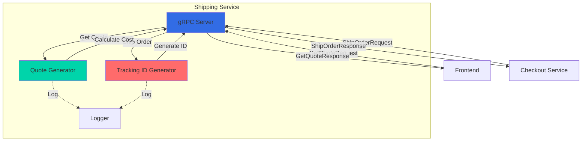
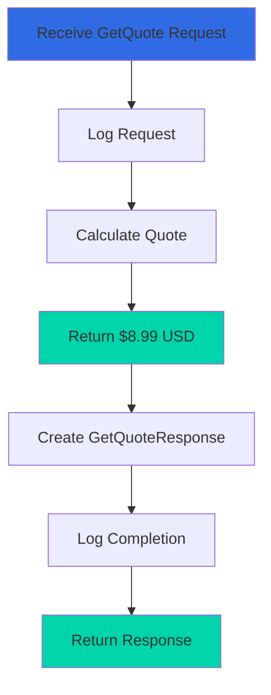
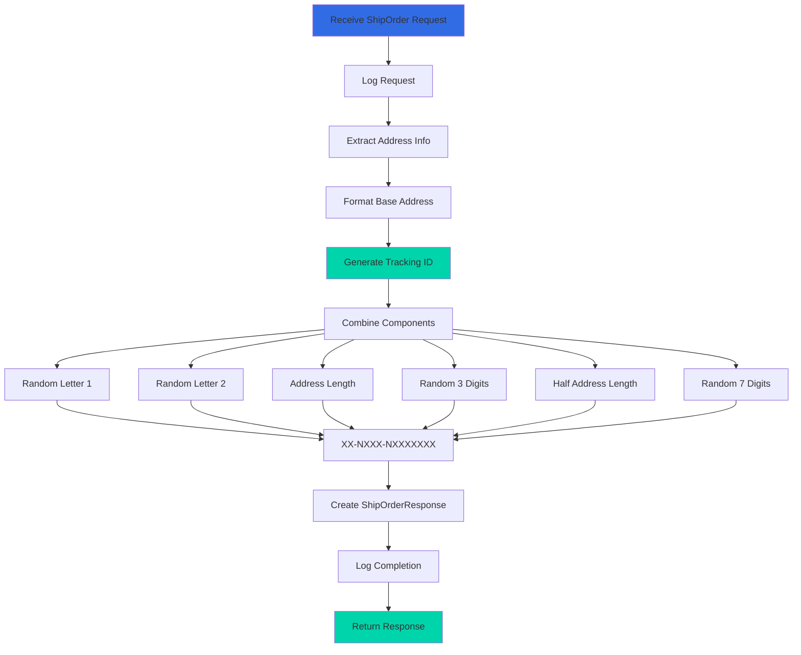

## Overview

The Shipping Service is a Go-based microservice responsible for calculating shipping costs and generating tracking IDs for orders in the Online Boutique application. It provides shipping quotes based on cart contents and creates unique tracking identifiers when orders are shipped.

<CardGroup cols={2}>
  <Card title="Language" icon="golang">
    Go with gRPC
  </Card>
  <Card title="Port" icon="network-wired">
    50051
  </Card>
  <Card title="Dependencies" icon="link">
    None (standalone service)
  </Card>
  <Card title="Data Store" icon="database">
    None (stateless)
  </Card>
</CardGroup>

## Service Architecture



## Key Features

<AccordionGroup>
  <Accordion title="Shipping Quote Calculation">
    - Provides flat-rate shipping cost of $8.99 USD
    - Independent of cart size or destination
    - Instant quote generation
    - No external API dependencies
  </Accordion>

  <Accordion title="Tracking ID Generation">
    - Creates unique tracking IDs for each shipment
    - Format: `XX-NXXX-NXXXXXXX` (e.g., `AB-5123-34567890`)
    - Incorporates address information for uniqueness
    - Deterministic based on shipping address
  </Accordion>

  <Accordion title="Observability">
    - Structured JSON logging with logrus
    - Google Cloud Profiler integration
    - Health check endpoint
    - gRPC reflection for debugging
  </Accordion>

  <Accordion title="Stateless Design">
    - No database or cache dependencies
    - Horizontally scalable
    - Fast response times
    - Simple deployment
  </Accordion>
</AccordionGroup>

## gRPC API

### Service Definition

```protobuf
service ShippingService {
    rpc GetQuote(GetQuoteRequest) returns (GetQuoteResponse) {}
    rpc ShipOrder(ShipOrderRequest) returns (ShipOrderResponse) {}
}
```

### Messages

<Tabs>
  <Tab title="GetQuote">
    ```protobuf
    message GetQuoteRequest {
        Address address = 1;
        repeated CartItem items = 2;
    }
    
    message GetQuoteResponse {
        Money cost_usd = 1;
    }
    
    message Address {
        string street_address = 1;
        string city = 2;
        string state = 3;
        string country = 4;
        int32 zip_code = 5;
    }
    ```
    
    **Request Fields:**
    - `address`: Shipping destination address
    - `items`: Cart items to be shipped (currently not used in calculation)
    
    **Response Fields:**
    - `cost_usd`: Shipping cost in USD (always $8.99)
  </Tab>

  <Tab title="ShipOrder">
    ```protobuf
    message ShipOrderRequest {
        Address address = 1;
        repeated CartItem items = 2;
    }
    
    message ShipOrderResponse {
        string tracking_id = 1;
    }
    ```
    
    **Request Fields:**
    - `address`: Shipping destination address
    - `items`: Cart items being shipped
    
    **Response Fields:**
    - `tracking_id`: Unique tracking identifier (e.g., `AB-5123-34567890`)
  </Tab>
</Tabs>

### Methods

#### GetQuote

Calculates shipping cost for a cart of items.

<CodeGroup>
```go Request Example
request := &pb.GetQuoteRequest{
    Address: &pb.Address{
        StreetAddress: "1600 Amphitheatre Parkway",
        City:          "Mountain View",
        State:         "CA",
        Country:       "United States",
        ZipCode:       94043,
    },
    Items: []*pb.CartItem{
        {ProductId: "OLJCESPC7Z", Quantity: 1},
        {ProductId: "66VCHSJNUP", Quantity: 2},
    },
}

response, err := client.GetQuote(ctx, request)
```

```go Response Example
&pb.GetQuoteResponse{
    CostUsd: &pb.Money{
        CurrencyCode: "USD",
        Units:        8,
        Nanos:        990000000,  // $8.99
    },
}
```
</CodeGroup>

**Note:** The current implementation returns a flat rate of $8.99 regardless of cart contents or destination. This is a simplified demo implementation.

#### ShipOrder

Initiates shipping for an order and returns a tracking ID.

<CodeGroup>
```go Request Example
request := &pb.ShipOrderRequest{
    Address: &pb.Address{
        StreetAddress: "1600 Amphitheatre Parkway",
        City:          "Mountain View",
        State:         "CA",
        Country:       "United States",
        ZipCode:       94043,
    },
    Items: []*pb.CartItem{
        {ProductId: "OLJCESPC7Z", Quantity: 1},
    },
}

response, err := client.ShipOrder(ctx, request)
```

```go Response Example
&pb.ShipOrderResponse{
    TrackingId: "AB-5123-34567890",
}
```
</CodeGroup>

## Configuration

### Environment Variables

| Variable | Description | Default | Required |
|----------|-------------|---------|----------|
| `PORT` | gRPC server port | `50051` | No |
| `DISABLE_PROFILER` | Disable Google Cloud Profiler | `false` | No |
| `DISABLE_TRACING` | Disable OpenTelemetry tracing | `false` | No |
| `DISABLE_STATS` | Disable statistics collection | `false` | No |

### Example Configuration

```yaml
env:
  - name: PORT
    value: "50051"
  - name: DISABLE_PROFILER
    value: "1"
  - name: DISABLE_TRACING
    value: "1"
```

## Implementation Details

### Shipping Quote Logic



### Tracking ID Generation



### Core Components

<Tabs>
  <Tab title="main.go">
    Main server implementation with gRPC handlers.
    
    ```go
    type server struct {
        pb.UnimplementedShippingServiceServer
    }

    func (s *server) GetQuote(ctx context.Context, 
                              in *pb.GetQuoteRequest) (*pb.GetQuoteResponse, error) {
        log.Info("[GetQuote] received request")
        defer log.Info("[GetQuote] completed request")

        // Generate quote (flat rate)
        quote := CreateQuoteFromCount(0)

        return &pb.GetQuoteResponse{
            CostUsd: &pb.Money{
                CurrencyCode: "USD",
                Units:        int64(quote.Dollars),
                Nanos:        int32(quote.Cents * 10000000),
            },
        }, nil
    }

    func (s *server) ShipOrder(ctx context.Context, 
                               in *pb.ShipOrderRequest) (*pb.ShipOrderResponse, error) {
        log.Info("[ShipOrder] received request")
        defer log.Info("[ShipOrder] completed request")

        // Create tracking ID from address
        baseAddress := fmt.Sprintf("%s, %s, %s", 
            in.Address.StreetAddress, 
            in.Address.City, 
            in.Address.State)
        id := CreateTrackingId(baseAddress)

        return &pb.ShipOrderResponse{
            TrackingId: id,
        }, nil
    }
    ```
  </Tab>

  <Tab title="quote.go">
    Shipping cost calculation logic.
    
    ```go
    type Quote struct {
        Dollars uint32
        Cents   uint32
    }

    func (q Quote) String() string {
        return fmt.Sprintf("$%d.%d", q.Dollars, q.Cents)
    }

    // CreateQuoteFromCount generates a quote
    // Currently returns flat rate regardless of count
    func CreateQuoteFromCount(count int) Quote {
        return CreateQuoteFromFloat(8.99)
    }

    // CreateQuoteFromFloat converts float to Quote struct
    func CreateQuoteFromFloat(value float64) Quote {
        units, fraction := math.Modf(value)
        return Quote{
            uint32(units),
            uint32(math.Trunc(fraction * 100)),
        }
    }
    ```
  </Tab>

  <Tab title="tracker.go">
    Tracking ID generation logic.
    
    ```go
    var seeded bool = false

    // CreateTrackingId generates a unique tracking ID
    // Format: XX-NXXX-NXXXXXXX
    func CreateTrackingId(salt string) string {
        if !seeded {
            rand.Seed(time.Now().UnixNano())
            seeded = true
        }

        return fmt.Sprintf("%c%c-%d%s-%d%s",
            getRandomLetterCode(),
            getRandomLetterCode(),
            len(salt),
            getRandomNumber(3),
            len(salt)/2,
            getRandomNumber(7),
        )
    }

    // getRandomLetterCode generates A-Z
    func getRandomLetterCode() uint32 {
        return 65 + uint32(rand.Intn(25))
    }

    // getRandomNumber generates N-digit number string
    func getRandomNumber(digits int) string {
        str := ""
        for i := 0; i < digits; i++ {
            str = fmt.Sprintf("%s%d", str, rand.Intn(10))
        }
        return str
    }
    ```
  </Tab>
</Tabs>

## Dependencies

### Go Modules

```go
require (
    cloud.google.com/go/profiler v0.4.3
    github.com/sirupsen/logrus v1.9.4
    golang.org/x/net v0.49.0
    google.golang.org/grpc v1.78.0
    google.golang.org/protobuf v1.36.11
)
```

<Accordion title="Package Descriptions">
- **google.golang.org/grpc**: gRPC framework for Go
- **google.golang.org/protobuf**: Protocol Buffers runtime
- **github.com/sirupsen/logrus**: Structured logger
- **cloud.google.com/go/profiler**: Google Cloud Profiler client
- **golang.org/x/net**: Network utilities
</Accordion>

## Testing

### Unit Tests

The service includes unit tests in `shippingservice_test.go`:

```bash
# Run tests
cd src/shippingservice
go test -v

# Run tests with coverage
go test -v -cover

# Run specific test
go test -v -run TestGetQuote
```

### Manual Testing

```bash
# Install grpcurl
go install github.com/fullstorydev/grpcurl/cmd/grpcurl@latest

# Test GetQuote
grpcurl -plaintext \
  -d '{
    "address": {
      "street_address": "1600 Amphitheatre Parkway",
      "city": "Mountain View",
      "state": "CA",
      "country": "United States",
      "zip_code": 94043
    },
    "items": [
      {"product_id": "OLJCESPC7Z", "quantity": 1}
    ]
  }' \
  localhost:50051 \
  hipstershop.ShippingService/GetQuote

# Test ShipOrder
grpcurl -plaintext \
  -d '{
    "address": {
      "street_address": "1600 Amphitheatre Parkway",
      "city": "Mountain View",
      "state": "CA",
      "country": "United States",
      "zip_code": 94043
    },
    "items": [
      {"product_id": "OLJCESPC7Z", "quantity": 1}
    ]
  }' \
  localhost:50051 \
  hipstershop.ShippingService/ShipOrder
```

### Test Scenarios

<Steps>
  <Step title="Basic Quote Request">
    Request shipping quote with valid address and items - should return $8.99
  </Step>
  <Step title="Empty Cart Quote">
    Request quote with no items - should still return $8.99 (flat rate)
  </Step>
  <Step title="Ship Order">
    Request shipment with valid address - should return tracking ID in format `XX-NXXX-NXXXXXXX`
  </Step>
  <Step title="Same Address Tracking">
    Ship multiple orders to same address - tracking IDs should be different due to randomization
  </Step>
</Steps>

## Deployment

### Kubernetes Deployment

```yaml
apiVersion: apps/v1
kind: Deployment
metadata:
  name: shippingservice
spec:
  selector:
    matchLabels:
      app: shippingservice
  template:
    metadata:
      labels:
        app: shippingservice
    spec:
      containers:
      - name: server
        image: shippingservice
        ports:
        - containerPort: 50051
        env:
        - name: PORT
          value: "50051"
        - name: DISABLE_PROFILER
          value: "1"
        resources:
          requests:
            cpu: 100m
            memory: 64Mi
          limits:
            cpu: 200m
            memory: 128Mi
        livenessProbe:
          grpc:
            port: 50051
          initialDelaySeconds: 10
        readinessProbe:
          grpc:
            port: 50051
          initialDelaySeconds: 5
```

### Docker Build

```dockerfile
FROM golang:1.25-alpine AS builder

WORKDIR /app
COPY go.* ./
RUN go mod download

COPY . .
RUN go build -o /shippingservice .

FROM alpine:3.19
RUN apk add --no-cache ca-certificates

COPY --from=builder /shippingservice /shippingservice

EXPOSE 50051
ENTRYPOINT ["/shippingservice"]
```

## Monitoring

### Key Metrics

<CardGroup cols={2}>
  <Card title="Request Rate" icon="chart-line">
    GetQuote and ShipOrder requests per second
  </Card>
  <Card title="Latency" icon="clock">
    P50, P95, P99 response times (should be <10ms)
  </Card>
  <Card title="Error Rate" icon="triangle-exclamation">
    Failed requests (should be near 0%)
  </Card>
  <Card title="Tracking IDs" icon="barcode">
    Number of tracking IDs generated
  </Card>
</CardGroup>

### Log Examples

```json
{
  "timestamp": "2024-02-13T10:30:45.123Z",
  "severity": "info",
  "message": "[GetQuote] received request"
}
```

```json
{
  "timestamp": "2024-02-13T10:30:45.125Z",
  "severity": "info",
  "message": "[GetQuote] completed request"
}
```

```json
{
  "timestamp": "2024-02-13T10:31:12.456Z",
  "severity": "info",
  "message": "[ShipOrder] received request"
}
```

## Performance Characteristics

<CardGroup cols={2}>
  <Card title="Response Time" icon="gauge-high">
    Typical: 1-5ms
    P99: <10ms
  </Card>
  <Card title="Throughput" icon="rocket">
    Can handle 1000+ req/s per instance
  </Card>
  <Card title="Memory Usage" icon="memory">
    Typical: 20-40 MB
    Peak: <64 MB
  </Card>
  <Card title="CPU Usage" icon="microchip">
    Typical: <5%
    Peak: <20%
  </Card>
</CardGroup>

## Future Enhancements

<Warning>
This is a simplified demo implementation. Production shipping services would require significant enhancements.
</Warning>

### Potential Improvements

1. **Dynamic Pricing**
   - Calculate cost based on weight and dimensions
   - Factor in shipping distance
   - Support multiple shipping methods (standard, express, overnight)
   - Apply discounts for bulk orders

2. **Carrier Integration**
   - Integrate with real carriers (UPS, FedEx, USPS)
   - Real-time rate shopping
   - Actual tracking number generation
   - Delivery time estimates

3. **Address Validation**
   - Validate addresses against carrier databases
   - Suggest corrections for invalid addresses
   - Support international address formats
   - Calculate shipping zones

4. **Advanced Features**
   - Package optimization (bin packing)
   - Multi-package shipments
   - Hazmat handling
   - Insurance options
   - Signature requirements

## Troubleshooting

<AccordionGroup>
  <Accordion title="Service fails to start">
    **Symptoms:** Service crashes on startup
    
    **Solutions:**
    - Verify PORT environment variable is valid
    - Check proto files are generated in genproto/ directory
    - Ensure Go version is 1.21 or higher
    - Run `go mod download` to fetch dependencies
    - Check logs for specific error messages
  </Accordion>

  <Accordion title="GetQuote returns wrong amount">
    **Symptoms:** Quote is not $8.99
    
    **Solutions:**
    - Check quote.go implementation
    - Verify CreateQuoteFromFloat(8.99) is being called
    - Ensure nanos calculation is correct (cents * 10000000)
    - Review any recent code changes
  </Accordion>

  <Accordion title="Tracking IDs not unique">
    **Symptoms:** Same tracking ID returned multiple times
    
    **Solutions:**
    - Verify random number generator is seeded
    - Check system time is correct
    - Ensure rand.Seed() is called before generation
    - Review tracker.go implementation
  </Accordion>

  <Accordion title="High latency">
    **Symptoms:** Slow response times
    
    **Solutions:**
    - Check CPU and memory usage
    - Verify no network issues
    - Review profiler data if enabled
    - Check for goroutine leaks
    - Ensure proper resource limits
  </Accordion>
</AccordionGroup>

## Related Services

<CardGroup cols={3}>
  <Card title="Frontend" icon="window-maximize" href="/microservices/frontend">
    Calls GetQuote to display shipping costs
  </Card>
  <Card title="Checkout Service" icon="shopping-cart" href="/microservices/checkoutservice">
    Calls ShipOrder to initiate shipping
  </Card>
  <Card title="Email Service" icon="envelope" href="/microservices/emailservice">
    Sends tracking info to customers
  </Card>
</CardGroup>

## Additional Resources

- [gRPC Go Documentation](https://grpc.io/docs/languages/go/)
- [Logrus Documentation](https://github.com/sirupsen/logrus)
- [Go Protocol Buffers](https://protobuf.dev/getting-started/gotutorial/)
- [Shipping API Best Practices](https://www.shipengine.com/docs/shipping-api/)
