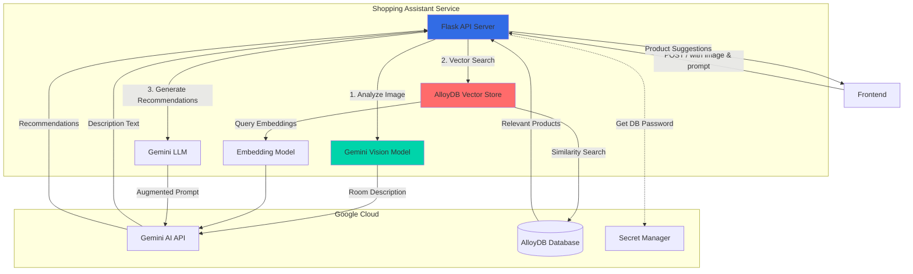
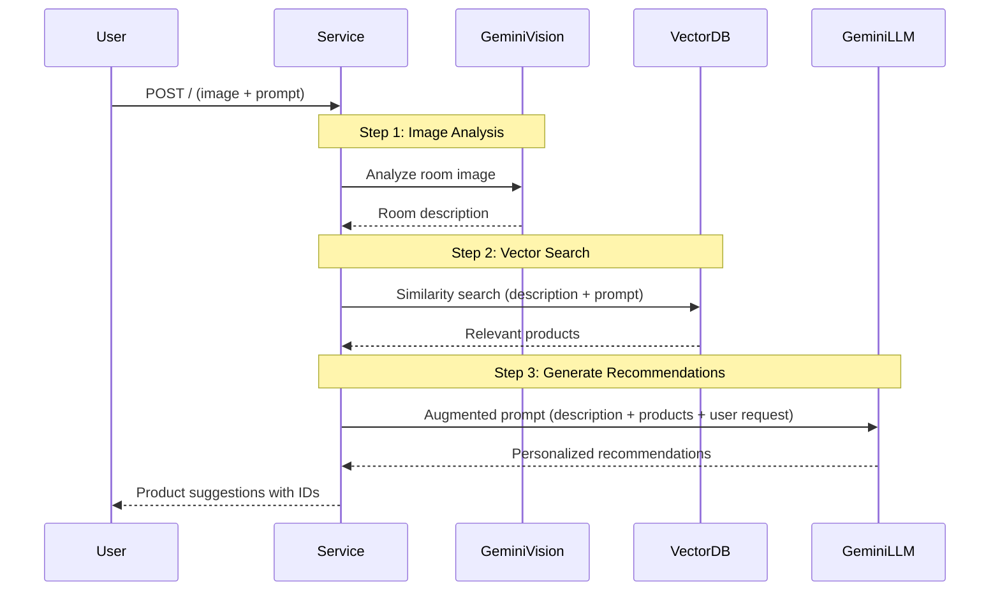

## Overview

The Shopping Assistant Service is a Python-based AI microservice that provides intelligent product recommendations using Google's Gemini AI models and AlloyDB vector search. It analyzes room images, understands user preferences, and suggests relevant products from the catalog that match the room's style and customer needs.

<CardGroup cols={2}>
  <Card title="Language" icon="python">
    Python 3 with Flask
  </Card>
  <Card title="Port" icon="network-wired">
    8080
  </Card>
  <Card title="Dependencies" icon="link">
    Google Gemini AI, AlloyDB, Secret Manager
  </Card>
  <Card title="AI Models" icon="brain">
    Gemini 1.5 Flash, Embedding-001
  </Card>
</CardGroup>

## Service Architecture



## Key Features

<AccordionGroup>
  <Accordion title="AI-Powered Image Analysis">
    - Uses Gemini Vision to analyze room images
    - Identifies room style and design elements
    - Generates detailed room descriptions
    - Understands interior design aesthetics
  </Accordion>

  <Accordion title="Vector Similarity Search">
    - Stores product embeddings in AlloyDB
    - Performs semantic similarity search
    - Matches products to room style
    - Retrieves most relevant items from catalog
  </Accordion>

  <Accordion title="Contextual Recommendations">
    - Combines user prompt with room analysis
    - Provides personalized product suggestions
    - Explains recommendations in natural language
    - Returns top 3 product IDs for display
  </Accordion>

  <Accordion title="RAG Architecture">
    - Retrieval-Augmented Generation (RAG) pattern
    - Grounds AI responses in actual product catalog
    - Prevents hallucination of non-existent products
    - Provides accurate, relevant recommendations
  </Accordion>
</AccordionGroup>

## API

### Endpoint

```
POST /
Content-Type: application/json
```

### Request Format

```json
{
  "message": "I need a lamp for my living room",
  "image": "data:image/jpeg;base64,/9j/4AAQSkZJRg..."
}
```

**Fields:**
- `message`: User's request or question about products
- `image`: Base64-encoded image of the room or data URL

### Response Format

```json
{
  "content": "Based on the modern minimalist style of your living room with its clean lines and neutral color palette, I recommend the following items:\n\n1. **Vintage Typewriter** - While not a lamp, this could add character to your space\n2. **Bamboo Glass Jar** - Perfect for organizing small items\n3. **Candle Holder** - Provides ambient lighting\n\n[OLJCESPC7Z], [9SIQT8TOJO], [0PUK6V6EV0]"
}
```

**Fields:**
- `content`: AI-generated recommendation text with product IDs at the end

## Configuration

### Environment Variables

| Variable | Description | Required |
|----------|-------------|----------|
| `PROJECT_ID` | Google Cloud project ID | Yes |
| `REGION` | Google Cloud region | Yes |
| `ALLOYDB_DATABASE_NAME` | AlloyDB database name | Yes |
| `ALLOYDB_TABLE_NAME` | Vector store table name | Yes |
| `ALLOYDB_CLUSTER_NAME` | AlloyDB cluster name | Yes |
| `ALLOYDB_INSTANCE_NAME` | AlloyDB instance name | Yes |
| `ALLOYDB_SECRET_NAME` | Secret Manager secret name for DB password | Yes |

### Example Configuration

```yaml
env:
  - name: PROJECT_ID
    value: "my-gcp-project"
  - name: REGION
    value: "us-central1"
  - name: ALLOYDB_DATABASE_NAME
    value: "online-boutique"
  - name: ALLOYDB_TABLE_NAME
    value: "product_embeddings"
  - name: ALLOYDB_CLUSTER_NAME
    value: "boutique-cluster"
  - name: ALLOYDB_INSTANCE_NAME
    value: "boutique-instance"
  - name: ALLOYDB_SECRET_NAME
    value: "alloydb-password"
```

## Implementation Details

### Three-Step RAG Process



### Core Implementation

<Tabs>
  <Tab title="Step 1: Image Analysis">
    Analyze room image using Gemini Vision.
    
    ```python
    from langchain_google_genai import ChatGoogleGenerativeAI
    from langchain_core.messages import HumanMessage
    
    llm_vision = ChatGoogleGenerativeAI(model="gemini-1.5-flash")
    message = HumanMessage(
        content=[
            {
                "type": "text",
                "text": "You are a professional interior designer, give me a detailed description of the style of the room in this image",
            },
            {"type": "image_url", "image_url": request.json['image']},
        ]
    )
    response = llm_vision.invoke([message])
    description_response = response.content
    ```
  </Tab>

  <Tab title="Step 2: Vector Search">
    Find relevant products using similarity search.
    
    ```python
    from langchain_google_alloydb_pg import AlloyDBVectorStore
    from langchain_google_genai import GoogleGenerativeAIEmbeddings
    
    # Initialize vector store
    vectorstore = AlloyDBVectorStore.create_sync(
        engine=engine,
        table_name=ALLOYDB_TABLE_NAME,
        embedding_service=GoogleGenerativeAIEmbeddings(
            model="models/embedding-001"
        ),
        id_column="id",
        content_column="description",
        embedding_column="product_embedding",
        metadata_columns=["id", "name", "categories"]
    )
    
    # Perform similarity search
    vector_search_prompt = f"""
    This is the user's request: {prompt}
    Find the most relevant items for that prompt,
    while matching style of the room described here: {description_response}
    """
    docs = vectorstore.similarity_search(vector_search_prompt)
    
    # Prepare relevant documents
    relevant_docs = ""
    for doc in docs:
        doc_details = doc.to_json()
        relevant_docs += str(doc_details) + ", "
    ```
  </Tab>

  <Tab title="Step 3: Generate Recommendations">
    Create personalized recommendations using Gemini LLM.
    
    ```python
    llm = ChatGoogleGenerativeAI(model="gemini-1.5-flash")
    design_prompt = f"""
    You are an interior designer that works for Online Boutique.
    You are tasked with providing recommendations to a customer
    on what they should add to a given room from our catalog.
    
    This is the description of the room:
    {description_response}
    
    Here are a list of products that are relevant to it:
    {relevant_docs}
    
    Specifically, this is what the customer has asked for:
    {prompt}
    
    Start by repeating a brief description of the room's design
    to the customer, then provide your recommendations.
    
    Do your best to pick the most relevant item out of the list
    of products provided, but if none of them seem relevant,
    then say that instead of inventing a new product.
    
    At the end of the response, add a list of the IDs of the
    relevant products in the following format for the top 3 results:
    [<first product ID>], [<second product ID>], [<third product ID>]
    """
    
    design_response = llm.invoke(design_prompt)
    return {'content': design_response.content}
    ```
  </Tab>
</Tabs>

### Database Setup

The service requires an AlloyDB database with vector search capabilities:

```sql
-- Create table for product embeddings
CREATE TABLE product_embeddings (
    id VARCHAR(255) PRIMARY KEY,
    name VARCHAR(255),
    description TEXT,
    categories TEXT[],
    product_embedding vector(768)
);

-- Create vector index for fast similarity search
CREATE INDEX ON product_embeddings
USING ivfflat (product_embedding vector_cosine_ops)
WITH (lists = 100);
```


## Dependencies

### Python Packages

```txt
flask==3.1.2
langchain==1.2.0
langchain-google-genai==4.1.2
langchain-google-alloydb-pg==0.13.0
google-cloud-secret-manager==2.26.0
google-genai==1.56.0
pillow==12.0.0
```

<Accordion title="Package Descriptions">
- **flask**: Web framework for API server
- **langchain**: Framework for LLM applications
- **langchain-google-genai**: Gemini AI integration
- **langchain-google-alloydb-pg**: AlloyDB vector store
- **google-cloud-secret-manager**: Secure credential management
- **google-genai**: Google Generative AI SDK
- **pillow**: Image processing library
</Accordion>

## Testing

### Manual Testing

```bash
# Test with curl
curl -X POST http://localhost:8080/ \
  -H "Content-Type: application/json" \
  -d '{
    "message": "I need a lamp for my bedroom",
    "image": "data:image/jpeg;base64,/9j/4AAQSkZJRg..."
  }'
```

### Test Scenarios

<Steps>
  <Step title="Simple Request">
    Request a specific item type (lamp, chair, etc.) with room image
  </Step>
  <Step title="Style Matching">
    Request items that match specific style (modern, vintage, minimalist)
  </Step>
  <Step title="No Match">
    Request items not in catalog - should indicate no suitable products
  </Step>
  <Step title="Multiple Items">
    Request multiple items for a room renovation
  </Step>
</Steps>

## Deployment

### Prerequisites

1. **Google Cloud Project** with APIs enabled:
   - Vertex AI API
   - AlloyDB API
   - Secret Manager API

2. **AlloyDB Instance** with:
   - Vector search extension enabled
   - Product embeddings table created
   - Database credentials stored in Secret Manager

3. **Service Account** with permissions:
   - Vertex AI User
   - AlloyDB Client
   - Secret Manager Secret Accessor

### Kubernetes Deployment

```yaml
apiVersion: apps/v1
kind: Deployment
metadata:
  name: shoppingassistantservice
spec:
  replicas: 1
  selector:
    matchLabels:
      app: shoppingassistantservice
  template:
    metadata:
      labels:
        app: shoppingassistantservice
    spec:
      serviceAccountName: shopping-assistant-sa
      containers:
      - name: server
        image: shoppingassistantservice
        ports:
        - containerPort: 8080
        env:
        - name: PROJECT_ID
          value: "my-gcp-project"
        - name: REGION
          value: "us-central1"
        - name: ALLOYDB_DATABASE_NAME
          value: "online-boutique"
        - name: ALLOYDB_TABLE_NAME
          value: "product_embeddings"
        - name: ALLOYDB_CLUSTER_NAME
          value: "boutique-cluster"
        - name: ALLOYDB_INSTANCE_NAME
          value: "boutique-instance"
        - name: ALLOYDB_SECRET_NAME
          value: "alloydb-password"
        resources:
          requests:
            cpu: 500m
            memory: 512Mi
          limits:
            cpu: 1000m
            memory: 1Gi
```

### Docker Build

```dockerfile
FROM python:3.11-slim

WORKDIR /app

# Install dependencies
COPY requirements.txt .
RUN pip install --no-cache-dir -r requirements.txt

# Copy application
COPY shoppingassistantservice.py .

EXPOSE 8080

ENTRYPOINT ["python", "shoppingassistantservice.py"]
```

## Monitoring

### Key Metrics

<CardGroup cols={2}>
  <Card title="Request Rate" icon="chart-line">
    Number of AI recommendation requests per second
  </Card>
  <Card title="Latency" icon="clock">
    Total response time (typically 2-5 seconds)
  </Card>
  <Card title="AI API Calls" icon="brain">
    Number of Gemini API invocations
  </Card>
  <Card title="Vector Search Time" icon="magnifying-glass">
    AlloyDB similarity search latency
  </Card>
</CardGroup>

### Latency Breakdown

Typical request processing time:

- Image analysis (Gemini Vision): 1-2 seconds
- Vector similarity search: 100-300ms
- Recommendation generation (Gemini LLM): 1-2 seconds
- **Total**: 2-5 seconds

### Log Examples

```
INFO: Beginning RAG call
INFO: Description step: The room features a modern minimalist design...
INFO: Vector search: The room features a modern minimalist design...
INFO: Retrieved documents: 5
INFO: Adding relevant document to prompt context: {...}
INFO: Final design prompt: You are an interior designer...
```

## Performance Considerations

<CardGroup cols={2}>
  <Card title="Response Time" icon="gauge-high">
    Typical: 2-5 seconds
    P99: <10 seconds
  </Card>
  <Card title="Throughput" icon="rocket">
    Limited by AI API rate limits
    Typically 10-20 req/s
  </Card>
  <Card title="Memory Usage" icon="memory">
    Typical: 400-600 MB
    Peak: <1 GB
  </Card>
  <Card title="CPU Usage" icon="microchip">
    Typical: 20-40%
    Peak: <80%
  </Card>
</CardGroup>

### Optimization Strategies

1. **Caching**: Cache room descriptions for repeated images
2. **Batch Processing**: Process multiple requests in parallel
3. **Connection Pooling**: Reuse database connections
4. **Async Processing**: Use async/await for I/O operations
5. **Rate Limiting**: Implement request throttling

## Cost Considerations

<Warning>
This service uses paid Google Cloud APIs. Monitor usage to control costs.
</Warning>

### Cost Factors

- **Gemini API Calls**: Charged per request
  - Vision model: ~$0.0025 per image
  - LLM model: ~$0.00025 per 1K characters
  - Embedding model: ~$0.00001 per 1K characters

- **AlloyDB**: Charged per instance hour
  - Instance size and storage
  - Network egress

- **Secret Manager**: Minimal cost
  - Per secret version access

### Cost Optimization

1. Implement request caching
2. Use smaller AI models when appropriate
3. Batch vector searches
4. Set up budget alerts
5. Monitor API usage

## Security Considerations

<CardGroup cols={2}>
  <Card title="Credentials" icon="key">
    - Database passwords in Secret Manager
    - Service account authentication
    - No hardcoded secrets
  </Card>
  <Card title="API Access" icon="shield">
    - Restrict API access by IP
    - Use VPC Service Controls
    - Enable audit logging
  </Card>
  <Card title="Data Privacy" icon="lock">
    - Don't log sensitive user data
    - Encrypt data in transit
    - Follow data retention policies
  </Card>
  <Card title="Input Validation" icon="check-circle">
    - Validate image formats
    - Sanitize user prompts
    - Limit request sizes
  </Card>
</CardGroup>

## Troubleshooting

<AccordionGroup>
  <Accordion title="Service fails to start">
    **Symptoms:** Service crashes on startup
    
    **Solutions:**
    - Verify all environment variables are set
    - Check AlloyDB instance is running
    - Verify Secret Manager secret exists
    - Check service account permissions
    - Review startup logs for specific errors
  </Accordion>

  <Accordion title="Cannot connect to AlloyDB">
    **Symptoms:** Database connection errors
    
    **Solutions:**
    - Verify AlloyDB instance is running
    - Check network connectivity
    - Verify database credentials in Secret Manager
    - Check service account has AlloyDB Client role
    - Review AlloyDB firewall rules
  </Accordion>

  <Accordion title="Gemini API errors">
    **Symptoms:** AI model invocation failures
    
    **Solutions:**
    - Verify Vertex AI API is enabled
    - Check service account has Vertex AI User role
    - Review API quotas and limits
    - Check for rate limiting
    - Verify model names are correct
  </Accordion>

  <Accordion title="Slow response times">
    **Symptoms:** Requests taking >10 seconds
    
    **Solutions:**
    - Check Gemini API latency
    - Verify AlloyDB performance
    - Review vector index configuration
    - Check network latency
    - Consider implementing caching
  </Accordion>

  <Accordion title="Poor recommendations">
    **Symptoms:** Irrelevant product suggestions
    
    **Solutions:**
    - Review product embeddings quality
    - Check vector search results
    - Adjust similarity search parameters
    - Improve prompt engineering
    - Verify product catalog data
  </Accordion>
</AccordionGroup>

## Future Enhancements

### Potential Improvements

1. **Multi-Modal Search**
   - Support text-only queries
   - Allow product image uploads
   - Enable voice input

2. **Personalization**
   - User preference learning
   - Purchase history integration
   - Style profile creation

3. **Advanced Features**
   - Room layout suggestions
   - Color palette matching
   - Budget-aware recommendations
   - Seasonal suggestions

4. **Performance**
   - Response caching
   - Async processing
   - Streaming responses
   - Progressive loading

5. **Analytics**
   - Recommendation acceptance rate
   - User satisfaction tracking
   - A/B testing framework
   - Conversion tracking

## Related Services

<CardGroup cols={3}>
  <Card title="Frontend" icon="window-maximize" href="/microservices/frontend">
    Displays AI recommendations to users
  </Card>
  <Card title="Product Catalog" icon="box" href="/microservices/productcatalogservice">
    Provides product data for embeddings
  </Card>
  <Card title="Recommendation Service" icon="sparkles" href="/microservices/recommendationservice">
    Alternative recommendation approach
  </Card>
</CardGroup>

## Additional Resources

- [Google Gemini AI Documentation](https://ai.google.dev/docs)
- [LangChain Documentation](https://python.langchain.com/)
- [AlloyDB Vector Search](https://cloud.google.com/alloydb/docs/ai/work-with-embeddings)
- [RAG Pattern Guide](https://cloud.google.com/blog/products/ai-machine-learning/rag-pattern-for-generative-ai)
- [Vertex AI Best Practices](https://cloud.google.com/vertex-ai/docs/start/introduction-unified-platform)
