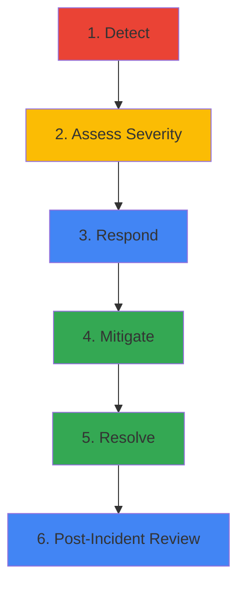

## Overview

When things go wrong in production, you need a clear process to identify, diagnose, and fix issues quickly. This guide covers incident response best practices for Online Boutique.

<Tip>
  **For Beginners:** An incident is when your application isn't working as expected - like a website being down or running very slowly. Incident response is your plan for fixing it fast.
</Tip>

## Incident Severity Levels

<CardGroup cols={4}>
  <Card title="SEV-1" icon="fire">
    **Critical**
    
    Complete outage
    
    Response: Immediate
  </Card>

  <Card title="SEV-2" icon="triangle-exclamation">
    **High**
    
    Major degradation
    
    Response: < 30 min
  </Card>

  <Card title="SEV-3" icon="circle-exclamation">
    **Medium**
    
    Minor issues
    
    Response: < 4 hours
  </Card>

  <Card title="SEV-4" icon="circle-info">
    **Low**
    
    Cosmetic issues
    
    Response: Next sprint
  </Card>
</CardGroup>

### Severity Definitions

<AccordionGroup>
  <Accordion title="SEV-1: Critical">
    **Examples:**
    - Website completely down
    - No users can checkout
    - Data loss or corruption
    - Security breach
    
    **Response:**
    - Page on-call immediately
    - All hands on deck
    - Hourly updates to stakeholders
    - Post-incident review required
  </Accordion>

  <Accordion title="SEV-2: High">
    **Examples:**
    - Checkout success rate < 50%
    - Major feature broken
    - Significant performance degradation
    - Affecting multiple users
    
    **Response:**
    - Notify on-call within 30 minutes
    - Assign incident commander
    - Regular updates to stakeholders
    - Post-incident review recommended
  </Accordion>

  <Accordion title="SEV-3: Medium">
    **Examples:**
    - Minor feature broken
    - Affecting small number of users
    - Performance slightly degraded
    - Non-critical service down
    
    **Response:**
    - Create ticket
    - Fix during business hours
    - Update stakeholders as needed
  </Accordion>

  <Accordion title="SEV-4: Low">
    **Examples:**
    - UI glitches
    - Typos
    - Minor UX issues
    - Non-urgent improvements
    
    **Response:**
    - Add to backlog
    - Fix in next sprint
    - No immediate action needed
  </Accordion>
</AccordionGroup>

## Incident Response Process



### 1. Detection

How you find out about incidents:

<Tabs>
  <Tab title="Automated Alerts">
    **Best:** Proactive monitoring catches issues
    
    ```yaml
    # Example alert
    Alert: HighErrorRate
    Severity: SEV-2
    Service: checkout
    Message: Error rate is 15% (threshold: 1%)
    Runbook: https://wiki.example.com/runbooks/high-error-rate
    ```
    
    **Action:** Alert fires → On-call paged → Incident starts
  </Tab>

  <Tab title="User Reports">
    **Common:** Users report issues
    
    **Action:**
    1. Thank the user
    2. Gather details (what, when, where)
    3. Check monitoring for confirmation
    4. Create incident if confirmed
  </Tab>

  <Tab title="Internal Discovery">
    **Happens:** Team member notices issue
    
    **Action:**
    1. Check if it's a known issue
    2. Verify impact
    3. Create incident if needed
    4. Notify team
  </Tab>
</Tabs>

### 2. Assessment

Quickly determine severity:

<Steps>
  <Step title="Check Impact">
    **Questions to ask:**
    - How many users affected?
    - What functionality is broken?
    - Is data at risk?
    - Is it getting worse?
    
    ```bash
    # Quick checks
    kubectl get pods | grep -v Running
    kubectl top pods
    kubectl logs -l app=frontend --tail=50 | grep ERROR
    ```
  </Step>

  <Step title="Assign Severity">
    Use the severity levels above to classify the incident.
  </Step>

  <Step title="Notify Stakeholders">
    - SEV-1: Page everyone, notify executives
    - SEV-2: Notify team lead, update status page
    - SEV-3: Create ticket, notify team
    - SEV-4: Add to backlog
  </Step>
</Steps>

### 3. Response

Assemble the team and start investigating:

<AccordionGroup>
  <Accordion title="Roles">
    **Incident Commander (IC):**
    - Coordinates response
    - Makes decisions
    - Communicates with stakeholders
    
    **Technical Lead:**
    - Investigates root cause
    - Implements fixes
    - Coordinates with IC
    
    **Communications Lead:**
    - Updates status page
    - Notifies customers
    - Handles external communication
    
    **Scribe:**
    - Documents timeline
    - Records decisions
    - Takes notes for post-mortem
  </Accordion>

  <Accordion title="Communication Channels">
    **Incident Channel:**
    ```
    #incident-2024-02-13-checkout-down
    ```
    
    **Status Page:**
    - Update every 30 minutes (SEV-1/2)
    - Be transparent about impact
    - Provide ETAs when possible
    
    **Internal Updates:**
    - Slack/Teams for real-time coordination
    - Email for formal updates
    - Video call for SEV-1 incidents
  </Accordion>

  <Accordion title="Initial Actions">
    1. **Stabilize:** Stop the bleeding
       - Roll back recent changes
       - Scale up resources
       - Disable problematic features
    
    2. **Gather Data:**
       - Check dashboards
       - Review recent changes
       - Collect logs and traces
    
    3. **Form Hypothesis:**
       - What changed recently?
       - What does the data show?
       - What are the symptoms?
  </Accordion>
</AccordionGroup>

### 4. Mitigation

Quick fixes to restore service:

<Tabs>
  <Tab title="Rollback">
    **When:** Recent deployment caused the issue
    
    ```bash
    # Rollback deployment
    kubectl rollout undo deployment/frontend
    
    # Verify rollback
    kubectl rollout status deployment/frontend
    
    # Check if issue resolved
    kubectl logs -l app=frontend --tail=50
    ```
    
    **Time:** 2-5 minutes
  </Tab>

  <Tab title="Scale Up">
    **When:** Resource exhaustion
    
    ```bash
    # Scale up replicas
    kubectl scale deployment frontend --replicas=10
    
    # Or increase resources
    kubectl set resources deployment frontend \
      --limits=cpu=500m,memory=512Mi
    
    # Verify
    kubectl top pods -l app=frontend
    ```
    
    **Time:** 1-3 minutes
  </Tab>

  <Tab title="Disable Feature">
    **When:** Specific feature causing issues
    
    ```bash
    # Update config
    kubectl set env deployment/frontend FEATURE_FLAG_NEW_CHECKOUT=false
    
    # Or use feature flag service
    curl -X POST https://flags.example.com/api/flags/new-checkout \
      -d '{"enabled": false}'
    ```
    
    **Time:** < 1 minute
  </Tab>

  <Tab title="Restart Services">
    **When:** Service in bad state
    
    ```bash
    # Restart all pods
    kubectl rollout restart deployment/frontend
    
    # Or delete specific pod
    kubectl delete pod frontend-abc123
    
    # Verify
    kubectl get pods -l app=frontend
    ```
    
    **Time:** 1-2 minutes
  </Tab>
</Tabs>

### 5. Resolution

Permanent fix after service is restored:

<Steps>
  <Step title="Root Cause Analysis">
    Use the 5 Whys technique:
    
    **Example:**
    1. Why did checkout fail? → Payment service was down
    2. Why was payment service down? → All pods crashed
    3. Why did pods crash? → Out of memory
    4. Why out of memory? → Memory leak in new code
    5. Why memory leak? → Forgot to close database connections
    
    **Root Cause:** Database connections not being closed
  </Step>

  <Step title="Implement Fix">
    ```go
    // Before (leaking connections)
    func processPayment(amount float64) error {
        db, _ := sql.Open("postgres", connStr)
        // ... process payment ...
        return nil  // Connection never closed!
    }
    
    // After (fixed)
    func processPayment(amount float64) error {
        db, _ := sql.Open("postgres", connStr)
        defer db.Close()  // Always close connection
        // ... process payment ...
        return nil
    }
    ```
  </Step>

  <Step title="Test Fix">
    - Unit tests
    - Integration tests
    - Load testing
    - Canary deployment
  </Step>

  <Step title="Deploy Fix">
    ```bash
    # Build new image
    docker build -t payment:v1.2.1 .
    
    # Deploy with canary
    kubectl apply -f deployment-canary.yaml
    
    # Monitor for issues
    kubectl logs -f -l app=payment,version=v1.2.1
    
    # Full rollout if successful
    kubectl apply -f deployment.yaml
    ```
  </Step>
</Steps>

### 6. Post-Incident Review

Learn from the incident:

<AccordionGroup>
  <Accordion title="Timeline">
    Document what happened when:
    
    ```
    2024-02-13 14:23 - Alert fired: HighErrorRate on checkout
    2024-02-13 14:25 - On-call paged, incident declared SEV-2
    2024-02-13 14:30 - Identified payment service as root cause
    2024-02-13 14:35 - Rolled back to previous version
    2024-02-13 14:37 - Service restored, error rate normal
    2024-02-13 15:00 - Root cause identified: memory leak
    2024-02-13 16:30 - Fix deployed and verified
    2024-02-13 17:00 - Incident closed
    ```
  </Accordion>

  <Accordion title="Impact Assessment">
    **Metrics:**
    - Duration: 74 minutes
    - Users affected: ~5,000
    - Failed transactions: 234
    - Revenue impact: $12,450
    
    **Severity:** SEV-2 (correct classification)
  </Accordion>

  <Accordion title="What Went Well">
    - Alert fired quickly (2 minutes after issue started)
    - Rollback was fast (12 minutes to restore service)
    - Good communication with stakeholders
    - Root cause identified quickly
  </Accordion>

  <Accordion title="What Went Wrong">
    - Memory leak not caught in testing
    - No load testing before deployment
    - Monitoring didn't catch memory growth
    - Rollback process could be faster
  </Accordion>

  <Accordion title="Action Items">
    1. **Add memory monitoring alert** (Owner: DevOps, Due: 2024-02-20)
    2. **Implement load testing in CI/CD** (Owner: QA, Due: 2024-02-27)
    3. **Document rollback procedure** (Owner: SRE, Due: 2024-02-16)
    4. **Add connection pool monitoring** (Owner: Backend, Due: 2024-02-23)
    5. **Review all services for similar issues** (Owner: All, Due: 2024-03-01)
  </Accordion>
</AccordionGroup>

## Common Incidents & Solutions

<Tabs>
  <Tab title="Service Down">
    **Symptoms:**
    - Pods not running
    - Health checks failing
    - 503 errors
    
    **Investigation:**
    ```bash
    # Check pod status
    kubectl get pods -l app=SERVICE_NAME
    
    # Check events
    kubectl describe pod POD_NAME
    
    # Check logs
    kubectl logs POD_NAME --previous
    ```
    
    **Common Causes:**
    - Image pull errors
    - Crash on startup
    - Resource limits too low
    - Configuration errors
    
    **Solutions:**
    - Fix image name/tag
    - Check logs for startup errors
    - Increase resource limits
    - Verify configuration
  </Tab>

  <Tab title="High Latency">
    **Symptoms:**
    - Slow response times
    - Timeouts
    - User complaints
    
    **Investigation:**
    ```bash
    # Check resource usage
    kubectl top pods
    
    # Find slow traces
    # (in Jaeger UI, filter by duration > 1s)
    
    # Check for errors
    kubectl logs -l app=SERVICE_NAME | grep ERROR
    ```
    
    **Common Causes:**
    - Database slow queries
    - External API timeouts
    - Resource exhaustion
    - N+1 query problems
    
    **Solutions:**
    - Add database indexes
    - Increase timeouts
    - Scale up resources
    - Optimize queries
  </Tab>

  <Tab title="High Error Rate">
    **Symptoms:**
    - 5xx errors
    - Failed requests
    - Alert firing
    
    **Investigation:**
    ```bash
    # Check error logs
    kubectl logs -l app=SERVICE_NAME | grep ERROR
    
    # Check metrics
    # (in Grafana, view error rate graph)
    
    # Find error traces
    # (in Jaeger, filter by error=true)
    ```
    
    **Common Causes:**
    - Dependency failures
    - Bad deployment
    - Configuration errors
    - Database issues
    
    **Solutions:**
    - Check dependencies
    - Rollback deployment
    - Fix configuration
    - Verify database connectivity
  </Tab>

  <Tab title="Memory Leak">
    **Symptoms:**
    - Memory usage growing
    - OOMKilled pods
    - Frequent restarts
    
    **Investigation:**
    ```bash
    # Check memory usage over time
    kubectl top pods -l app=SERVICE_NAME
    
    # Check for OOMKilled
    kubectl get pods | grep OOMKilled
    
    # Get heap dump (if supported)
    kubectl exec POD_NAME -- curl localhost:6060/debug/pprof/heap > heap.prof
    ```
    
    **Common Causes:**
    - Unclosed connections
    - Growing caches
    - Goroutine leaks
    - Large objects not GC'd
    
    **Solutions:**
    - Close connections properly
    - Set cache size limits
    - Fix goroutine leaks
    - Profile and optimize
  </Tab>
</Tabs>

## Runbooks

Create runbooks for common scenarios:

<AccordionGroup>
  <Accordion title="Runbook Template">
    ```markdown
    # Runbook: High Error Rate on Checkout
    
    ## Symptoms
    - Error rate > 1% on checkout service
    - Users unable to complete purchases
    - Alert: HighErrorRate fires
    
    ## Impact
    - SEV-2: Major revenue impact
    - Affects all users trying to checkout
    
    ## Investigation Steps
    1. Check Grafana dashboard: [link]
    2. View recent deployments: `kubectl rollout history deployment/checkout`
    3. Check logs: `kubectl logs -l app=checkout --tail=100 | grep ERROR`
    4. Find error traces in Jaeger: [link]
    
    ## Common Causes
    1. Payment gateway down (check status page)
    2. Database connection issues
    3. Recent bad deployment
    4. Resource exhaustion
    
    ## Mitigation Steps
    1. If recent deployment: `kubectl rollout undo deployment/checkout`
    2. If payment gateway down: Enable fallback payment method
    3. If resource issue: `kubectl scale deployment checkout --replicas=10`
    
    ## Resolution
    1. Identify root cause
    2. Implement fix
    3. Test thoroughly
    4. Deploy with canary
    5. Monitor for 24 hours
    
    ## Escalation
    - Primary: @checkout-team
    - Secondary: @platform-team
    - Manager: @engineering-manager
    
    ## Related
    - Dashboard: [link]
    - Logs: [link]
    - Previous incidents: [link]
    ```
  </Accordion>

  <Accordion title="Runbook Locations">
    Store runbooks where they're easy to find:
    - Wiki (Confluence, Notion)
    - Git repository (docs/runbooks/)
    - Incident management tool (PagerDuty)
    - Link from alerts
  </Accordion>
</AccordionGroup>

## Tools

<CardGroup cols={2}>
  <Card title="PagerDuty" icon="bell">
    On-call management and alerting
  </Card>
  <Card title="Opsgenie" icon="bell">
    Alternative to PagerDuty
  </Card>
  <Card title="Statuspage" icon="signal">
    Customer-facing status updates
  </Card>
  <Card title="Slack" icon="slack">
    Real-time team communication
  </Card>
</CardGroup>

## Best Practices

<AccordionGroup>
  <Accordion title="Blameless Post-Mortems">
    - Focus on systems, not people
    - Assume good intentions
    - Learn from mistakes
    - Share learnings widely
  </Accordion>

  <Accordion title="Practice Incident Response">
    - Run game days
    - Practice rollbacks
    - Test alerting
    - Update runbooks
  </Accordion>

  <Accordion title="Automate Common Tasks">
    - Automated rollbacks
    - Self-healing systems
    - Automated scaling
    - Chatops for common commands
  </Accordion>

  <Accordion title="Improve Continuously">
    - Track MTTR (Mean Time To Recovery)
    - Track MTTD (Mean Time To Detection)
    - Review action items monthly
    - Update runbooks after incidents
  </Accordion>
</AccordionGroup>

## Next Steps

<CardGroup cols={2}>
  <Card title="Monitoring" icon="chart-line" href="/operations/monitoring">
    Set up alerts to detect incidents
  </Card>
  <Card title="Observability" icon="magnifying-glass" href="/operations/observability">
    Tools for investigating incidents
  </Card>
  <Card title="Production Best Practices" icon="shield-check" href="/operations/production">
    Prevent incidents before they happen
  </Card>
  <Card title="Architecture" icon="sitemap" href="/architecture/overview">
    Understand the system
  </Card>
</CardGroup>
