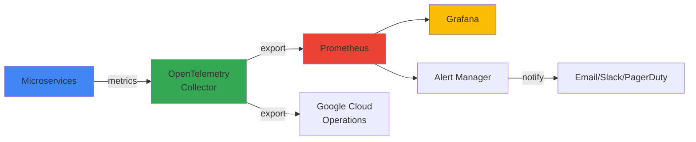

## Overview

Monitoring helps you understand the health and performance of your application. This guide covers setting up metrics collection, creating dashboards, and configuring alerts.

<Tip>
  **For Beginners:** Monitoring is like having a dashboard in your car. It shows you important information (speed, fuel, temperature) so you know when something needs attention before it becomes a problem.
</Tip>

## Monitoring Architecture



## What to Monitor

### Golden Signals

The four most important metrics for any service:

<CardGroup cols={2}>
  <Card title="Latency" icon="clock">
    How long requests take to complete
    
    **Target:** P95 < 200ms for most endpoints
  </Card>

  <Card title="Traffic" icon="arrow-trend-up">
    How many requests you're receiving
    
    **Target:** Track trends, set capacity alerts
  </Card>

  <Card title="Errors" icon="triangle-exclamation">
    Rate of failed requests
    
    **Target:** < 0.1% error rate
  </Card>

  <Card title="Saturation" icon="gauge-high">
    How "full" your service is
    
    **Target:** < 80% CPU/memory usage
  </Card>
</CardGroup>

### Service-Specific Metrics

<Tabs>
  <Tab title="Frontend">
    ```yaml
    # Key metrics
    - http_requests_total
    - http_request_duration_seconds
    - http_requests_in_flight
    - page_load_time_seconds
    
    # Business metrics
    - product_views_total
    - cart_additions_total
    - checkout_attempts_total
    ```
  </Tab>

  <Tab title="Cart Service">
    ```yaml
    # Key metrics
    - grpc_server_handled_total
    - grpc_server_handling_seconds
    - redis_commands_total
    - redis_command_duration_seconds
    
    # Business metrics
    - cart_size_items
    - cart_value_usd
    - cart_abandonment_rate
    ```
  </Tab>

  <Tab title="Checkout Service">
    ```yaml
    # Key metrics
    - checkout_requests_total
    - checkout_duration_seconds
    - checkout_errors_total
    
    # Business metrics
    - orders_placed_total
    - order_value_usd
    - payment_success_rate
    ```
  </Tab>

  <Tab title="Product Catalog">
    ```yaml
    # Key metrics
    - product_list_requests_total
    - product_search_requests_total
    - cache_hit_rate
    
    # Business metrics
    - products_viewed_total
    - search_queries_total
    - popular_products
    ```
  </Tab>
</Tabs>

## Setup: Prometheus + Grafana

### 1. Deploy Prometheus

<Steps>
  <Step title="Install Prometheus Operator">
    ```bash
    # Add Prometheus Helm repo
    helm repo add prometheus-community https://prometheus-community.github.io/helm-charts
    helm repo update
    
    # Install Prometheus stack
    helm install prometheus prometheus-community/kube-prometheus-stack \
      --namespace monitoring \
      --create-namespace
    ```
  </Step>

  <Step title="Configure Service Monitors">
    Create ServiceMonitor resources to scrape metrics:
    
    ```yaml
    apiVersion: monitoring.coreos.com/v1
    kind: ServiceMonitor
    metadata:
      name: online-boutique
      namespace: monitoring
    spec:
      selector:
        matchLabels:
          app: online-boutique
      endpoints:
      - port: metrics
        interval: 30s
        path: /metrics
    ```
    
    Apply it:
    ```bash
    kubectl apply -f servicemonitor.yaml
    ```
  </Step>

  <Step title="Verify Prometheus">
    Access Prometheus UI:
    ```bash
    kubectl port-forward -n monitoring svc/prometheus-kube-prometheus-prometheus 9090:9090
    ```
    
    Open http://localhost:9090 and check targets are being scraped.
  </Step>
</Steps>

### 2. Deploy Grafana

<Steps>
  <Step title="Access Grafana">
    Grafana is included with the Prometheus stack:
    ```bash
    # Get admin password
    kubectl get secret -n monitoring prometheus-grafana \
      -o jsonpath="{.data.admin-password}" | base64 --decode
    
    # Port forward
    kubectl port-forward -n monitoring svc/prometheus-grafana 3000:80
    ```
    
    Open http://localhost:3000 (username: admin)
  </Step>

  <Step title="Import Dashboards">
    Import pre-built dashboards:
    
    1. Go to Dashboards → Import
    2. Enter dashboard ID or upload JSON
    3. Select Prometheus data source
    
    **Recommended Dashboards:**
    - Kubernetes Cluster Monitoring: 7249
    - Node Exporter Full: 1860
    - gRPC Services: 12055
  </Step>

  <Step title="Create Custom Dashboard">
    Create a dashboard for Online Boutique:
    
    ```json
    {
      "dashboard": {
        "title": "Online Boutique Overview",
        "panels": [
          {
            "title": "Request Rate",
            "targets": [{
              "expr": "sum(rate(http_requests_total[5m])) by (service)"
            }]
          },
          {
            "title": "Error Rate",
            "targets": [{
              "expr": "sum(rate(http_requests_total{status=~\"5..\"}[5m])) / sum(rate(http_requests_total[5m]))"
            }]
          }
        ]
      }
    }
    ```
  </Step>
</Steps>

## Setup: Google Cloud Operations

<Steps>
  <Step title="Enable APIs">
    ```bash
    gcloud services enable monitoring.googleapis.com
    gcloud services enable logging.googleapis.com
    gcloud services enable cloudtrace.googleapis.com
    ```
  </Step>

  <Step title="Configure OpenTelemetry">
    Update the OpenTelemetry Collector configuration:
    
    ```yaml
    apiVersion: v1
    kind: ConfigMap
    metadata:
      name: otel-collector-config
    data:
      config.yaml: |
        receivers:
          otlp:
            protocols:
              grpc:
              http:
        
        exporters:
          googlecloud:
            project: YOUR_PROJECT_ID
            metric:
              prefix: "custom.googleapis.com"
        
        service:
          pipelines:
            metrics:
              receivers: [otlp]
              exporters: [googlecloud]
    ```
  </Step>

  <Step title="View Metrics">
    Access Google Cloud Console:
    1. Go to Operations → Monitoring
    2. Create dashboards
    3. Set up alerts
    4. View metrics explorer
  </Step>
</Steps>

## Key Dashboards

### Service Health Dashboard

<AccordionGroup>
  <Accordion title="Pod Status">
    **Metrics:**
    ```promql
    # Running pods
    kube_pod_status_phase{phase="Running"}
    
    # Pod restarts
    rate(kube_pod_container_status_restarts_total[5m])
    
    # Pod readiness
    kube_pod_status_ready{condition="true"}
    ```
    
    **Visualization:** Status panel showing green/red for each service
  </Accordion>

  <Accordion title="Request Metrics">
    **Metrics:**
    ```promql
    # Request rate
    sum(rate(http_requests_total[5m])) by (service)
    
    # Latency (P95)
    histogram_quantile(0.95, 
      rate(http_request_duration_seconds_bucket[5m])
    )
    
    # Error rate
    sum(rate(http_requests_total{status=~"5.."}[5m])) 
    / sum(rate(http_requests_total[5m]))
    ```
    
    **Visualization:** Time series graphs
  </Accordion>

  <Accordion title="Resource Usage">
    **Metrics:**
    ```promql
    # CPU usage
    sum(rate(container_cpu_usage_seconds_total[5m])) by (pod)
    
    # Memory usage
    sum(container_memory_working_set_bytes) by (pod)
    
    # Network I/O
    sum(rate(container_network_receive_bytes_total[5m])) by (pod)
    ```
    
    **Visualization:** Gauge or bar chart
  </Accordion>
</AccordionGroup>

### Business Metrics Dashboard

Track business KPIs:

```promql
# Orders per minute
sum(rate(checkout_requests_total{status="success"}[1m])) * 60

# Average order value
sum(rate(order_value_usd_total[5m])) 
/ sum(rate(checkout_requests_total{status="success"}[5m]))

# Cart abandonment rate
1 - (
  sum(rate(checkout_requests_total[5m])) 
  / sum(rate(cart_additions_total[5m]))
)

# Popular products
topk(10, sum(rate(product_views_total[1h])) by (product_id))
```

## Alerting

### Alert Rules

<Tabs>
  <Tab title="High Error Rate">
    ```yaml
    apiVersion: monitoring.coreos.com/v1
    kind: PrometheusRule
    metadata:
      name: online-boutique-alerts
    spec:
      groups:
      - name: errors
        interval: 30s
        rules:
        - alert: HighErrorRate
          expr: |
            sum(rate(http_requests_total{status=~"5.."}[5m])) 
            / sum(rate(http_requests_total[5m])) > 0.01
          for: 5m
          labels:
            severity: warning
          annotations:
            summary: "High error rate detected"
            description: "Error rate is {{ $value | humanizePercentage }}"
    ```
  </Tab>

  <Tab title="High Latency">
    ```yaml
    - alert: HighLatency
      expr: |
        histogram_quantile(0.95,
          rate(http_request_duration_seconds_bucket[5m])
        ) > 1
      for: 10m
      labels:
        severity: warning
      annotations:
        summary: "High latency detected"
        description: "P95 latency is {{ $value }}s"
    ```
  </Tab>

  <Tab title="Pod Down">
    ```yaml
    - alert: PodDown
      expr: |
        kube_pod_status_phase{phase!="Running"} == 1
      for: 5m
      labels:
        severity: critical
      annotations:
        summary: "Pod {{ $labels.pod }} is down"
        description: "Pod has been down for 5 minutes"
    ```
  </Tab>

  <Tab title="High Memory Usage">
    ```yaml
    - alert: HighMemoryUsage
      expr: |
        (container_memory_working_set_bytes 
        / container_spec_memory_limit_bytes) > 0.9
      for: 5m
      labels:
        severity: warning
      annotations:
        summary: "High memory usage"
        description: "{{ $labels.pod }} using {{ $value | humanizePercentage }} of memory"
    ```
  </Tab>
</Tabs>

### Alert Channels

Configure where alerts are sent:

<Tabs>
  <Tab title="Email">
    ```yaml
    apiVersion: v1
    kind: Secret
    metadata:
      name: alertmanager-config
    stringData:
      alertmanager.yaml: |
        receivers:
        - name: email
          email_configs:
          - to: 'team@example.com'
            from: 'alerts@example.com'
            smarthost: 'smtp.gmail.com:587'
            auth_username: 'alerts@example.com'
            auth_password: 'password'
    ```
  </Tab>

  <Tab title="Slack">
    ```yaml
    receivers:
    - name: slack
      slack_configs:
      - api_url: 'https://hooks.slack.com/services/YOUR/WEBHOOK/URL'
        channel: '#alerts'
        title: 'Alert: {{ .GroupLabels.alertname }}'
        text: '{{ range .Alerts }}{{ .Annotations.description }}{{ end }}'
    ```
  </Tab>

  <Tab title="PagerDuty">
    ```yaml
    receivers:
    - name: pagerduty
      pagerduty_configs:
      - service_key: 'YOUR_SERVICE_KEY'
        description: '{{ .GroupLabels.alertname }}'
    ```
  </Tab>
</Tabs>

## Monitoring Best Practices

<AccordionGroup>
  <Accordion title="Set Meaningful Thresholds">
    - Base alerts on historical data
    - Use percentiles (P95, P99) not averages
    - Account for traffic patterns (weekday vs weekend)
    - Avoid alert fatigue with proper thresholds
  </Accordion>

  <Accordion title="Use SLOs and SLIs">
    **SLI (Service Level Indicator):** What you measure
    - Request latency
    - Error rate
    - Availability
    
    **SLO (Service Level Objective):** Your target
    - 99.9% of requests < 200ms
    - Error rate < 0.1%
    - 99.95% uptime
    
    **SLA (Service Level Agreement):** What you promise customers
  </Accordion>

  <Accordion title="Monitor Dependencies">
    Track external dependencies:
    - Database connection pool
    - Redis cache hit rate
    - External API latency
    - Network connectivity
  </Accordion>

  <Accordion title="Create Runbooks">
    For each alert, document:
    - What the alert means
    - How to investigate
    - Common causes
    - How to fix
    - Who to escalate to
  </Accordion>
</AccordionGroup>

## Troubleshooting Monitoring

<AccordionGroup>
  <Accordion title="Metrics Not Appearing">
    **Check:**
    ```bash
    # Verify ServiceMonitor
    kubectl get servicemonitor -n monitoring
    
    # Check Prometheus targets
    kubectl port-forward -n monitoring svc/prometheus-kube-prometheus-prometheus 9090:9090
    # Visit http://localhost:9090/targets
    
    # Check pod labels match ServiceMonitor selector
    kubectl get pods --show-labels
    ```
  </Accordion>

  <Accordion title="Alerts Not Firing">
    **Check:**
    ```bash
    # Verify PrometheusRule
    kubectl get prometheusrule -n monitoring
    
    # Check alert rules in Prometheus UI
    # Visit http://localhost:9090/alerts
    
    # Verify AlertManager config
    kubectl get secret -n monitoring alertmanager-prometheus-kube-prometheus-alertmanager \
      -o jsonpath='{.data.alertmanager\.yaml}' | base64 --decode
    ```
  </Accordion>

  <Accordion title="High Cardinality Issues">
    **Problem:** Too many unique label combinations
    
    **Solution:**
    - Limit label values (don't use user IDs as labels)
    - Use recording rules to pre-aggregate
    - Drop unnecessary labels
    - Use histogram buckets wisely
  </Accordion>
</AccordionGroup>

## Next Steps

<CardGroup cols={2}>
  <Card title="Observability" icon="magnifying-glass" href="/operations/observability">
    Set up distributed tracing and logging
  </Card>
  <Card title="Production Best Practices" icon="shield-check" href="/operations/production">
    Optimize for production workloads
  </Card>
  <Card title="Incident Response" icon="siren" href="/operations/incident-response">
    Prepare for handling incidents
  </Card>
  <Card title="Architecture" icon="sitemap" href="/architecture/overview">
    Understand the system architecture
  </Card>
</CardGroup>
