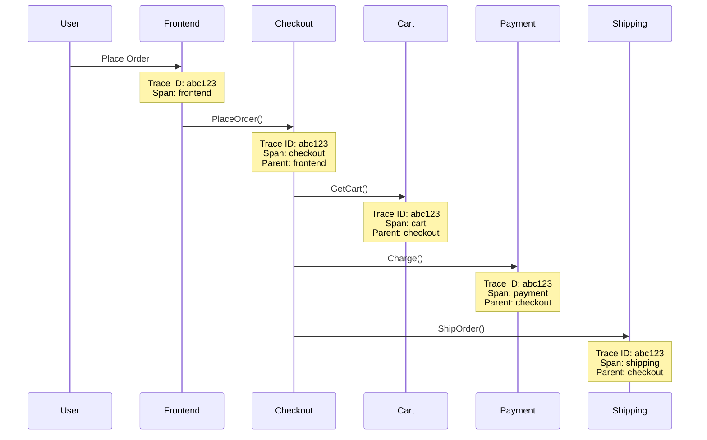
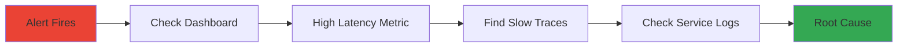

## Overview

Observability helps you understand what's happening inside your application. While monitoring tells you "something is wrong," observability helps you figure out "what and why."

<Tip>
  **For Beginners:** If monitoring is like your car's dashboard, observability is like having a mechanic's diagnostic tool. It lets you look inside the engine to see exactly what's happening.
</Tip>

## The Three Pillars

<CardGroup cols={3}>
  <Card title="Metrics" icon="chart-line">
    **What:** Numbers over time
    
    **Example:** Request rate, CPU usage
    
    **Use:** Detect problems
  </Card>

  <Card title="Logs" icon="file-lines">
    **What:** Text records of events
    
    **Example:** Error messages, user actions
    
    **Use:** Understand what happened
  </Card>

  <Card title="Traces" icon="route">
    **What:** Request journey through services
    
    **Example:** Frontend → Cart → Redis
    
    **Use:** Find bottlenecks
  </Card>
</CardGroup>

## Distributed Tracing

### What is Distributed Tracing?

When a user places an order, the request flows through multiple services. Tracing shows you this entire journey:



<Note>
  **Key Concepts:**
  - **Trace:** The complete journey of a request
  - **Span:** A single operation within a trace
  - **Trace ID:** Unique identifier linking all spans together
  - **Parent Span:** The span that called this span
</Note>

### Setup: Jaeger

<Steps>
  <Step title="Deploy Jaeger">
    ```bash
    # Using Jaeger Operator
    kubectl create namespace observability
    kubectl create -f https://github.com/jaegertracing/jaeger-operator/releases/download/v1.51.0/jaeger-operator.yaml -n observability
    
    # Deploy Jaeger instance
    kubectl apply -f - <<EOF
    apiVersion: jaegertracing.io/v1
    kind: Jaeger
    metadata:
      name: jaeger
      namespace: observability
    spec:
      strategy: allInOne
      allInOne:
        image: jaegertracing/all-in-one:latest
        options:
          log-level: debug
      storage:
        type: memory
        options:
          memory:
            max-traces: 100000
      ingress:
        enabled: false
    EOF
    ```
  </Step>

  <Step title="Configure OpenTelemetry">
    Update services to send traces to Jaeger:
    
    ```yaml
    env:
    - name: OTEL_EXPORTER_OTLP_ENDPOINT
      value: "http://jaeger-collector.observability:4317"
    - name: OTEL_SERVICE_NAME
      valueFrom:
        fieldRef:
          fieldPath: metadata.labels['app']
    - name: OTEL_TRACES_SAMPLER
      value: "always_on"
    ```
  </Step>

  <Step title="Access Jaeger UI">
    ```bash
    kubectl port-forward -n observability svc/jaeger-query 16686:16686
    ```
    
    Open http://localhost:16686
  </Step>
</Steps>

### Using Jaeger

<Tabs>
  <Tab title="Find Slow Requests">
    1. Select service (e.g., "frontend")
    2. Set min duration (e.g., > 1s)
    3. Click "Find Traces"
    4. Click on a slow trace to see details
    
    You'll see:
    - Which service was slow
    - How long each step took
    - Where the bottleneck is
  </Tab>

  <Tab title="Debug Errors">
    1. Select service with errors
    2. Add tag: `error=true`
    3. Click "Find Traces"
    4. Examine error spans
    
    You'll see:
    - Where the error occurred
    - Error message and stack trace
    - What led to the error
  </Tab>

  <Tab title="Analyze Dependencies">
    1. Go to "System Architecture" tab
    2. View service dependency graph
    3. See request rates between services
    4. Identify critical paths
  </Tab>
</Tabs>

### Trace Examples

<AccordionGroup>
  <Accordion title="Successful Checkout">
    ```
    Trace ID: 7f8a9b2c3d4e5f6g
    Duration: 847ms
    
    ├─ frontend (120ms)
    │  └─ checkout.PlaceOrder (720ms)
    │     ├─ cart.GetCart (45ms)
    │     │  └─ redis.GET (12ms)
    │     ├─ productcatalog.GetProduct (89ms) [parallel]
    │     ├─ currency.Convert (34ms) [parallel]
    │     ├─ shipping.GetQuote (156ms)
    │     ├─ payment.Charge (234ms)
    │     ├─ shipping.ShipOrder (98ms)
    │     └─ email.SendConfirmation (67ms)
    ```
    
    **Analysis:** Payment service is the slowest step (234ms)
  </Accordion>

  <Accordion title="Failed Checkout">
    ```
    Trace ID: 1a2b3c4d5e6f7g8h
    Duration: 523ms
    Status: ERROR
    
    ├─ frontend (98ms)
    │  └─ checkout.PlaceOrder (425ms) [ERROR]
    │     ├─ cart.GetCart (34ms)
    │     ├─ productcatalog.GetProduct (67ms)
    │     └─ payment.Charge (312ms) [ERROR]
    │        Error: INVALID_ARGUMENT
    │        Message: "Invalid card number"
    ```
    
    **Analysis:** Payment failed due to invalid card number
  </Accordion>
</AccordionGroup>

## Logging

### Log Aggregation

Collect logs from all services in one place:

<Tabs>
  <Tab title="Google Cloud Logging">
    Automatically enabled on GKE:
    
    ```bash
    # View logs in Cloud Console
    gcloud logging read "resource.type=k8s_container" --limit 50
    
    # Filter by service
    gcloud logging read "resource.labels.container_name=frontend" --limit 20
    
    # Search for errors
    gcloud logging read "severity>=ERROR" --limit 10
    ```
  </Tab>

  <Tab title="ELK Stack">
    Deploy Elasticsearch, Logstash, Kibana:
    
    ```bash
    # Add Elastic Helm repo
    helm repo add elastic https://helm.elastic.co
    
    # Install Elasticsearch
    helm install elasticsearch elastic/elasticsearch \
      --namespace logging --create-namespace
    
    # Install Kibana
    helm install kibana elastic/kibana --namespace logging
    
    # Install Filebeat (log shipper)
    helm install filebeat elastic/filebeat --namespace logging
    ```
  </Tab>

  <Tab title="Loki + Grafana">
    Lightweight alternative to ELK:
    
    ```bash
    # Add Grafana Helm repo
    helm repo add grafana https://grafana.github.io/helm-charts
    
    # Install Loki
    helm install loki grafana/loki-stack \
      --namespace logging \
      --create-namespace \
      --set grafana.enabled=true
    ```
  </Tab>
</Tabs>

### Structured Logging

Use structured logs for better searchability:

<Tabs>
  <Tab title="Good (Structured)">
    ```json
    {
      "timestamp": "2024-02-13T10:30:45Z",
      "level": "ERROR",
      "service": "checkout",
      "trace_id": "abc123",
      "user_id": "user456",
      "message": "Payment failed",
      "error": {
        "code": "INVALID_ARGUMENT",
        "details": "Invalid card number"
      },
      "context": {
        "order_id": "order789",
        "amount": 99.99,
        "currency": "USD"
      }
    }
    ```
    
    **Why it's good:**
    - Easy to search and filter
    - Machine-readable
    - Includes context
    - Has trace ID for correlation
  </Tab>

  <Tab title="Bad (Unstructured)">
    ```
    2024-02-13 10:30:45 ERROR: Payment failed for user456 - Invalid card number (order789, $99.99 USD)
    ```
    
    **Why it's bad:**
    - Hard to parse
    - Can't filter by fields
    - No trace ID
    - Inconsistent format
  </Tab>
</Tabs>

### Log Levels

Use appropriate log levels:

<AccordionGroup>
  <Accordion title="DEBUG">
    **When:** Development and troubleshooting
    
    **Example:** "Connecting to Redis at localhost:6379"
    
    **Production:** Usually disabled (too verbose)
  </Accordion>

  <Accordion title="INFO">
    **When:** Normal operations
    
    **Example:** "Order placed successfully: order123"
    
    **Production:** Enabled for important events
  </Accordion>

  <Accordion title="WARN">
    **When:** Something unexpected but not critical
    
    **Example:** "Cache miss, fetching from database"
    
    **Production:** Always enabled
  </Accordion>

  <Accordion title="ERROR">
    **When:** Operation failed
    
    **Example:** "Failed to charge card: invalid number"
    
    **Production:** Always enabled, triggers alerts
  </Accordion>

  <Accordion title="FATAL">
    **When:** Service cannot continue
    
    **Example:** "Cannot connect to database, exiting"
    
    **Production:** Always enabled, immediate alert
  </Accordion>
</AccordionGroup>

### Viewing Logs

<Tabs>
  <Tab title="kubectl">
    ```bash
    # View logs for a pod
    kubectl logs frontend-7d8f9c5b6-abc12
    
    # Follow logs (live tail)
    kubectl logs -f frontend-7d8f9c5b6-abc12
    
    # Logs from all pods in deployment
    kubectl logs -l app=frontend --tail=100
    
    # Previous container logs (after crash)
    kubectl logs frontend-7d8f9c5b6-abc12 --previous
    
    # Logs from specific container in pod
    kubectl logs frontend-7d8f9c5b6-abc12 -c server
    ```
  </Tab>

  <Tab title="stern">
    Better log viewing with stern:
    
    ```bash
    # Install stern
    brew install stern  # macOS
    
    # Tail logs from all frontend pods
    stern frontend
    
    # Tail logs from multiple services
    stern "frontend|checkout"
    
    # Filter by log level
    stern frontend | grep ERROR
    
    # Show timestamps
    stern --timestamps frontend
    ```
  </Tab>
</Tabs>

## Debugging Techniques

### 1. Trace-Based Debugging

<Steps>
  <Step title="Find the Trace">
    User reports slow checkout. Get the trace ID:
    - From error message
    - From logs
    - From user session
  </Step>

  <Step title="Analyze the Trace">
    Open Jaeger, search for trace ID:
    ```
    Trace abc123:
    ├─ frontend: 120ms
    └─ checkout: 2.3s ← SLOW!
       ├─ cart: 45ms
       ├─ payment: 2.1s ← BOTTLENECK!
       └─ shipping: 150ms
    ```
  </Step>

  <Step title="Investigate the Slow Service">
    Check payment service logs:
    ```bash
    kubectl logs -l app=payment --since=10m | grep abc123
    ```
    
    Find: "Timeout connecting to payment gateway"
  </Step>

  <Step title="Fix the Issue">
    - Increase timeout
    - Add retry logic
    - Check network connectivity
    - Contact payment provider
  </Step>
</Steps>

### 2. Log-Based Debugging

<Steps>
  <Step title="Search for Errors">
    ```bash
    # Find all errors in last hour
    kubectl logs -l app=checkout --since=1h | grep ERROR
    
    # Count error types
    kubectl logs -l app=checkout --since=1h | grep ERROR | sort | uniq -c
    ```
  </Step>

  <Step title="Find Related Logs">
    Use trace ID or request ID:
    ```bash
    # All logs for a specific request
    stern . | grep "trace_id=abc123"
    ```
  </Step>

  <Step title="Analyze Patterns">
    Look for:
    - Error frequency
    - Time patterns (specific hours?)
    - Affected users/regions
    - Common error messages
  </Step>
</Steps>

### 3. Metrics-Based Debugging

<Steps>
  <Step title="Identify Anomaly">
    Dashboard shows high latency spike at 2 PM
  </Step>

  <Step title="Correlate with Traces">
    Find slow traces during that time:
    - Jaeger: Filter by time range and duration
    - Look for common patterns
  </Step>

  <Step title="Check Resource Usage">
    ```bash
    # CPU/Memory during spike
    kubectl top pods --sort-by=cpu
    
    # Check for OOMKilled pods
    kubectl get pods | grep OOMKilled
    ```
  </Step>

  <Step title="Review Recent Changes">
    - Recent deployments?
    - Configuration changes?
    - Traffic spikes?
    - External dependencies?
  </Step>
</Steps>

## Correlation

Connect metrics, logs, and traces:



**Example Flow:**
1. **Alert:** "High latency on checkout service"
2. **Dashboard:** P95 latency jumped from 200ms to 2s
3. **Traces:** Payment service taking 1.8s (normally 200ms)
4. **Logs:** "Connection timeout to payment-gateway.example.com"
5. **Root Cause:** Payment gateway is down

## Best Practices

<AccordionGroup>
  <Accordion title="Use Correlation IDs">
    Pass trace IDs through all services:
    
    ```go
    // Extract trace ID from context
    traceID := trace.SpanFromContext(ctx).SpanContext().TraceID()
    
    // Add to logs
    log.WithField("trace_id", traceID).Info("Processing request")
    
    // Pass to downstream services
    ctx = metadata.AppendToOutgoingContext(ctx, "trace-id", traceID.String())
    ```
  </Accordion>

  <Accordion title="Sample Traces Wisely">
    Don't trace every request (too expensive):
    
    ```yaml
    # Sample 1% of requests
    OTEL_TRACES_SAMPLER: "traceidratio"
    OTEL_TRACES_SAMPLER_ARG: "0.01"
    
    # Always trace errors
    OTEL_TRACES_SAMPLER: "parentbased_traceidratio"
    ```
  </Accordion>

  <Accordion title="Add Context to Logs">
    Include relevant information:
    - User ID (hashed for privacy)
    - Request ID / Trace ID
    - Service name
    - Environment (prod/staging)
    - Version
  </Accordion>

  <Accordion title="Set Up Log Retention">
    Balance cost vs. usefulness:
    - Hot storage: 7-30 days (fast access)
    - Cold storage: 90-365 days (archival)
    - Delete after retention period
  </Accordion>
</AccordionGroup>

## Troubleshooting

<AccordionGroup>
  <Accordion title="Traces Not Appearing">
    **Check:**
    ```bash
    # Verify OTEL_EXPORTER_OTLP_ENDPOINT is set
    kubectl get pods frontend-xxx -o yaml | grep OTEL
    
    # Check Jaeger collector logs
    kubectl logs -n observability -l app=jaeger-collector
    
    # Test connectivity
    kubectl run -it --rm debug --image=curlimages/curl --restart=Never -- \
      curl -v http://jaeger-collector.observability:4317
    ```
  </Accordion>

  <Accordion title="Logs Missing">
    **Check:**
    ```bash
    # Verify pods are logging
    kubectl logs frontend-xxx | head
    
    # Check log shipper (Filebeat/Fluentd)
    kubectl logs -n logging -l app=filebeat
    
    # Verify log format is correct
    kubectl logs frontend-xxx --tail=1 | jq .
    ```
  </Accordion>

  <Accordion title="High Cardinality">
    **Problem:** Too many unique trace/log attributes
    
    **Solution:**
    - Don't use user IDs as span names
    - Limit custom attributes
    - Use sampling
    - Aggregate similar traces
  </Accordion>
</AccordionGroup>

## Next Steps

<CardGroup cols={2}>
  <Card title="Monitoring" icon="chart-line" href="/operations/monitoring">
    Set up metrics and alerts
  </Card>
  <Card title="Production Best Practices" icon="shield-check" href="/operations/production">
    Optimize for production
  </Card>
  <Card title="Incident Response" icon="siren" href="/operations/incident-response">
    Handle incidents effectively
  </Card>
  <Card title="Architecture" icon="sitemap" href="/architecture/overview">
    Understand the system
  </Card>
</CardGroup>
