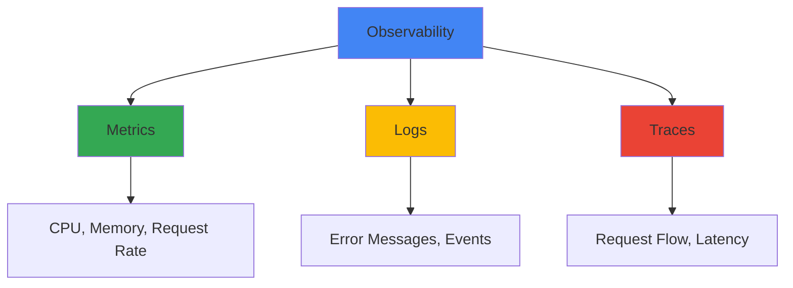

## Overview

Running Online Boutique in production requires proper monitoring, observability, and operational practices. This section covers everything you need to keep your application healthy and performant.

<CardGroup cols={2}>
  <Card title="Monitoring" icon="chart-line" href="/operations/monitoring">
    Track metrics, set up alerts, and monitor system health
  </Card>
  <Card title="Observability" icon="magnifying-glass" href="/operations/observability">
    Distributed tracing, logging, and debugging
  </Card>
  <Card title="Production Best Practices" icon="shield-check" href="/operations/production">
    Security, reliability, and performance optimization
  </Card>
  <Card title="Incident Response" icon="siren" href="/operations/incident-response">
    Handle outages and troubleshoot issues
  </Card>
</CardGroup>

## What is Operations?

<Tip>
  **For Beginners:** Operations (often called "Ops") is about keeping your application running smoothly after it's deployed. Think of it like maintaining a car - you need to check the oil, monitor the engine, and fix problems when they arise.
</Tip>

Operations includes:
- **Monitoring**: Watching your application to know when something goes wrong
- **Observability**: Understanding what's happening inside your application
- **Maintenance**: Keeping everything up-to-date and running efficiently
- **Incident Response**: Fixing problems quickly when they occur

## The Three Pillars of Observability



### Metrics
Numbers that tell you how your system is performing:
- CPU and memory usage
- Request rate and latency
- Error rates
- Database connections

### Logs
Text records of what happened:
- Error messages
- User actions
- System events
- Debug information

### Traces
The path a request takes through your system:
- Which services were called
- How long each step took
- Where errors occurred
- Dependencies between services

## Online Boutique Observability Stack

Online Boutique comes with built-in observability using OpenTelemetry:

<Tabs>
  <Tab title="What's Included">
    - **OpenTelemetry Collector**: Collects metrics, logs, and traces
    - **Automatic Instrumentation**: Services automatically send telemetry
    - **Exporters**: Send data to your monitoring backend
    - **Service Mesh (Optional)**: Istio for advanced observability
  </Tab>

  <Tab title="Supported Backends">
    You can send telemetry data to:
    - Google Cloud Operations (formerly Stackdriver)
    - Prometheus + Grafana
    - Jaeger (for tracing)
    - Datadog
    - New Relic
    - Any OpenTelemetry-compatible backend
  </Tab>

  <Tab title="What You Get">
    Out of the box, you can see:
    - Request latency per service
    - Error rates and types
    - Service dependencies
    - Resource usage (CPU, memory)
    - Distributed traces
    - Custom business metrics
  </Tab>
</Tabs>

## Quick Start

Get started with monitoring in 3 steps:

<Steps>
  <Step title="Deploy with OpenTelemetry">
    The OpenTelemetry Collector is included by default:
    ```bash
    kubectl apply -f ./release/kubernetes-manifests.yaml
    ```
    
    The collector is automatically deployed and configured.
  </Step>

  <Step title="Configure Your Backend">
    Choose where to send your telemetry data:
    
    ```yaml
    # For Google Cloud
    env:
      - name: OTEL_EXPORTER_OTLP_ENDPOINT
        value: "https://cloudtrace.googleapis.com"
    
    # For Jaeger
    env:
      - name: OTEL_EXPORTER_OTLP_ENDPOINT
        value: "http://jaeger-collector:4317"
    ```
  </Step>

  <Step title="View Your Data">
    Access your monitoring dashboard:
    - Google Cloud Console → Operations
    - Grafana dashboard
    - Jaeger UI for traces
    - Your chosen backend's interface
  </Step>
</Steps>

## Key Metrics to Monitor

<AccordionGroup>
  <Accordion title="Service Health">
    **What to watch:**
    - Pod status (Running, CrashLoopBackOff, etc.)
    - Container restarts
    - Readiness and liveness probe failures
    
    **Why it matters:** Tells you if services are up and healthy
  </Accordion>

  <Accordion title="Request Rate & Latency">
    **What to watch:**
    - Requests per second (RPS)
    - P50, P95, P99 latency
    - Error rate (4xx, 5xx responses)
    
    **Why it matters:** Shows if users are experiencing slow or failed requests
  </Accordion>

  <Accordion title="Resource Usage">
    **What to watch:**
    - CPU utilization
    - Memory usage
    - Disk I/O
    - Network bandwidth
    
    **Why it matters:** Prevents resource exhaustion and helps with capacity planning
  </Accordion>

  <Accordion title="Business Metrics">
    **What to watch:**
    - Orders placed per minute
    - Cart abandonment rate
    - Product views
    - Checkout success rate
    
    **Why it matters:** Tracks actual business impact, not just technical metrics
  </Accordion>
</AccordionGroup>

## Common Operational Tasks

<CardGroup cols={2}>
  <Card title="Check Service Health" icon="heart-pulse">
    ```bash
    kubectl get pods
    kubectl top pods
    ```
  </Card>

  <Card title="View Logs" icon="file-lines">
    ```bash
    kubectl logs -l app=frontend
    kubectl logs -f deployment/cartservice
    ```
  </Card>

  <Card title="Scale Services" icon="up-right-and-down-left-from-center">
    ```bash
    kubectl scale deployment frontend --replicas=3
    kubectl autoscale deployment frontend --min=2 --max=10
    ```
  </Card>

  <Card title="Update Services" icon="rotate">
    ```bash
    kubectl set image deployment/frontend frontend=gcr.io/project/frontend:v2
    kubectl rollout status deployment/frontend
    ```
  </Card>
</CardGroup>

## Production Readiness Checklist

Before going to production, ensure you have:

<Steps>
  <Step title="Monitoring Setup">
    - [ ] Metrics collection configured
    - [ ] Dashboards created
    - [ ] Alerts configured
    - [ ] On-call rotation established
  </Step>

  <Step title="Observability">
    - [ ] Distributed tracing enabled
    - [ ] Log aggregation configured
    - [ ] Error tracking set up
    - [ ] Performance monitoring active
  </Step>

  <Step title="Reliability">
    - [ ] Resource limits set
    - [ ] Autoscaling configured
    - [ ] Health checks defined
    - [ ] Backup and recovery tested
  </Step>

  <Step title="Security">
    - [ ] Network policies applied
    - [ ] Secrets management configured
    - [ ] TLS/SSL enabled
    - [ ] Security scanning automated
  </Step>
</Steps>

## Next Steps

<CardGroup cols={2}>
  <Card title="Monitoring" icon="chart-line" href="/operations/monitoring">
    Set up metrics, dashboards, and alerts
  </Card>
  <Card title="Observability" icon="magnifying-glass" href="/operations/observability">
    Configure tracing and logging
  </Card>
  <Card title="Production Best Practices" icon="shield-check" href="/operations/production">
    Optimize for production workloads
  </Card>
  <Card title="Incident Response" icon="siren" href="/operations/incident-response">
    Prepare for and handle incidents
  </Card>
</CardGroup>
